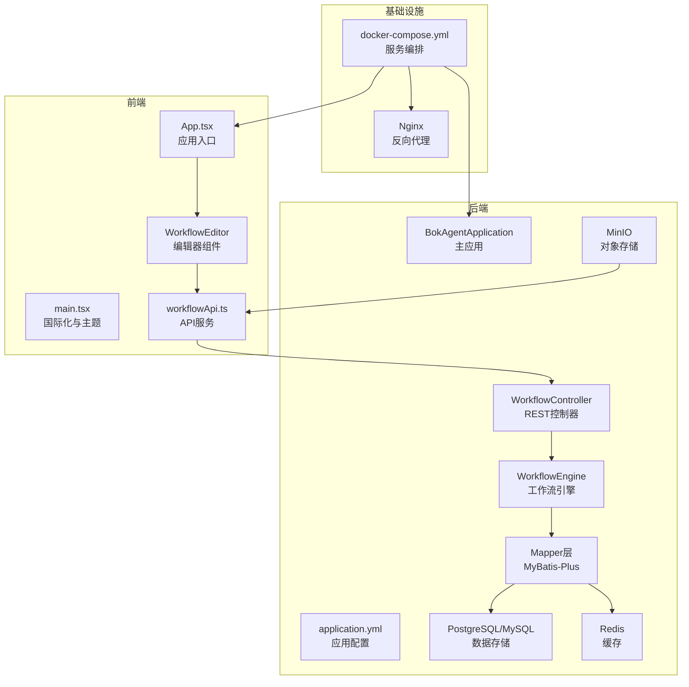
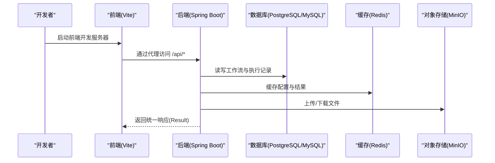
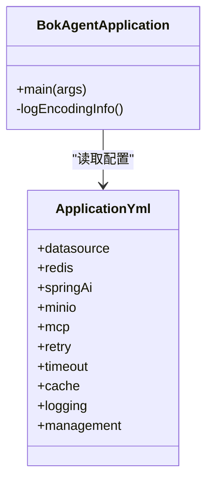
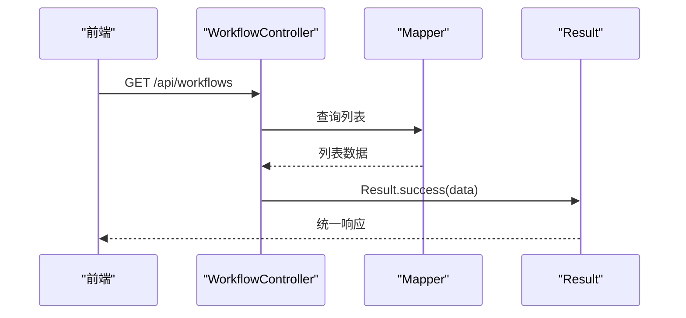
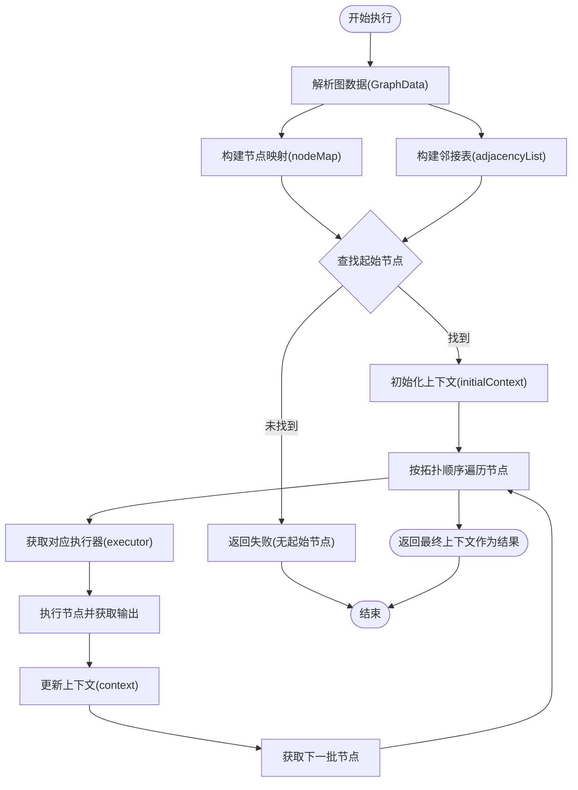
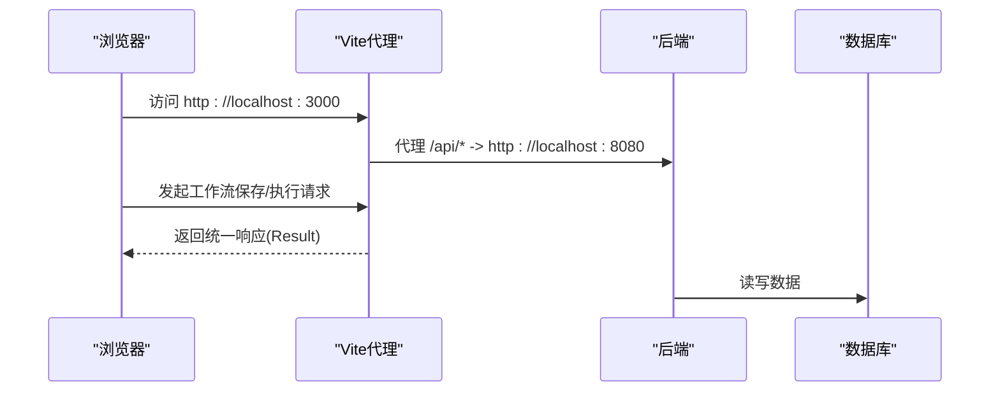
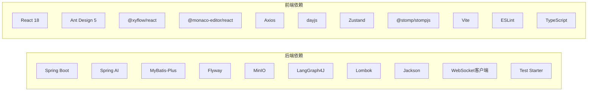

# 开发者指南

<cite>
**本文引用的文件**
- [README.md](file://README.md)
- [QUICKSTART.md](file://QUICKSTART.md)
- [IMPLEMENTATION_PROGRESS.md](file://IMPLEMENTATION_PROGRESS.md)
- [PROJECT_INIT_STATUS.md](file://PROJECT_INIT_STATUS.md)
- [backend/pom.xml](file://backend/pom.xml)
- [frontend/package.json](file://frontend/package.json)
- [backend/src/main/resources/application.yml](file://backend/src/main/resources/application.yml)
- [docker/docker-compose.yml](file://docker/docker-compose.yml)
- [backend/src/main/java/com/bokagent/BokAgentApplication.java](file://backend/src/main/java/com/bokagent/BokAgentApplication.java)
- [backend/src/main/java/com/bokagent/common/Result.java](file://backend/src/main/java/com/bokagent/common/Result.java)
- [backend/src/main/java/com/bokagent/common/GlobalExceptionHandler.java](file://backend/src/main/java/com/bokagent/common/GlobalExceptionHandler.java)
- [backend/src/main/java/com/bokagent/controller/WorkflowController.java](file://backend/src/main/java/com/bokagent/controller/WorkflowController.java)
- [backend/src/main/java/com/bokagent/engine/WorkflowEngine.java](file://backend/src/main/java/com/bokagent/engine/WorkflowEngine.java)
- [frontend/src/App.tsx](file://frontend/src/App.tsx)
- [frontend/src/main.tsx](file://frontend/src/main.tsx)
- [frontend/vite.config.ts](file://frontend/vite.config.ts)
</cite>

## 目录
1. [简介](#简介)
2. [项目结构](#项目结构)
3. [核心组件](#核心组件)
4. [架构总览](#架构总览)
5. [详细组件分析](#详细组件分析)
6. [依赖关系分析](#依赖关系分析)
7. [性能考虑](#性能考虑)
8. [故障排查指南](#故障排查指南)
9. [结论](#结论)
10. [附录](#附录)

## 简介
本指南面向新加入的开发者，提供BokAgent项目的完整开发与协作流程说明。BokAgent是一个基于React 18 + Spring Boot 3.5的企业级AI Agent可视化工作流编排系统，支持多LLM厂商、插件生态、MCP协议、TTS音频合成等能力。本指南涵盖开发环境搭建、IDE配置、代码规范、构建与打包、测试策略、调试与性能分析、贡献流程以及开发工具推荐。

## 项目结构
项目采用前后端分离架构，后端使用Spring Boot + MyBatis-Plus，前端使用React 18 + TypeScript + Vite，配合Docker一键部署与UTF-8全链路编码保障。

图表来源
- [docker/docker-compose.yml:1-132](file://docker/docker-compose.yml#L1-L132)
- [backend/src/main/resources/application.yml:1-190](file://backend/src/main/resources/application.yml#L1-L190)
- [backend/src/main/java/com/bokagent/BokAgentApplication.java:1-56](file://backend/src/main/java/com/bokagent/BokAgentApplication.java#L1-L56)
- [backend/src/main/java/com/bokagent/controller/WorkflowController.java:1-92](file://backend/src/main/java/com/bokagent/controller/WorkflowController.java#L1-L92)
- [backend/src/main/java/com/bokagent/engine/WorkflowEngine.java:1-171](file://backend/src/main/java/com/bokagent/engine/WorkflowEngine.java#L1-L171)
- [frontend/src/App.tsx:1-21](file://frontend/src/App.tsx#L1-L21)
- [frontend/src/main.tsx:1-22](file://frontend/src/main.tsx#L1-L22)

章节来源
- [README.md:81-92](file://README.md#L81-L92)
- [docker/docker-compose.yml:1-132](file://docker/docker-compose.yml#L1-L132)
- [backend/src/main/resources/application.yml:1-190](file://backend/src/main/resources/application.yml#L1-L190)

## 核心组件
- 统一响应与异常处理：通过Result封装统一返回，GlobalExceptionHandler集中处理异常，保证前后端一致的错误语义。
- REST控制器：提供工作流的CRUD接口，跨域开放，便于前端调用。
- 工作流引擎：负责解析图数据、构建邻接表、按拓扑顺序执行节点，管理上下文传递。
- 前端编辑器：基于React Flow的可视化编辑器，支持节点拖拽、连线、保存与调试。
- 应用配置：application.yml集中管理数据库、缓存、Spring AI、MinIO、MCP、超时、重试、缓存、日志等配置。
- Docker编排：docker-compose.yml定义服务编排、健康检查、端口映射与数据卷持久化。

章节来源
- [backend/src/main/java/com/bokagent/common/Result.java:1-42](file://backend/src/main/java/com/bokagent/common/Result.java#L1-L42)
- [backend/src/main/java/com/bokagent/common/GlobalExceptionHandler.java:1-37](file://backend/src/main/java/com/bokagent/common/GlobalExceptionHandler.java#L1-L37)
- [backend/src/main/java/com/bokagent/controller/WorkflowController.java:1-92](file://backend/src/main/java/com/bokagent/controller/WorkflowController.java#L1-L92)
- [backend/src/main/java/com/bokagent/engine/WorkflowEngine.java:1-171](file://backend/src/main/java/com/bokagent/engine/WorkflowEngine.java#L1-L171)
- [backend/src/main/resources/application.yml:1-190](file://backend/src/main/resources/application.yml#L1-L190)
- [frontend/src/App.tsx:1-21](file://frontend/src/App.tsx#L1-L21)

## 架构总览
系统采用微服务式容器编排，后端提供REST与WebSocket服务，前端通过Vite代理访问后端API；数据库、缓存、对象存储由Compose统一管理。

图表来源
- [frontend/vite.config.ts:1-21](file://frontend/vite.config.ts#L1-L21)
- [backend/src/main/resources/application.yml:1-190](file://backend/src/main/resources/application.yml#L1-L190)
- [docker/docker-compose.yml:1-132](file://docker/docker-compose.yml#L1-L132)

## 详细组件分析

### 后端应用与配置
- 主应用类负责设置JVM编码、默认属性与启动后编码校验日志。
- application.yml集中配置数据源、缓存、Spring AI多厂商、MinIO、MCP、超时、重试、缓存、日志与Actuator。
- Docker编排中设置时区、语言与各服务依赖关系，确保健康检查与数据持久化。

图表来源
- [backend/src/main/java/com/bokagent/BokAgentApplication.java:1-56](file://backend/src/main/java/com/bokagent/BokAgentApplication.java#L1-L56)
- [backend/src/main/resources/application.yml:1-190](file://backend/src/main/resources/application.yml#L1-L190)

章节来源
- [backend/src/main/java/com/bokagent/BokAgentApplication.java:1-56](file://backend/src/main/java/com/bokagent/BokAgentApplication.java#L1-L56)
- [backend/src/main/resources/application.yml:1-190](file://backend/src/main/resources/application.yml#L1-L190)
- [docker/docker-compose.yml:1-132](file://docker/docker-compose.yml#L1-L132)

### 控制器与统一响应
- 控制器提供工作流的增删改查接口，统一返回Result封装。
- 全局异常处理器捕获常见异常，返回标准化错误信息。

图表来源
- [backend/src/main/java/com/bokagent/controller/WorkflowController.java:1-92](file://backend/src/main/java/com/bokagent/controller/WorkflowController.java#L1-L92)
- [backend/src/main/java/com/bokagent/common/Result.java:1-42](file://backend/src/main/java/com/bokagent/common/Result.java#L1-L42)
- [backend/src/main/java/com/bokagent/common/GlobalExceptionHandler.java:1-37](file://backend/src/main/java/com/bokagent/common/GlobalExceptionHandler.java#L1-L37)

章节来源
- [backend/src/main/java/com/bokagent/controller/WorkflowController.java:1-92](file://backend/src/main/java/com/bokagent/controller/WorkflowController.java#L1-L92)
- [backend/src/main/java/com/bokagent/common/Result.java:1-42](file://backend/src/main/java/com/bokagent/common/Result.java#L1-L42)
- [backend/src/main/java/com/bokagent/common/GlobalExceptionHandler.java:1-37](file://backend/src/main/java/com/bokagent/common/GlobalExceptionHandler.java#L1-L37)

### 工作流引擎
- 引擎解析图数据，构建节点映射与邻接表，按拓扑顺序执行节点，维护上下文并在每个节点执行后更新。
- 包含执行计时与异常处理，返回ExecutionResult。

图表来源
- [backend/src/main/java/com/bokagent/engine/WorkflowEngine.java:1-171](file://backend/src/main/java/com/bokagent/engine/WorkflowEngine.java#L1-L171)

章节来源
- [backend/src/main/java/com/bokagent/engine/WorkflowEngine.java:1-171](file://backend/src/main/java/com/bokagent/engine/WorkflowEngine.java#L1-L171)

### 前端应用与编辑器
- main.tsx设置Ant Design中文语言包与dayjs中文本地化，控制台输出UTF-8测试。
- App.tsx作为页面布局，嵌入工作流编辑器组件。
- Vite配置代理后端API与WebSocket，便于本地联调。

图表来源
- [frontend/src/main.tsx:1-22](file://frontend/src/main.tsx#L1-L22)
- [frontend/src/App.tsx:1-21](file://frontend/src/App.tsx#L1-L21)
- [frontend/vite.config.ts:1-21](file://frontend/vite.config.ts#L1-L21)
- [backend/src/main/resources/application.yml:1-190](file://backend/src/main/resources/application.yml#L1-L190)

章节来源
- [frontend/src/main.tsx:1-22](file://frontend/src/main.tsx#L1-L22)
- [frontend/src/App.tsx:1-21](file://frontend/src/App.tsx#L1-L21)
- [frontend/vite.config.ts:1-21](file://frontend/vite.config.ts#L1-L21)

## 依赖关系分析
- 后端依赖：Spring Boot Web/WebSocket/Redis/Actuator、Spring AI OpenAI/Deepseek/Qwen、MyBatis-Plus、Flyway、MinIO、LangGraph4J、Lombok、Jackson、WebSocket客户端、测试 Starter。
- 前端依赖：React 18、Ant Design 5、@xyflow/react、Monaco Editor、Axios、dayjs、Zustand、STOMP、Vite、ESLint、TypeScript。

图表来源
- [backend/pom.xml:1-170](file://backend/pom.xml#L1-L170)
- [frontend/package.json:1-37](file://frontend/package.json#L1-L37)

章节来源
- [backend/pom.xml:1-170](file://backend/pom.xml#L1-L170)
- [frontend/package.json:1-37](file://frontend/package.json#L1-L37)

## 性能考虑
- 编码一致性：全链路UTF-8配置，避免中文与Emoji乱码导致的性能与兼容性问题。
- 连接池与线程：Hikari连接池与虚拟线程执行器，合理配置最大连接数与队列容量。
- 缓存策略：启用缓存并设置不同TTL，减少重复计算与外部调用。
- 超时与重试：针对工具执行、LLM调用、TTS合成、MCP请求与工作流执行设置超时与重试策略。
- 日志级别：生产默认INFO，开发可提升至DEBUG，注意日志文件大小与保留策略。

章节来源
- [backend/src/main/resources/application.yml:138-180](file://backend/src/main/resources/application.yml#L138-L180)
- [PROJECT_INIT_STATUS.md:134-159](file://PROJECT_INIT_STATUS.md#L134-L159)

## 故障排查指南
- 端口占用：若启动失败，检查80/8080/5432/3306/6379/9000/9001端口占用，必要时修改docker-compose.yml中的端口映射。
- 服务状态：使用docker-compose ps确认各服务处于Up状态。
- 数据库连接：检查PostgreSQL/MySQL健康检查与初始化脚本。
- 中文显示：如出现乱码，检查终端、浏览器与操作系统UTF-8支持。
- 日志定位：查看后端容器日志，关注编码信息与异常堆栈。

章节来源
- [QUICKSTART.md:112-164](file://QUICKSTART.md#L112-L164)
- [docker/docker-compose.yml:1-132](file://docker/docker-compose.yml#L1-L132)

## 结论
本指南提供了BokAgent从环境搭建到开发协作的全流程指引。建议新开发者优先完成Docker一键部署验证，再进入本地开发模式，结合统一响应与异常处理规范、Maven与npm脚本、以及Docker编排进行迭代开发。后续可逐步完善MCP协议、工具注册系统与集成测试，持续优化性能与稳定性。

## 附录

### 开发环境搭建与IDE配置
- Java后端
  - JDK 21，IDE推荐IntelliJ IDEA，启用Lombok插件与Google JavaFormat。
  - Maven：使用pom.xml管理依赖，Spring Boot插件用于打包与运行。
- 前端
  - Node.js与npm，TypeScript + ESLint + Prettier，VS Code或WebStorm。
  - Vite开发服务器默认端口3000，代理后端8080端口。
- Docker
  - Docker Desktop 20.10+，Docker Compose 2.0+，一键启动所有服务。

章节来源
- [README.md:16-29](file://README.md#L16-L29)
- [backend/pom.xml:1-170](file://backend/pom.xml#L1-L170)
- [frontend/package.json:1-37](file://frontend/package.json#L1-L37)
- [frontend/vite.config.ts:1-21](file://frontend/vite.config.ts#L1-L21)
- [docker/docker-compose.yml:1-132](file://docker/docker-compose.yml#L1-L132)

### 代码规范与最佳实践
- Java
  - 命名：类与接口使用帕斯卡命名，方法与字段使用驼峰命名；常量全大写。
  - 注释：公共API与复杂逻辑需提供清晰注释；异常处理明确错误码与消息。
  - 结构：按功能分层（controller/service/mapper/entity/handler），统一响应与异常处理。
- TypeScript/React
  - 命名：组件首字母大写，Hook以use开头，类型接口以I或Props结尾。
  - 结构：组件拆分与职责单一，API服务与Hooks分离，状态管理使用Zustand。
  - 规范：ESLint规则严格，禁止未使用禁用项，保持类型安全。

章节来源
- [backend/src/main/java/com/bokagent/common/Result.java:1-42](file://backend/src/main/java/com/bokagent/common/Result.java#L1-L42)
- [backend/src/main/java/com/bokagent/common/GlobalExceptionHandler.java:1-37](file://backend/src/main/java/com/bokagent/common/GlobalExceptionHandler.java#L1-L37)
- [frontend/src/App.tsx:1-21](file://frontend/src/App.tsx#L1-L21)
- [frontend/src/main.tsx:1-22](file://frontend/src/main.tsx#L1-L22)

### 构建与打包
- 后端
  - Maven：spring-boot:run本地运行，spring-boot-maven-plugin打包为可执行jar。
  - Docker：多阶段构建，Alpine基础镜像，UTF-8与Asia/Shanghai时区，健康检查。
- 前端
  - npm scripts：dev、build、lint、preview；TypeScript与Vite构建。
  - Docker：多阶段构建，Nginx提供静态资源，挂载nginx.conf。

章节来源
- [backend/pom.xml:142-157](file://backend/pom.xml#L142-L157)
- [docker/docker-compose.yml:83-126](file://docker/docker-compose.yml#L83-L126)
- [frontend/package.json:6-11](file://frontend/package.json#L6-L11)

### 测试策略
- 单元测试：后端使用spring-boot-starter-test，覆盖Service与工具类；前端使用Vitest/Jest（如引入），覆盖组件与Hook。
- 集成测试：通过docker-compose启动全栈，验证API与数据库交互。
- 端到端测试：建议引入Cypress或Playwright，覆盖编辑器操作、工作流保存与执行流程。

章节来源
- [backend/pom.xml:122-127](file://backend/pom.xml#L122-L127)
- [docker/docker-compose.yml:1-132](file://docker/docker-compose.yml#L1-L132)

### 调试技巧与工具
- IDE调试：后端设置断点，前端在Vite代理下调试API；WebSocket使用浏览器开发者工具Network/WS面板。
- 日志分析：application.yml配置日志级别与文件滚动策略，关注编码信息与异常堆栈。
- 性能分析：后端启用Actuator metrics，前端使用浏览器性能面板与网络面板。

章节来源
- [backend/src/main/resources/application.yml:164-190](file://backend/src/main/resources/application.yml#L164-L190)
- [docker/docker-compose.yml:1-132](file://docker/docker-compose.yml#L1-L132)

### 贡献指南
- 分支管理：master/main用于发布，feature/*用于功能开发，hotfix/*用于紧急修复。
- Pull Request：提交PR前确保通过本地测试与ESLint；描述变更内容与影响范围。
- 代码审查：关注统一响应、异常处理、日志与性能；确保UTF-8与国际化配置一致。
- Issue报告：提供环境信息、复现步骤、期望与实际结果、日志片段。

章节来源
- [README.md:103-106](file://README.md#L103-L106)
- [IMPLEMENTATION_PROGRESS.md:171-179](file://IMPLEMENTATION_PROGRESS.md#L171-L179)

### 开发工具推荐
- IDE插件：IntelliJ IDEA Lombok、Google JavaFormat；VS Code ESLint、Prettier、ES7+ React/Redux。
- 浏览器扩展：React DevTools、Redux DevTools、Postman或Insomnia。
- 开发辅助：Docker Desktop、Postman、dbeaver、Wireshark（网络诊断）。

章节来源
- [README.md:16-29](file://README.md#L16-L29)
- [frontend/package.json:24-35](file://frontend/package.json#L24-L35)

### 新人入门与成长路径
- 第一周：完成Docker一键部署，阅读README与INIT STATUS，理解技术栈与项目结构。
- 第二周：本地开发模式（后端mvn spring-boot:run，前端npm run dev），熟悉统一响应与控制器。
- 第三周：深入工作流引擎与编辑器，理解拓扑执行与上下文传递。
- 第四周：参与MCP协议、工具注册系统与集成测试，完善文档与测试用例。

章节来源
- [README.md:30-68](file://README.md#L30-L68)
- [QUICKSTART.md:166-186](file://QUICKSTART.md#L166-L186)
- [IMPLEMENTATION_PROGRESS.md:171-179](file://IMPLEMENTATION_PROGRESS.md#L171-L179)