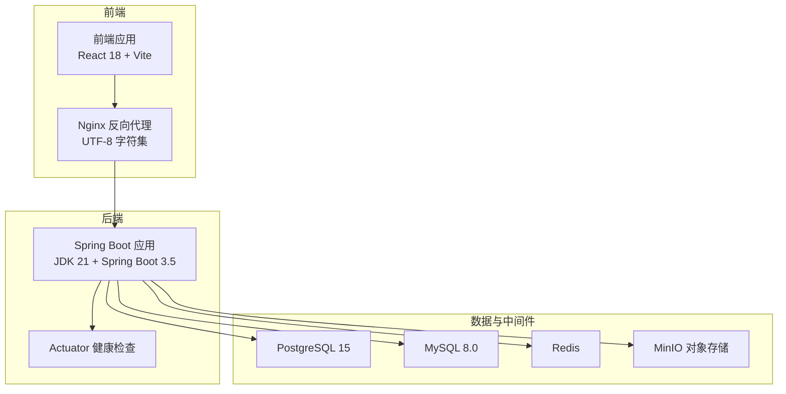
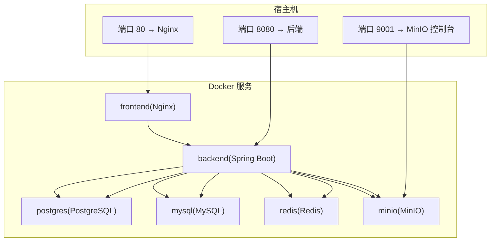
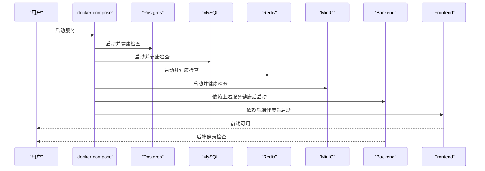
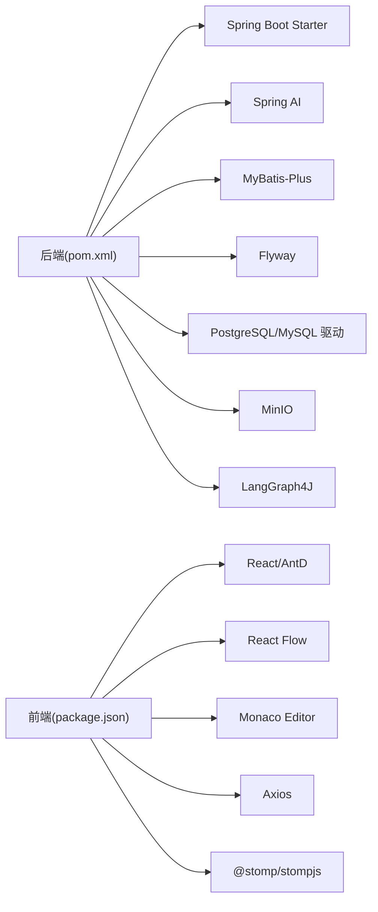

# 快速开始

<cite>
**本文引用的文件**
- [README.md](file://README.md)
- [QUICKSTART.md](file://QUICKSTART.md)
- [docker-compose.yml](file://docker/docker-compose.yml)
- [application.yml](file://backend/src/main/resources/application.yml)
- [pom.xml](file://backend/pom.xml)
- [package.json](file://frontend/package.json)
- [start.sh](file://start.sh)
- [start.ps1](file://start.ps1)
- [Dockerfile.backend](file://docker/Dockerfile.backend)
- [Dockerfile.frontend](file://docker/Dockerfile.frontend)
- [BokAgentApplication.java](file://backend/src/main/java/com/bokagent/BokAgentApplication.java)
- [vite.config.ts](file://frontend/vite.config.ts)
- [nginx.conf](file://docker/nginx.conf)
</cite>

## 目录
1. [简介](#简介)
2. [项目结构](#项目结构)
3. [核心组件](#核心组件)
4. [架构总览](#架构总览)
5. [详细组件分析](#详细组件分析)
6. [依赖分析](#依赖分析)
7. [性能考虑](#性能考虑)
8. [故障排除指南](#故障排除指南)
9. [结论](#结论)
10. [附录](#附录)

## 简介
本指南面向首次接触 BokAgent 的用户，帮助你在最短时间内完成安装与部署，覆盖 Docker 一键部署与本地开发两种方式；同时提供环境准备、配置步骤、启动顺序与依赖关系说明、常见问题排查以及验证方法，确保你能快速运行起完整的系统。

## 项目结构
BokAgent 采用前后端分离架构，后端基于 Spring Boot 3.5 + JDK 21，前端基于 React 18 + Vite，配合 Docker Compose 编排 PostgreSQL、MySQL、Redis、MinIO 等基础设施服务，提供完整的中文与 UTF-8 支持。

图表来源
- [docker-compose.yml:1-132](file://docker/docker-compose.yml#L1-L132)
- [application.yml:1-182](file://backend/src/main/resources/application.yml#L1-L182)
- [nginx.conf:1-56](file://docker/nginx.conf#L1-L56)

章节来源
- [README.md:1-106](file://README.md#L1-L106)
- [docker-compose.yml:1-132](file://docker/docker-compose.yml#L1-L132)

## 核心组件
- 前端（Nginx + React）
  - 使用 Nginx 提供静态资源服务与反向代理，统一设置 UTF-8 字符集。
  - 前端通过 /api 代理到后端 8080 端口，WebSocket 与 MCP SSE 通道也由 Nginx 转发。
- 后端（Spring Boot）
  - 提供 REST API、WebSocket、MCP 协议端点，内置 Actuator 健康检查。
  - 默认监听 8080 端口，支持 UTF-8 编码与中文日志输出。
- 数据与中间件
  - PostgreSQL（工作流数据）、MySQL（业务数据）、Redis（缓存）、MinIO（对象存储）。
  - 通过 docker-compose 管理服务生命周期与依赖顺序。

章节来源
- [application.yml:1-182](file://backend/src/main/resources/application.yml#L1-L182)
- [nginx.conf:1-56](file://docker/nginx.conf#L1-L56)
- [docker-compose.yml:1-132](file://docker/docker-compose.yml#L1-L132)

## 架构总览
下图展示 Docker 编排的服务拓扑、端口映射与依赖关系：

图表来源
- [docker-compose.yml:1-132](file://docker/docker-compose.yml#L1-L132)
- [nginx.conf:1-56](file://docker/nginx.conf#L1-L56)

## 详细组件分析

### Docker 一键部署（推荐）
- 前置条件
  - Docker 20.10+ 与 Docker Compose 2.0+
  - Git（可选）
- 步骤
  1) 获取项目代码
     - 使用 git clone 或下载 ZIP 并解压。
  2) 配置环境变量
     - 复制示例文件并编辑 .env，填写各 LLM API 密钥（如 OpenAI、DeepSeek、通义千问）。
  3) 启动服务
     - 使用启动脚本或手动执行 docker-compose up -d。
     - 等待约 30 秒，确保所有服务健康。
  4) 访问应用
     - 前端：http://localhost
     - 后端健康检查：http://localhost:8080/actuator/health
     - MinIO 控制台：http://localhost:9001（凭据见 docker-compose 环境变量）

章节来源
- [README.md:30-50](file://README.md#L30-L50)
- [QUICKSTART.md:12-78](file://QUICKSTART.md#L12-L78)
- [docker-compose.yml:1-132](file://docker/docker-compose.yml#L1-L132)

### 本地开发模式
- 后端（Spring Boot）
  - 在 backend 目录执行 mvn spring-boot:run。
  - 默认端口 8080，Actuator 开启 health/info/metrics。
- 前端（React + Vite）
  - 在 frontend 目录执行 npm install 后 npm run dev。
  - 默认端口 3000，通过代理将 /api 请求转发至 http://localhost:8080。
  - WebSocket 与 MCP SSE 通道同样通过代理转发。

章节来源
- [README.md:52-67](file://README.md#L52-L67)
- [vite.config.ts:1-21](file://frontend/vite.config.ts#L1-L21)

### 环境准备与前置要求
- Docker 与 Docker Compose
  - 版本要求：Docker 20.10+，Compose 2.0+
- Java 与 Maven
  - 后端使用 JDK 21，Maven 构建。
- Node.js
  - 前端使用 Node 20（镜像内含），本地开发需安装 Node.js 以运行 npm 脚本。
- Git
  - 可选，用于克隆仓库。

章节来源
- [pom.xml:21-27](file://backend/pom.xml#L21-L27)
- [Dockerfile.backend:1-51](file://docker/Dockerfile.backend#L1-L51)
- [Dockerfile.frontend:1-35](file://docker/Dockerfile.frontend#L1-L35)
- [package.json:1-37](file://frontend/package.json#L1-L37)

### 配置步骤
- .env 文件设置
  - 复制 .env.example 为 .env，至少配置以下 LLM API 密钥：
    - OPENAI_API_KEY
    - DEEPSEEK_API_KEY
    - QWEN_API_KEY
  - 如无密钥，系统仍可启动，但 LLM 功能不可用。
- 后端配置要点
  - 数据源：PostgreSQL（工作流数据）、MySQL（业务数据）、Redis（缓存）、MinIO（对象存储）。
  - Spring AI：OpenAI、DeepSeek、通义千问的 API Key 与 Base URL。
  - Actuator：启用 health/info/metrics。
  - 日志：UTF-8 编码，控制台与文件输出。
- 前端配置要点
  - Vite 代理：/api → http://localhost:8080，/ws → ws://localhost:8080。
  - Nginx：统一 charset utf-8，静态资源与 API 路由转发。

章节来源
- [QUICKSTART.md:23-45](file://QUICKSTART.md#L23-L45)
- [application.yml:9-182](file://backend/src/main/resources/application.yml#L9-L182)
- [nginx.conf:1-56](file://docker/nginx.conf#L1-L56)
- [vite.config.ts:1-21](file://frontend/vite.config.ts#L1-L21)

### 启动顺序与依赖关系
- 依赖顺序
  - backend 依赖 postgres、mysql、redis、minio 健康就绪。
  - frontend 依赖 backend 就绪。
- 健康检查
  - postgres：pg_isready
  - mysql：mysqladmin ping
  - redis：redis-cli ping
  - minio：/minio/health/live
  - backend：/actuator/health

图表来源
- [docker-compose.yml:105-126](file://docker/docker-compose.yml#L105-L126)

章节来源
- [docker-compose.yml:105-126](file://docker/docker-compose.yml#L105-L126)

### 验证安装成功
- 服务状态
  - docker-compose ps：确认所有服务 Up。
- UTF-8 编码验证
  - PostgreSQL：SHOW server_encoding → 应为 UTF8。
  - MySQL：SHOW VARIABLES LIKE 'character_set_database' → 应为 utf8mb4。
- 中文与 Emoji 存储测试
  - 向 workflows 表插入含中文与 Emoji 的记录，再查询验证。
- 访问地址
  - 前端：http://localhost
  - 后端健康：http://localhost:8080/actuator/health
  - MinIO 控制台：http://localhost:9001

章节来源
- [QUICKSTART.md:70-111](file://QUICKSTART.md#L70-L111)

### 基本使用示例
- 启动与验证
  - 使用启动脚本 ./start.sh（Linux/Mac）或 .\start.ps1（Windows）。
  - 脚本会自动创建 .env（如不存在）、启动服务、等待并进行 UTF-8 与中文存储验证。
- 停止服务
  - docker-compose down（保留数据卷）或 docker-compose down -v（清理数据卷）。

章节来源
- [start.sh:1-58](file://start.sh#L1-L58)
- [start.ps1:1-65](file://start.ps1#L1-L65)

## 依赖分析
- 后端依赖
  - Spring Boot Web/WebSocket/Actuator/Redis
  - Spring AI（OpenAI/DeepSeek/Qwen）
  - MyBatis-Plus、Flyway、PostgreSQL/MySQL 驱动
  - MinIO、LangGraph4J、Jackson、WebSocket 客户端
- 前端依赖
  - React 18、Ant Design 5、React Flow、Monaco Editor、Axios、WebSocket 客户端

图表来源
- [pom.xml:29-128](file://backend/pom.xml#L29-L128)
- [package.json:12-35](file://frontend/package.json#L12-L35)

章节来源
- [pom.xml:29-128](file://backend/pom.xml#L29-L128)
- [package.json:12-35](file://frontend/package.json#L12-L35)

## 性能考虑
- 连接池与线程
  - Hikari 连接池最大 20，Redis 连接池适度配置。
  - 后端启用虚拟线程，提升并发处理能力。
- 缓存与超时
  - 默认缓存 TTL 与各类调用超时（工具执行、LLM、TTS、MCP、工作流执行）已配置。
- 日志与监控
  - 启用 Actuator 指标，建议结合外部监控系统观察健康状态。

章节来源
- [application.yml:22-43](file://backend/src/main/resources/application.yml#L22-L43)
- [application.yml:130-147](file://backend/src/main/resources/application.yml#L130-L147)
- [application.yml:173-182](file://backend/src/main/resources/application.yml#L173-L182)

## 故障排除指南
- 端口被占用
  - 修改 docker-compose.yml 中的端口映射（如将 8080 映射到 8081）。
- 服务启动失败
  - 查看后端/前端日志：docker-compose logs backend/frontend。
- 数据库连接失败
  - 检查 docker-compose ps postgres/mysql 是否健康，必要时重启：docker-compose restart postgres mysql。
- 中文显示为问号或乱码
  - 确认终端、浏览器与操作系统 UTF-8 支持；本项目已在各层配置 UTF-8。

章节来源
- [QUICKSTART.md:112-153](file://QUICKSTART.md#L112-L153)

## 结论
通过本指南，你可以使用 Docker 一键部署快速获得可用的 BokAgent 系统，或在本地开发模式下进行调试与扩展。建议先完成 Docker 部署验证基础链路，再切换到本地开发模式进行二次开发。

## 附录

### A. 启动与验证流程（命令行）
- 获取代码与配置
  - Linux/Mac：git clone ...；cp .env.example .env；编辑 .env。
  - Windows：复制 .env.example 为 .env；编辑 .env。
- 启动服务
  - Linux/Mac：chmod +x start.sh；./start.sh。
  - Windows：.\start.ps1。
  - 或手动：docker-compose up -d。
- 验证
  - docker-compose ps；docker-compose logs -f backend；UTF-8 与中文存储验证。
- 停止
  - docker-compose down 或 docker-compose down -v 清理数据卷。

章节来源
- [QUICKSTART.md:12-78](file://QUICKSTART.md#L12-L78)
- [start.sh:1-58](file://start.sh#L1-L58)
- [start.ps1:1-65](file://start.ps1#L1-L65)

### B. 关键配置一览
- 环境变量（.env）
  - OPENAI_API_KEY、DEEPSEEK_API_KEY、QWEN_API_KEY。
- 后端配置（application.yml）
  - 数据源、Spring AI、MinIO、MCP、重试、超时、缓存、日志、Actuator。
- 前端配置（vite.config.ts + nginx.conf）
  - /api 代理、WebSocket 与 MCP SSE 转发、UTF-8 字符集。

章节来源
- [application.yml:9-182](file://backend/src/main/resources/application.yml#L9-L182)
- [vite.config.ts:1-21](file://frontend/vite.config.ts#L1-L21)
- [nginx.conf:1-56](file://docker/nginx.conf#L1-L56)