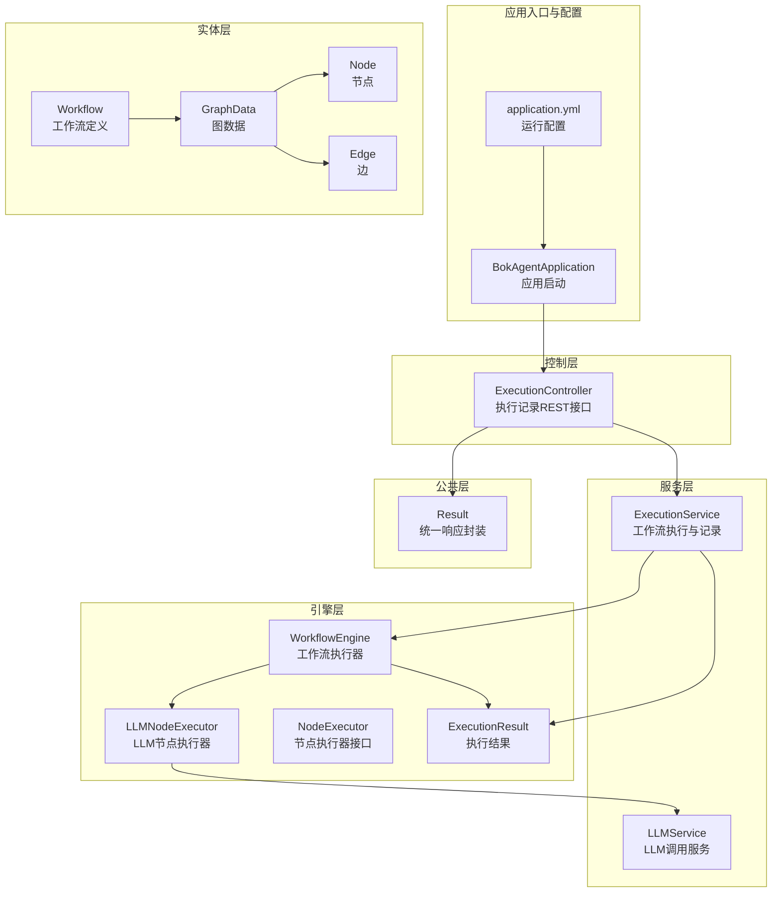
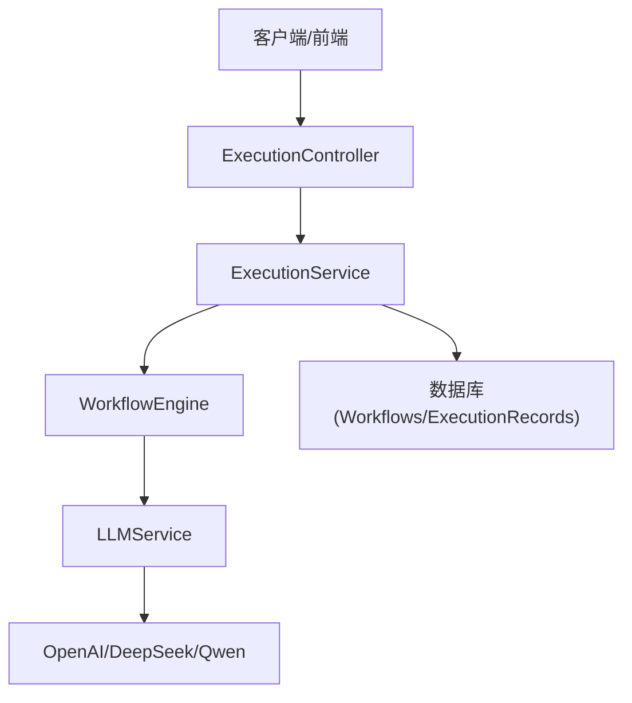
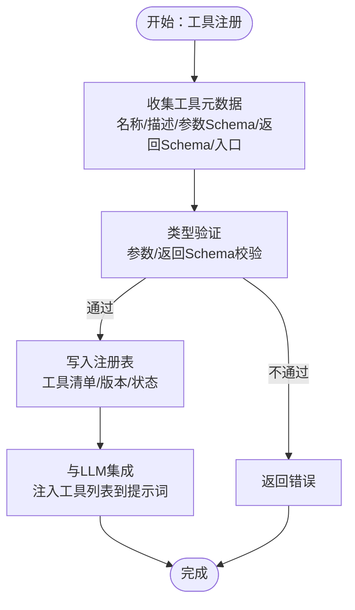
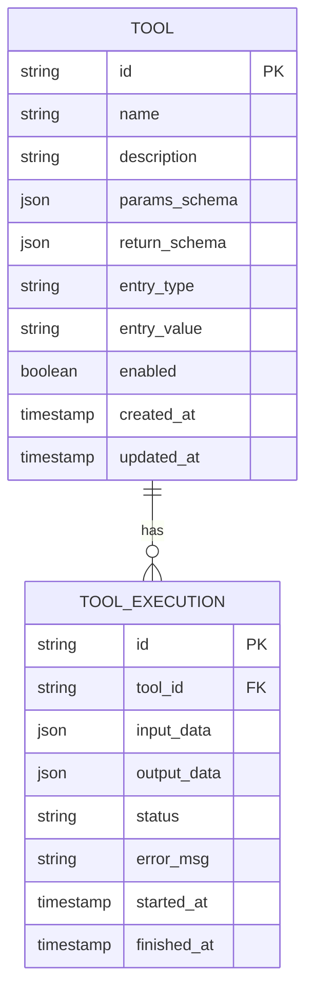
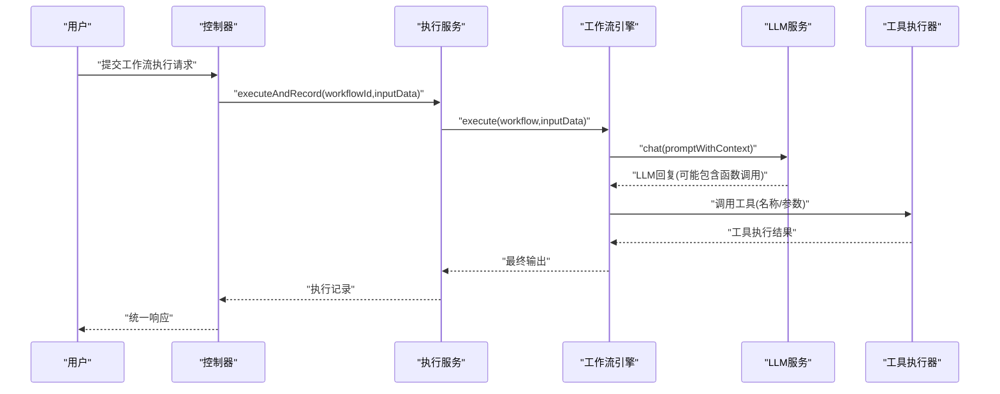
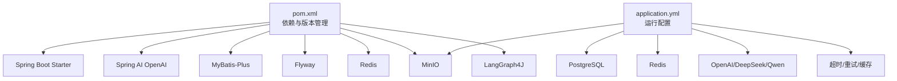
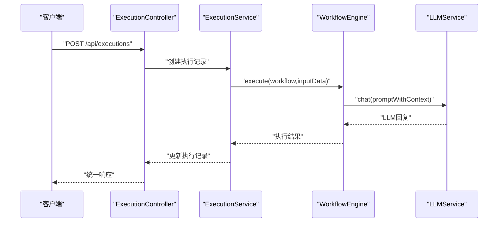

# 工具注册系统

<cite>
**本文引用的文件**
- [BokAgentApplication.java](file://backend/src/main/java/com/bokagent/BokAgentApplication.java)
- [application.yml](file://backend/src/main/resources/application.yml)
- [ExecutionController.java](file://backend/src/main/java/com/bokagent/controller/ExecutionController.java)
- [ExecutionService.java](file://backend/src/main/java/com/bokagent/service/ExecutionService.java)
- [LLMService.java](file://backend/src/main/java/com/bokagent/service/LLMService.java)
- [LLMNodeExecutor.java](file://backend/src/main/java/com/bokagent/engine/LLMNodeExecutor.java)
- [WorkflowEngine.java](file://backend/src/main/java/com/bokagent/engine/WorkflowEngine.java)
- [NodeExecutor.java](file://backend/src/main/java/com/bokagent/engine/NodeExecutor.java)
- [ExecutionResult.java](file://backend/src/main/java/com/bokagent/engine/ExecutionResult.java)
- [Workflow.java](file://backend/src/main/java/com/bokagent/entity/Workflow.java)
- [GraphData.java](file://backend/src/main/java/com/bokagent/entity/GraphData.java)
- [Node.java](file://backend/src/main/java/com/bokagent/entity/Node.java)
- [Edge.java](file://backend/src/main/java/com/bokagent/entity/Edge.java)
- [Result.java](file://backend/src/main/java/com/bokagent/common/Result.java)
- [pom.xml](file://backend/pom.xml)
</cite>

## 目录
1. [简介](#简介)
2. [项目结构](#项目结构)
3. [核心组件](#核心组件)
4. [架构总览](#架构总览)
5. [详细组件分析](#详细组件分析)
6. [依赖分析](#依赖分析)
7. [性能考虑](#性能考虑)
8. [故障排查指南](#故障排查指南)
9. [结论](#结论)
10. [附录：API接口文档与使用示例](#附录api接口文档与使用示例)

## 简介
本文件面向BokAgent工具注册系统，聚焦于“工具注册机制”的实现与扩展路径。当前代码库已具备工作流编排、LLM节点执行、统一响应封装等能力；工具注册作为可扩展的“工具节点”能力尚未在现有代码中直接体现。本文将基于现有架构，给出工具注册机制的设计蓝图、接口规范、数据模型、执行隔离与安全策略建议、与LLM集成的Function Calling协议对接方案，以及开发最佳实践与生命周期管理流程，帮助开发者快速上手并安全地扩展工具注册与执行。

## 项目结构
后端采用Spring Boot工程，核心模块划分如下：
- 应用入口与配置：BokAgentApplication、application.yml
- 控制层：ExecutionController（执行记录REST接口）
- 服务层：ExecutionService（工作流执行与记录）、LLMService（LLM调用）
- 引擎层：WorkflowEngine（工作流执行器）、LLMNodeExecutor（LLM节点执行器）、NodeExecutor（节点执行器接口）、ExecutionResult（执行结果）
- 实体层：Workflow、GraphData、Node、Edge等
- 公共层：Result（统一响应封装）

图表来源
- [BokAgentApplication.java:1-56](file://backend/src/main/java/com/bokagent/BokAgentApplication.java#L1-L56)
- [application.yml:1-190](file://backend/src/main/resources/application.yml#L1-L190)
- [ExecutionController.java:1-81](file://backend/src/main/java/com/bokagent/controller/ExecutionController.java#L1-L81)
- [ExecutionService.java:1-113](file://backend/src/main/java/com/bokagent/service/ExecutionService.java#L1-L113)
- [LLMService.java:1-67](file://backend/src/main/java/com/bokagent/service/LLMService.java#L1-L67)
- [WorkflowEngine.java:1-171](file://backend/src/main/java/com/bokagent/engine/WorkflowEngine.java#L1-L171)
- [LLMNodeExecutor.java:1-69](file://backend/src/main/java/com/bokagent/engine/LLMNodeExecutor.java#L1-L69)
- [NodeExecutor.java:1-24](file://backend/src/main/java/com/bokagent/engine/NodeExecutor.java#L1-L24)
- [ExecutionResult.java:1-32](file://backend/src/main/java/com/bokagent/engine/ExecutionResult.java#L1-L32)
- [Workflow.java:1-32](file://backend/src/main/java/com/bokagent/entity/Workflow.java#L1-L32)
- [GraphData.java:1-15](file://backend/src/main/java/com/bokagent/entity/GraphData.java#L1-L15)
- [Node.java:1-15](file://backend/src/main/java/com/bokagent/entity/Node.java#L1-L15)
- [Edge.java:1-14](file://backend/src/main/java/com/bokagent/entity/Edge.java#L1-L14)
- [Result.java:1-42](file://backend/src/main/java/com/bokagent/common/Result.java#L1-L42)

章节来源
- [BokAgentApplication.java:1-56](file://backend/src/main/java/com/bokagent/BokAgentApplication.java#L1-L56)
- [application.yml:1-190](file://backend/src/main/resources/application.yml#L1-L190)

## 核心组件
- 统一响应封装：Result提供标准的code/message/data结构，便于前端与接口层一致化处理。
- 执行记录接口：ExecutionController提供执行记录的增删改查接口，支撑工作流执行状态追踪。
- 工作流执行服务：ExecutionService负责工作流执行、记录创建与更新，串联引擎与数据库。
- LLM服务：LLMService通过Spring AI ChatClient调用外部大模型，支持多模型配置。
- 工作流引擎：WorkflowEngine负责解析GraphData，按拓扑顺序调度节点执行器。
- 节点执行器：NodeExecutor定义节点执行接口，LLMNodeExecutor实现LLM节点逻辑。

章节来源
- [Result.java:1-42](file://backend/src/main/java/com/bokagent/common/Result.java#L1-L42)
- [ExecutionController.java:1-81](file://backend/src/main/java/com/bokagent/controller/ExecutionController.java#L1-L81)
- [ExecutionService.java:1-113](file://backend/src/main/java/com/bokagent/service/ExecutionService.java#L1-L113)
- [LLMService.java:1-67](file://backend/src/main/java/com/bokagent/service/LLMService.java#L1-L67)
- [WorkflowEngine.java:1-171](file://backend/src/main/java/com/bokagent/engine/WorkflowEngine.java#L1-L171)
- [NodeExecutor.java:1-24](file://backend/src/main/java/com/bokagent/engine/NodeExecutor.java#L1-L24)
- [LLMNodeExecutor.java:1-69](file://backend/src/main/java/com/bokagent/engine/LLMNodeExecutor.java#L1-L69)

## 架构总览
系统采用“控制层-服务层-引擎层-外部服务”的分层架构。控制层接收HTTP请求，服务层协调执行与持久化，引擎层负责工作流调度与节点执行，外部服务通过配置接入（如LLM、MinIO、Redis等）。

图表来源
- [ExecutionController.java:1-81](file://backend/src/main/java/com/bokagent/controller/ExecutionController.java#L1-L81)
- [ExecutionService.java:1-113](file://backend/src/main/java/com/bokagent/service/ExecutionService.java#L1-L113)
- [WorkflowEngine.java:1-171](file://backend/src/main/java/com/bokagent/engine/WorkflowEngine.java#L1-L171)
- [LLMService.java:1-67](file://backend/src/main/java/com/bokagent/service/LLMService.java#L1-L67)
- [application.yml:45-67](file://backend/src/main/resources/application.yml#L45-L67)

## 详细组件分析

### 工具注册机制设计蓝图
为实现“工具注册”，建议在现有架构基础上新增以下模块与流程：
- 工具元数据收集：定义工具描述、参数Schema、返回值Schema、执行入口等。
- 类型验证：对工具参数与返回值进行Schema校验，确保与LLM Function Calling协议兼容。
- 注册表管理：维护工具清单、版本、启用状态、执行超时等元数据。
- 工具执行隔离：通过沙箱或容器化执行，限制资源与网络访问。
- 与LLM集成：将工具注册表注入LLM提示词，使LLM能动态选择与调用工具。
- 生命周期管理：安装、启用、禁用、卸载工具的全生命周期操作。

（本图为概念性设计，不对应具体源码文件）

### 工具接口规范与数据模型
- 工具描述：包含唯一标识、名称、描述、分类、可见性、创建时间等。
- 参数定义：采用JSON Schema，明确必填字段、类型、范围与默认值。
- 返回值规范：统一返回结构，包含状态、输出数据、错误信息与时间戳。
- 执行入口：支持函数名、模块路径、命令行等不同形式，便于隔离执行。

（本图为概念性数据模型，不对应具体源码文件）

### 工具执行隔离机制
- 沙箱/容器：使用Docker或Podman隔离执行，限制CPU/内存/磁盘/网络。
- 资源限制：通过cgroups或容器运行时设置CPU配额、内存上限、文件句柄数。
- 网络隔离：仅允许访问预设的工具API或受限网络。
- 权限最小化：以非root用户运行，仅授予必要文件权限。
- 超时与回退：设置执行超时与最大重试次数，失败时返回标准化错误。

（本节为通用实践建议，不对应具体源码文件）

### 与LLM的集成方式（Function Calling协议）
- 注入工具列表：在提示词中注入可用工具的描述与Schema，供LLM决策是否调用。
- 参数传递：LLM输出函数调用请求（名称、参数），由系统解析并调用工具。
- 结果格式化：将工具执行结果按统一格式返回给LLM，形成多轮对话闭环。
- 错误处理：捕获工具执行异常，返回人类可读的错误信息并允许LLM重试。

图表来源
- [ExecutionService.java:39-92](file://backend/src/main/java/com/bokagent/service/ExecutionService.java#L39-L92)
- [LLMService.java:27-44](file://backend/src/main/java/com/bokagent/service/LLMService.java#L27-L44)
- [LLMNodeExecutor.java:22-61](file://backend/src/main/java/com/bokagent/engine/LLMNodeExecutor.java#L22-L61)

### 开发最佳实践
- 命名规范：工具ID使用小写字母+下划线；参数Schema字段语义清晰；返回值包含状态与消息。
- 文档编写：为每个工具提供中文与英文双语说明，参数与返回值均需标注类型与约束。
- 版本管理：工具版本号遵循语义化版本；变更时保留向后兼容或提供迁移脚本。
- 安全与合规：禁止执行任意命令；对输入进行严格白名单过滤；记录审计日志。
- 性能优化：缓存热点工具结果；批量执行减少开销；异步回调通知结果。

（本节为通用实践建议，不对应具体源码文件）

### 生命周期管理
- 安装：上传工具包或注册工具元数据，校验Schema并通过。
- 启用：将工具标记为可用，注入到LLM提示词中。
- 禁用：临时停用工具，不影响历史记录与工作流。
- 卸载：删除工具元数据与历史执行记录，清理相关缓存。

（本节为通用流程建议，不对应具体源码文件）

## 依赖分析
后端使用Spring Boot 3.5.0与Spring AI 1.1.0，集成MyBatis-Plus、Flyway、Redis、MinIO、LangGraph4J等组件。配置文件集中管理数据库、缓存、LLM提供商、MCP协议、超时与重试策略等。

图表来源
- [pom.xml:1-170](file://backend/pom.xml#L1-L170)
- [application.yml:1-190](file://backend/src/main/resources/application.yml#L1-L190)

章节来源
- [pom.xml:1-170](file://backend/pom.xml#L1-L170)
- [application.yml:1-190](file://backend/src/main/resources/application.yml#L1-L190)

## 性能考虑
- 连接池与缓存：合理配置数据库连接池与Redis连接池，避免阻塞。
- 异步执行：对长耗时工具采用异步执行与回调，提升吞吐量。
- 超时与重试：为LLM调用与工具执行设置合理的超时与指数退避重试。
- 日志级别：生产环境降低日志级别，避免I/O瓶颈。
- 监控指标：通过Actuator暴露健康检查与指标，结合外部监控平台。

（本节提供通用指导，不对应具体源码文件）

## 故障排查指南
- 统一响应错误：所有接口返回Result结构，前端可根据code与message快速定位问题。
- 执行记录追踪：通过ExecutionController查询执行记录，核对状态与错误信息。
- LLM调用异常：检查application.yml中的LLM提供商配置与API密钥，确认网络可达性。
- 数据库迁移：Flyway自动迁移，若失败检查迁移脚本与数据库权限。
- 编码问题：应用启动时强制UTF-8编码，避免中文乱码。

章节来源
- [Result.java:1-42](file://backend/src/main/java/com/bokagent/common/Result.java#L1-L42)
- [ExecutionController.java:25-47](file://backend/src/main/java/com/bokagent/controller/ExecutionController.java#L25-L47)
- [LLMService.java:30-43](file://backend/src/main/java/com/bokagent/service/LLMService.java#L30-L43)
- [application.yml:26-31](file://backend/src/main/resources/application.yml#L26-L31)
- [BokAgentApplication.java:21-54](file://backend/src/main/java/com/bokagent/BokAgentApplication.java#L21-L54)

## 结论
当前代码库提供了完善的工作流编排与LLM集成能力，工具注册系统可通过新增“工具元数据收集—类型验证—注册表管理—隔离执行—LLM集成—生命周期管理”的完整链路进行扩展。建议在保持现有架构稳定性的前提下，逐步引入工具注册与执行模块，确保安全、可观测与可维护性。

## 附录：API接口文档与使用示例

### 执行记录接口
- 获取工作流的所有执行记录
  - 方法：GET
  - 路径：/api/executions/workflow/{workflowId}
  - 成功响应：Result<List<ExecutionRecord>>
- 获取执行记录详情
  - 方法：GET
  - 路径：/api/executions/{id}
  - 成功响应：Result<ExecutionRecord>
- 创建执行记录
  - 方法：POST
  - 路径：/api/executions
  - 请求体：ExecutionRecord
  - 成功响应：Result<ExecutionRecord>
- 更新执行记录
  - 方法：PUT
  - 路径：/api/executions/{id}
  - 请求体：ExecutionRecord
  - 成功响应：Result<ExecutionRecord>

章节来源
- [ExecutionController.java:25-79](file://backend/src/main/java/com/bokagent/controller/ExecutionController.java#L25-L79)
- [Result.java:14-40](file://backend/src/main/java/com/bokagent/common/Result.java#L14-L40)

### 使用示例（工作流执行）
- 步骤1：创建执行记录（状态置为RUNNING）
- 步骤2：服务层调用工作流引擎执行
- 步骤3：根据执行结果更新状态与结束时间
- 步骤4：返回统一响应

图表来源
- [ExecutionController.java:52-59](file://backend/src/main/java/com/bokagent/controller/ExecutionController.java#L52-L59)
- [ExecutionService.java:39-92](file://backend/src/main/java/com/bokagent/service/ExecutionService.java#L39-L92)
- [WorkflowEngine.java:47-82](file://backend/src/main/java/com/bokagent/engine/WorkflowEngine.java#L47-L82)
- [LLMService.java:27-44](file://backend/src/main/java/com/bokagent/service/LLMService.java#L27-L44)