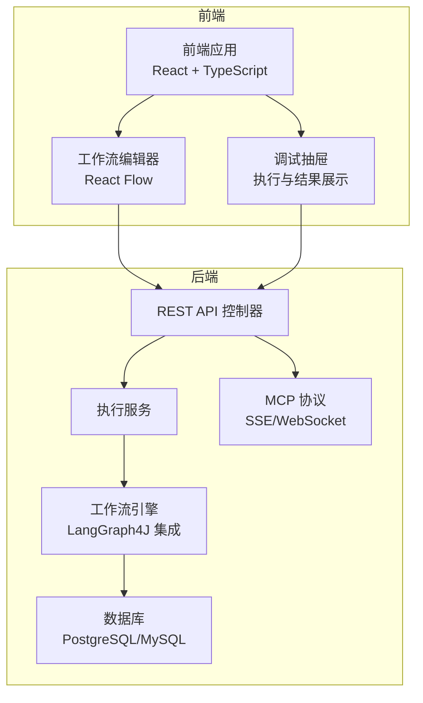
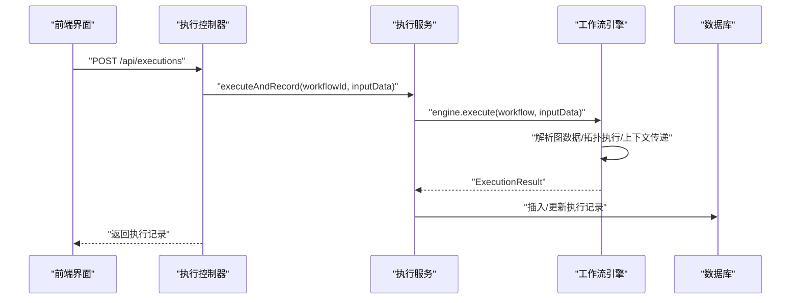
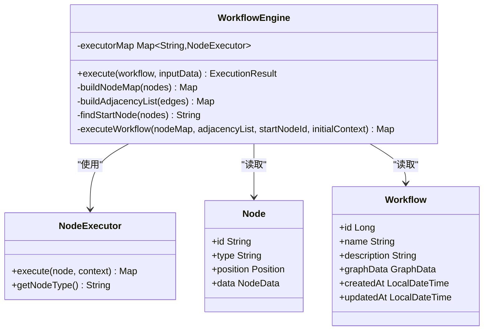
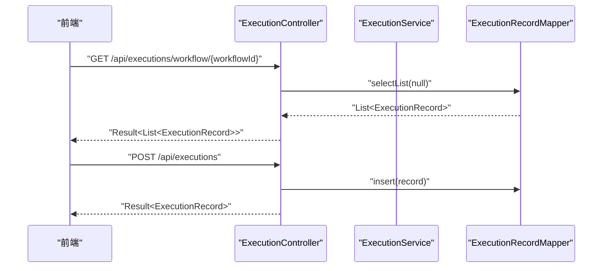
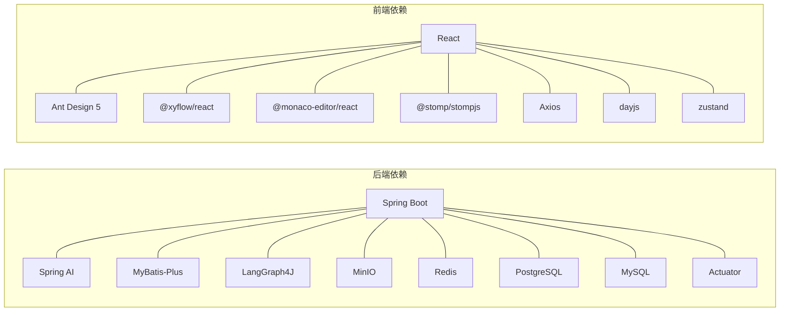

# 插件开发SDK

<cite>
**本文引用的文件**
- [README.md](file://README.md)
- [QUICKSTART.md](file://QUICKSTART.md)
- [IMPLEMENTATION_PROGRESS.md](file://IMPLEMENTATION_PROGRESS.md)
- [PROJECT_INIT_STATUS.md](file://PROJECT_INIT_STATUS.md)
- [backend/pom.xml](file://backend/pom.xml)
- [frontend/package.json](file://frontend/package.json)
- [backend/src/main/java/com/bokagent/engine/NodeExecutor.java](file://backend/src/main/java/com/bokagent/engine/NodeExecutor.java)
- [backend/src/main/java/com/bokagent/engine/WorkflowEngine.java](file://backend/src/main/java/com/bokagent/engine/WorkflowEngine.java)
- [backend/src/main/java/com/bokagent/entity/Node.java](file://backend/src/main/java/com/bokagent/entity/Node.java)
- [backend/src/main/java/com/bokagent/entity/Workflow.java](file://backend/src/main/java/com/bokagent/entity/Workflow.java)
- [backend/src/main/java/com/bokagent/service/ExecutionService.java](file://backend/src/main/java/com/bokagent/service/ExecutionService.java)
- [backend/src/main/java/com/bokagent/controller/ExecutionController.java](file://backend/src/main/java/com/bokagent/controller/ExecutionController.java)
- [backend/src/main/resources/application.yml](file://backend/src/main/resources/application.yml)
</cite>

## 目录
1. [简介](#简介)
2. [项目结构](#项目结构)
3. [核心组件](#核心组件)
4. [架构总览](#架构总览)
5. [详细组件分析](#详细组件分析)
6. [依赖分析](#依赖分析)
7. [性能考虑](#性能考虑)
8. [故障排除指南](#故障排除指南)
9. [结论](#结论)
10. [附录](#附录)

## 简介
本指南面向希望基于 BokAgent 平台开发“插件”的开发者，目标是提供一套完整的“插件开发SDK”使用与扩展方案。当前仓库已具备：
- 前端工作流编辑器（React + TypeScript）
- 后端工作流引擎（Spring Boot 3.5 + MyBatis-Plus + Spring AI + LangGraph4J）
- Docker 一键部署与 UTF-8 中文支持
- MCP 协议基础配置与能力开关
- 执行记录与统一响应/异常处理

本指南将围绕“插件接口实现、生命周期钩子、事件处理、配置管理、测试与调试、打包发布”等方面，给出可操作的开发步骤与最佳实践。

## 项目结构
BokAgent 采用前后端分离架构，核心目录如下：
- backend：Spring Boot 后端，包含控制器、服务、引擎、实体、Mapper、配置等
- frontend：React 18 + TypeScript 前端，包含工作流编辑器、调试抽屉、API 服务等
- docker：Docker Compose 编排与镜像构建
- docs：项目文档
- plugin-sdk：插件开发SDK（本指南重点）
- tool-sdk：工具开发SDK（本指南不展开）
- sample-plugins：示例插件（本指南不展开）

图表来源
- [backend/src/main/java/com/bokagent/controller/ExecutionController.java:1-81](file://backend/src/main/java/com/bokagent/controller/ExecutionController.java#L1-81)
- [backend/src/main/java/com/bokagent/service/ExecutionService.java:1-113](file://backend/src/main/java/com/bokagent/service/ExecutionService.java#L1-113)
- [backend/src/main/java/com/bokagent/engine/WorkflowEngine.java:1-171](file://backend/src/main/java/com/bokagent/engine/WorkflowEngine.java#L1-171)
- [backend/src/main/resources/application.yml:116-137](file://backend/src/main/resources/application.yml#L116-137)

章节来源
- [README.md: 81-92:81-92](file://README.md#L81-L92)
- [PROJECT_INIT_STATUS.md: 65-109:65-109](file://PROJECT_INIT_STATUS.md#L65-L109)

## 核心组件
- 节点执行器接口：定义节点执行规范，提供上下文传递与类型识别
- 工作流引擎：负责解析图数据、构建执行图、拓扑执行、上下文传递
- 执行服务：封装执行流程、记录执行历史、错误处理
- 控制器：对外暴露执行记录的 CRUD 接口
- 配置中心：application.yml 提供 MCP、缓存、超时、重试、日志等全局配置

章节来源
- [backend/src/main/java/com/bokagent/engine/NodeExecutor.java: 1-24:1-24](file://backend/src/main/java/com/bokagent/engine/NodeExecutor.java#L1-L24)
- [backend/src/main/java/com/bokagent/engine/WorkflowEngine.java: 1-171:1-171](file://backend/src/main/java/com/bokagent/engine/WorkflowEngine.java#L1-L171)
- [backend/src/main/java/com/bokagent/service/ExecutionService.java: 1-113:1-113](file://backend/src/main/java/com/bokagent/service/ExecutionService.java#L1-L113)
- [backend/src/main/java/com/bokagent/controller/ExecutionController.java: 1-81:1-81](file://backend/src/main/java/com/bokagent/controller/ExecutionController.java#L1-L81)
- [backend/src/main/resources/application.yml: 101-162:101-162](file://backend/src/main/resources/application.yml#L101-L162)

## 架构总览
下图展示了从前端到后端、再到数据库与 MCP 协议的整体交互关系：

图表来源
- [backend/src/main/java/com/bokagent/controller/ExecutionController.java: 25-60:25-60](file://backend/src/main/java/com/bokagent/controller/ExecutionController.java#L25-L60)
- [backend/src/main/java/com/bokagent/service/ExecutionService.java: 39-91:39-91](file://backend/src/main/java/com/bokagent/service/ExecutionService.java#L39-L91)
- [backend/src/main/java/com/bokagent/engine/WorkflowEngine.java: 47-82:47-82](file://backend/src/main/java/com/bokagent/engine/WorkflowEngine.java#L47-L82)

## 详细组件分析

### 节点执行器接口与工作流引擎
- NodeExecutor：定义 execute(node, context) 与 getNodeType()，用于不同节点类型的统一执行入口
- WorkflowEngine：解析 GraphData，构建节点映射与邻接表，按拓扑顺序执行节点，维护上下文传递

图表来源
- [backend/src/main/java/com/bokagent/engine/NodeExecutor.java: 6-23:6-23](file://backend/src/main/java/com/bokagent/engine/NodeExecutor.java#L6-L23)
- [backend/src/main/java/com/bokagent/engine/WorkflowEngine.java: 21-171:21-171](file://backend/src/main/java/com/bokagent/engine/WorkflowEngine.java#L21-L171)
- [backend/src/main/java/com/bokagent/entity/Node.java: 8-14:8-14](file://backend/src/main/java/com/bokagent/entity/Node.java#L8-L14)
- [backend/src/main/java/com/bokagent/entity/Workflow.java: 14-31:14-31](file://backend/src/main/java/com/bokagent/entity/Workflow.java#L14-L31)

章节来源
- [backend/src/main/java/com/bokagent/engine/NodeExecutor.java: 1-24:1-24](file://backend/src/main/java/com/bokagent/engine/NodeExecutor.java#L1-L24)
- [backend/src/main/java/com/bokagent/engine/WorkflowEngine.java: 1-171:1-171](file://backend/src/main/java/com/bokagent/engine/WorkflowEngine.java#L1-L171)
- [backend/src/main/java/com/bokagent/entity/Node.java: 1-15:1-15](file://backend/src/main/java/com/bokagent/entity/Node.java#L1-L15)
- [backend/src/main/java/com/bokagent/entity/Workflow.java: 1-32:1-32](file://backend/src/main/java/com/bokagent/entity/Workflow.java#L1-L32)

### 执行服务与控制器
- ExecutionService：封装执行流程，创建执行记录，调用引擎执行，更新状态与结果
- ExecutionController：提供执行记录的查询、创建、更新接口

图表来源
- [backend/src/main/java/com/bokagent/controller/ExecutionController.java: 25-79:25-79](file://backend/src/main/java/com/bokagent/controller/ExecutionController.java#L25-L79)
- [backend/src/main/java/com/bokagent/service/ExecutionService.java: 99-112:99-112](file://backend/src/main/java/com/bokagent/service/ExecutionService.java#L99-L112)

章节来源
- [backend/src/main/java/com/bokagent/controller/ExecutionController.java: 1-81:1-81](file://backend/src/main/java/com/bokagent/controller/ExecutionController.java#L1-L81)
- [backend/src/main/java/com/bokagent/service/ExecutionService.java: 1-113:1-113](file://backend/src/main/java/com/bokagent/service/ExecutionService.java#L1-L113)

### 配置管理（MCP、缓存、超时、重试、日志）
- MCP：启用/禁用、能力开关、传输通道（SSE/WebSocket）
- 缓存：默认 TTL、工具结果 TTL、LLM 响应 TTL
- 超时：工具执行、LLM 调用、TTS 合成、MCP 请求、工作流执行
- 重试：最大尝试次数、初始延迟、退避倍数、最大延迟、可重试异常
- 日志：控制台与文件编码、级别、文件滚动

章节来源
- [backend/src/main/resources/application.yml: 116-162:116-162](file://backend/src/main/resources/application.yml#L116-L162)

## 依赖分析
- 后端依赖（Maven）：Spring Boot Web/WebSocket/Redis/Actuator、MyBatis-Plus、Flyway、MinIO、LangGraph4J、Spring AI、WebSocket 客户端、Lombok、Jackson、测试 Starter
- 前端依赖（npm）：React、Ant Design 5、@xyflow/react、Monaco Editor、@stomp/stompjs、Axios、dayjs、zustand、Vite、TypeScript

图表来源
- [backend/pom.xml: 29-128:29-128](file://backend/pom.xml#L29-L128)
- [frontend/package.json: 12-35:12-35](file://frontend/package.json#L12-L35)

章节来源
- [backend/pom.xml: 1-170:1-170](file://backend/pom.xml#L1-L170)
- [frontend/package.json: 1-37:1-37](file://frontend/package.json#L1-L37)

## 性能考虑
- 异步任务池：虚拟线程、核心池大小、队列容量
- 缓存策略：合理设置 TTL，避免热点数据过期导致抖动
- 超时控制：针对外部调用（LLM、MCP、MinIO）设置上限，防止阻塞
- 连接池：数据库最大连接数、空闲连接数、最大等待时间
- 日志级别：生产环境建议 INFO，必要时临时提升到 DEBUG

章节来源
- [backend/src/main/resources/application.yml: 82-89:82-89](file://backend/src/main/resources/application.yml#L82-L89)
- [backend/src/main/resources/application.yml: 158-162:158-162](file://backend/src/main/resources/application.yml#L158-L162)
- [backend/src/main/resources/application.yml: 149-155:149-155](file://backend/src/main/resources/application.yml#L149-L155)

## 故障排除指南
- 端口冲突：修改 docker-compose.yml 中的端口映射
- 服务启动失败：查看后端/前端日志定位异常
- 数据库连接失败：确认数据库服务状态并重启
- 中文乱码：确保终端、浏览器、操作系统均使用 UTF-8

章节来源
- [QUICKSTART.md: 114-144:114-144](file://QUICKSTART.md#L114-L144)

## 结论
本指南基于现有代码库，梳理了插件开发所需的关键接口与配置要点。结合 NodeExecutor、WorkflowEngine、ExecutionService、ExecutionController 以及 application.yml 的配置项，开发者可据此实现“工作流节点插件”。对于“工具集成插件”，可参考 Spring AI 的 ChatClient 集成方式；对于“Hello World 插件”，可从最小化节点实现入手，逐步接入上下文与外部服务。

## 附录

### A. 安装与环境准备
- Docker 一键部署（推荐）：复制环境变量模板、启动服务、验证 UTF-8 编码、访问应用
- 本地开发：后端使用 Maven 启动，前端使用 npm 安装与开发

章节来源
- [README.md: 30-67:30-67](file://README.md#L30-L67)
- [QUICKSTART.md: 23-100:23-100](file://QUICKSTART.md#L23-L100)

### B. 插件项目标准结构与约定
- 目录布局：遵循“插件名/src/main/java/...”组织，使用 Maven 或 Gradle 构建
- 配置文件：在 application.yml 中声明插件相关配置（如 MCP 能力、超时、缓存）
- 资源管理：插件静态资源通过前端工作流编辑器注册或通过后端 API 暴露

章节来源
- [backend/src/main/resources/application.yml: 116-137:116-137](file://backend/src/main/resources/application.yml#L116-L137)

### C. 插件接口实现方法
- 生命周期钩子：在节点执行前后注入初始化/清理逻辑（通过 NodeExecutor 实现）
- 事件处理：利用 ExecutionService 的执行记录能力，记录节点状态与结果
- 配置管理：通过 application.yml 的缓存、超时、重试、日志等参数统一治理

章节来源
- [backend/src/main/java/com/bokagent/engine/NodeExecutor.java: 6-23:6-23](file://backend/src/main/java/com/bokagent/engine/NodeExecutor.java#L6-L23)
- [backend/src/main/java/com/bokagent/service/ExecutionService.java: 39-91:39-91](file://backend/src/main/java/com/bokagent/service/ExecutionService.java#L39-L91)
- [backend/src/main/resources/application.yml: 138-162:138-162](file://backend/src/main/resources/application.yml#L138-L162)

### D. 开发示例（路径指引）
- Hello World 插件：实现一个最小化的 NodeExecutor，返回固定输出，注册到执行器映射
- 工具集成插件：基于 Spring AI ChatClient 调用 LLM，将结果写入上下文
- 工作流节点插件：实现 Start/LLM/End 节点执行器，配合 WorkflowEngine 拓扑执行

章节来源
- [backend/src/main/java/com/bokagent/engine/NodeExecutor.java: 6-23:6-23](file://backend/src/main/java/com/bokagent/engine/NodeExecutor.java#L6-L23)
- [backend/src/main/java/com/bokagent/engine/WorkflowEngine.java: 32-39:32-39](file://backend/src/main/java/com/bokagent/engine/WorkflowEngine.java#L32-L39)
- [backend/src/main/java/com/bokagent/service/ExecutionService.java: 61-63:61-63](file://backend/src/main/java/com/bokagent/service/ExecutionService.java#L61-L63)

### E. 测试策略与调试方法
- 单元测试：对 NodeExecutor 的 execute 方法进行输入/上下文/输出断言
- 集成测试：通过 ExecutionController 的接口发起执行，校验 ExecutionService 的执行记录
- 性能测试：在 application.yml 中调整线程池与缓存参数，观察吞吐与延迟

章节来源
- [backend/src/main/java/com/bokagent/controller/ExecutionController.java: 25-79:25-79](file://backend/src/main/java/com/bokagent/controller/ExecutionController.java#L25-L79)
- [backend/src/main/java/com/bokagent/service/ExecutionService.java: 39-91:39-91](file://backend/src/main/java/com/bokagent/service/ExecutionService.java#L39-L91)
- [backend/src/main/resources/application.yml: 82-89:82-89](file://backend/src/main/resources/application.yml#L82-L89)

### F. 打包与发布（Maven）
- 依赖声明：在 pom.xml 中声明插件所需的后端依赖（如 Spring AI、LangGraph4J、MinIO 等）
- 构建配置：使用 spring-boot-maven-plugin 打包为可执行 JAR
- 版本控制：遵循语义化版本，配合 Git 标签与 CI 发布

章节来源
- [backend/pom.xml: 29-128:29-128](file://backend/pom.xml#L29-L128)
- [backend/pom.xml: 142-157:142-157](file://backend/pom.xml#L142-L157)

### G. 常见问题与最佳实践
- 问题：端口被占用、服务启动失败、数据库连接失败、中文乱码
- 最佳实践：统一 UTF-8 编码、合理设置超时与重试、使用缓存降低外部依赖压力、在生产环境降低日志级别

章节来源
- [QUICKSTART.md: 114-158:114-158](file://QUICKSTART.md#L114-L158)
- [PROJECT_INIT_STATUS.md: 134-159:134-159](file://PROJECT_INIT_STATUS.md#L134-L159)