# 插件架构设计

<cite>
**本文档引用的文件**
- [BokAgentApplication.java](file://backend/src/main/java/com/bokagent/BokAgentApplication.java)
- [WorkflowEngine.java](file://backend/src/main/java/com/bokagent/engine/WorkflowEngine.java)
- [WorkflowExecutor.java](file://backend/src/main/java/com/bokagent/engine/WorkflowExecutor.java)
- [WorkflowEngineSelector.java](file://backend/src/main/java/com/bokagent/engine/WorkflowEngineSelector.java)
- [CustomWorkflowEngine.java](file://backend/src/main/java/com/bokagent/engine/CustomWorkflowEngine.java)
- [NodeExecutor.java](file://backend/src/main/java/com/bokagent/engine/NodeExecutor.java)
- [StartNodeExecutor.java](file://backend/src/main/java/com/bokagent/engine/StartNodeExecutor.java)
- [LLMNodeExecutor.java](file://backend/src/main/java/com/bokagent/engine/LLMNodeExecutor.java)
- [EndNodeExecutor.java](file://backend/src/main/java/com/bokagent/engine/EndNodeExecutor.java)
- [ExecutionResult.java](file://backend/src/main/java/com/bokagent/engine/ExecutionResult.java)
- [ExecutionController.java](file://backend/src/main/java/com/bokagent/controller/ExecutionController.java)
- [WorkflowController.java](file://backend/src/main/java/com/bokagent/controller/WorkflowController.java)
- [Result.java](file://backend/src/main/java/com/bokagent/common/Result.java)
- [Workflow.java](file://backend/src/main/java/com/bokagent/entity/Workflow.java)
- [application.yml](file://backend/src/main/resources/application.yml)
- [DUAL_ENGINE_PHASE1_REPORT.md](file://DUAL_ENGINE_PHASE1_REPORT.md)
- [STAGE3_COMPLETION_REPORT.md](file://STAGE3_COMPLETION_REPORT.md)
</cite>

## 目录
1. [引言](#引言)
2. [项目结构](#项目结构)
3. [核心组件](#核心组件)
4. [架构概览](#架构概览)
5. [详细组件分析](#详细组件分析)
6. [依赖分析](#依赖分析)
7. [性能考虑](#性能考虑)
8. [故障排除指南](#故障排除指南)
9. [结论](#结论)
10. [附录](#附录)

## 引言

BokAgent是一个基于Spring Boot的AI Agent工作流编排系统，采用模块化设计思想，实现了可扩展的插件架构。该架构的核心设计理念是通过接口抽象和依赖注入实现插件的热插拔能力，支持动态类加载和生命周期管理。

本系统采用双引擎架构设计，既保持了现有功能的稳定性，又为未来的插件扩展预留了充足的空间。通过统一的接口契约和配置驱动的引擎选择机制，实现了插件系统的高度灵活性和可维护性。

## 项目结构

BokAgent项目采用标准的分层架构设计，主要分为以下层次：

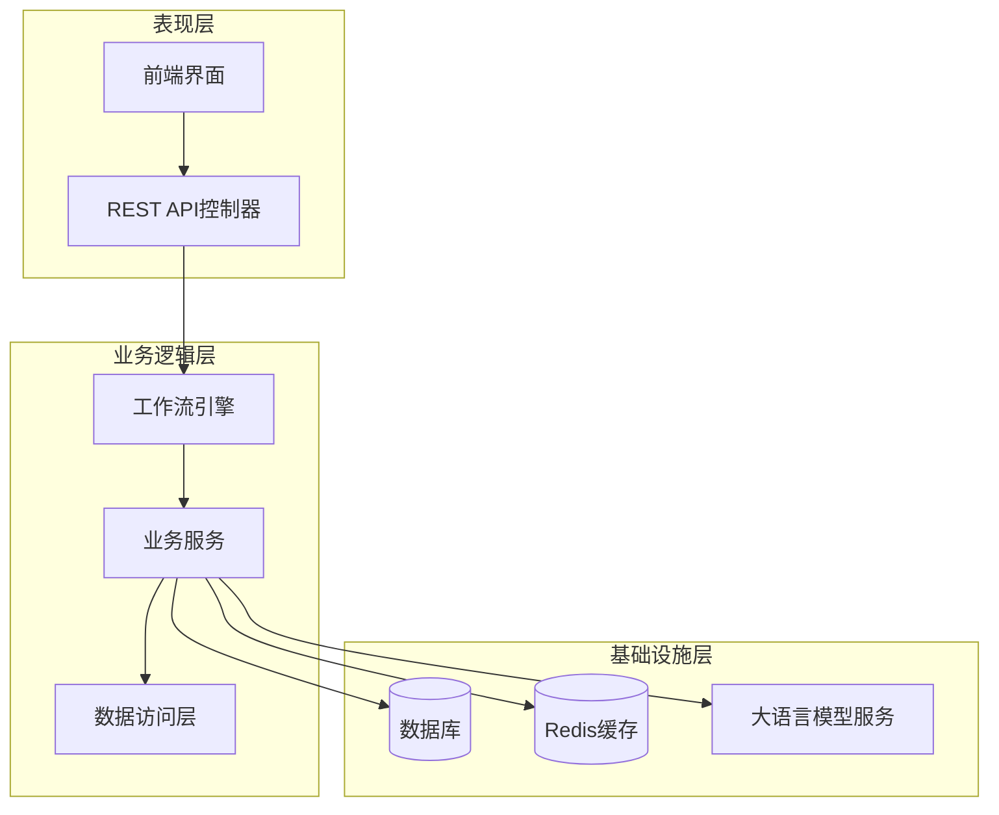

**图表来源**
- [BokAgentApplication.java:1-56](file://backend/src/main/java/com/bokagent/BokAgentApplication.java#L1-L56)
- [WorkflowController.java:1-92](file://backend/src/main/java/com/bokagent/controller/WorkflowController.java#L1-L92)
- [ExecutionController.java:1-81](file://backend/src/main/java/com/bokagent/controller/ExecutionController.java#L1-L81)

**章节来源**
- [BokAgentApplication.java:1-56](file://backend/src/main/java/com/bokagent/BokAgentApplication.java#L1-L56)
- [application.yml:1-190](file://backend/src/main/resources/application.yml#L1-L190)

## 核心组件

### 工作流引擎体系

系统实现了完整的双引擎架构，通过统一接口契约支持多种执行引擎：

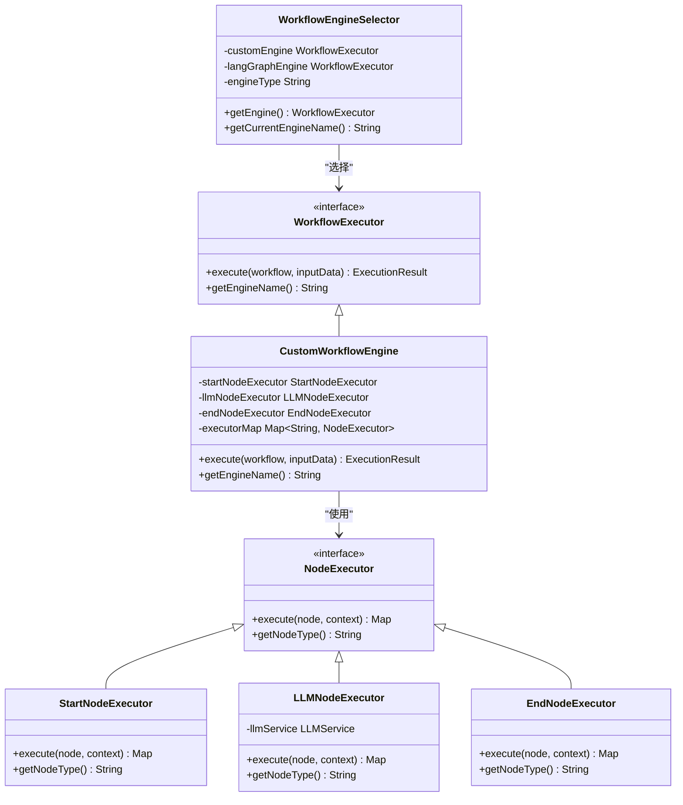

**图表来源**
- [WorkflowExecutor.java:1-25](file://backend/src/main/java/com/bokagent/engine/WorkflowExecutor.java#L1-L25)
- [CustomWorkflowEngine.java:1-44](file://backend/src/main/java/com/bokagent/engine/CustomWorkflowEngine.java#L1-L44)
- [WorkflowEngineSelector.java:1-52](file://backend/src/main/java/com/bokagent/engine/WorkflowEngineSelector.java#L1-L52)
- [NodeExecutor.java:1-24](file://backend/src/main/java/com/bokagent/engine/NodeExecutor.java#L1-L24)

### 控制器层架构

系统采用RESTful API设计，提供完整的工作流管理功能：

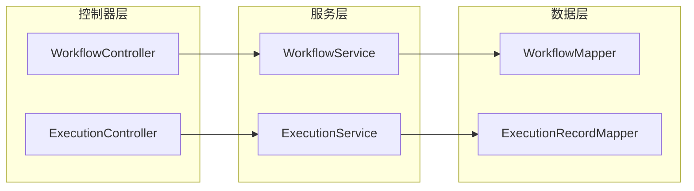

**图表来源**
- [WorkflowController.java:1-92](file://backend/src/main/java/com/bokagent/controller/WorkflowController.java#L1-L92)
- [ExecutionController.java:1-81](file://backend/src/main/java/com/bokagent/controller/ExecutionController.java#L1-L81)

**章节来源**
- [WorkflowExecutor.java:1-25](file://backend/src/main/java/com/bokagent/engine/WorkflowExecutor.java#L1-L25)
- [WorkflowEngineSelector.java:1-52](file://backend/src/main/java/com/bokagent/engine/WorkflowEngineSelector.java#L1-L52)
- [NodeExecutor.java:1-24](file://backend/src/main/java/com/bokagent/engine/NodeExecutor.java#L1-L24)

## 架构概览

### 插件发现机制

系统通过Spring框架的依赖注入机制实现插件的自动发现和装配：

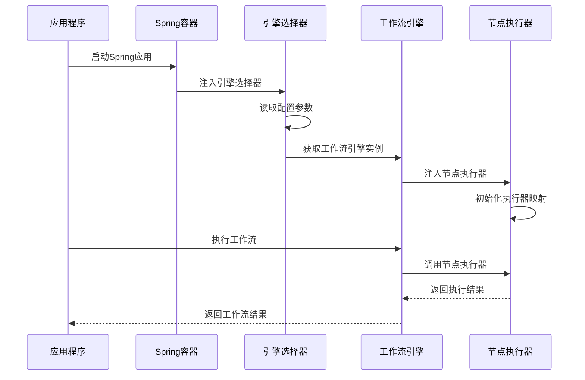

**图表来源**
- [WorkflowEngineSelector.java:25-43](file://backend/src/main/java/com/bokagent/engine/WorkflowEngineSelector.java#L25-L43)
- [CustomWorkflowEngine.java:31-38](file://backend/src/main/java/com/bokagent/engine/CustomWorkflowEngine.java#L31-L38)

### 动态类加载策略

系统采用基于注解的动态类加载策略，通过Spring的组件扫描机制实现插件的自动注册：

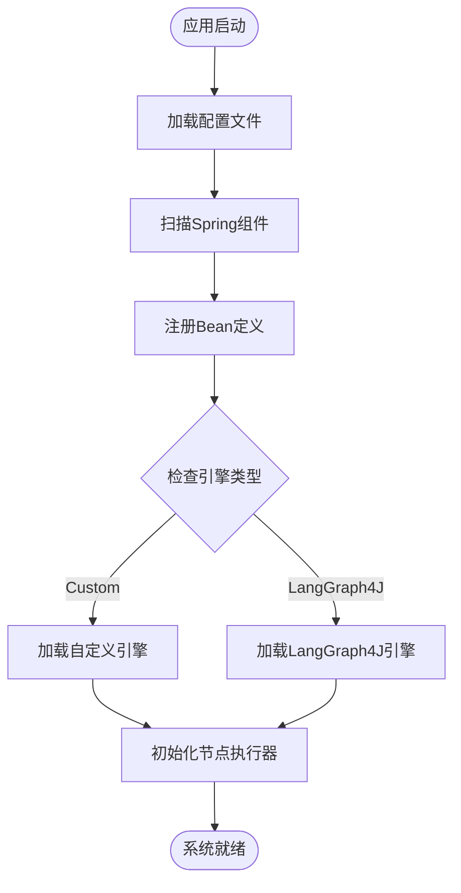

**图表来源**
- [application.yml:101-108](file://backend/src/main/resources/application.yml#L101-L108)
- [WorkflowEngineSelector.java:25-43](file://backend/src/main/java/com/bokagent/engine/WorkflowEngineSelector.java#L25-L43)

**章节来源**
- [DUAL_ENGINE_PHASE1_REPORT.md:1-170](file://DUAL_ENGINE_PHASE1_REPORT.md#L1-L170)
- [application.yml:101-108](file://backend/src/main/resources/application.yml#L101-L108)

## 详细组件分析

### 工作流引擎接口设计

#### WorkflowExecutor接口规范

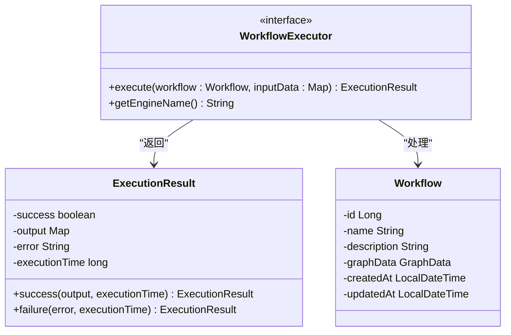

**图表来源**
- [WorkflowExecutor.java:10-25](file://backend/src/main/java/com/bokagent/engine/WorkflowExecutor.java#L10-L25)
- [ExecutionResult.java:9-32](file://backend/src/main/java/com/bokagent/engine/ExecutionResult.java#L9-L32)
- [Workflow.java:14-32](file://backend/src/main/java/com/bokagent/entity/Workflow.java#L14-L32)

#### 引擎选择器实现

引擎选择器采用条件化注入和配置驱动的方式，实现了插件的动态切换：

**章节来源**
- [WorkflowEngineSelector.java:1-52](file://backend/src/main/java/com/bokagent/engine/WorkflowEngineSelector.java#L1-L52)
- [DUAL_ENGINE_PHASE1_REPORT.md:27-42](file://DUAL_ENGINE_PHASE1_REPORT.md#L27-L42)

### 节点执行器体系

#### NodeExecutor接口设计

系统实现了标准化的节点执行器接口，支持不同类型节点的统一处理：

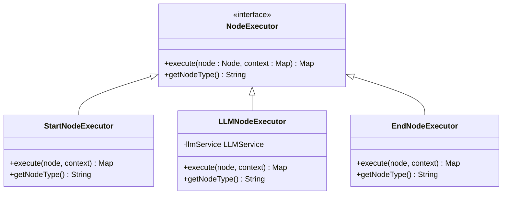

**图表来源**
- [NodeExecutor.java:9-24](file://backend/src/main/java/com/bokagent/engine/NodeExecutor.java#L9-L24)
- [StartNodeExecutor.java:15-41](file://backend/src/main/java/com/bokagent/engine/StartNodeExecutor.java#L15-L41)
- [LLMNodeExecutor.java:17-69](file://backend/src/main/java/com/bokagent/engine/LLMNodeExecutor.java#L17-L69)
- [EndNodeExecutor.java:15-41](file://backend/src/main/java/com/bokagent/engine/EndNodeExecutor.java#L15-L41)

#### 执行器注册机制

自定义工作流引擎通过构造函数注册内置的节点执行器：

**章节来源**
- [CustomWorkflowEngine.java:31-38](file://backend/src/main/java/com/bokagent/engine/CustomWorkflowEngine.java#L31-L38)
- [StartNodeExecutor.java:17-34](file://backend/src/main/java/com/bokagent/engine/StartNodeExecutor.java#L17-L34)
- [EndNodeExecutor.java:17-34](file://backend/src/main/java/com/bokagent/engine/EndNodeExecutor.java#L17-L34)

### 生命周期管理流程

#### 工作流执行生命周期

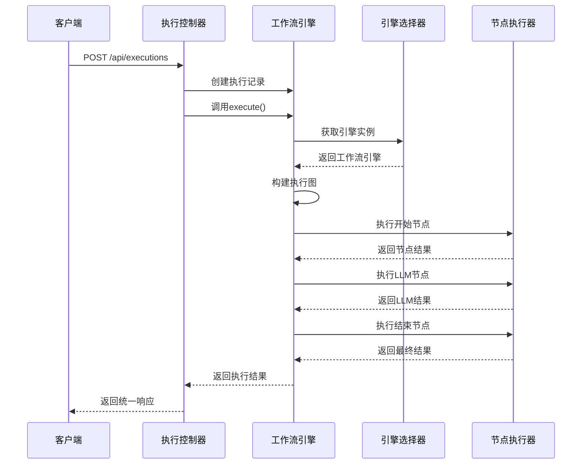

**图表来源**
- [ExecutionController.java:52-79](file://backend/src/main/java/com/bokagent/controller/ExecutionController.java#L52-L79)
- [CustomWorkflowEngine.java:40-82](file://backend/src/main/java/com/bokagent/engine/CustomWorkflowEngine.java#L40-L82)

**章节来源**
- [ExecutionController.java:1-81](file://backend/src/main/java/com/bokagent/controller/ExecutionController.java#L1-L81)
- [CustomWorkflowEngine.java:1-171](file://backend/src/main/java/com/bokagent/engine/CustomWorkflowEngine.java#L1-L171)

### 配置解析机制

#### 应用配置体系

系统采用YAML配置文件管理各种设置，支持环境变量覆盖：

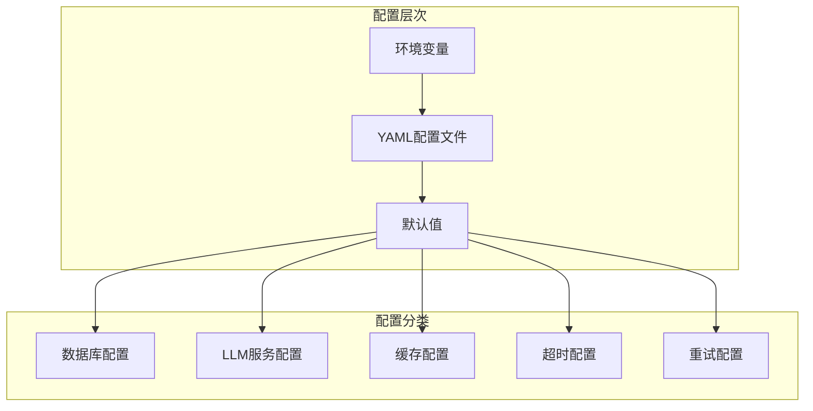

**图表来源**
- [application.yml:16-67](file://backend/src/main/resources/application.yml#L16-L67)
- [application.yml:101-155](file://backend/src/main/resources/application.yml#L101-L155)

**章节来源**
- [application.yml:1-190](file://backend/src/main/resources/application.yml#L1-190)

## 依赖分析

### 组件耦合关系

系统采用松耦合设计，通过接口和依赖注入实现组件间的解耦：

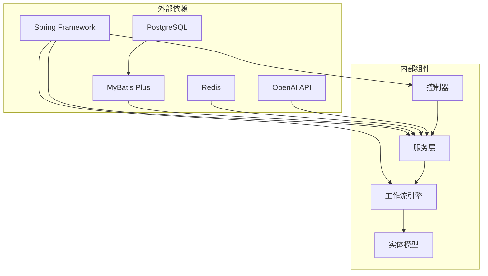

**图表来源**
- [application.yml:16-67](file://backend/src/main/resources/application.yml#L16-L67)
- [BokAgentApplication.java:16-18](file://backend/src/main/java/com/bokagent/BokAgentApplication.java#L16-L18)

### 依赖注入模式

系统广泛使用Spring的依赖注入模式，实现插件的自动装配：

**章节来源**
- [CustomWorkflowEngine.java:22-29](file://backend/src/main/java/com/bokagent/engine/CustomWorkflowEngine.java#L22-L29)
- [LLMNodeExecutor.java:19-20](file://backend/src/main/java/com/bokagent/engine/LLMNodeExecutor.java#L19-L20)

## 性能考虑

### 执行效率优化

系统在多个层面实现了性能优化：

1. **缓存策略**：通过Redis实现结果缓存，减少重复计算
2. **连接池管理**：配置合理的数据库连接池参数
3. **异步处理**：支持虚拟线程的异步任务执行
4. **超时控制**：为不同操作设置合适的超时时间

### 资源管理

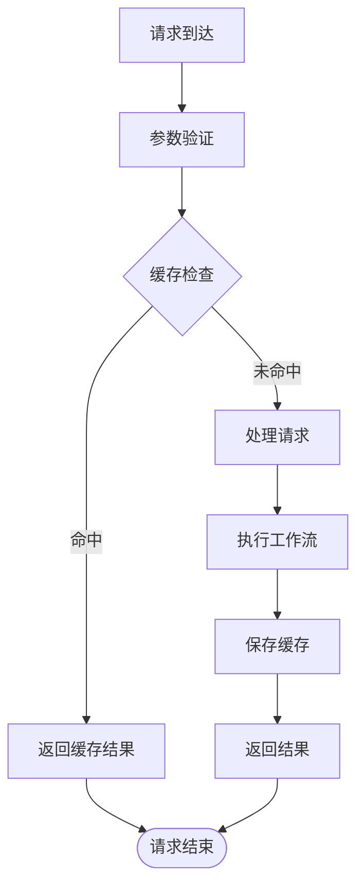

**图表来源**
- [application.yml:157-163](file://backend/src/main/resources/application.yml#L157-L163)
- [application.yml:81-89](file://backend/src/main/resources/application.yml#L81-L89)

**章节来源**
- [application.yml:157-163](file://backend/src/main/resources/application.yml#L157-L163)
- [application.yml:81-89](file://backend/src/main/resources/application.yml#L81-L89)

## 故障排除指南

### 常见问题诊断

#### 引擎切换问题

当配置为LangGraph4J但未找到实现时，系统会自动回退到自定义引擎：

**章节来源**
- [WorkflowEngineSelector.java:37-40](file://backend/src/main/java/com/bokagent/engine/WorkflowEngineSelector.java#L37-L40)
- [DUAL_ENGINE_PHASE1_REPORT.md:136-141](file://DUAL_ENGINE_PHASE1_REPORT.md#L136-L141)

#### 编码问题排查

系统通过多种方式确保UTF-8编码的一致性：

**章节来源**
- [BokAgentApplication.java:21-54](file://backend/src/main/java/com/bokagent/BokAgentApplication.java#L21-L54)
- [application.yml:3-8](file://backend/src/main/resources/application.yml#L3-L8)

### 日志分析

系统在关键节点添加了详细的日志记录，便于问题诊断：

**章节来源**
- [CustomWorkflowEngine.java:47-82](file://backend/src/main/java/com/bokagent/engine/CustomWorkflowEngine.java#L47-L82)
- [STAGE3_COMPLETION_REPORT.md:216-223](file://STAGE3_COMPLETION_REPORT.md#L216-L223)

## 结论

BokAgent的插件架构设计体现了现代软件工程的最佳实践，通过接口抽象、依赖注入和配置驱动实现了高度的模块化和可扩展性。双引擎架构为未来的插件扩展奠定了坚实基础，而统一的接口契约确保了系统的稳定性和一致性。

该架构的主要优势包括：
- **高度可扩展**：通过接口抽象支持任意数量的插件实现
- **配置驱动**：通过配置文件实现插件的动态切换
- **向后兼容**：现有功能完全不受影响，平滑过渡到新架构
- **性能优化**：多层缓存和连接池优化提升系统性能
- **易于维护**：清晰的分层架构和详细的日志记录便于维护

## 附录

### 扩展性设计要点

#### 版本管理策略

系统通过语义化版本控制和向后兼容性保证插件的版本演进：

#### 兼容性检查机制

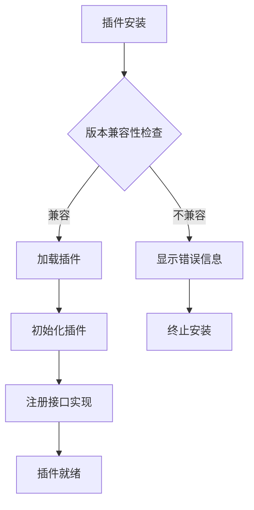

#### 升级策略

系统支持渐进式升级，通过配置切换实现零停机升级：

**章节来源**
- [DUAL_ENGINE_PHASE1_REPORT.md:147-170](file://DUAL_ENGINE_PHASE1_REPORT.md#L147-L170)