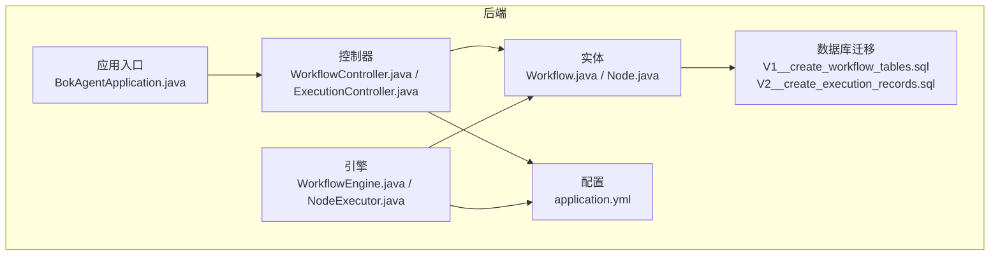
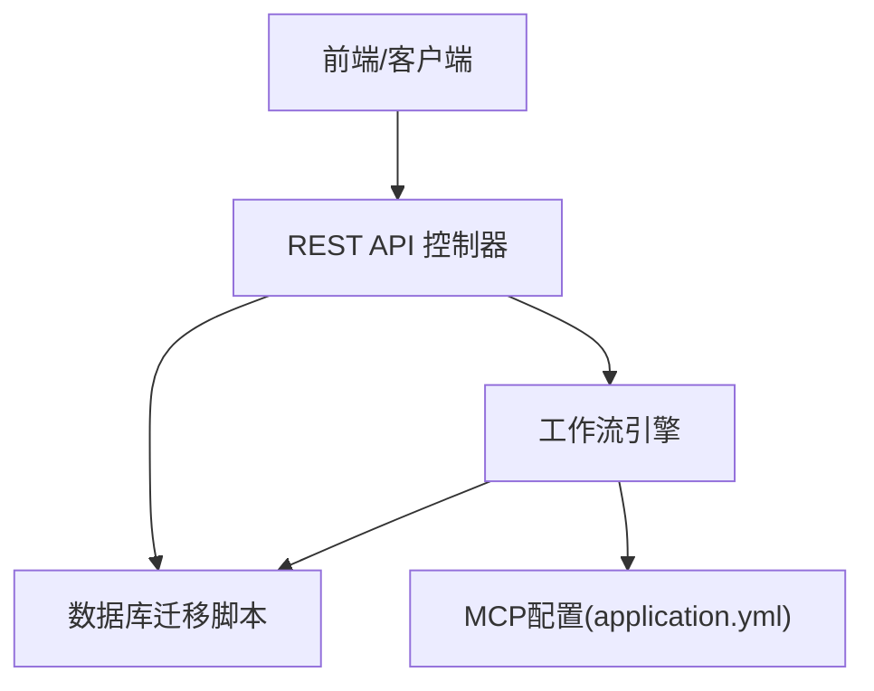
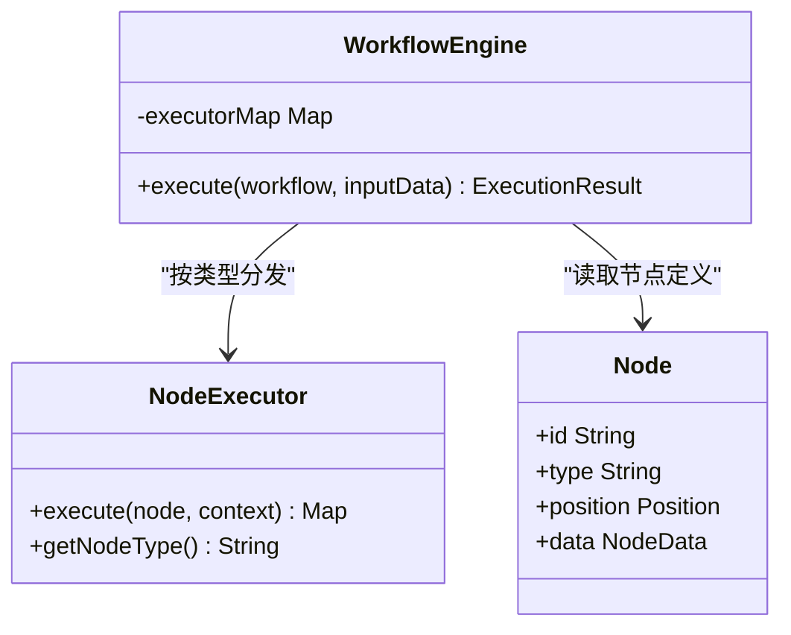
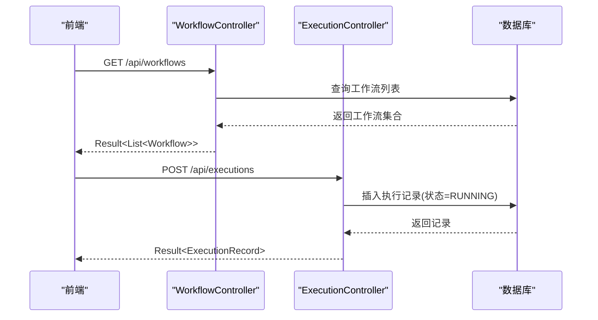
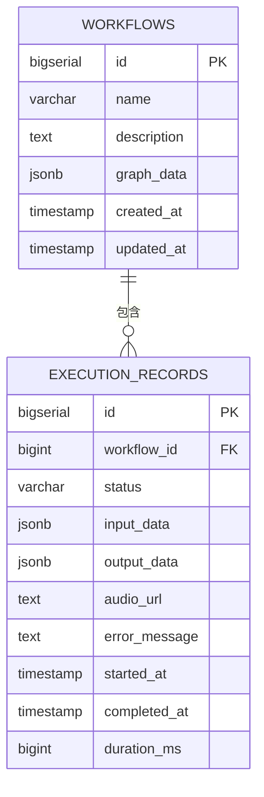
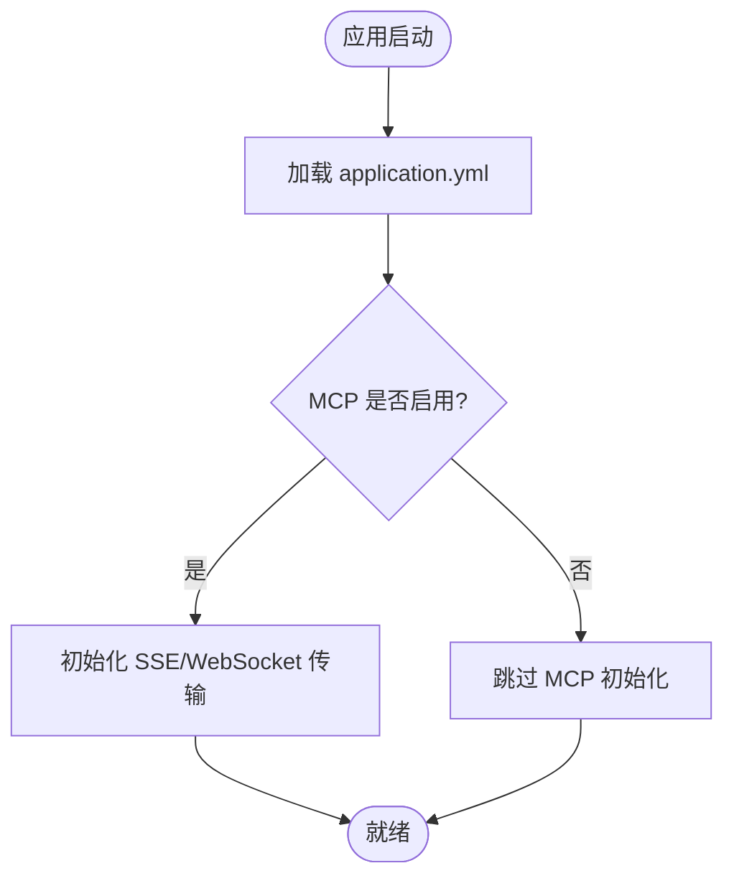
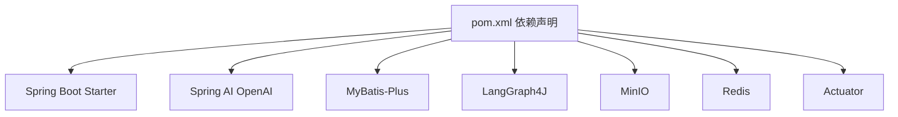

# 插件系统

<cite>
**本文引用的文件**
- [README.md](file://README.md)
- [BokAgentApplication.java](file://backend/src/main/java/com/bokagent/BokAgentApplication.java)
- [ExecutionController.java](file://backend/src/main/java/com/bokagent/controller/ExecutionController.java)
- [WorkflowController.java](file://backend/src/main/java/com/bokagent/controller/WorkflowController.java)
- [WorkflowEngine.java](file://backend/src/main/java/com/bokagent/engine/WorkflowEngine.java)
- [NodeExecutor.java](file://backend/src/main/java/com/bokagent/engine/NodeExecutor.java)
- [Node.java](file://backend/src/main/java/com/bokagent/entity/Node.java)
- [Workflow.java](file://backend/src/main/java/com/bokagent/entity/Workflow.java)
- [application.yml](file://backend/src/main/resources/application.yml)
- [V1__create_workflow_tables.sql](file://backend/src/main/resources/db/migration/V1__create_workflow_tables.sql)
- [V2__create_execution_records.sql](file://backend/src/main/resources/db/migration/V2__create_execution_records.sql)
- [pom.xml](file://backend/pom.xml)
</cite>

## 目录
1. [简介](#简介)
2. [项目结构](#项目结构)
3. [核心组件](#核心组件)
4. [架构总览](#架构总览)
5. [详细组件分析](#详细组件分析)
6. [依赖分析](#依赖分析)
7. [性能考虑](#性能考虑)
8. [故障排查指南](#故障排查指南)
9. [结论](#结论)
10. [附录](#附录)

## 简介
本文件面向BokAgent插件系统，围绕“热插拔插件架构”“工具注册系统”“插件开发SDK与测试策略”“与工作流集成”“安全机制”等主题，结合后端代码现状进行技术文档梳理。当前仓库后端尚未实现插件热加载与工具注册的具体实现，但已具备工作流执行引擎、节点抽象、API层与配置体系，为后续插件化演进提供了良好的基础。

## 项目结构
后端采用Spring Boot工程，核心模块包括：
- 应用入口与编码初始化
- 控制器层（工作流与执行记录）
- 引擎层（工作流执行与节点执行器接口）
- 实体层（工作流、节点、边等）
- 配置与数据库迁移

**图表来源**
- [BokAgentApplication.java:1-56](file://backend/src/main/java/com/bokagent/BokAgentApplication.java#L1-L56)
- [WorkflowController.java:1-92](file://backend/src/main/java/com/bokagent/controller/WorkflowController.java#L1-L92)
- [ExecutionController.java:1-81](file://backend/src/main/java/com/bokagent/controller/ExecutionController.java#L1-L81)
- [WorkflowEngine.java:1-171](file://backend/src/main/java/com/bokagent/engine/WorkflowEngine.java#L1-L171)
- [NodeExecutor.java:1-24](file://backend/src/main/java/com/bokagent/engine/NodeExecutor.java#L1-L24)
- [Workflow.java:1-32](file://backend/src/main/java/com/bokagent/entity/Workflow.java#L1-L32)
- [Node.java:1-15](file://backend/src/main/java/com/bokagent/entity/Node.java#L1-L15)
- [application.yml:1-182](file://backend/src/main/resources/application.yml#L1-L182)
- [V1__create_workflow_tables.sql:1-17](file://backend/src/main/resources/db/migration/V1__create_workflow_tables.sql#L1-L17)
- [V2__create_execution_records.sql:1-19](file://backend/src/main/resources/db/migration/V2__create_execution_records.sql#L1-L19)

**章节来源**
- [README.md:81-92](file://README.md#L81-L92)
- [BokAgentApplication.java:16-43](file://backend/src/main/java/com/bokagent/BokAgentApplication.java#L16-L43)
- [application.yml:108-129](file://backend/src/main/resources/application.yml#L108-L129)

## 核心组件
- 应用入口负责JVM编码设置与默认属性注入，保障中文与UTF-8显示正常。
- 控制器层提供工作流与执行记录的REST API，支撑前端编辑器与运行时交互。
- 引擎层提供工作流执行框架与节点执行器接口，为插件化节点类型预留扩展点。
- 实体层定义工作流与节点结构，JSONB字段承载图数据，适配工具注册与节点参数。
- 配置层启用MCP协议（Server/Client）、超时、缓存、重试等企业级能力。

**章节来源**
- [BokAgentApplication.java:21-43](file://backend/src/main/java/com/bokagent/BokAgentApplication.java#L21-L43)
- [WorkflowController.java:25-90](file://backend/src/main/java/com/bokagent/controller/WorkflowController.java#L25-L90)
- [ExecutionController.java:25-79](file://backend/src/main/java/com/bokagent/controller/ExecutionController.java#L25-L79)
- [WorkflowEngine.java:32-82](file://backend/src/main/java/com/bokagent/engine/WorkflowEngine.java#L32-L82)
- [NodeExecutor.java:9-23](file://backend/src/main/java/com/bokagent/engine/NodeExecutor.java#L9-L23)
- [Workflow.java:25-26](file://backend/src/main/java/com/bokagent/entity/Workflow.java#L25-L26)
- [application.yml:108-147](file://backend/src/main/resources/application.yml#L108-L147)

## 架构总览
下图展示从控制器到引擎再到数据库的执行路径，并标注MCP配置位置，便于后续插件扩展。

**图表来源**
- [WorkflowController.java:18-91](file://backend/src/main/java/com/bokagent/controller/WorkflowController.java#L18-L91)
- [ExecutionController.java:19-80](file://backend/src/main/java/com/bokagent/controller/ExecutionController.java#L19-L80)
- [WorkflowEngine.java:47-82](file://backend/src/main/java/com/bokagent/engine/WorkflowEngine.java#L47-L82)
- [application.yml:108-129](file://backend/src/main/resources/application.yml#L108-L129)
- [V1__create_workflow_tables.sql:1-17](file://backend/src/main/resources/db/migration/V1__create_workflow_tables.sql#L1-L17)
- [V2__create_execution_records.sql:1-19](file://backend/src/main/resources/db/migration/V2__create_execution_records.sql#L1-L19)

## 详细组件分析

### 工作流引擎与节点执行器接口
- 引擎负责构建执行图、拓扑遍历、上下文传递与结果聚合。
- 节点执行器接口定义了统一的执行契约，便于后续插件注册与动态调度。

**图表来源**
- [NodeExecutor.java:9-23](file://backend/src/main/java/com/bokagent/engine/NodeExecutor.java#L9-L23)
- [WorkflowEngine.java:32-82](file://backend/src/main/java/com/bokagent/engine/WorkflowEngine.java#L32-L82)
- [Node.java:9-14](file://backend/src/main/java/com/bokagent/entity/Node.java#L9-L14)

**章节来源**
- [WorkflowEngine.java:47-169](file://backend/src/main/java/com/bokagent/engine/WorkflowEngine.java#L47-L169)
- [NodeExecutor.java:9-23](file://backend/src/main/java/com/bokagent/engine/NodeExecutor.java#L9-L23)
- [Node.java:9-14](file://backend/src/main/java/com/bokagent/entity/Node.java#L9-L14)

### API工作流与执行记录
- 提供工作流的增删改查与执行记录的创建、查询、状态更新。
- 执行记录包含输入/输出、状态、错误信息与耗时，便于审计与回放。

**图表来源**
- [WorkflowController.java:28-57](file://backend/src/main/java/com/bokagent/controller/WorkflowController.java#L28-L57)
- [ExecutionController.java:52-59](file://backend/src/main/java/com/bokagent/controller/ExecutionController.java#L52-L59)

**章节来源**
- [WorkflowController.java:25-90](file://backend/src/main/java/com/bokagent/controller/WorkflowController.java#L25-L90)
- [ExecutionController.java:25-79](file://backend/src/main/java/com/bokagent/controller/ExecutionController.java#L25-L79)

### 数据模型与持久化
- 工作流实体通过JSONB字段保存图数据，支持复杂节点与工具参数。
- 执行记录表记录运行时状态、输入输出与错误信息，索引优化查询。

**图表来源**
- [V1__create_workflow_tables.sql:2-16](file://backend/src/main/resources/db/migration/V1__create_workflow_tables.sql#L2-L16)
- [V2__create_execution_records.sql:1-19](file://backend/src/main/resources/db/migration/V2__create_execution_records.sql#L1-L19)

**章节来源**
- [Workflow.java:25-26](file://backend/src/main/java/com/bokagent/entity/Workflow.java#L25-L26)
- [V1__create_workflow_tables.sql:2-16](file://backend/src/main/resources/db/migration/V1__create_workflow_tables.sql#L2-L16)
- [V2__create_execution_records.sql:1-19](file://backend/src/main/resources/db/migration/V2__create_execution_records.sql#L1-L19)

### 配置与MCP协议
- application.yml启用MCP Server/Client能力，定义传输通道（SSE/WebSocket）与能力开关。
- 超时、缓存、重试等配置为企业级运行保障。

**图表来源**
- [application.yml:108-129](file://backend/src/main/resources/application.yml#L108-L129)

**章节来源**
- [application.yml:108-147](file://backend/src/main/resources/application.yml#L108-L147)

## 依赖分析
后端使用Spring Boot 3.5、Spring AI、MyBatis-Plus、LangGraph4J、MinIO等技术栈，MCP相关能力在配置中开启，为后续插件与工具注册提供基础。

**图表来源**
- [pom.xml:29-127](file://backend/pom.xml#L29-L127)

**章节来源**
- [pom.xml:21-27](file://backend/pom.xml#L21-L27)
- [pom.xml:51-100](file://backend/pom.xml#L51-L100)

## 性能考虑
- 连接池与线程池：Hikari最大连接数、Redis连接池大小、虚拟线程池配置，需结合并发场景调优。
- 超时与重试：工具执行、LLM调用、TTS合成、MCP请求均有明确超时阈值，建议结合业务SLA调整。
- 缓存：工具结果与LLM响应缓存可显著降低重复计算成本，注意TTL与失效策略。
- 数据库：JSONB字段查询需配合合适索引与查询模式；执行记录表建立时间与关联字段索引。

**章节来源**
- [application.yml:22-43](file://backend/src/main/resources/application.yml#L22-L43)
- [application.yml:82-89](file://backend/src/main/resources/application.yml#L82-L89)
- [application.yml:131-147](file://backend/src/main/resources/application.yml#L131-L147)
- [application.yml:149-154](file://backend/src/main/resources/application.yml#L149-L154)
- [V1__create_workflow_tables.sql:16](file://backend/src/main/resources/db/migration/V1__create_workflow_tables.sql#L16)
- [V2__create_execution_records.sql:17-18](file://backend/src/main/resources/db/migration/V2__create_execution_records.sql#L17-L18)

## 故障排查指南
- 编码问题：若出现中文乱码或Emoji异常，检查应用入口与配置中的编码设置是否一致。
- API返回404：确认工作流或执行记录是否存在，控制器对不存在资源返回错误信息。
- 执行失败：执行记录包含错误信息与耗时，结合日志定位具体节点与原因。
- MCP不可用：确认application.yml中MCP开关与传输路径配置正确。

**章节来源**
- [BokAgentApplication.java:22-52](file://backend/src/main/java/com/bokagent/BokAgentApplication.java#L22-L52)
- [ExecutionController.java:43-46](file://backend/src/main/java/com/bokagent/controller/ExecutionController.java#L43-L46)
- [ExecutionController.java:68-70](file://backend/src/main/java/com/bokagent/controller/ExecutionController.java#L68-L70)
- [application.yml:108-129](file://backend/src/main/resources/application.yml#L108-L129)

## 结论
当前后端已具备工作流执行引擎、节点接口抽象、REST API与配置体系，为插件化扩展打下坚实基础。下一步可在以下方向推进：
- 插件发现与动态加载：基于SPI或注解扫描，注册节点执行器与工具。
- 工具注册系统：以JSONB元数据管理工具清单、参数校验与执行隔离。
- 安全机制：引入沙箱执行、权限控制与资源限制，结合MCP传输通道。
- 开发SDK：提供接口定义、开发规范与测试策略，配套示例与模板。

## 附录
- 项目结构参考：[README.md:81-92](file://README.md#L81-L92)
- 快速开始与部署：[README.md:30-67](file://README.md#L30-L67)
- UTF-8与中文支持：[README.md:69-80](file://README.md#L69-L80)