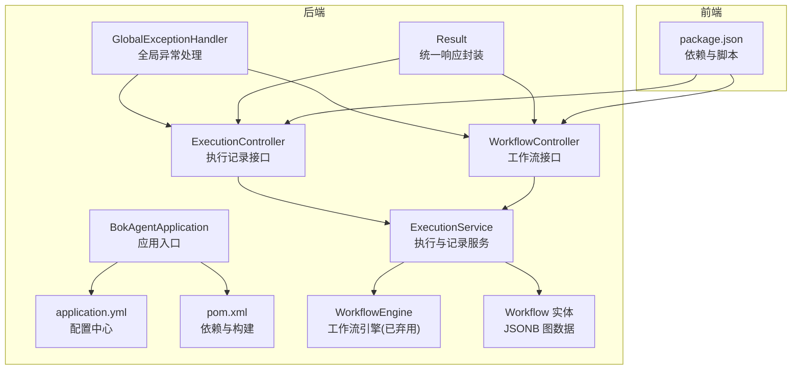
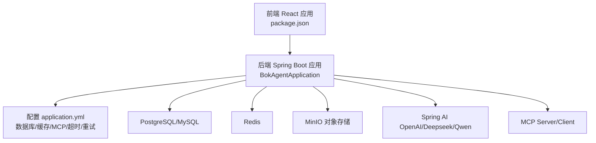
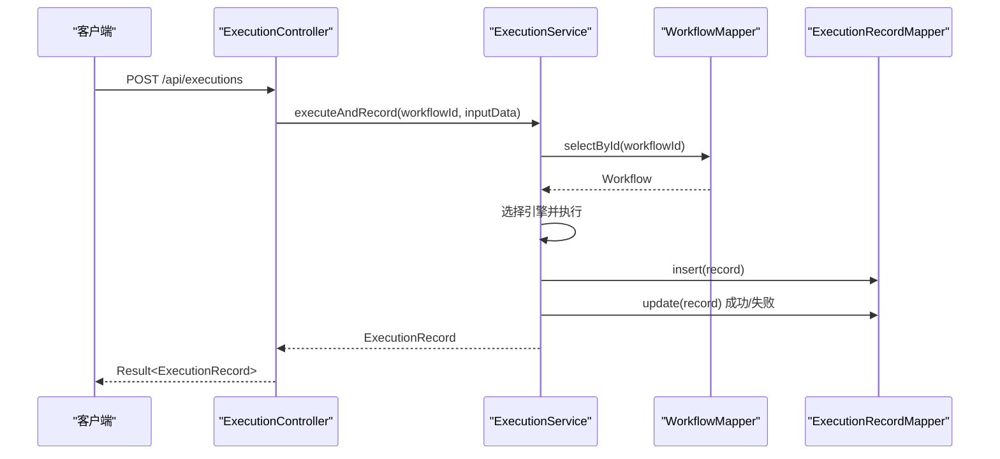
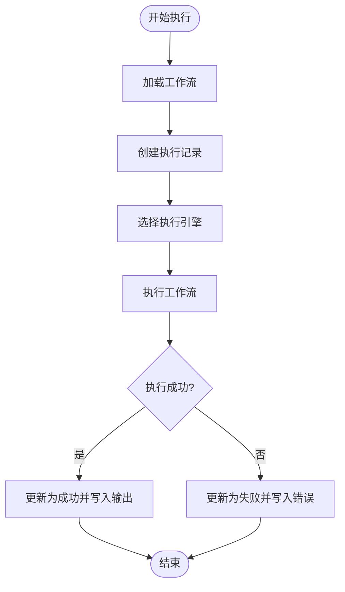
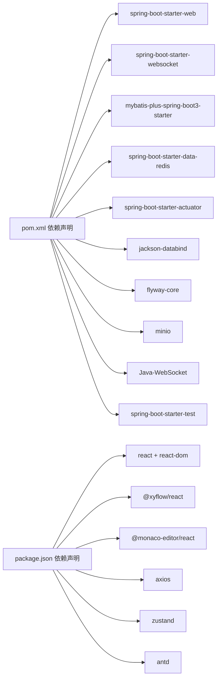

# 示例插件和工具

<cite>
**本文引用的文件**
- [README.md](file://README.md)
- [BokAgentApplication.java](file://backend/src/main/java/com/bokagent/BokAgentApplication.java)
- [application.yml](file://backend/src/main/resources/application.yml)
- [pom.xml](file://backend/pom.xml)
- [package.json](file://frontend/package.json)
- [ExecutionController.java](file://backend/src/main/java/com/bokagent/controller/ExecutionController.java)
- [WorkflowController.java](file://backend/src/main/java/com/bokagent/controller/WorkflowController.java)
- [WorkflowEngine.java](file://backend/src/main/java/com/bokagent/engine/WorkflowEngine.java)
- [Workflow.java](file://backend/src/main/java/com/bokagent/entity/Workflow.java)
- [ExecutionService.java](file://backend/src/main/java/com/bokagent/service/ExecutionService.java)
- [GlobalExceptionHandler.java](file://backend/src/main/java/com/bokagent/common/GlobalExceptionHandler.java)
- [Result.java](file://backend/src/main/java/com/bokagent/common/Result.java)
</cite>

## 目录
1. [简介](#简介)
2. [项目结构](#项目结构)
3. [核心组件](#核心组件)
4. [架构总览](#架构总览)
5. [详细组件分析](#详细组件分析)
6. [依赖分析](#依赖分析)
7. [性能考量](#性能考量)
8. [故障排查指南](#故障排查指南)
9. [结论](#结论)
10. [附录](#附录)

## 简介
本项目是一个基于 React 18、Spring Boot 3.5、Spring AI 和 LangGraph4J 的企业级 AI Agent 可视化工作流编排系统。它提供了：
- 可视化工作流编辑器（React Flow）
- 多 LLM 支持（OpenAI、Deepseek、通义千问等）
- 工具注册系统与插件生态（热插拔）
- MCP 协议支持（双向 Server/Client）
- 企业级特性（重试、超时、缓存、异步执行）
- Docker 一键部署与完整的 UTF-8 中文支持

## 项目结构
后端采用 Spring Boot，前端采用 React 18 + TypeScript；项目包含数据库迁移脚本、配置文件、以及 Docker 编排。根据 README 的目录结构，示例插件与工具位于独立的 SDK 与示例目录中。

图表来源
- [BokAgentApplication.java:1-56](file://backend/src/main/java/com/bokagent/BokAgentApplication.java#L1-L56)
- [application.yml:1-190](file://backend/src/main/resources/application.yml#L1-L190)
- [pom.xml:1-175](file://backend/pom.xml#L1-L175)
- [ExecutionController.java:1-81](file://backend/src/main/java/com/bokagent/controller/ExecutionController.java#L1-L81)
- [WorkflowController.java:1-92](file://backend/src/main/java/com/bokagent/controller/WorkflowController.java#L1-L92)
- [ExecutionService.java:1-113](file://backend/src/main/java/com/bokagent/service/ExecutionService.java#L1-L113)
- [WorkflowEngine.java:1-171](file://backend/src/main/java/com/bokagent/engine/WorkflowEngine.java#L1-L171)
- [Workflow.java:1-32](file://backend/src/main/java/com/bokagent/entity/Workflow.java#L1-L32)
- [GlobalExceptionHandler.java:1-37](file://backend/src/main/java/com/bokagent/common/GlobalExceptionHandler.java#L1-L37)
- [Result.java:1-42](file://backend/src/main/java/com/bokagent/common/Result.java#L1-L42)
- [package.json:1-37](file://frontend/package.json#L1-L37)

章节来源
- [README.md:1-106](file://README.md#L1-L106)
- [BokAgentApplication.java:1-56](file://backend/src/main/java/com/bokagent/BokAgentApplication.java#L1-L56)
- [application.yml:1-190](file://backend/src/main/resources/application.yml#L1-L190)
- [pom.xml:1-175](file://backend/pom.xml#L1-L175)
- [package.json:1-37](file://frontend/package.json#L1-L37)

## 核心组件
- 应用入口与编码保障：应用启动时强制设置 UTF-8 编码，并在日志中输出编码信息，确保前后端与数据库一致的字符集。
- 控制器层：提供执行记录与工作流的 REST 接口，统一返回 Result 包装。
- 服务层：负责工作流执行与执行记录的持久化，选择具体引擎并处理异常。
- 引擎层：提供工作流执行能力（当前存在已弃用的 WorkflowEngine，实际执行由 WorkflowExecutor 选择器承担）。
- 实体与映射：工作流实体包含 JSONB 类型的图数据，便于存储复杂拓扑结构。
- 全局异常处理：对通用异常、参数异常、运行时异常进行分类处理与统一响应。

章节来源
- [BokAgentApplication.java:21-54](file://backend/src/main/java/com/bokagent/BokAgentApplication.java#L21-L54)
- [ExecutionController.java:16-80](file://backend/src/main/java/com/bokagent/controller/ExecutionController.java#L16-L80)
- [WorkflowController.java:16-91](file://backend/src/main/java/com/bokagent/controller/WorkflowController.java#L16-L91)
- [ExecutionService.java:22-92](file://backend/src/main/java/com/bokagent/service/ExecutionService.java#L22-L92)
- [WorkflowEngine.java:18-82](file://backend/src/main/java/com/bokagent/engine/WorkflowEngine.java#L18-L82)
- [Workflow.java:14-31](file://backend/src/main/java/com/bokagent/entity/Workflow.java#L14-L31)
- [GlobalExceptionHandler.java:12-36](file://backend/src/main/java/com/bokagent/common/GlobalExceptionHandler.java#L12-L36)
- [Result.java:8-41](file://backend/src/main/java/com/bokagent/common/Result.java#L8-L41)

## 架构总览
系统采用分层架构：前端通过 HTTP 与 WebSocket 与后端交互；后端通过 MyBatis-Plus 访问关系数据库，使用 Redis 进行缓存，集成 MinIO 存储对象数据；配置集中在 application.yml，支持多 LLM 与 MCP 协议。

图表来源
- [package.json:1-37](file://frontend/package.json#L1-L37)
- [BokAgentApplication.java:16-43](file://backend/src/main/java/com/bokagent/BokAgentApplication.java#L16-L43)
- [application.yml:16-190](file://backend/src/main/resources/application.yml#L16-L190)

## 详细组件分析

### 控制器层：执行记录与工作流接口
- 执行记录接口：支持按工作流查询、按 ID 查询、创建与更新执行记录，自动填充状态与时间戳。
- 工作流接口：支持增删改查，创建与更新时维护时间戳字段。
- 统一响应：所有接口返回 Result 封装，便于前端统一处理。

图表来源
- [ExecutionController.java:52-79](file://backend/src/main/java/com/bokagent/controller/ExecutionController.java#L52-L79)
- [ExecutionService.java:39-91](file://backend/src/main/java/com/bokagent/service/ExecutionService.java#L39-L91)

章节来源
- [ExecutionController.java:16-80](file://backend/src/main/java/com/bokagent/controller/ExecutionController.java#L16-L80)
- [WorkflowController.java:16-91](file://backend/src/main/java/com/bokagent/controller/WorkflowController.java#L16-L91)
- [Result.java:8-41](file://backend/src/main/java/com/bokagent/common/Result.java#L8-L41)

### 服务层：执行与记录
- 执行流程：查询工作流 → 创建执行记录 → 选择引擎执行 → 更新执行记录状态与结果。
- 错误处理：捕获异常并标记执行记录为失败，同时抛出运行时异常供上层处理。

图表来源
- [ExecutionService.java:39-91](file://backend/src/main/java/com/bokagent/service/ExecutionService.java#L39-L91)

章节来源
- [ExecutionService.java:22-113](file://backend/src/main/java/com/bokagent/service/ExecutionService.java#L22-L113)

### 引擎层：工作流执行（已弃用）
- 提供基于拓扑排序的工作流执行逻辑，支持起始节点、LLM 节点与结束节点的执行器注册。
- 已标注为弃用，后续由 WorkflowExecutor 选择器替代。

章节来源
- [WorkflowEngine.java:18-171](file://backend/src/main/java/com/bokagent/engine/WorkflowEngine.java#L18-L171)

### 实体层：工作流与图数据
- 工作流实体包含名称、描述、图数据（JSONB）与时间戳。
- 使用自定义 TypeHandler 处理 JSONB 字段，便于存储复杂图结构。

章节来源
- [Workflow.java:14-31](file://backend/src/main/java/com/bokagent/entity/Workflow.java#L14-L31)

### 异常处理与统一响应
- 全局异常处理器对不同异常类型返回相应状态码与消息。
- 统一响应 Result 封装 code、message、data，简化前端处理。

章节来源
- [GlobalExceptionHandler.java:12-36](file://backend/src/main/java/com/bokagent/common/GlobalExceptionHandler.java#L12-L36)
- [Result.java:8-41](file://backend/src/main/java/com/bokagent/common/Result.java#L8-L41)

## 依赖分析
- 后端依赖：Spring Web/WebSocket、MyBatis-Plus、Redis、Actuator、Jackson、Flyway、MinIO、WebSocket 客户端等。
- 前端依赖：React 18、Ant Design、React Flow、Monaco Editor、Axios、Zustand 等。
- 配置集中：数据库连接、缓存、MCP、超时、重试、日志级别、异步线程池等。

图表来源
- [pom.xml:29-132](file://backend/pom.xml#L29-L132)
- [package.json:12-35](file://frontend/package.json#L12-L35)

章节来源
- [pom.xml:1-175](file://backend/pom.xml#L1-L175)
- [package.json:1-37](file://frontend/package.json#L1-L37)
- [application.yml:16-190](file://backend/src/main/resources/application.yml#L16-L190)

## 性能考量
- 线程池与异步：配置虚拟线程与线程池大小，适合高并发场景。
- 缓存策略：启用缓存并区分工具结果与 LLM 响应 TTL，降低重复计算与网络开销。
- 超时控制：针对工具执行、LLM 调用、TTS 合成、MCP 请求与工作流执行设置合理超时。
- 数据库连接池：HikariCP 最大池大小与空闲数配置，避免连接争用。
- 日志级别：生产环境建议提升根日志级别，减少 IO 压力。

章节来源
- [application.yml:82-88](file://backend/src/main/resources/application.yml#L82-L88)
- [application.yml:157-162](file://backend/src/main/resources/application.yml#L157-L162)
- [application.yml:149-155](file://backend/src/main/resources/application.yml#L149-L155)
- [application.yml:22-24](file://backend/src/main/resources/application.yml#L22-L24)
- [application.yml:172-175](file://backend/src/main/resources/application.yml#L172-L175)

## 故障排查指南
- 编码问题：若出现中文乱码或 Emoji 显示异常，检查 JVM 与服务器编码设置是否为 UTF-8。
- 数据库连接：确认数据库地址、端口、用户名、密码与字符集配置正确。
- 缓存与超时：若出现缓存不生效或超时频繁，调整 TTL 与超时阈值。
- 异常响应：查看全局异常处理器返回的错误码与消息，定位业务异常与参数异常。
- 执行记录：通过执行记录接口查询执行状态、输入输出与错误信息，辅助定位问题。

章节来源
- [BokAgentApplication.java:21-54](file://backend/src/main/java/com/bokagent/BokAgentApplication.java#L21-L54)
- [application.yml:16-79](file://backend/src/main/resources/application.yml#L16-L79)
- [GlobalExceptionHandler.java:12-36](file://backend/src/main/java/com/bokagent/common/GlobalExceptionHandler.java#L12-L36)
- [ExecutionController.java:28-47](file://backend/src/main/java/com/bokagent/controller/ExecutionController.java#L28-L47)

## 结论
本项目提供了完整的企业级工作流编排能力，具备良好的扩展性与可维护性。通过统一的响应封装、全局异常处理、完善的配置体系与清晰的分层架构，开发者可以快速基于示例进行二次开发与定制化改造。

## 附录
- 快速开始与部署：参考 README 的 Docker 一键部署与本地开发步骤。
- 开发与测试：后端使用 Maven 构建，前端使用 npm 脚本；结合 Actuator 暴露健康与指标端点。
- 配置参考：application.yml 中包含数据库、缓存、MCP、超时、重试、日志等关键配置项。

章节来源
- [README.md:30-67](file://README.md#L30-L67)
- [application.yml:181-190](file://backend/src/main/resources/application.yml#L181-L190)