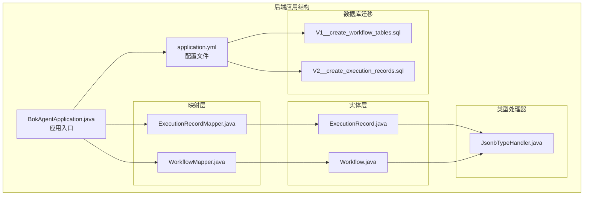
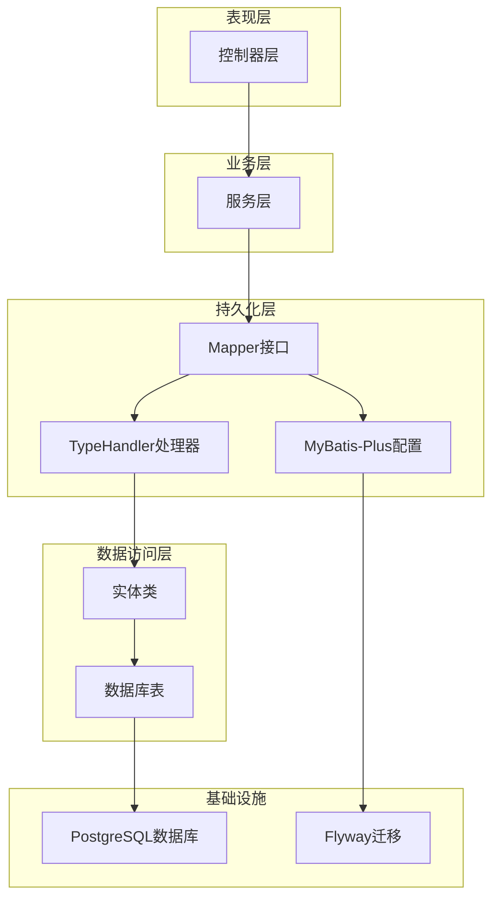
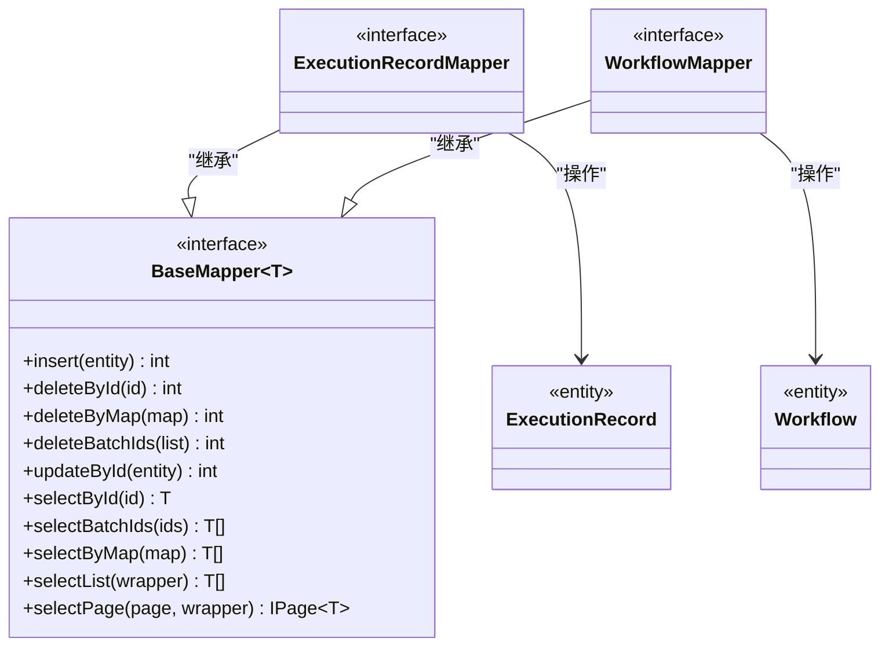
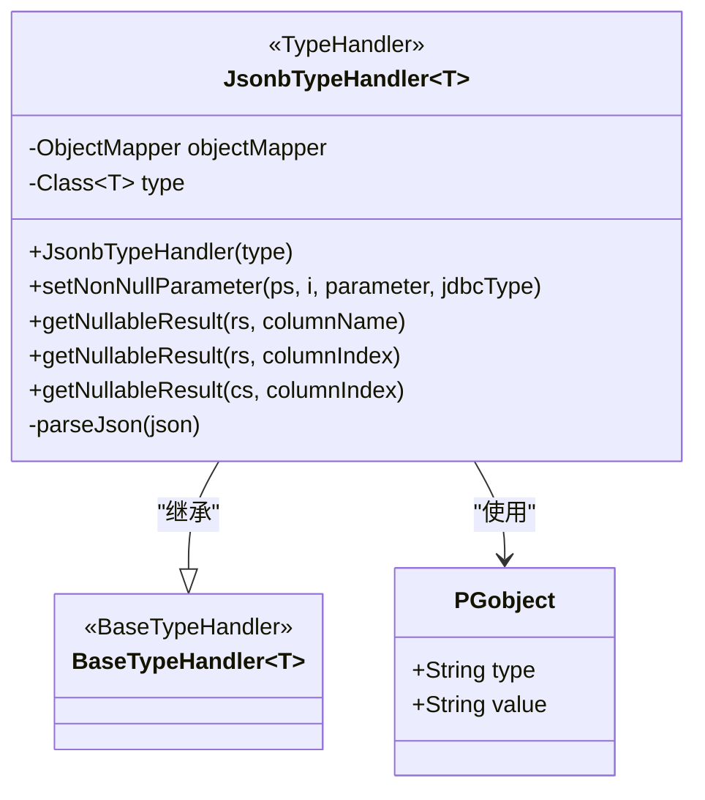
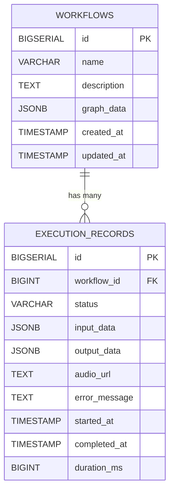
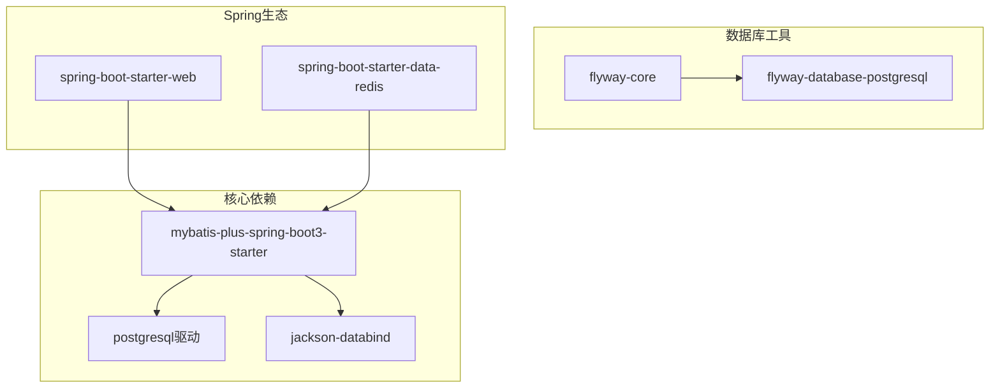

# ORM框架配置

<cite>
**本文档引用的文件**
- [BokAgentApplication.java](file://backend/src/main/java/com/bokagent/BokAgentApplication.java)
- [application.yml](file://backend/src/main/resources/application.yml)
- [ExecutionRecordMapper.java](file://backend/src/main/java/com/bokagent/mapper/ExecutionRecordMapper.java)
- [WorkflowMapper.java](file://backend/src/main/java/com/bokagent/mapper/WorkflowMapper.java)
- [JsonbTypeHandler.java](file://backend/src/main/java/com/bokagent/handler/JsonbTypeHandler.java)
- [ExecutionRecord.java](file://backend/src/main/java/com/bokagent/entity/ExecutionRecord.java)
- [Workflow.java](file://backend/src/main/java/com/bokagent/entity/Workflow.java)
- [V1__create_workflow_tables.sql](file://backend/src/main/resources/db/migration/V1__create_workflow_tables.sql)
- [V2__create_execution_records.sql](file://backend/src/main/resources/db/migration/V2__create_execution_records.sql)
- [pom.xml](file://backend/pom.xml)
</cite>

## 目录
1. [简介](#简介)
2. [项目结构](#项目结构)
3. [核心组件](#核心组件)
4. [架构概览](#架构概览)
5. [详细组件分析](#详细组件分析)
6. [依赖分析](#依赖分析)
7. [性能考虑](#性能考虑)
8. [故障排除指南](#故障排除指南)
9. [结论](#结论)

## 简介

本文件详细介绍了BokAgent项目中MyBatis-Plus ORM框架的配置与使用。BokAgent是一个AI Agent工作流编排系统，采用Spring Boot + MyBatis-Plus + PostgreSQL的技术栈。本文档重点涵盖以下内容：

- MyBatis-Plus核心配置：自动配置、分页插件、性能分析插件设置
- Mapper接口设计模式：BaseMapper继承、通用CRUD方法使用、自定义SQL编写
- 实体类注解使用：@TableId、@TableName、@TableField等注解的作用和配置
- TypeHandler自定义实现：JsonbTypeHandler对PostgreSQL JSONB类型的支持
- 完整配置示例和最佳实践：命名策略、逻辑删除、自动填充等功能

## 项目结构

BokAgent项目的后端采用标准的Spring Boot目录结构，ORM相关的核心文件分布如下：

**图表来源**
- [BokAgentApplication.java:1-56](file://backend/src/main/java/com/bokagent/BokAgentApplication.java#L1-L56)
- [application.yml:1-190](file://backend/src/main/resources/application.yml#L1-L190)

**章节来源**
- [BokAgentApplication.java:1-56](file://backend/src/main/java/com/bokagent/BokAgentApplication.java#L1-L56)
- [application.yml:1-190](file://backend/src/main/resources/application.yml#L1-L190)

## 核心组件

### 应用启动配置

应用通过`@SpringBootApplication`和`@MapperScan`注解实现自动扫描和配置：

- **应用入口类**：`BokAgentApplication`负责应用启动和编码设置
- **Mapper扫描**：`@MapperScan("com.bokagent.mapper")`自动扫描所有Mapper接口
- **编码配置**：确保JVM使用UTF-8编码，支持中文和Emoji

### MyBatis-Plus配置

在`application.yml`中配置了完整的MyBatis-Plus设置：

- **配置管理器**：启用setter方法调用、下划线到驼峰命名转换、SLF4J日志实现
- **全局配置**：ID生成策略设置为自动增长
- **映射文件位置**：扫描classpath下的所有XML映射文件

**章节来源**
- [BokAgentApplication.java:16-18](file://backend/src/main/java/com/bokagent/BokAgentApplication.java#L16-L18)
- [application.yml:90-100](file://backend/src/main/resources/application.yml#L90-L100)

## 架构概览

BokAgent的ORM架构采用经典的分层设计，实现了清晰的关注点分离：

**图表来源**
- [BokAgentApplication.java:19-43](file://backend/src/main/java/com/bokagent/BokAgentApplication.java#L19-L43)
- [application.yml:90-100](file://backend/src/main/resources/application.yml#L90-L100)

## 详细组件分析

### Mapper接口设计模式

#### BaseMapper继承模式

两个核心Mapper接口都直接继承自`BaseMapper`，获得了完整的CRUD操作能力：

**图表来源**
- [ExecutionRecordMapper.java:10-12](file://backend/src/main/java/com/bokagent/mapper/ExecutionRecordMapper.java#L10-L12)
- [WorkflowMapper.java:10-12](file://backend/src/main/java/com/bokagent/mapper/WorkflowMapper.java#L10-L12)

#### 通用CRUD方法使用

通过继承BaseMapper，Mapper接口自动获得以下功能：
- **插入操作**：`insert(entity)` - 插入单个实体
- **查询操作**：`selectById(id)`、`selectList(wrapper)`、`selectPage(page, wrapper)`
- **更新操作**：`updateById(entity)` - 基于主键更新
- **删除操作**：`deleteById(id)`、`deleteBatchIds(ids)`

这些方法提供了完整的数据操作能力，无需编写XML映射文件。

**章节来源**
- [ExecutionRecordMapper.java:1-13](file://backend/src/main/java/com/bokagent/mapper/ExecutionRecordMapper.java#L1-L13)
- [WorkflowMapper.java:1-13](file://backend/src/main/java/com/bokagent/mapper/WorkflowMapper.java#L1-L13)

### 实体类注解详解

#### 表映射注解

所有实体类都使用`@TableName`注解指定对应的数据库表：

- **Workflow实体**：`@TableName("workflows")` - 映射到workflows表
- **ExecutionRecord实体**：`@TableName("execution_records")` - 映射到execution_records表

#### 主键注解

使用`@TableId`注解配置主键策略：
- **ID类型**：`IdType.AUTO` - 使用数据库自增策略
- **数据类型**：Long类型，对应PostgreSQL的BIGSERIAL

#### 字段映射注解

使用`@TableField`注解处理特殊字段：
- **JSONB字段**：`@TableField(typeHandler = JsonbTypeHandler.class)` - 指定自定义类型处理器
- **普通字段**：自动映射到同名列

**章节来源**
- [ExecutionRecord.java:16-39](file://backend/src/main/java/com/bokagent/entity/ExecutionRecord.java#L16-L39)
- [Workflow.java:15-31](file://backend/src/main/java/com/bokagent/entity/Workflow.java#L15-L31)

### TypeHandler自定义实现

#### JsonbTypeHandler设计

JsonbTypeHandler是专门为PostgreSQL JSONB类型设计的自定义类型处理器：

**图表来源**
- [JsonbTypeHandler.java:17-64](file://backend/src/main/java/com/bokagent/handler/JsonbTypeHandler.java#L17-L64)

#### 类型转换机制

JsonbTypeHandler实现了完整的类型转换流程：

1. **参数设置**：将Java对象序列化为JSON字符串，包装为PGobject
2. **结果获取**：从数据库读取JSON字符串，反序列化为Java对象
3. **异常处理**：统一捕获和处理JSON转换异常

**章节来源**
- [JsonbTypeHandler.java:1-65](file://backend/src/main/java/com/bokagent/handler/JsonbTypeHandler.java#L1-L65)

### 数据库表结构

#### 工作流表结构

**图表来源**
- [V1__create_workflow_tables.sql:2-9](file://backend/src/main/resources/db/migration/V1__create_workflow_tables.sql#L2-L9)
- [V2__create_execution_records.sql:1-12](file://backend/src/main/resources/db/migration/V2__create_execution_records.sql#L1-L12)

**章节来源**
- [V1__create_workflow_tables.sql:1-17](file://backend/src/main/resources/db/migration/V1__create_workflow_tables.sql#L1-L17)
- [V2__create_execution_records.sql:1-19](file://backend/src/main/resources/db/migration/V2__create_execution_records.sql#L1-L19)

## 依赖分析

### Maven依赖配置

项目使用MyBatis-Plus 3.5.5版本，包含以下关键依赖：

**图表来源**
- [pom.xml:57-86](file://backend/pom.xml#L57-L86)

### 版本兼容性

- **Spring Boot版本**：3.5.0
- **MyBatis-Plus版本**：3.5.5
- **PostgreSQL驱动**：最新版本
- **Jackson版本**：由Spring Boot管理

**章节来源**
- [pom.xml:21-27](file://backend/pom.xml#L21-L27)
- [pom.xml:57-86](file://backend/pom.xml#L57-L86)

## 性能考虑

### 配置优化建议

基于当前配置，以下是性能优化建议：

1. **连接池配置**：根据并发需求调整HikariCP参数
2. **查询优化**：合理使用索引，避免N+1查询
3. **批量操作**：对于大量数据操作，使用批量插入/更新
4. **缓存策略**：结合Redis实现读写分离

### 监控和调试

- **日志配置**：使用SLF4J实现SQL日志输出
- **性能监控**：集成Spring Boot Actuator进行性能监控
- **数据库监控**：使用PostgreSQL内置监控工具

## 故障排除指南

### 常见问题及解决方案

#### JSONB类型转换失败

**问题症状**：序列化/反序列化异常
**解决方法**：
1. 确认实体类正确标注`@TableField(typeHandler = JsonbTypeHandler.class)`
2. 检查Jackson依赖是否正确引入
3. 验证数据库字段类型为JSONB

#### Mapper扫描失败

**问题症状**：Mapper接口无法注入
**解决方法**：
1. 确认`@MapperScan`注解路径正确
2. 检查Mapper接口包路径
3. 确保Spring Boot启动类位于根包下

#### 数据库连接问题

**问题症状**：应用启动时报连接错误
**解决方法**：
1. 检查环境变量配置
2. 验证PostgreSQL服务状态
3. 确认数据库用户权限

**章节来源**
- [JsonbTypeHandler.java:26-36](file://backend/src/main/java/com/bokagent/handler/JsonbTypeHandler.java#L26-L36)
- [BokAgentApplication.java:16-18](file://backend/src/main/java/com/bokagent/BokAgentApplication.java#L16-L18)

## 结论

BokAgent项目中的MyBatis-Plus配置展现了现代Java企业级应用的最佳实践：

1. **简洁高效的配置**：通过合理的YAML配置实现了开箱即用的功能
2. **类型安全的设计**：自定义TypeHandler确保了JSONB类型的类型安全
3. **清晰的分层架构**：MVC模式配合ORM实现了良好的代码组织
4. **完善的工具链**：结合Flyway、Jackson等工具形成了完整的开发生态

该配置方案为类似的工作流管理系统提供了可复用的模板，开发者可以根据具体需求进行扩展和定制。