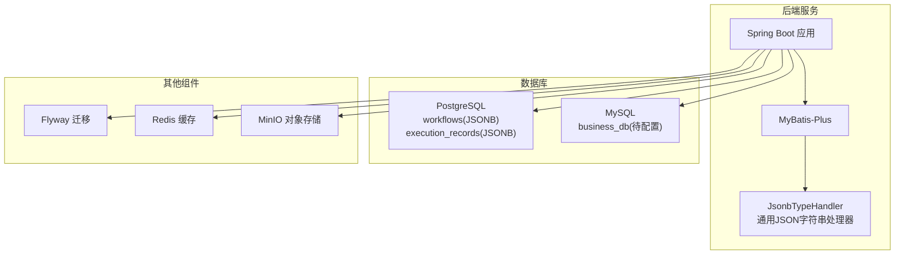
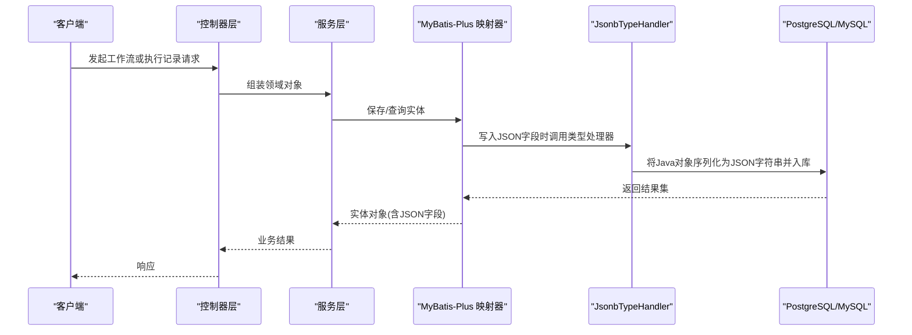
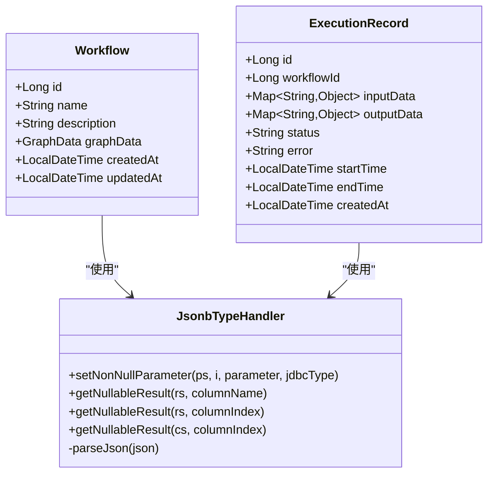
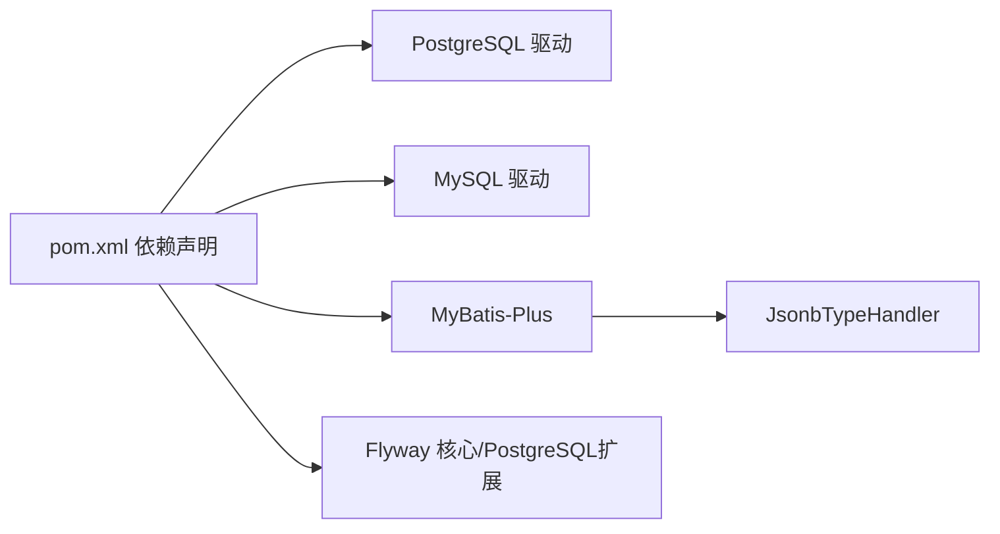

# 多数据库支持

<cite>
**本文引用的文件**
- [application.yml](file://backend/src/main/resources/application.yml)
- [JsonbTypeHandler.java](file://backend/src/main/java/com/bokagent/handler/JsonbTypeHandler.java)
- [Workflow.java](file://backend/src/main/java/com/bokagent/entity/Workflow.java)
- [ExecutionRecord.java](file://backend/src/main/java/com/bokagent/entity/ExecutionRecord.java)
- [ExecutionRecordMapper.java](file://backend/src/main/java/com/bokagent/mapper/ExecutionRecordMapper.java)
- [WorkflowMapper.java](file://backend/src/main/java/com/bokagent/mapper/WorkflowMapper.java)
- [V1__create_workflow_tables.sql](file://backend/src/main/resources/db/migration/V1__create_workflow_tables.sql)
- [V2__create_execution_records.sql](file://backend/src/main/resources/db/migration/V2__create_execution_records.sql)
- [docker-compose.yml](file://docker/docker-compose.yml)
- [init-postgres.sql](file://docker/init-postgres.sql)
- [init-mysql.sql](file://docker/init-mysql.sql)
- [pom.xml](file://backend/pom.xml)
</cite>

## 更新摘要
**变更内容**
- 更新了JSON字段处理章节，反映JsonbTypeHandler现在使用通用JSON字符串处理方式
- 新增了数据库兼容性改进说明，强调对MySQL等其他数据库的兼容性提升
- 更新了数据类型映射策略，说明JSON字段在不同数据库中的统一处理方式
- 增强了多数据库部署最佳实践，包含MySQL启用建议

## 目录
1. [简介](#简介)
2. [项目结构](#项目结构)
3. [核心组件](#核心组件)
4. [架构总览](#架构总览)
5. [详细组件分析](#详细组件分析)
6. [依赖分析](#依赖分析)
7. [性能考虑](#性能考虑)
8. [故障排查指南](#故障排查指南)
9. [结论](#结论)
10. [附录](#附录)

## 简介
本文件面向BokAgent的多数据库支持能力，系统化梳理当前实现中对PostgreSQL与MySQL的差异处理、JSON字段兼容策略、数据类型映射、事务管理现状与限制、部署最佳实践以及数据迁移与同步方案建议。当前代码库已明确包含PostgreSQL工作流数据库与MySQL业务数据库的容器编排与基础驱动依赖，并通过MyBatis-Plus与自定义类型处理器实现JSON字段的序列化/反序列化。**最新改进**显示JsonbTypeHandler现在使用通用JSON字符串处理方式，显著提升了与MySQL等其他数据库的兼容性，减少了对PostgreSQL特定功能的依赖。

## 项目结构
后端采用Spring Boot + MyBatis-Plus架构，数据库方面包含：
- PostgreSQL：用于工作流定义与执行记录（JSONB字段）
- MySQL：容器中存在但未在后端显式配置数据源
- Redis：缓存
- MinIO：对象存储
- Flyway：数据库迁移

**图表来源**
- [docker-compose.yml:1-132](file://docker/docker-compose.yml#L1-L132)
- [application.yml:16-31](file://backend/src/main/resources/application.yml#L16-L31)
- [pom.xml:67-78](file://backend/pom.xml#L67-L78)

**章节来源**
- [docker-compose.yml:1-132](file://docker/docker-compose.yml#L1-L132)
- [application.yml:16-31](file://backend/src/main/resources/application.yml#L16-L31)
- [pom.xml:67-78](file://backend/pom.xml#L67-L78)

## 核心组件
- 数据源与连接池：PostgreSQL数据源已配置，使用HikariCP连接池；MySQL驱动已引入但未在application.yml中启用数据源。
- JSON字段处理：**已改进**通过自定义JsonbTypeHandler将Java对象序列化为通用JSON字符串，兼容PostgreSQL JSONB和MySQL JSON类型；实体类中对JSON字段标注了类型处理器。
- 数据库迁移：Flyway启用，迁移脚本位于classpath:db/migration，当前仅包含PostgreSQL脚本。
- 容器编排：docker-compose同时启动PostgreSQL与MySQL服务，便于本地开发测试。

**章节来源**
- [application.yml:16-31](file://backend/src/main/resources/application.yml#L16-L31)
- [JsonbTypeHandler.java:17-63](file://backend/src/main/java/com/bokagent/handler/JsonbTypeHandler.java#L17-L63)
- [Workflow.java:25-26](file://backend/src/main/java/com/bokagent/entity/Workflow.java#L25-L26)
- [ExecutionRecord.java:24-28](file://backend/src/main/java/com/bokagent/entity/ExecutionRecord.java#L24-L28)
- [V1__create_workflow_tables.sql:1-17](file://backend/src/main/resources/db/migration/V1__create_workflow_tables.sql#L1-L17)
- [V2__create_execution_records.sql:1-19](file://backend/src/main/resources/db/migration/V2__create_execution_records.sql#L1-L19)
- [docker-compose.yml:28-49](file://docker/docker-compose.yml#L28-L49)

## 架构总览
下图展示当前后端与数据库的交互关系，突出JSON字段处理与迁移机制：

**图表来源**
- [Workflow.java:25-26](file://backend/src/main/java/com/bokagent/entity/Workflow.java#L25-L26)
- [ExecutionRecord.java:24-28](file://backend/src/main/java/com/bokagent/entity/ExecutionRecord.java#L24-L28)
- [JsonbTypeHandler.java:26-51](file://backend/src/main/java/com/bokagent/handler/JsonbTypeHandler.java#L26-L51)
- [V1__create_workflow_tables.sql:6-6](file://backend/src/main/resources/db/migration/V1__create_workflow_tables.sql#L6-L6)
- [V2__create_execution_records.sql:5-6](file://backend/src/main/resources/db/migration/V2__create_execution_records.sql#L5-L6)

## 详细组件分析

### PostgreSQL配置与差异
- 连接参数
  - JDBC URL指向PostgreSQL，默认使用UTF-8字符集与时间戳列。
  - HikariCP连接池参数已配置最大池大小与最小空闲数。
- 驱动程序
  - 使用PostgreSQL官方JDBC驱动。
- 方言与方言配置
  - 当前未显式配置MyBatis方言；MyBatis-Plus默认方言适配常见数据库，PostgreSQL场景通常无需额外方言配置。
- 字符集与排序规则
  - 容器初始化脚本与docker-compose命令均设置UTF-8编码与区域化参数，确保中文与Emoji支持。

**章节来源**
- [application.yml:16-24](file://backend/src/main/resources/application.yml#L16-L24)
- [docker-compose.yml:11-12](file://docker/docker-compose.yml#L11-L12)
- [docker-compose.yml:42-44](file://docker/docker-compose.yml#L42-L44)
- [init-postgres.sql:1-20](file://docker/init-postgres.sql#L1-L20)

### MySQL配置与差异
- 连接参数
  - 容器中MySQL服务已运行，字符集设置为utf8mb4，排序规则为utf8mb4_unicode_ci。
  - 当前后端未配置MySQL数据源，因此未在应用中启用MySQL。
- 驱动程序
  - Maven已引入MySQL Connector/J驱动，可直接启用。
- 方言与方言配置
  - 未显式配置MyBatis方言；如启用MySQL，可按需配置方言以优化SQL生成。
- 字符集与排序规则
  - 容器启动参数设置字符集与时区，满足中文与统一时区需求。

**章节来源**
- [docker-compose.yml:28-49](file://docker/docker-compose.yml#L28-L49)
- [init-mysql.sql:1-12](file://docker/init-mysql.sql#L1-L12)
- [pom.xml:74-78](file://backend/pom.xml#L74-L78)

### JSON字段处理与兼容性
- **已改进**通用JSON字符串处理
  - JsonbTypeHandler现在使用通用JSON字符串处理方式，不再依赖PostgreSQL特定的JSONB类型特性。
  - 通过`objectMapper.writeValueAsString()`将Java对象序列化为标准JSON字符串，兼容PostgreSQL JSONB和MySQL JSON类型。
  - 读取时使用`objectMapper.readValue()`将JSON字符串反序列化为Java对象。
- 实体类标注
  - Workflow实体的graphData字段和ExecutionRecord实体的inputData、outputData字段均标注了JsonbTypeHandler类型处理器。
- 兼容性优势
  - 减少了对PostgreSQL JSONB类型的依赖，提升了与MySQL等其他数据库的兼容性。
  - 统一的JSON处理逻辑降低了跨数据库迁移的复杂度。

**图表来源**
- [JsonbTypeHandler.java:17-63](file://backend/src/main/java/com/bokagent/handler/JsonbTypeHandler.java#L17-L63)
- [Workflow.java:25-26](file://backend/src/main/java/com/bokagent/entity/Workflow.java#L25-L26)
- [ExecutionRecord.java:24-28](file://backend/src/main/java/com/bokagent/entity/ExecutionRecord.java#L24-L28)

**章节来源**
- [JsonbTypeHandler.java:17-63](file://backend/src/main/java/com/bokagent/handler/JsonbTypeHandler.java#L17-L63)
- [Workflow.java:25-26](file://backend/src/main/java/com/bokagent/entity/Workflow.java#L25-L26)
- [ExecutionRecord.java:24-28](file://backend/src/main/java/com/bokagent/entity/ExecutionRecord.java#L24-L28)

### 数据类型映射策略
- 时间类型
  - PostgreSQL使用TIMESTAMP；MySQL对应DATETIME或TIMESTAMP。当前实体使用Java时间类型，ORM会自动映射。
- 数值类型
  - BIGINT在两库中均为大整型；注意MySQL的BIGINT UNSIGNED范围差异。
- **已改进**字符串类型
  - **PostgreSQL**：使用JSONB类型存储JSON数据
  - **MySQL**：使用TEXT或JSON类型存储JSON数据
  - **统一处理**：通过JsonbTypeHandler将所有JSON数据统一为字符串格式存储，避免数据库特定类型差异
- 跨库兼容建议
  - 统一使用字符串字段承载JSON，由服务层完成序列化/反序列化，降低数据库差异带来的维护成本。

**章节来源**
- [V1__create_workflow_tables.sql:2-9](file://backend/src/main/resources/db/migration/V1__create_workflow_tables.sql#L2-L9)
- [V2__create_execution_records.sql:1-12](file://backend/src/main/resources/db/migration/V2__create_execution_records.sql#L1-L12)

### 事务管理差异与现状
- 事务隔离级别
  - 未在代码中显式配置隔离级别；默认行为取决于数据库与连接池配置。
- 分布式事务与XA
  - 未发现分布式事务或XA事务相关配置与实现；当前为单数据源事务模型。
- 建议
  - 如需跨库事务，可引入Atomikos或Bitronix等JTA实现，并在多数据源场景下启用XA。

**章节来源**
- [application.yml:16-31](file://backend/src/main/resources/application.yml#L16-L31)
- [docker-compose.yml:28-49](file://docker/docker-compose.yml#L28-L49)

### 数据迁移与同步策略
- 迁移
  - Flyway已启用，迁移脚本位于classpath:db/migration，当前仅包含PostgreSQL脚本。
- 同步
  - 未发现双写、影子表或CDC实现；当前为单数据库模式。
- 建议
  - 双写：在启用MySQL后，对同一实体进行双写并在失败时回滚或补偿。
  - 影子表：切换期间使用影子表承载新逻辑，逐步替换主表。
  - CDC：结合Canal或Debezium捕获MySQL变更，同步至PostgreSQL或其他目标。

**章节来源**
- [application.yml:26-30](file://backend/src/main/resources/application.yml#L26-L30)
- [V1__create_workflow_tables.sql:1-17](file://backend/src/main/resources/db/migration/V1__create_workflow_tables.sql#L1-L17)
- [V2__create_execution_records.sql:1-19](file://backend/src/main/resources/db/migration/V2__create_execution_records.sql#L1-L19)

## 依赖分析
- 数据库驱动
  - PostgreSQL驱动与MySQL驱动均已引入，PostgreSQL在运行时生效，MySQL未启用。
- ORM与类型处理
  - MyBatis-Plus与自定义JsonbTypeHandler用于PostgreSQL JSONB字段处理。
- 迁移工具
  - Flyway核心与PostgreSQL扩展已引入，MySQL迁移需补充相应扩展。

**图表来源**
- [pom.xml:67-89](file://backend/pom.xml#L67-L89)

**章节来源**
- [pom.xml:67-89](file://backend/pom.xml#L67-L89)

## 性能考虑
- 连接池
  - PostgreSQL连接池参数已配置，建议根据并发与QPS调整最大池大小与空闲数。
- 字符集
  - PostgreSQL与MySQL均设置UTF-8/utf8mb4，避免字符集转换开销。
- 索引
  - 已为常用查询列建立索引，建议结合慢查询日志持续优化。
- 缓存与对象存储
  - Redis与MinIO配置已就绪，可配合数据库实现热点数据与静态资源分离。

**章节来源**
- [application.yml:22-24](file://backend/src/main/resources/application.yml#L22-L24)
- [docker-compose.yml:11-12](file://docker/docker-compose.yml#L11-L12)
- [docker-compose.yml:42-44](file://docker/docker-compose.yml#L42-L44)
- [V1__create_workflow_tables.sql:16-16](file://backend/src/main/resources/db/migration/V1__create_workflow_tables.sql#L16-L16)
- [V2__create_execution_records.sql:17-18](file://backend/src/main/resources/db/migration/V2__create_execution_records.sql#L17-L18)

## 故障排查指南
- PostgreSQL连接问题
  - 检查容器健康检查与网络连通性；确认初始化脚本执行成功。
- MySQL连接问题
  - 确认MySQL服务已启动且root密码正确；如需启用，请在application.yml中添加数据源配置。
- **已改进**JSON序列化异常
  - 检查JsonbTypeHandler是否正确处理空值与异常；确认实体字段类型处理器标注正确。
  - **新特性**：由于使用通用JSON字符串处理，现在支持更广泛的数据库类型，包括MySQL JSON类型。
- 迁移失败
  - 查看Flyway迁移日志与目标数据库权限；确保迁移脚本语法符合目标数据库。

**章节来源**
- [docker-compose.yml:22-26](file://docker/docker-compose.yml#L22-L26)
- [docker-compose.yml:45-49](file://docker/docker-compose.yml#L45-L49)
- [JsonbTypeHandler.java:54-63](file://backend/src/main/java/com/bokagent/handler/JsonbTypeHandler.java#L54-L63)
- [application.yml:26-30](file://backend/src/main/resources/application.yml#L26-L30)

## 结论
当前BokAgent已具备PostgreSQL工作流数据库的完整链路：容器编排、迁移脚本、实体映射与JSONB类型处理。**最新改进**显示JsonbTypeHandler现在使用通用JSON字符串处理方式，显著提升了与MySQL等其他数据库的兼容性，减少了对PostgreSQL特定功能的依赖。MySQL作为业务数据库已在容器中可用，但后端尚未启用其数据源。建议在保持现有PostgreSQL能力的同时，按"统一JSON序列化、按需启用MySQL、完善迁移与监控"的路径推进多数据库演进，确保平滑过渡与长期可维护性。

## 附录

### 多数据库部署最佳实践
- 环境配置
  - 使用Spring Profile区分开发/生产环境；在docker-compose中通过环境变量注入数据库地址与凭据。
- 性能调优
  - 根据实际负载调整连接池大小、查询超时与线程池配置；为高频查询建立合适索引。
- 监控策略
  - 开启Actuator指标；结合数据库慢查询日志与APM工具定位瓶颈。
- **MySQL启用建议**
  - 在application.yml中添加MySQL数据源配置
  - 确保Flyway配置支持MySQL迁移
  - 验证JsonbTypeHandler在MySQL环境下的兼容性

### 数据类型映射对照（现状与建议）
- 时间类型：PostgreSQL TIMESTAMP ↔ MySQL DATETIME/TIMESTAMP
- 数值类型：BIGINT一致；注意MySQL UNSIGNED范围差异
- **已改进**字符串类型：
  - **PostgreSQL**：JSONB类型存储JSON数据
  - **MySQL**：TEXT或JSON类型存储JSON数据  
  - **统一处理**：通过JsonbTypeHandler统一为字符串格式，消除数据库差异

### 事务与一致性建议
- 单库事务：默认即可满足当前需求
- 跨库事务：引入JTA实现与XA事务，谨慎评估性能与复杂度

### 迁移与同步方案（建议）
- 双写：在启用MySQL后，对同一实体进行双写，失败补偿
- 影子表：切换期间使用影子表承载新逻辑
- CDC：使用Canal/Debezium捕获MySQL变更，同步至目标库

### JsonbTypeHandler兼容性改进详情
- **核心改进**：从PostgreSQL特定的JSONB处理转向通用JSON字符串处理
- **技术实现**：使用Jackson ObjectMapper进行标准JSON序列化/反序列化
- **兼容性提升**：支持PostgreSQL JSONB、MySQL JSON、以及其他支持JSON的数据库
- **向后兼容**：保持原有API接口不变，无缝升级
- **性能影响**：统一的字符串处理方式可能略微增加存储空间，但显著提升兼容性

**章节来源**
- [JsonbTypeHandler.java:27-30](file://backend/src/main/java/com/bokagent/handler/JsonbTypeHandler.java#L27-L30)
- [V1__create_workflow_tables.sql:6](file://backend/src/main/resources/db/migration/V1__create_workflow_tables.sql#L6)
- [V2__create_execution_records.sql:5](file://backend/src/main/resources/db/migration/V2__create_execution_records.sql#L5)