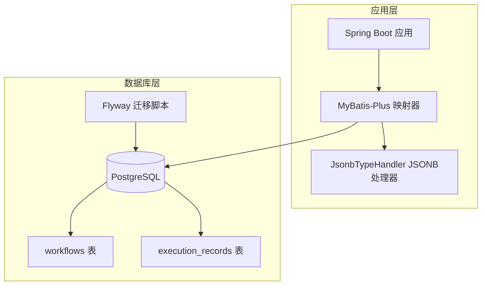
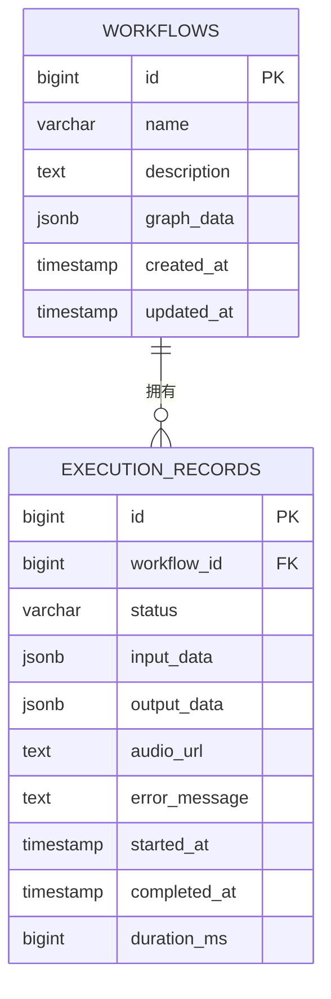
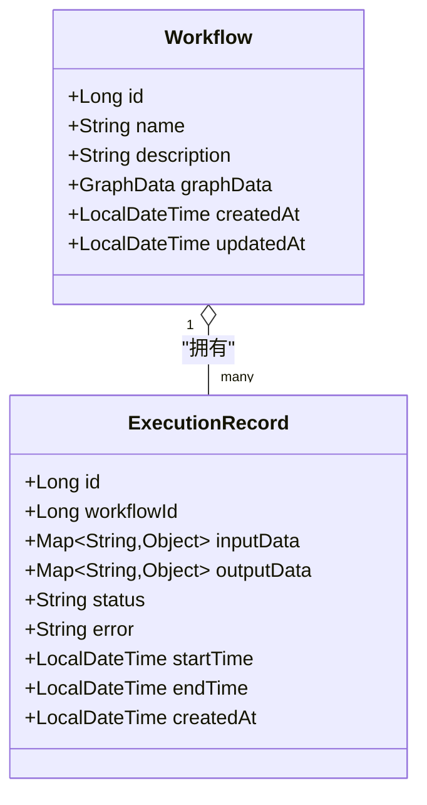
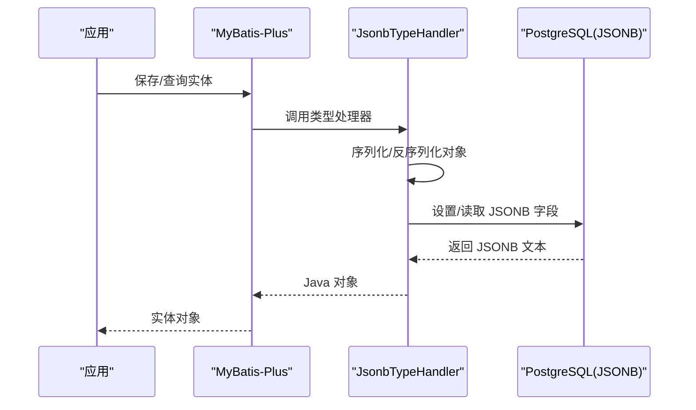
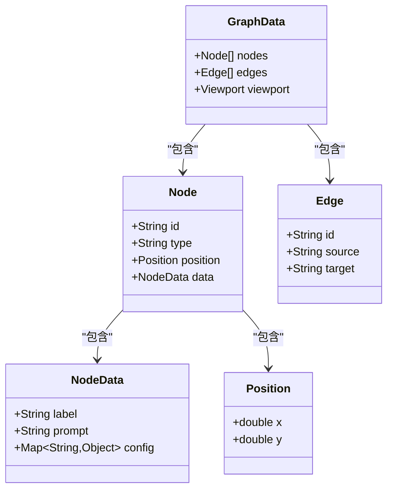
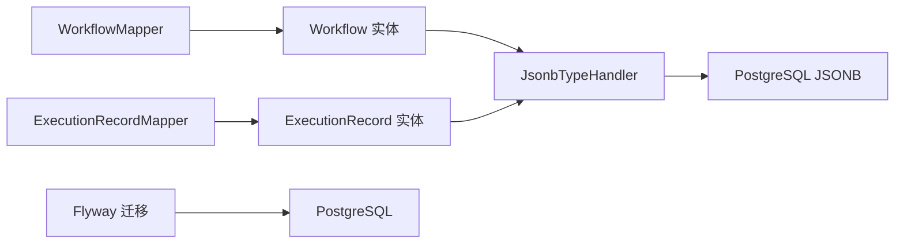

# 数据库设计

<cite>
**本文引用的文件**
- [V1__create_workflow_tables.sql](file://backend/src/main/resources/db/migration/V1__create_workflow_tables.sql)
- [V2__create_execution_records.sql](file://backend/src/main/resources/db/migration/V2__create_execution_records.sql)
- [Workflow.java](file://backend/src/main/java/com/bokagent/entity/Workflow.java)
- [ExecutionRecord.java](file://backend/src/main/java/com/bokagent/entity/ExecutionRecord.java)
- [Node.java](file://backend/src/main/java/com/bokagent/entity/Node.java)
- [Edge.java](file://backend/src/main/java/com/bokagent/entity/Edge.java)
- [GraphData.java](file://backend/src/main/java/com/bokagent/entity/GraphData.java)
- [NodeData.java](file://backend/src/main/java/com/bokagent/entity/NodeData.java)
- [Position.java](file://backend/src/main/java/com/bokagent/entity/Position.java)
- [JsonbTypeHandler.java](file://backend/src/main/java/com/bokagent/handler/JsonbTypeHandler.java)
- [WorkflowMapper.java](file://backend/src/main/java/com/bokagent/mapper/WorkflowMapper.java)
- [ExecutionRecordMapper.java](file://backend/src/main/java/com/bokagent/mapper/ExecutionRecordMapper.java)
- [application.yml](file://backend/src/main/resources/application.yml)
- [init-postgres.sql](file://docker/init-postgres.sql)
</cite>

## 目录
1. [简介](#简介)
2. [项目结构](#项目结构)
3. [核心组件](#核心组件)
4. [架构总览](#架构总览)
5. [详细组件分析](#详细组件分析)
6. [依赖分析](#依赖分析)
7. [性能考量](#性能考量)
8. [故障排查指南](#故障排查指南)
9. [结论](#结论)
10. [附录](#附录)

## 简介
本文件面向BokAgent数据库设计，系统性阐述工作流与执行记录相关的表结构、字段定义、约束、索引策略以及JSONB字段的设计与使用。文档同时覆盖MyBatis-Plus实体映射、PostgreSQL JSONB类型处理机制、Flyway迁移脚本、以及数据库最佳实践（规范化与反规范化、索引优化、分区表建议）等内容，帮助开发者在理解现有设计的基础上进行扩展与优化。

## 项目结构
后端采用Spring Boot + MyBatis-Plus + PostgreSQL架构：
- 数据库迁移：通过Flyway管理，初始包含工作流表与执行记录表两个版本脚本
- 实体层：使用MyBatis-Plus注解映射数据库表
- 类型处理器：自定义JsonbTypeHandler用于JSONB字段的序列化/反序列化
- 配置：application.yml中定义了PostgreSQL数据源、Flyway迁移路径、Redis、Spring AI等集成

图表来源
- [application.yml:16-31](file://backend/src/main/resources/application.yml#L16-L31)
- [WorkflowMapper.java:1-13](file://backend/src/main/java/com/bokagent/mapper/WorkflowMapper.java#L1-L13)
- [ExecutionRecordMapper.java:1-13](file://backend/src/main/java/com/bokagent/mapper/ExecutionRecordMapper.java#L1-L13)
- [JsonbTypeHandler.java:1-65](file://backend/src/main/java/com/bokagent/handler/JsonbTypeHandler.java#L1-L65)
- [V1__create_workflow_tables.sql:1-17](file://backend/src/main/resources/db/migration/V1__create_workflow_tables.sql#L1-L17)
- [V2__create_execution_records.sql:1-19](file://backend/src/main/resources/db/migration/V2__create_execution_records.sql#L1-L19)

章节来源
- [application.yml:16-31](file://backend/src/main/resources/application.yml#L16-L31)
- [V1__create_workflow_tables.sql:1-17](file://backend/src/main/resources/db/migration/V1__create_workflow_tables.sql#L1-L17)
- [V2__create_execution_records.sql:1-19](file://backend/src/main/resources/db/migration/V2__create_execution_records.sql#L1-L19)

## 核心组件
- workflows 表：存储工作流定义，包含名称、描述、图数据（JSONB）、创建/更新时间戳
- execution_records 表：存储工作流执行记录，包含状态、输入输出数据（JSONB）、错误信息、开始/结束时间、耗时等
- 实体类：Workflow、ExecutionRecord、Node、Edge、GraphData、NodeData、Position等，用于Java侧对象建模
- 类型处理器：JsonbTypeHandler负责将Java对象与PostgreSQL JSONB字段互转
- Mapper接口：WorkflowMapper、ExecutionRecordMapper，基于MyBatis-Plus简化CRUD

章节来源
- [Workflow.java:1-32](file://backend/src/main/java/com/bokagent/entity/Workflow.java#L1-L32)
- [ExecutionRecord.java:1-40](file://backend/src/main/java/com/bokagent/entity/ExecutionRecord.java#L1-L40)
- [Node.java:1-15](file://backend/src/main/java/com/bokagent/entity/Node.java#L1-L15)
- [Edge.java:1-14](file://backend/src/main/java/com/bokagent/entity/Edge.java#L1-L14)
- [GraphData.java:1-15](file://backend/src/main/java/com/bokagent/entity/GraphData.java#L1-L15)
- [NodeData.java:1-15](file://backend/src/main/java/com/bokagent/entity/NodeData.java#L1-L15)
- [Position.java:1-13](file://backend/src/main/java/com/bokagent/entity/Position.java#L1-L13)
- [JsonbTypeHandler.java:1-65](file://backend/src/main/java/com/bokagent/handler/JsonbTypeHandler.java#L1-L65)
- [WorkflowMapper.java:1-13](file://backend/src/main/java/com/bokagent/mapper/WorkflowMapper.java#L1-L13)
- [ExecutionRecordMapper.java:1-13](file://backend/src/main/java/com/bokagent/mapper/ExecutionRecordMapper.java#L1-L13)

## 架构总览
下图展示数据库表结构、实体类与类型处理器之间的关系，以及查询与写入流程的关键节点。

图表来源
- [V1__create_workflow_tables.sql:2-9](file://backend/src/main/resources/db/migration/V1__create_workflow_tables.sql#L2-L9)
- [V2__create_execution_records.sql:1-12](file://backend/src/main/resources/db/migration/V2__create_execution_records.sql#L1-L12)

## 详细组件分析

### 表结构与字段定义

#### workflows 表
- 主键：id（BIGSERIAL）
- 名称：name（VARCHAR(255)，NOT NULL）
- 描述：description（TEXT，支持中文与Emoji）
- 图数据：graph_data（JSONB，NOT NULL），用于存储完整的图结构（nodes、edges、viewport）
- 时间戳：created_at、updated_at（TIMESTAMP，默认NOW）
- 索引：idx_workflows_created_at（按创建时间倒序）

字段选择理由
- 使用JSONB存储图数据，便于灵活扩展节点与边结构，无需频繁变更表结构
- created_at/updated_at统一使用TIMESTAMP，便于排序与统计

章节来源
- [V1__create_workflow_tables.sql:2-16](file://backend/src/main/resources/db/migration/V1__create_workflow_tables.sql#L2-L16)
- [Workflow.java:18-30](file://backend/src/main/java/com/bokagent/entity/Workflow.java#L18-L30)

#### execution_records 表
- 主键：id（BIGSERIAL）
- 外键：workflow_id（REFERENCES workflows(id)）
- 状态：status（VARCHAR(20)，枚举值：RUNNING/SUCCESS/FAILED）
- 输入输出：input_data、output_data（JSONB），用于保存执行阶段的输入输出上下文
- 媒体：audio_url（TEXT，MinIO存储的音频URL）
- 错误：error_message（TEXT，支持中文）
- 时间：started_at、completed_at（TIMESTAMP）
- 性能：duration_ms（BIGINT，执行耗时毫秒）
- 索引：idx_execution_records_workflow_id、idx_execution_records_started_at

字段选择理由
- JSONB用于动态数据结构，避免为每次执行新增列
- 外键保证执行记录与工作流定义的一致性
- 独立的音频URL字段便于媒体资源与数据库解耦

章节来源
- [V2__create_execution_records.sql:1-19](file://backend/src/main/resources/db/migration/V2__create_execution_records.sql#L1-L19)
- [ExecutionRecord.java:19-39](file://backend/src/main/java/com/bokagent/entity/ExecutionRecord.java#L19-L39)

### 表关系设计
- 一对多：workflows.id → execution_records.workflow_id
- 无多对多：当前设计未见多对多关系；如需扩展可引入中间表
- 外键约束：execution_records.workflow_id指向workflows.id，确保引用完整性

图表来源
- [Workflow.java:18-30](file://backend/src/main/java/com/bokagent/entity/Workflow.java#L18-L30)
- [ExecutionRecord.java:19-39](file://backend/src/main/java/com/bokagent/entity/ExecutionRecord.java#L19-L39)

章节来源
- [V1__create_workflow_tables.sql:3](file://backend/src/main/resources/db/migration/V1__create_workflow_tables.sql#L3)
- [V2__create_execution_records.sql:3](file://backend/src/main/resources/db/migration/V2__create_execution_records.sql#L3)

### 索引设计策略
- workflows 表
  - idx_workflows_created_at：按创建时间倒序查询，适合分页与时间筛选
- execution_records 表
  - idx_execution_records_workflow_id：按工作流ID过滤执行记录
  - idx_execution_records_started_at：按开始时间倒序查询，适合执行历史列表

索引优化建议
- 若存在高频按状态过滤的查询，可考虑添加复合索引（status, started_at）
- 若需要按错误信息检索，可考虑添加GIN索引（取决于查询模式与数据分布）

章节来源
- [V1__create_workflow_tables.sql:16](file://backend/src/main/resources/db/migration/V1__create_workflow_tables.sql#L16)
- [V2__create_execution_records.sql:17-18](file://backend/src/main/resources/db/migration/V2__create_execution_records.sql#L17-L18)

### JSONB字段设计与使用
- 存储内容
  - workflows.graph_data：完整图结构（nodes、edges、viewport）
  - execution_records.input_data、output_data：执行阶段的动态上下文
- 类型处理器
  - JsonbTypeHandler：基于Jackson将Java对象序列化为JSON字符串，并封装为PGobject设置到数据库；读取时解析回目标类型
- 使用场景
  - 高度灵活的结构化数据存储，无需预定义字段
  - 与前端编辑器的数据结构保持一致，减少转换成本
- 性能考虑
  - JSONB查询通常不如结构化字段高效，建议仅在必要时使用
  - 对常用查询字段建立GIN索引或物化视图（视业务需求而定）
  - 控制JSONB大小，避免过大文档影响I/O与备份

图表来源
- [JsonbTypeHandler.java:26-63](file://backend/src/main/java/com/bokagent/handler/JsonbTypeHandler.java#L26-L63)
- [Workflow.java:25](file://backend/src/main/java/com/bokagent/entity/Workflow.java#L25)
- [ExecutionRecord.java:24-28](file://backend/src/main/java/com/bokagent/entity/ExecutionRecord.java#L24-L28)

章节来源
- [JsonbTypeHandler.java:1-65](file://backend/src/main/java/com/bokagent/handler/JsonbTypeHandler.java#L1-L65)
- [Workflow.java:25](file://backend/src/main/java/com/bokagent/entity/Workflow.java#L25)
- [ExecutionRecord.java:24-28](file://backend/src/main/java/com/bokagent/entity/ExecutionRecord.java#L24-L28)

### 实体类与数据模型
- Workflow：对应workflows表，graphData字段通过JsonbTypeHandler映射JSONB
- ExecutionRecord：对应execution_records表，input_data、output_data通过JsonbTypeHandler映射
- Node/Edge/GraphData/NodeData/Position：用于构建图数据结构，便于前后端一致性

图表来源
- [GraphData.java:10-14](file://backend/src/main/java/com/bokagent/entity/GraphData.java#L10-L14)
- [Node.java:9-14](file://backend/src/main/java/com/bokagent/entity/Node.java#L9-L14)
- [Edge.java:9-13](file://backend/src/main/java/com/bokagent/entity/Edge.java#L9-L13)
- [NodeData.java:10-14](file://backend/src/main/java/com/bokagent/entity/NodeData.java#L10-L14)
- [Position.java:9-12](file://backend/src/main/java/com/bokagent/entity/Position.java#L9-L12)

章节来源
- [GraphData.java:1-15](file://backend/src/main/java/com/bokagent/entity/GraphData.java#L1-L15)
- [Node.java:1-15](file://backend/src/main/java/com/bokagent/entity/Node.java#L1-L15)
- [Edge.java:1-14](file://backend/src/main/java/com/bokagent/entity/Edge.java#L1-L14)
- [NodeData.java:1-15](file://backend/src/main/java/com/bokagent/entity/NodeData.java#L1-L15)
- [Position.java:1-13](file://backend/src/main/java/com/bokagent/entity/Position.java#L1-L13)

### 数据库初始化与环境
- 初始化脚本：创建数据库workflow_db，启用UTF-8编码，安装uuid-ossp与pg_trgm扩展
- 应用配置：PostgreSQL数据源、Flyway迁移启用、迁移脚本路径等

章节来源
- [init-postgres.sql:1-20](file://docker/init-postgres.sql#L1-L20)
- [application.yml:16-31](file://backend/src/main/resources/application.yml#L16-L31)

## 依赖分析
- MyBatis-Plus依赖：Mapper接口与实体类绑定，自动映射表字段
- 类型处理器依赖：JsonbTypeHandler依赖Jackson与PGobject
- 迁移脚本依赖：Flyway管理数据库版本演进
- 数据库依赖：PostgreSQL JSONB、索引、扩展

图表来源
- [WorkflowMapper.java:10-12](file://backend/src/main/java/com/bokagent/mapper/WorkflowMapper.java#L10-L12)
- [ExecutionRecordMapper.java:10-12](file://backend/src/main/java/com/bokagent/mapper/ExecutionRecordMapper.java#L10-L12)
- [Workflow.java:25](file://backend/src/main/java/com/bokagent/entity/Workflow.java#L25)
- [ExecutionRecord.java:24-28](file://backend/src/main/java/com/bokagent/entity/ExecutionRecord.java#L24-L28)
- [JsonbTypeHandler.java:19](file://backend/src/main/java/com/bokagent/handler/JsonbTypeHandler.java#L19)
- [application.yml:26-30](file://backend/src/main/resources/application.yml#L26-L30)

章节来源
- [WorkflowMapper.java:1-13](file://backend/src/main/java/com/bokagent/mapper/WorkflowMapper.java#L1-L13)
- [ExecutionRecordMapper.java:1-13](file://backend/src/main/java/com/bokagent/mapper/ExecutionRecordMapper.java#L1-L13)
- [JsonbTypeHandler.java:1-65](file://backend/src/main/java/com/bokagent/handler/JsonbTypeHandler.java#L1-L65)
- [application.yml:26-30](file://backend/src/main/resources/application.yml#L26-L30)

## 性能考量
- JSONB查询性能
  - 对于复杂嵌套查询，建议在必要字段上建立GIN索引或物化视图
  - 控制JSONB文档大小，避免过大的输入/输出数据导致I/O瓶颈
- 索引策略
  - workflows：按创建时间倒序查询频繁，现有索引合理
  - execution_records：按workflow_id与started_at倒序查询常见，现有索引有效
  - 可根据实际查询模式增加复合索引（如status+started_at）
- 分区表建议
  - execution_records按时间分区（月/季度）可显著提升历史查询性能
  - 分区键建议使用started_at或created_at
- 连接池与并发
  - HikariCP最大连接数20，适用于中小规模并发；若执行记录量大，可评估扩容
- 缓存与归档
  - 将历史执行记录归档至冷存储，保留热数据在主表

[本节为通用性能指导，不直接分析具体文件]

## 故障排查指南
- JSONB序列化异常
  - 症状：插入/更新时抛出JSON转换异常
  - 排查：检查JsonbTypeHandler中的序列化逻辑与Jackson配置
  - 参考：JsonbTypeHandler的setNonNullParameter与parseJson方法
- 外键约束失败
  - 症状：插入execution_records时报外键错误
  - 排查：确认workflows表中是否存在对应的workflow_id
- Flyway迁移问题
  - 症状：启动时迁移失败或版本不匹配
  - 排查：检查application.yml中的flyway配置与迁移脚本路径
- 数据库编码与扩展
  - 症状：字符集或扩展缺失导致初始化失败
  - 排查：确认init-postgres.sql已正确执行，数据库编码为UTF-8，扩展uuid-ossp与pg_trgm已安装

章节来源
- [JsonbTypeHandler.java:26-63](file://backend/src/main/java/com/bokagent/handler/JsonbTypeHandler.java#L26-L63)
- [V2__create_execution_records.sql:3](file://backend/src/main/resources/db/migration/V2__create_execution_records.sql#L3)
- [application.yml:26-30](file://backend/src/main/resources/application.yml#L26-L30)
- [init-postgres.sql:13-15](file://docker/init-postgres.sql#L13-L15)

## 结论
BokAgent数据库设计以PostgreSQL为核心，采用JSONB存储灵活的工作流图数据与执行上下文，结合Flyway进行版本化管理，配合MyBatis-Plus与自定义类型处理器实现高效的读写。现有索引满足主流查询场景，建议在高并发与大数据量情况下引入分区表、复合索引与归档策略，持续优化查询与写入性能。

[本节为总结性内容，不直接分析具体文件]

## 附录

### 最佳实践清单
- 规范化与反规范化
  - 核心表遵循规范化，避免重复；JSONB用于非结构化或半结构化数据
- 索引优化
  - 为高频查询字段建立合适索引；对JSONB字段使用GIN或表达式索引
- 分区表
  - 基于时间维度对execution_records进行分区，提升历史查询效率
- 安全与合规
  - 对敏感数据进行脱敏或加密；定期备份与审计日志
- 监控与告警
  - 关注慢查询、索引失效、JSONB过大等问题，及时调整

[本节为通用最佳实践，不直接分析具体文件]