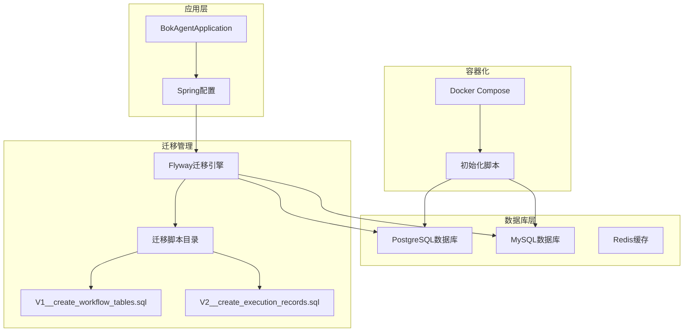
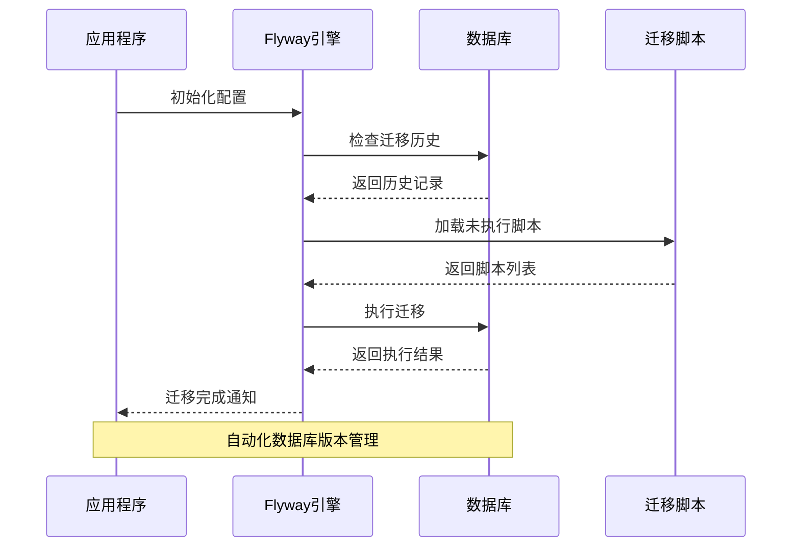
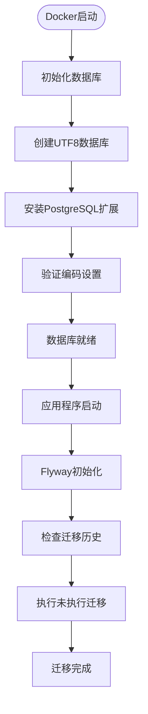
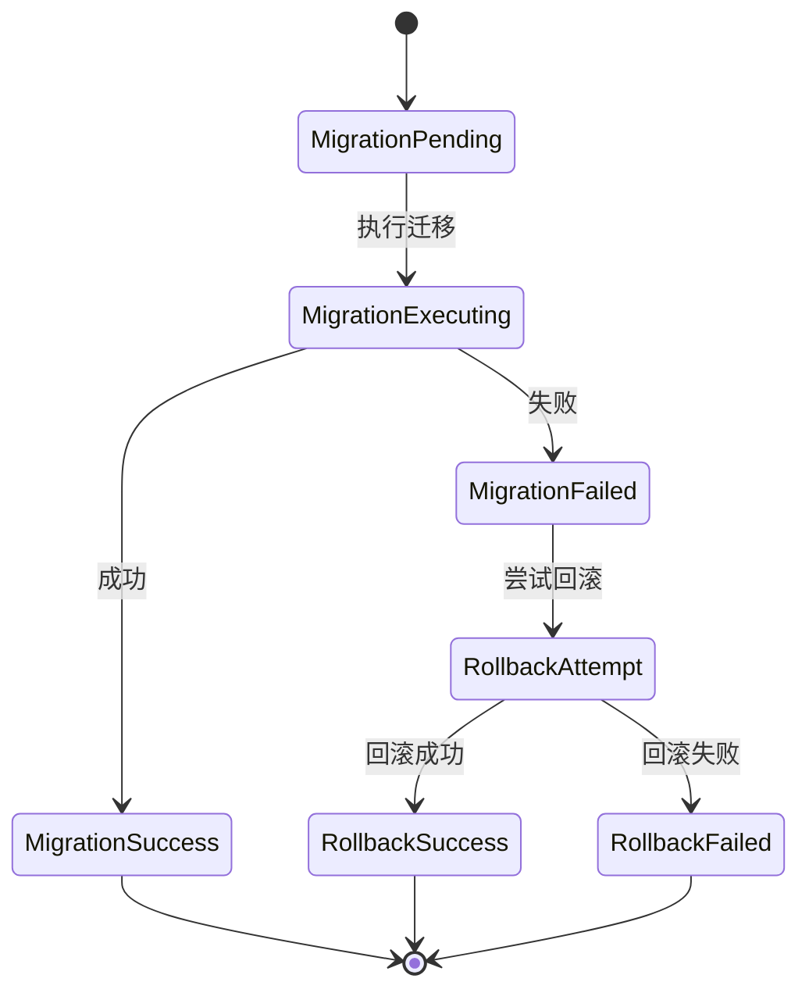
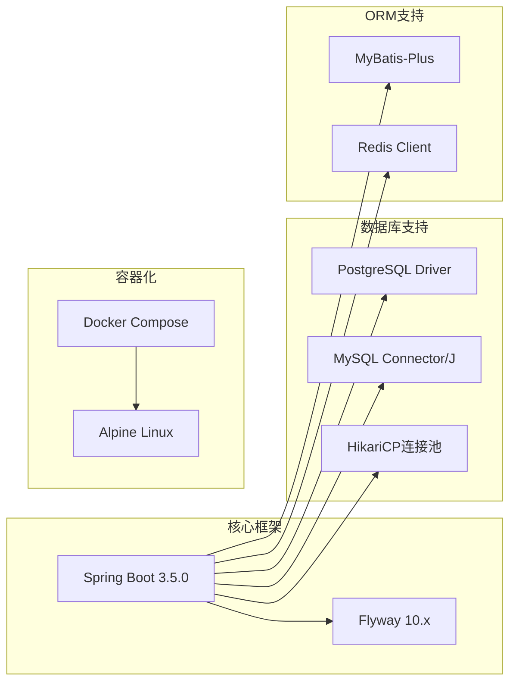
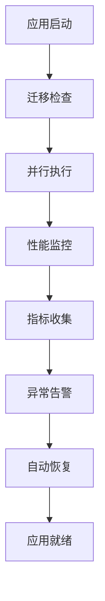

# 数据库迁移管理

<cite>
**本文引用的文件**
- [application.yml](file://backend/src/main/resources/application.yml)
- [pom.xml](file://backend/pom.xml)
- [V1__create_workflow_tables.sql](file://backend/src/main/resources/db/migration/V1__create_workflow_tables.sql)
- [V2__create_execution_records.sql](file://backend/src/main/resources/db/migration/V2__create_execution_records.sql)
- [docker-compose.yml](file://docker/docker-compose.yml)
- [init-postgres.sql](file://docker/init-postgres.sql)
- [PROJECT_STRUCTURE.md](file://docs/PROJECT_STRUCTURE.md)
</cite>

## 目录
1. [简介](#简介)
2. [项目结构](#项目结构)
3. [核心组件](#核心组件)
4. [架构概览](#架构概览)
5. [详细组件分析](#详细组件分析)
6. [依赖关系分析](#依赖关系分析)
7. [性能考虑](#性能考虑)
8. [故障排除指南](#故障排除指南)
9. [结论](#结论)
10. [附录](#附录)

## 简介

BokAgent项目采用Flyway进行数据库版本控制和迁移管理。该项目实现了完整的数据库迁移基础设施，包括PostgreSQL工作流数据库和MySQL业务数据库的双数据源配置。通过Flyway的自动化迁移机制，确保数据库结构的一致性和可追溯性。

项目当前包含两个核心迁移脚本：
- V1__create_workflow_tables.sql：创建工作流定义表
- V2__create_execution_records.sql：创建执行记录表

这些迁移脚本遵循Flyway的标准命名规范，确保迁移的有序执行和版本管理。

## 项目结构

BokAgent项目的数据库迁移管理采用分层架构设计，主要包含以下关键组件：

**图表来源**
- [application.yml:26-31](file://backend/src/main/resources/application.yml#L26-L31)
- [docker-compose.yml:1-132](file://docker/docker-compose.yml#L1-L132)

**章节来源**
- [application.yml:16-31](file://backend/src/main/resources/application.yml#L16-L31)
- [PROJECT_STRUCTURE.md:55-62](file://docs/PROJECT_STRUCTURE.md#L55-L62)

## 核心组件

### Flyway配置组件

项目使用Spring Boot自动配置的Flyway迁移管理器，配置位于application.yml中：

- **启用状态**：enabled: true
- **迁移位置**：classpath:db/migration
- **基线迁移**：baseline-on-migrate: true

这些配置确保应用程序启动时自动执行数据库迁移。

### 迁移脚本组件

项目包含两个核心迁移脚本，每个脚本都遵循Flyway命名规范：

1. **V1__create_workflow_tables.sql**：创建工作流定义表
2. **V2__create_execution_records.sql**：创建执行记录表

每个脚本都包含完整的DDL语句、索引创建和注释定义。

### 数据库配置组件

项目配置了双数据源架构：

- **PostgreSQL**：用于工作流数据存储
- **MySQL**：用于业务数据存储
- **Redis**：用于缓存和会话存储

**章节来源**
- [application.yml:26-31](file://backend/src/main/resources/application.yml#L26-L31)
- [pom.xml:77-86](file://backend/pom.xml#L77-L86)

## 架构概览

BokAgent的数据库迁移管理架构采用现代化的微服务设计理念：

**图表来源**
- [application.yml:26-31](file://backend/src/main/resources/application.yml#L26-L31)
- [pom.xml:77-86](file://backend/pom.xml#L77-L86)

该架构确保了数据库结构的版本控制、自动迁移执行和完整的变更追踪。

## 详细组件分析

### 迁移脚本组织结构

#### 版本前缀规范

Flyway使用标准化的版本前缀格式：`V{版本号}__{描述}`

- **V**：版本标识符
- **{版本号}**：数字版本号（如1, 2, 3）
- **__**：分隔符
- **{描述}**：简短的功能描述

#### 当前迁移脚本分析

**V1__create_workflow_tables.sql**：
- 创建workflows主表
- 包含JSONB字段支持复杂数据结构
- 设置UTF-8编码支持中文和Emoji
- 创建时间戳索引优化查询性能

**V2__create_execution_records.sql**：
- 创建execution_records关联表
- 使用外键约束维护数据完整性
- 支持工作流执行状态跟踪
- 包含音频URL存储和错误信息记录

#### 数据库初始化配置

项目使用Docker Compose进行数据库初始化：

**图表来源**
- [docker-compose.yml:1-132](file://docker/docker-compose.yml#L1-L132)
- [init-postgres.sql:1-20](file://docker/init-postgres.sql#L1-L20)

**章节来源**
- [V1__create_workflow_tables.sql:1-17](file://backend/src/main/resources/db/migration/V1__create_workflow_tables.sql#L1-L17)
- [V2__create_execution_records.sql:1-19](file://backend/src/main/resources/db/migration/V2__create_execution_records.sql#L1-L19)
- [docker/init-postgres.sql:1-20](file://docker/init-postgres.sql#L1-L20)

### DDL语句编写规范

#### 表结构设计原则

1. **主键设计**：使用BIGSERIAL自增主键确保唯一性
2. **字符集支持**：UTF-8编码支持中文和Emoji
3. **JSONB字段**：使用PostgreSQL JSONB类型存储动态数据
4. **索引优化**：为常用查询字段创建索引

#### 索引策略

- **时间戳索引**：优化排序和范围查询
- **外键索引**：确保关联查询性能
- **复合索引**：针对复杂查询条件优化

### 数据迁移策略

#### 数据完整性保证

1. **外键约束**：维护表间引用完整性
2. **非空约束**：确保关键字段的完整性
3. **默认值设置**：提供合理的默认值

#### 性能优化措施

1. **索引设计**：平衡查询性能和写入性能
2. **分区策略**：为大数据量表设计分区方案
3. **统计信息**：定期更新数据库统计信息

### 回滚机制设计

虽然当前项目未实现回滚脚本，但Flyway提供了完整的回滚支持：

## 依赖关系分析

### 技术栈依赖

项目使用现代化的技术栈确保数据库迁移的可靠性和性能：

**图表来源**
- [pom.xml:21-27](file://backend/pom.xml#L21-L27)
- [pom.xml:77-86](file://backend/pom.xml#L77-L86)

### 外部依赖关系

项目依赖的关键外部组件：

1. **Spring Boot**：提供自动配置和依赖注入
2. **Flyway**：数据库版本管理和迁移
3. **PostgreSQL**：工作流数据存储
4. **MySQL**：业务数据存储
5. **Docker**：容器化部署

**章节来源**
- [pom.xml:29-128](file://backend/pom.xml#L29-L128)

## 性能考虑

### 迁移性能优化

1. **批量操作**：合理设计迁移脚本减少事务开销
2. **索引策略**：在迁移过程中智能创建和重建索引
3. **连接池配置**：优化数据库连接池参数

### 生产环境性能监控

## 故障排除指南

### 常见迁移问题

#### 迁移失败排查

1. **检查数据库连接**：确认连接字符串和凭据
2. **验证权限设置**：确保用户具有必要的DDL权限
3. **检查磁盘空间**：确保有足够的存储空间
4. **查看日志输出**：分析详细的错误信息

#### 数据库初始化问题

1. **编码问题**：确认UTF-8编码设置
2. **扩展缺失**：检查PostgreSQL扩展安装
3. **版本兼容性**：验证数据库版本要求

**章节来源**
- [docker/init-postgres.sql:1-20](file://docker/init-postgres.sql#L1-L20)

## 结论

BokAgent项目的数据库迁移管理实现了现代化的版本控制和自动化管理。通过Flyway的标准化配置和规范化的迁移脚本，确保了数据库结构的一致性和可追溯性。

项目的优势包括：
- **标准化命名**：遵循Flyway标准命名规范
- **双数据源支持**：灵活的数据存储架构
- **容器化部署**：一致的环境配置
- **UTF-8支持**：完整的国际化能力

建议的改进方向：
1. 实现回滚脚本以支持紧急回滚
2. 添加迁移测试策略
3. 实施生产环境备份机制
4. 建立迁移审批流程

## 附录

### 迁移最佳实践清单

#### 开发环境实践
- 使用独立的开发数据库实例
- 实施频繁的小型迁移
- 建立本地迁移测试流程
- 维护完整的迁移历史记录

#### 生产环境实践
- 实施零停机迁移策略
- 建立完整的备份和恢复计划
- 制定详细的回滚预案
- 实施变更审批流程

#### 迁移脚本编写规范
- 使用清晰的版本前缀
- 编写完整的DDL语句
- 包含适当的索引创建
- 添加必要的注释说明
- 确保幂等性设计