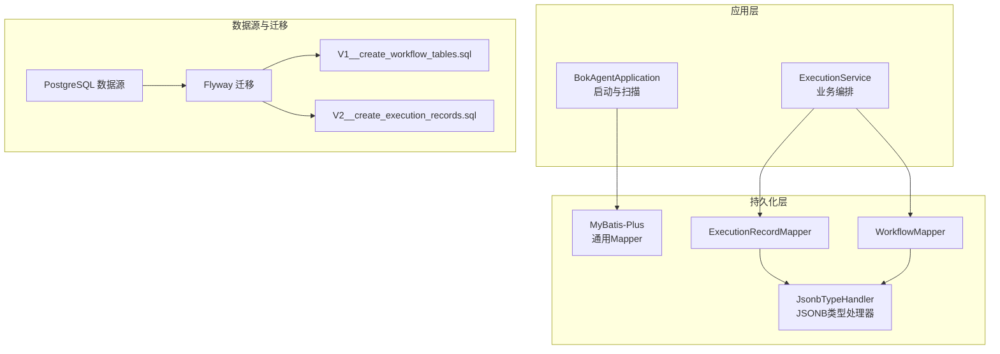
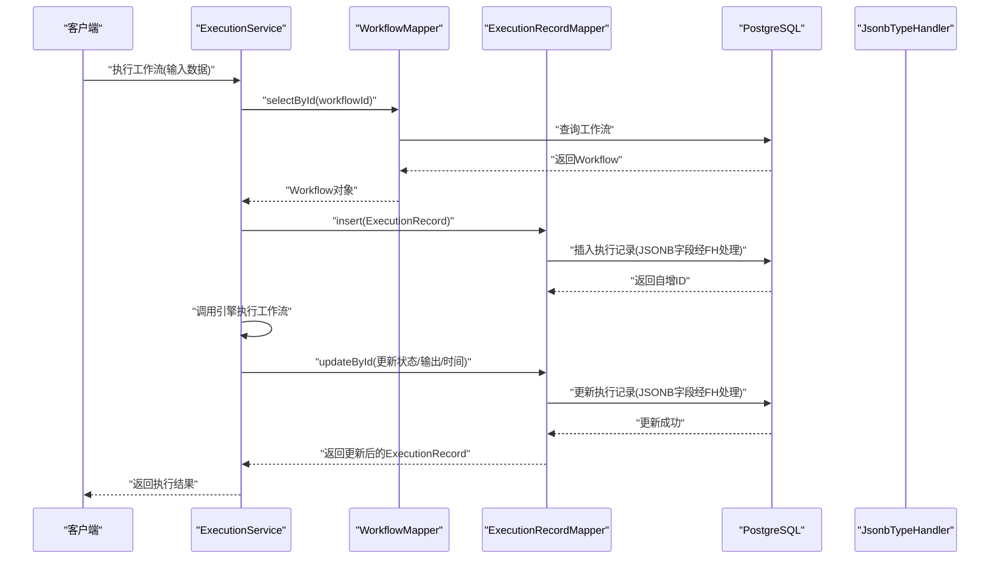
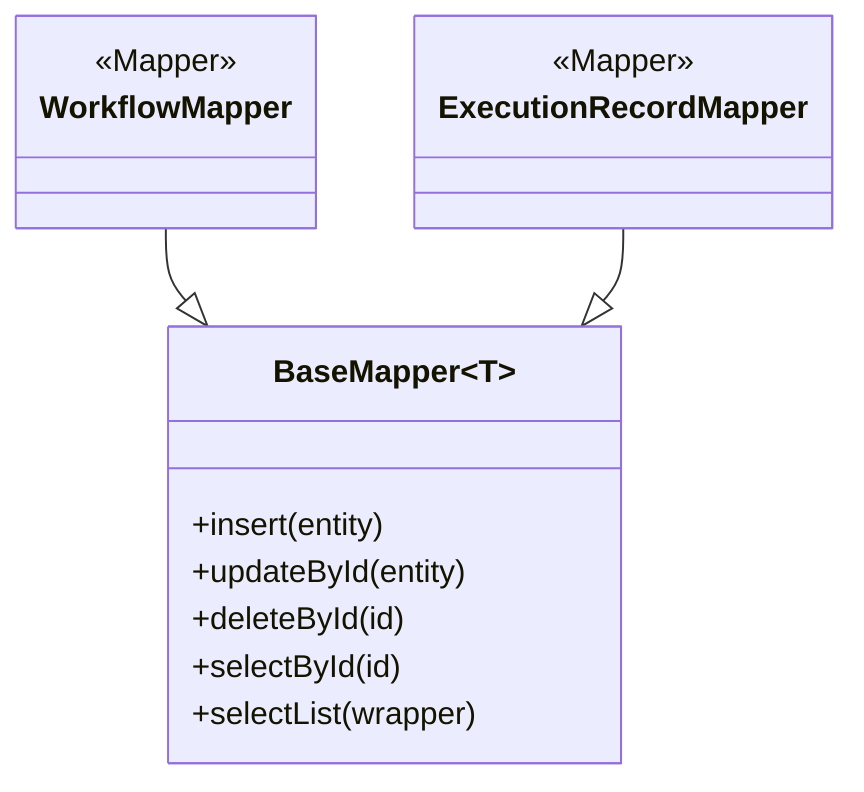
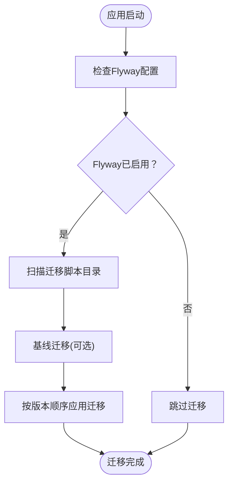
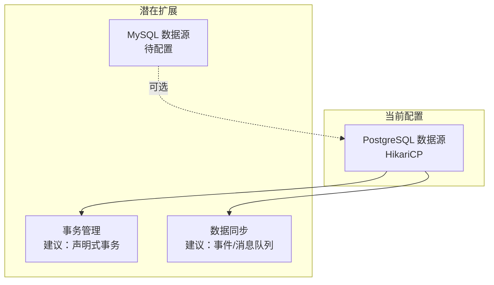
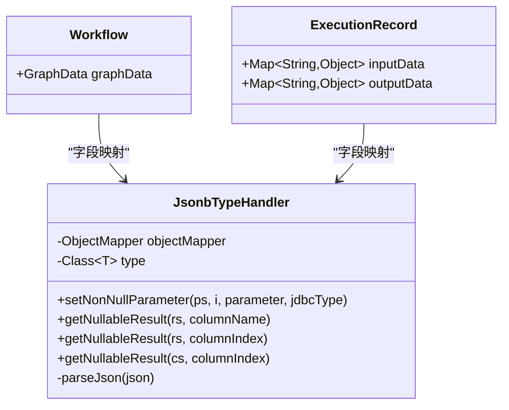
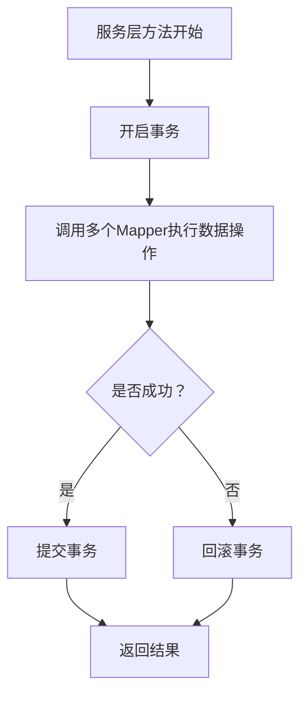
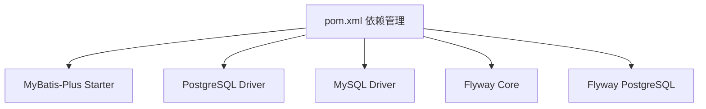

# 数据持久化

<cite>
**本文引用的文件**
- [BokAgentApplication.java](file://backend/src/main/java/com/bokagent/BokAgentApplication.java)
- [application.yml](file://backend/src/main/resources/application.yml)
- [ExecutionRecordMapper.java](file://backend/src/main/java/com/bokagent/mapper/ExecutionRecordMapper.java)
- [WorkflowMapper.java](file://backend/src/main/java/com/bokagent/mapper/WorkflowMapper.java)
- [JsonbTypeHandler.java](file://backend/src/main/java/com/bokagent/handler/JsonbTypeHandler.java)
- [ExecutionRecord.java](file://backend/src/main/java/com/bokagent/entity/ExecutionRecord.java)
- [Workflow.java](file://backend/src/main/java/com/bokagent/entity/Workflow.java)
- [GraphData.java](file://backend/src/main/java/com/bokagent/entity/GraphData.java)
- [NodeData.java](file://backend/src/main/java/com/bokagent/entity/NodeData.java)
- [Node.java](file://backend/src/main/java/com/bokagent/entity/Node.java)
- [Edge.java](file://backend/src/main/java/com/bokagent/entity/Edge.java)
- [V1__create_workflow_tables.sql](file://backend/src/main/resources/db/migration/V1__create_workflow_tables.sql)
- [V2__create_execution_records.sql](file://backend/src/main/resources/db/migration/V2__create_execution_records.sql)
- [pom.xml](file://backend/pom.xml)
- [ExecutionService.java](file://backend/src/main/java/com/bokagent/service/ExecutionService.java)
- [init-postgres.sql](file://docker/init-postgres.sql)
- [init-mysql.sql](file://docker/init-mysql.sql)
</cite>

## 目录
1. [简介](#简介)
2. [项目结构](#项目结构)
3. [核心组件](#核心组件)
4. [架构总览](#架构总览)
5. [详细组件分析](#详细组件分析)
6. [依赖分析](#依赖分析)
7. [性能考虑](#性能考虑)
8. [故障排查指南](#故障排查指南)
9. [结论](#结论)
10. [附录](#附录)

## 简介
本文件面向数据库开发者，系统性梳理 BokAgent 数据持久化层的设计与实现，覆盖以下主题：
- MyBatis-Plus 的配置与使用：Mapper 接口设计、XML 映射文件、通用 CRUD 实现
- 数据库迁移脚本管理：Flyway 集成、版本控制、回滚策略
- 多数据源与连接池：PostgreSQL 与 MySQL 的连接池配置、事务管理与数据同步思路
- 复杂数据类型处理：JSON 字段序列化、PostgreSQL JSONB 类型支持、自定义 TypeHandler
- 性能优化：索引设计、查询优化、缓存策略
- 设计原则：DAO/Repository 模式、分页查询
- 一致性保障：事务边界、并发控制、数据校验

## 项目结构
后端采用 Spring Boot + MyBatis-Plus 架构，持久化层主要由以下部分组成：
- 应用入口与扫描配置：通过注解扫描 Mapper 包路径
- 配置文件：application.yml 中定义数据源、Flyway、MyBatis-Plus、Redis 等
- 实体与映射：实体类标注表名与字段类型处理器；Mapper 继承 BaseMapper 即获得通用 CRUD
- 自定义类型处理器：JsonbTypeHandler 将 Java 对象与 PostgreSQL JSONB 字段互转
- 迁移脚本：Flyway 管理的 SQL 版本化迁移
- 服务层：通过 Mapper 完成数据访问与业务流程编排

**图表来源**
- [BokAgentApplication.java:16-18](file://backend/src/main/java/com/bokagent/BokAgentApplication.java#L16-L18)
- [application.yml:16-31](file://backend/src/main/resources/application.yml#L16-L31)
- [application.yml:90-99](file://backend/src/main/resources/application.yml#L90-L99)
- [ExecutionRecordMapper.java:10-12](file://backend/src/main/java/com/bokagent/mapper/ExecutionRecordMapper.java#L10-L12)
- [WorkflowMapper.java:10-12](file://backend/src/main/java/com/bokagent/mapper/WorkflowMapper.java#L10-L12)
- [JsonbTypeHandler.java:17-24](file://backend/src/main/java/com/bokagent/handler/JsonbTypeHandler.java#L17-L24)
- [V1__create_workflow_tables.sql:1-17](file://backend/src/main/resources/db/migration/V1__create_workflow_tables.sql#L1-L17)
- [V2__create_execution_records.sql:1-19](file://backend/src/main/resources/db/migration/V2__create_execution_records.sql#L1-L19)

**章节来源**
- [BokAgentApplication.java:16-18](file://backend/src/main/java/com/bokagent/BokAgentApplication.java#L16-L18)
- [application.yml:16-31](file://backend/src/main/resources/application.yml#L16-L31)
- [application.yml:90-99](file://backend/src/main/resources/application.yml#L90-L99)
- [pom.xml:57-87](file://backend/pom.xml#L57-L87)

## 核心组件
- 应用入口与扫描
  - 通过扫描注解指定 Mapper 包路径，确保 MyBatis-Plus 自动发现 Mapper 接口
- 配置中心
  - 数据源：PostgreSQL（工作流数据），HikariCP 连接池参数
  - Flyway：启用迁移、指定迁移脚本位置、基线迁移
  - MyBatis-Plus：全局配置、驼峰映射、日志实现、Mapper XML 位置
- 实体与映射
  - 实体类标注表名与字段类型处理器，用于 JSONB 字段的自动序列化/反序列化
- Mapper 接口
  - 继承 BaseMapper，即可获得通用 CRUD 能力
- 自定义类型处理器
  - JsonbTypeHandler 将 Java 泛型对象与 PostgreSQL JSONB 互转，并处理空值与异常

**章节来源**
- [BokAgentApplication.java:16-18](file://backend/src/main/java/com/bokagent/BokAgentApplication.java#L16-L18)
- [application.yml:16-31](file://backend/src/main/resources/application.yml#L16-L31)
- [application.yml:90-99](file://backend/src/main/resources/application.yml#L90-L99)
- [ExecutionRecord.java:16-39](file://backend/src/main/java/com/bokagent/entity/ExecutionRecord.java#L16-L39)
- [Workflow.java:15-31](file://backend/src/main/java/com/bokagent/entity/Workflow.java#L15-L31)
- [ExecutionRecordMapper.java:10-12](file://backend/src/main/java/com/bokagent/mapper/ExecutionRecordMapper.java#L10-L12)
- [WorkflowMapper.java:10-12](file://backend/src/main/java/com/bokagent/mapper/WorkflowMapper.java#L10-L12)
- [JsonbTypeHandler.java:17-63](file://backend/src/main/java/com/bokagent/handler/JsonbTypeHandler.java#L17-L63)

## 架构总览
下图展示从应用到数据库的典型调用链路，以及迁移与类型转换的关键环节。

**图表来源**
- [ExecutionService.java:39-92](file://backend/src/main/java/com/bokagent/service/ExecutionService.java#L39-L92)
- [ExecutionRecordMapper.java:10-12](file://backend/src/main/java/com/bokagent/mapper/ExecutionRecordMapper.java#L10-L12)
- [WorkflowMapper.java:10-12](file://backend/src/main/java/com/bokagent/mapper/WorkflowMapper.java#L10-L12)
- [JsonbTypeHandler.java:26-51](file://backend/src/main/java/com/bokagent/handler/JsonbTypeHandler.java#L26-L51)

## 详细组件分析

### MyBatis-Plus 配置与使用
- Mapper 接口设计
  - WorkflowMapper、ExecutionRecordMapper 均继承 BaseMapper，天然具备通用 CRUD 方法
- XML 映射文件
  - 项目中未提供 XML 映射文件，所有查询基于注解或约定命名，符合 MyBatis-Plus 的零 XML 设计理念
- 通用 CRUD 实现
  - 通过 BaseMapper 提供的方法完成插入、更新、删除、查询等操作，无需手写 SQL

**图表来源**
- [WorkflowMapper.java:10-12](file://backend/src/main/java/com/bokagent/mapper/WorkflowMapper.java#L10-L12)
- [ExecutionRecordMapper.java:10-12](file://backend/src/main/java/com/bokagent/mapper/ExecutionRecordMapper.java#L10-L12)

**章节来源**
- [WorkflowMapper.java:10-12](file://backend/src/main/java/com/bokagent/mapper/WorkflowMapper.java#L10-L12)
- [ExecutionRecordMapper.java:10-12](file://backend/src/main/java/com/bokagent/mapper/ExecutionRecordMapper.java#L10-L12)
- [application.yml:90-99](file://backend/src/main/resources/application.yml#L90-L99)

### 数据库迁移与 Flyway 集成
- 迁移脚本管理
  - 通过 Flyway 启用迁移，指定 classpath:db/migration 作为脚本目录
  - V1：创建 workflows 表，含 JSONB 字段与索引
  - V2：创建 execution_records 表，含 JSONB 字段与索引
- 版本控制与回滚
  - 建议在生产环境谨慎回滚；如需回滚，可使用 Flyway 的 clean/repair 或编写降级脚本
- 基线迁移
  - 开启基线迁移以兼容已有数据库

**图表来源**
- [application.yml:26-31](file://backend/src/main/resources/application.yml#L26-L31)
- [V1__create_workflow_tables.sql:1-17](file://backend/src/main/resources/db/migration/V1__create_workflow_tables.sql#L1-L17)
- [V2__create_execution_records.sql:1-19](file://backend/src/main/resources/db/migration/V2__create_execution_records.sql#L1-L19)

**章节来源**
- [application.yml:26-31](file://backend/src/main/resources/application.yml#L26-L31)
- [V1__create_workflow_tables.sql:1-17](file://backend/src/main/resources/db/migration/V1__create_workflow_tables.sql#L1-L17)
- [V2__create_execution_records.sql:1-19](file://backend/src/main/resources/db/migration/V2__create_execution_records.sql#L1-L19)

### 多数据源与连接池配置
- 当前配置
  - 仅配置了 PostgreSQL 数据源（工作流数据）
  - 使用 HikariCP 连接池，设置最大池大小与最小空闲数
- MySQL 支持
  - 项目引入了 MySQL 驱动依赖，但未在配置中启用 MySQL 数据源
- 事务管理与数据同步
  - 建议：若引入 MySQL 数据源，应明确区分事务作用域与数据同步策略（如分布式事务、消息队列）

**图表来源**
- [application.yml:16-25](file://backend/src/main/resources/application.yml#L16-L25)
- [pom.xml:71-75](file://backend/pom.xml#L71-L75)

**章节来源**
- [application.yml:16-25](file://backend/src/main/resources/application.yml#L16-L25)
- [pom.xml:71-75](file://backend/pom.xml#L71-L75)

### 复杂数据类型处理：JSON 与 JSONB
- JSON 字段序列化
  - 使用 Jackson 进行对象与字符串的序列化/反序列化
- PostgreSQL JSONB 类型支持
  - 通过 JsonbTypeHandler 将 Map/对象与 JSONB 字段互转
  - 处理空值与异常，确保读写安全
- 实体中的字段映射
  - Workflow.graphData、ExecutionRecord.inputData、ExecutionRecord.outputData 使用 JSONB 类型处理器

**图表来源**
- [JsonbTypeHandler.java:17-63](file://backend/src/main/java/com/bokagent/handler/JsonbTypeHandler.java#L17-L63)
- [Workflow.java:25-26](file://backend/src/main/java/com/bokagent/entity/Workflow.java#L25-L26)
- [ExecutionRecord.java:24-28](file://backend/src/main/java/com/bokagent/entity/ExecutionRecord.java#L24-L28)

**章节来源**
- [JsonbTypeHandler.java:17-63](file://backend/src/main/java/com/bokagent/handler/JsonbTypeHandler.java#L17-L63)
- [Workflow.java:25-26](file://backend/src/main/java/com/bokagent/entity/Workflow.java#L25-L26)
- [ExecutionRecord.java:24-28](file://backend/src/main/java/com/bokagent/entity/ExecutionRecord.java#L24-L28)

### 数据访问层设计原则
- DAO/Repository 模式
  - Mapper 接口承担 Repository 职责，提供数据访问能力
- 分页查询
  - MyBatis-Plus 提供 Page 对象进行分页，可在服务层封装分页查询
- 事务边界
  - 在服务层方法上使用事务注解，确保业务原子性（如执行工作流与记录写入）

**图表来源**
- [ExecutionService.java:39-92](file://backend/src/main/java/com/bokagent/service/ExecutionService.java#L39-L92)

**章节来源**
- [ExecutionService.java:39-92](file://backend/src/main/java/com/bokagent/service/ExecutionService.java#L39-L92)

### 数据一致性与并发控制
- 事务边界
  - 执行工作流与写入执行记录应在同一事务内，避免中间态数据
- 并发控制
  - 建议对关键写入操作加锁（如悲观锁 SELECT ... FOR UPDATE）或使用乐观锁版本号
- 数据校验
  - 在入库前对 JSONB 字段进行格式校验，防止非法数据进入数据库

**章节来源**
- [ExecutionService.java:39-92](file://backend/src/main/java/com/bokagent/service/ExecutionService.java#L39-L92)
- [JsonbTypeHandler.java:54-63](file://backend/src/main/java/com/bokagent/handler/JsonbTypeHandler.java#L54-L63)

## 依赖分析
- MyBatis-Plus 与 Spring Boot 集成
  - Starter 引入与版本管理
- 数据库驱动
  - PostgreSQL 与 MySQL 驱动均引入，但仅 PostgreSQL 在配置中启用
- Flyway 迁移
  - 核心与 PostgreSQL 扩展依赖均已引入

**图表来源**
- [pom.xml:57-87](file://backend/pom.xml#L57-L87)

**章节来源**
- [pom.xml:57-87](file://backend/pom.xml#L57-L87)

## 性能考虑
- 索引设计
  - workflows 表按创建时间倒序索引
  - execution_records 表按 workflow_id 与 started_at 建立索引，有利于按工作流与时间范围查询
- 查询优化
  - 使用条件查询与投影查询，避免全表扫描
  - 对 JSONB 字段的过滤尽量结合索引字段
- 缓存策略
  - 配置了 Redis 与本地缓存 TTL，建议对热点查询结果进行缓存

**章节来源**
- [V1__create_workflow_tables.sql:16](file://backend/src/main/resources/db/migration/V1__create_workflow_tables.sql#L16)
- [V2__create_execution_records.sql:17-18](file://backend/src/main/resources/db/migration/V2__create_execution_records.sql#L17-L18)
- [application.yml:150-154](file://backend/src/main/resources/application.yml#L150-L154)

## 故障排查指南
- 编码问题
  - 应用启动时强制 UTF-8 编码，确保中文与 Emoji 正常显示
- 连接池问题
  - 检查 HikariCP 最大池大小与最小空闲配置，避免连接不足或过多
- 迁移失败
  - 查看 Flyway 版本状态与错误日志，确认脚本语法与权限
- JSONB 处理异常
  - 检查 JsonbTypeHandler 的序列化/反序列化逻辑与空值处理

**章节来源**
- [BokAgentApplication.java:22-53](file://backend/src/main/java/com/bokagent/BokAgentApplication.java#L22-L53)
- [application.yml:22-25](file://backend/src/main/resources/application.yml#L22-L25)
- [application.yml:26-31](file://backend/src/main/resources/application.yml#L26-L31)
- [JsonbTypeHandler.java:33-35](file://backend/src/main/java/com/bokagent/handler/JsonbTypeHandler.java#L33-L35)

## 结论
本持久化层以 MyBatis-Plus 为核心，配合 Flyway 迁移与自定义类型处理器，实现了对 PostgreSQL JSONB 字段的稳定支持，并通过通用 Mapper 提供了高效的 CRUD 能力。当前配置聚焦于 PostgreSQL 数据源，未来可按需扩展 MySQL 数据源与事务同步策略。建议在生产环境中完善索引、缓存与并发控制策略，确保高可用与高性能。

## 附录
- 数据库初始化脚本
  - PostgreSQL 初始化：创建数据库、扩展、编码验证
  - MySQL 初始化：创建数据库、字符集与排序规则验证
- 实体与字段说明
  - Workflow：包含工作流元数据与 JSONB 图数据
  - ExecutionRecord：包含执行状态、输入输出 JSONB、时间戳与耗时

**章节来源**
- [init-postgres.sql:1-20](file://docker/init-postgres.sql#L1-L20)
- [init-mysql.sql:1-12](file://docker/init-mysql.sql#L1-L12)
- [Workflow.java:15-31](file://backend/src/main/java/com/bokagent/entity/Workflow.java#L15-L31)
- [ExecutionRecord.java:16-39](file://backend/src/main/java/com/bokagent/entity/ExecutionRecord.java#L16-L39)
- [GraphData.java:10-14](file://backend/src/main/java/com/bokagent/entity/GraphData.java#L10-L14)
- [NodeData.java:10-14](file://backend/src/main/java/com/bokagent/entity/NodeData.java#L10-L14)
- [Node.java:9-14](file://backend/src/main/java/com/bokagent/entity/Node.java#L9-L14)
- [Edge.java:9-13](file://backend/src/main/java/com/bokagent/entity/Edge.java#L9-L13)