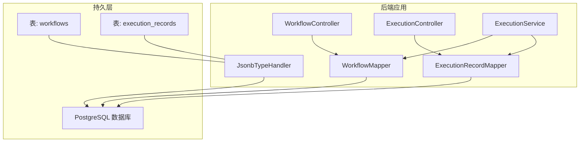
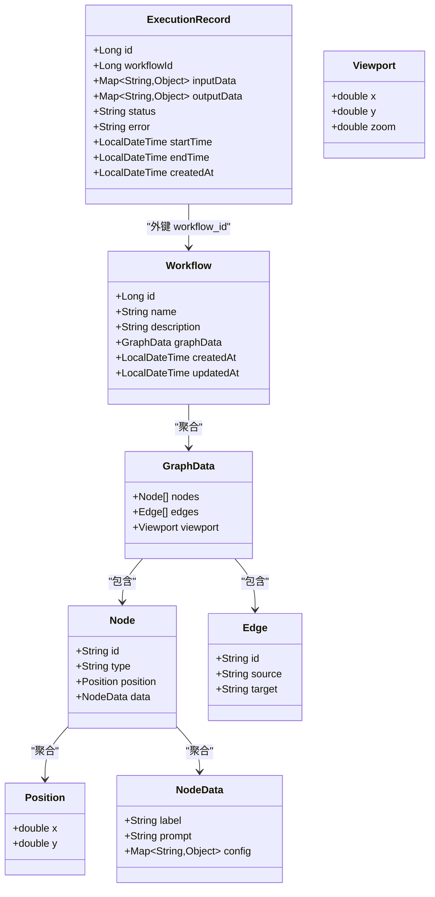
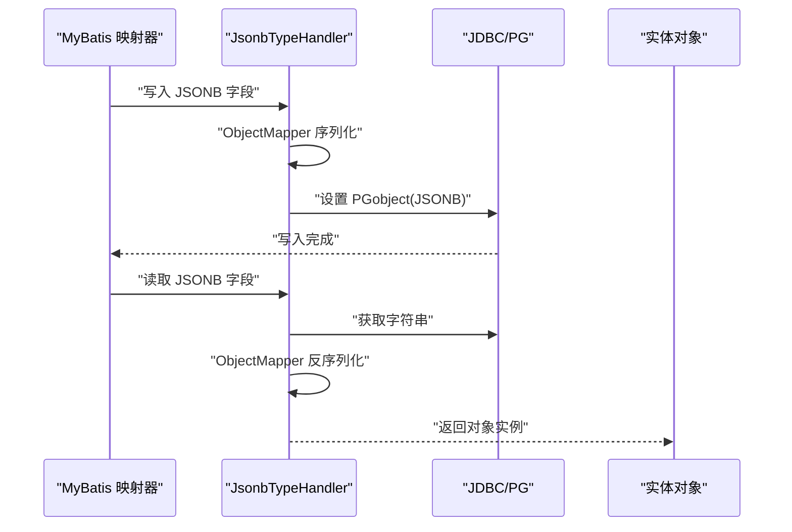
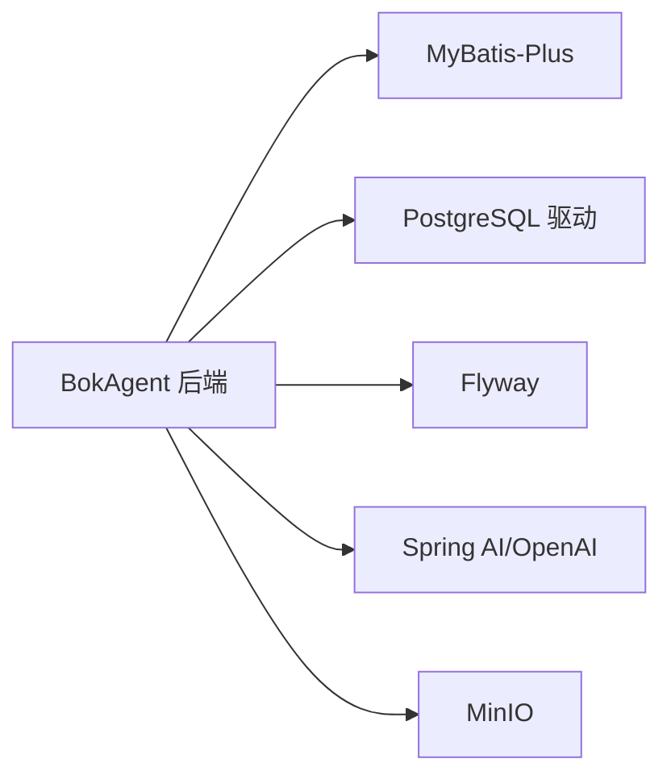
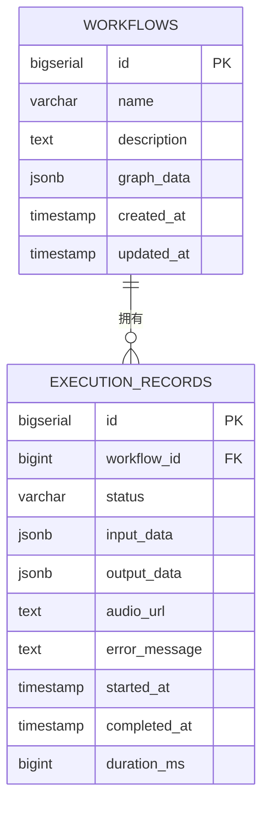

# 数据模型设计

<cite>
**本文引用的文件**
- [Workflow.java](file://backend/src/main/java/com/bokagent/entity/Workflow.java)
- [ExecutionRecord.java](file://backend/src/main/java/com/bokagent/entity/ExecutionRecord.java)
- [Node.java](file://backend/src/main/java/com/bokagent/entity/Node.java)
- [Edge.java](file://backend/src/main/java/com/bokagent/entity/Edge.java)
- [GraphData.java](file://backend/src/main/java/com/bokagent/entity/GraphData.java)
- [NodeData.java](file://backend/src/main/java/com/bokagent/entity/NodeData.java)
- [Position.java](file://backend/src/main/java/com/bokagent/entity/Position.java)
- [Viewport.java](file://backend/src/main/java/com/bokagent/entity/Viewport.java)
- [JsonbTypeHandler.java](file://backend/src/main/java/com/bokagent/handler/JsonbTypeHandler.java)
- [WorkflowMapper.java](file://backend/src/main/java/com/bokagent/mapper/WorkflowMapper.java)
- [ExecutionRecordMapper.java](file://backend/src/main/java/com/bokagent/mapper/ExecutionRecordMapper.java)
- [ExecutionService.java](file://backend/src/main/java/com/bokagent/service/ExecutionService.java)
- [ExecutionController.java](file://backend/src/main/java/com/bokagent/controller/ExecutionController.java)
- [WorkflowController.java](file://backend/src/main/java/com/bokagent/controller/WorkflowController.java)
- [V1__create_workflow_tables.sql](file://backend/src/main/resources/db/migration/V1__create_workflow_tables.sql)
- [V2__create_execution_records.sql](file://backend/src/main/resources/db/migration/V2__create_execution_records.sql)
- [pom.xml](file://backend/pom.xml)
</cite>

## 目录
1. [简介](#简介)
2. [项目结构](#项目结构)
3. [核心组件](#核心组件)
4. [架构总览](#架构总览)
5. [详细组件分析](#详细组件分析)
6. [依赖分析](#依赖分析)
7. [性能考虑](#性能考虑)
8. [故障排查指南](#故障排查指南)
9. [结论](#结论)
10. [附录](#附录)

## 简介
本文件面向数据库管理员与后端开发者，系统性梳理 BokAgent 的数据模型设计，覆盖实体类设计理念、字段定义、约束与索引、关系映射、数据验证与业务规则、JSON 序列化与反序列化机制、数据生命周期管理（创建/更新/删除/归档）、以及数据访问模式与性能优化建议。文中所有技术细节均以仓库中的实体、映射器、处理器与数据库迁移脚本为依据。

## 项目结构
后端采用 Spring Boot + MyBatis-Plus 架构，数据模型通过实体类与数据库表一一对应，并通过自定义 TypeHandler 处理 JSONB 字段。数据库迁移使用 Flyway，初始版本包含工作流表与执行记录表。

图表来源
- [WorkflowController.java:1-92](file://backend/src/main/java/com/bokagent/controller/WorkflowController.java#L1-L92)
- [ExecutionController.java:1-81](file://backend/src/main/java/com/bokagent/controller/ExecutionController.java#L1-L81)
- [ExecutionService.java:1-110](file://backend/src/main/java/com/bokagent/service/ExecutionService.java#L1-L110)
- [WorkflowMapper.java:1-13](file://backend/src/main/java/com/bokagent/mapper/WorkflowMapper.java#L1-L13)
- [ExecutionRecordMapper.java:1-13](file://backend/src/main/java/com/bokagent/mapper/ExecutionRecordMapper.java#L1-L13)
- [JsonbTypeHandler.java:1-65](file://backend/src/main/java/com/bokagent/handler/JsonbTypeHandler.java#L1-L65)
- [V1__create_workflow_tables.sql:1-17](file://backend/src/main/resources/db/migration/V1__create_workflow_tables.sql#L1-L17)
- [V2__create_execution_records.sql:1-19](file://backend/src/main/resources/db/migration/V2__create_execution_records.sql#L1-L19)

章节来源
- [pom.xml:1-170](file://backend/pom.xml#L1-L170)

## 核心组件
本节聚焦于核心数据模型：Workflow、ExecutionRecord、Node、Edge 及其嵌套对象 GraphData、NodeData、Position、Viewport。这些类共同构成工作流的“定义”与“执行”的数据骨架。

- Workflow：工作流定义，包含名称、描述、图形数据（GraphData）及时间戳。
- ExecutionRecord：执行记录，包含输入输出数据（Map）、状态、错误信息、起止时间等。
- GraphData：工作流图数据，包含节点列表、边列表与视口信息。
- Node/Edge：工作流图的基本元素，Node 包含类型、位置与节点数据；Edge 表示连接关系。
- NodeData：节点元数据，如标签、提示词与配置。
- Position/Viewport：位置与视口参数，用于编辑器渲染。

章节来源
- [Workflow.java:1-32](file://backend/src/main/java/com/bokagent/entity/Workflow.java#L1-L32)
- [ExecutionRecord.java:1-40](file://backend/src/main/java/com/bokagent/entity/ExecutionRecord.java#L1-L40)
- [GraphData.java:1-15](file://backend/src/main/java/com/bokagent/entity/GraphData.java#L1-L15)
- [Node.java:1-15](file://backend/src/main/java/com/bokagent/entity/Node.java#L1-L15)
- [Edge.java:1-14](file://backend/src/main/java/com/bokagent/entity/Edge.java#L1-L14)
- [NodeData.java:1-15](file://backend/src/main/java/com/bokagent/entity/NodeData.java#L1-L15)
- [Position.java:1-13](file://backend/src/main/java/com/bokagent/entity/Position.java#L1-L13)
- [Viewport.java:1-15](file://backend/src/main/java/com/bokagent/entity/Viewport.java#L1-L15)

## 架构总览
下图展示实体类之间的聚合与组合关系，以及与数据库表的映射思路。注意：实体类之间为 Java 层的聚合关系，数据库层面通过外键体现 Workflow 与 ExecutionRecord 的一对多关系。

图表来源
- [Workflow.java:1-32](file://backend/src/main/java/com/bokagent/entity/Workflow.java#L1-L32)
- [ExecutionRecord.java:1-40](file://backend/src/main/java/com/bokagent/entity/ExecutionRecord.java#L1-L40)
- [GraphData.java:1-15](file://backend/src/main/java/com/bokagent/entity/GraphData.java#L1-L15)
- [Node.java:1-15](file://backend/src/main/java/com/bokagent/entity/Node.java#L1-L15)
- [Edge.java:1-14](file://backend/src/main/java/com/bokagent/entity/Edge.java#L1-L14)
- [NodeData.java:1-15](file://backend/src/main/java/com/bokagent/entity/NodeData.java#L1-L15)
- [Position.java:1-13](file://backend/src/main/java/com/bokagent/entity/Position.java#L1-L13)
- [Viewport.java:1-15](file://backend/src/main/java/com/bokagent/entity/Viewport.java#L1-L15)

## 详细组件分析

### 实体类与字段定义、约束与索引
- workflows 表
  - 主键：id（自增）
  - 字段：name（非空）、description（可空）、graph_data（JSONB 非空）、created_at、updated_at
  - 约束：name 非空；graph_data JSONB 非空
  - 索引：按 created_at 倒序排序
- execution_records 表
  - 主键：id（自增）
  - 外键：workflow_id 引用 workflows.id
  - 字段：status（非空，取值范围 RUNNING/SUCCESS/FAILED）、input_data/output_data（JSONB 可空）、audio_url（文本，MinIO 存储的音频地址）、error_message（文本，可空）、started_at、completed_at、duration_ms（整数，毫秒）
  - 约束：status 非空；workflow_id 引用有效
  - 索引：workflow_id、started_at 倒序

章节来源
- [V1__create_workflow_tables.sql:1-17](file://backend/src/main/resources/db/migration/V1__create_workflow_tables.sql#L1-L17)
- [V2__create_execution_records.sql:1-19](file://backend/src/main/resources/db/migration/V2__create_execution_records.sql#L1-L19)

### 关系映射与业务含义
- Workflow 与 ExecutionRecord：一对多关系。一个工作流可有多个执行记录；每个执行记录仅属于一个工作流。
- GraphData 与 Node/Edge：聚合关系。工作流的图形数据包含节点与边集合，以及视口信息。
- Node 与 NodeData/Position：聚合关系。节点包含其显示位置与业务配置。
- JSONB 字段：通过自定义 TypeHandler 将复杂对象序列化/反序列化为 PostgreSQL JSONB 类型，便于灵活扩展与查询。

章节来源
- [ExecutionRecord.java:1-40](file://backend/src/main/java/com/bokagent/entity/ExecutionRecord.java#L1-L40)
- [Workflow.java:1-32](file://backend/src/main/java/com/bokagent/entity/Workflow.java#L1-L32)
- [GraphData.java:1-15](file://backend/src/main/java/com/bokagent/entity/GraphData.java#L1-L15)
- [Node.java:1-15](file://backend/src/main/java/com/bokagent/entity/Node.java#L1-L15)
- [NodeData.java:1-15](file://backend/src/main/java/com/bokagent/entity/NodeData.java#L1-L15)
- [Position.java:1-13](file://backend/src/main/java/com/bokagent/entity/Position.java#L1-L13)
- [Viewport.java:1-15](file://backend/src/main/java/com/bokagent/entity/Viewport.java#L1-L15)

### 数据验证与业务规则
- 控制器层
  - WorkflowController：创建/更新时设置时间戳；删除前检查存在性。
  - ExecutionController：创建时设置状态为 RUNNING、开始时间与创建时间；更新时若状态为 SUCCESS/FAILED 则自动补全结束时间。
- 服务层
  - ExecutionService：执行前校验工作流存在；执行中根据结果更新状态与输出/错误；异常时统一标记为 FAILED 并记录错误。
- 实体层
  - ExecutionRecord.status 限定枚举值（RUNNING/SUCCESS/FAILED），确保状态机一致性。
  - Workflow.graphData 使用自定义 TypeHandler，保证 JSONB 写入与读取的稳定性。

章节来源
- [WorkflowController.java:1-92](file://backend/src/main/java/com/bokagent/controller/WorkflowController.java#L1-L92)
- [ExecutionController.java:1-81](file://backend/src/main/java/com/bokagent/controller/ExecutionController.java#L1-L81)
- [ExecutionService.java:1-110](file://backend/src/main/java/com/bokagent/service/ExecutionService.java#L1-L110)
- [ExecutionRecord.java:1-40](file://backend/src/main/java/com/bokagent/entity/ExecutionRecord.java#L1-L40)

### JSON 序列化与反序列化机制
- 自定义 TypeHandler：将 Java 对象（如 GraphData、Map<String,Object>）转换为 PostgreSQL JSONB 字段，反之亦然。
- ObjectMapper：统一使用 Jackson 进行序列化/反序列化。
- 兼容性：支持复杂嵌套结构（如节点配置、输入输出数据），便于前端编辑器与引擎运行时的数据交换。

图表来源
- [JsonbTypeHandler.java:1-65](file://backend/src/main/java/com/bokagent/handler/JsonbTypeHandler.java#L1-L65)
- [Workflow.java:1-32](file://backend/src/main/java/com/bokagent/entity/Workflow.java#L1-L32)
- [ExecutionRecord.java:1-40](file://backend/src/main/java/com/bokagent/entity/ExecutionRecord.java#L1-L40)

### 数据生命周期管理
- 创建
  - Workflow：创建时设置 createdAt/updatedAt。
  - ExecutionRecord：创建时设置 status=RUNNING、startTime/createdAt。
- 更新
  - Workflow：更新时保留 createdAt，更新 updated_at。
  - ExecutionRecord：更新时若状态为 SUCCESS/FAILED，则补全 endTime。
- 删除
  - WorkflowController 提供删除接口，删除前进行存在性检查。
- 归档策略
  - 当前未见专用归档逻辑。建议基于执行记录的 completed_at 或 status 进行冷热分层：近期活跃执行记录走热存储，历史记录可定期迁移至归档库或压缩存储。

章节来源
- [WorkflowController.java:1-92](file://backend/src/main/java/com/bokagent/controller/WorkflowController.java#L1-L92)
- [ExecutionController.java:1-81](file://backend/src/main/java/com/bokagent/controller/ExecutionController.java#L1-L81)
- [ExecutionService.java:1-110](file://backend/src/main/java/com/bokagent/service/ExecutionService.java#L1-L110)

### 数据访问模式与性能优化建议
- 访问模式
  - MyBatis-Plus 基础 CRUD：WorkflowMapper/ExecutionRecordMapper 继承 BaseMapper，提供通用方法。
  - 自定义查询：可通过条件构造器或 XML 定义复杂查询（例如按 workflow_id 分页查询执行记录）。
- 性能优化
  - 索引利用：execution_records 表已建立 workflow_id 与 started_at 索引，适合按工作流与时间范围检索。
  - JSONB 查询：可在必要时对 JSONB 字段建立 GIN 索引以加速键路径查询（需结合实际查询模式评估）。
  - 分页与投影：对执行记录列表查询建议分页并仅选择必要字段，减少网络与解析开销。
  - 缓存：对工作流定义与常用配置可引入 Redis 缓存，降低数据库压力。

章节来源
- [WorkflowMapper.java:1-13](file://backend/src/main/java/com/bokagent/mapper/WorkflowMapper.java#L1-L13)
- [ExecutionRecordMapper.java:1-13](file://backend/src/main/java/com/bokagent/mapper/ExecutionRecordMapper.java#L1-L13)
- [V2__create_execution_records.sql:1-19](file://backend/src/main/resources/db/migration/V2__create_execution_records.sql#L1-L19)

## 依赖分析
- 持久层依赖
  - MyBatis-Plus：提供 ORM 能力与 TypeHandler 注册。
  - PostgreSQL 驱动：支持 JSONB 类型。
  - Flyway：数据库迁移工具，确保表结构演进一致。
- 外部组件
  - Spring AI/OpenAI：用于 LLM 节点执行（在引擎层使用，不影响数据模型）。
  - MinIO：存储音频文件（execution_records.audio_url 字段承载 URL）。

图表来源
- [pom.xml:1-170](file://backend/pom.xml#L1-L170)

章节来源
- [pom.xml:1-170](file://backend/pom.xml#L1-L170)

## 性能考虑
- 表结构与索引
  - workflows：按创建时间倒序索引，有利于最新工作流检索。
  - execution_records：按 workflow_id 与 started_at 建立索引，满足按工作流与时间范围查询。
- JSONB 处理
  - 使用自定义 TypeHandler 统一序列化/反序列化，避免手写转换带来的性能与一致性问题。
- 查询优化
  - 对高频查询（如按 workflow_id 查询执行记录）建议使用分页与投影，减少数据传输。
  - 若 JSONB 查询频繁，可评估对特定键建立 GIN 索引（需结合实际查询模式）。

章节来源
- [V1__create_workflow_tables.sql:1-17](file://backend/src/main/resources/db/migration/V1__create_workflow_tables.sql#L1-L17)
- [V2__create_execution_records.sql:1-19](file://backend/src/main/resources/db/migration/V2__create_execution_records.sql#L1-L19)
- [JsonbTypeHandler.java:1-65](file://backend/src/main/java/com/bokagent/handler/JsonbTypeHandler.java#L1-L65)

## 故障排查指南
- JSONB 写入失败
  - 现象：插入/更新时抛出转换异常。
  - 排查：确认对象可被 Jackson 正确序列化；检查 TypeHandler 是否正确注册到字段。
- 执行记录状态不一致
  - 现象：状态为 RUNNING 却无结束时间。
  - 排查：确认控制器/服务是否正确设置状态与结束时间；检查业务流程是否提前中断。
- 外键约束错误
  - 现象：插入 execution_records 报外键无效。
  - 排查：确认 workflow_id 指向的 workflows.id 存在且未被删除。
- 查询性能差
  - 现象：按 workflow_id 或时间范围查询慢。
  - 排查：确认索引是否存在；查询语句是否命中索引；必要时增加复合索引或调整查询条件。

章节来源
- [JsonbTypeHandler.java:1-65](file://backend/src/main/java/com/bokagent/handler/JsonbTypeHandler.java#L1-L65)
- [ExecutionController.java:1-81](file://backend/src/main/java/com/bokagent/controller/ExecutionController.java#L1-L81)
- [ExecutionService.java:1-110](file://backend/src/main/java/com/bokagent/service/ExecutionService.java#L1-L110)
- [V2__create_execution_records.sql:1-19](file://backend/src/main/resources/db/migration/V2__create_execution_records.sql#L1-L19)

## 结论
BokAgent 的数据模型围绕“工作流定义”与“执行记录”两大核心展开，通过 JSONB 字段与自定义 TypeHandler 实现了灵活的数据结构与稳定的序列化机制。数据库层面通过外键与索引保障关系完整性与查询效率。建议在生产环境中结合实际查询模式进一步完善索引策略，并对执行记录实施合理的归档与冷热分层，以平衡性能与成本。

## 附录

### 数据库表结构图（DDL）
- workflows
  - id（主键，自增）
  - name（非空）
  - description（可空）
  - graph_data（JSONB，非空）
  - created_at（默认当前时间）
  - updated_at（默认当前时间）
- execution_records
  - id（主键，自增）
  - workflow_id（外键，引用 workflows.id）
  - status（非空，取值 RUNNING/SUCCESS/FAILED）
  - input_data（JSONB，可空）
  - output_data（JSONB，可空）
  - audio_url（文本，可空）
  - error_message（文本，可空）
  - started_at（时间戳，可空）
  - completed_at（时间戳，可空）
  - duration_ms（整数，可空）

章节来源
- [V1__create_workflow_tables.sql:1-17](file://backend/src/main/resources/db/migration/V1__create_workflow_tables.sql#L1-L17)
- [V2__create_execution_records.sql:1-19](file://backend/src/main/resources/db/migration/V2__create_execution_records.sql#L1-L19)

### ER 关系图

图表来源
- [V1__create_workflow_tables.sql:1-17](file://backend/src/main/resources/db/migration/V1__create_workflow_tables.sql#L1-L17)
- [V2__create_execution_records.sql:1-19](file://backend/src/main/resources/db/migration/V2__create_execution_records.sql#L1-L19)