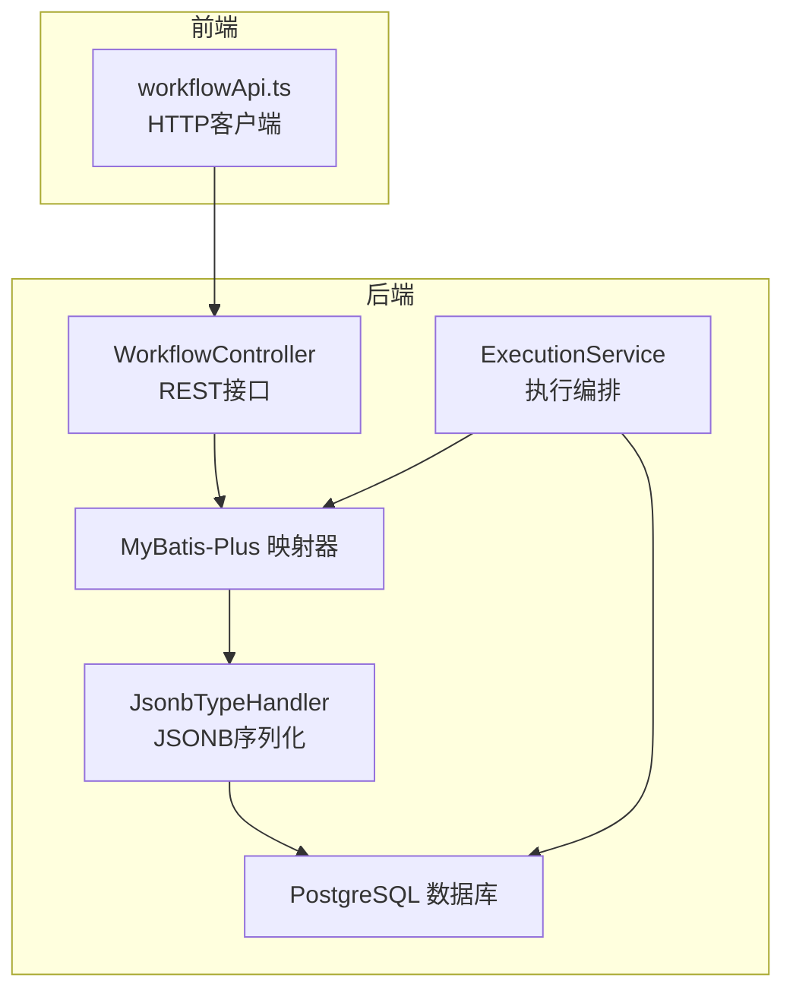
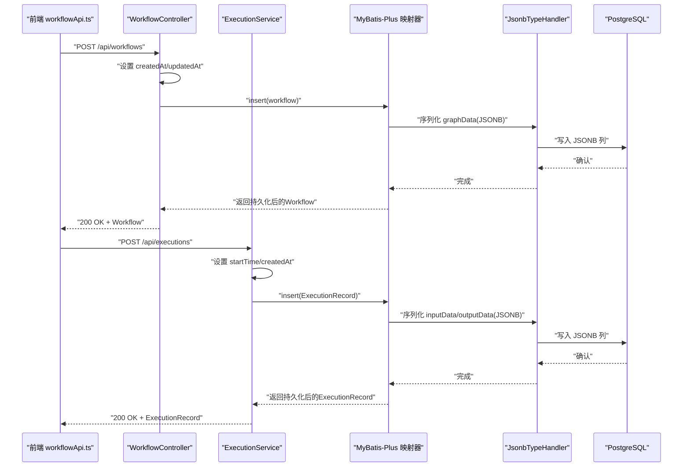
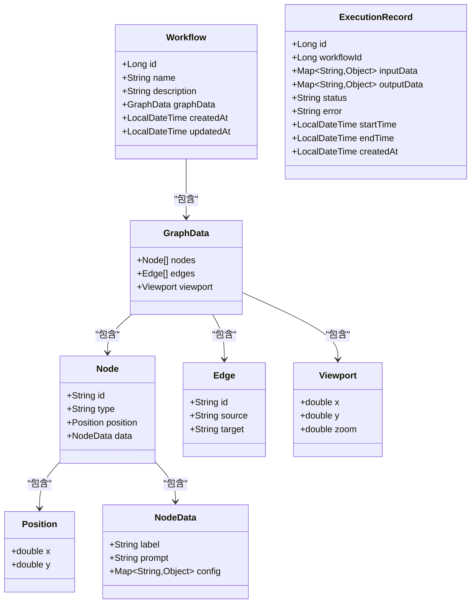
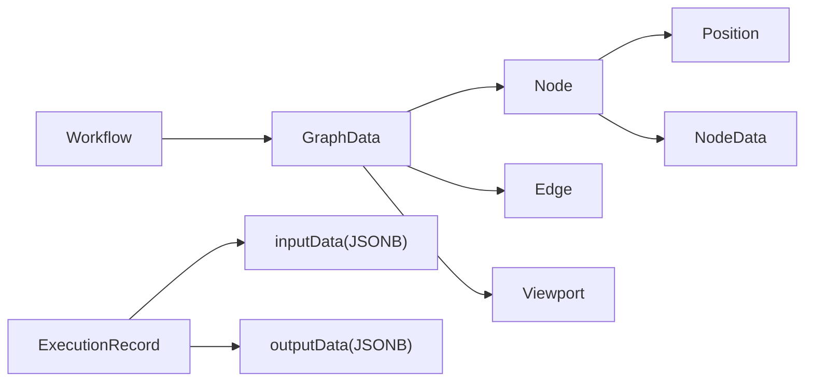

```mermaid
flowchart TD
Start(["进入 TypeHandler"]) --> Serialize{"是否为参数?"}
Serialize --> |是| ToJson["ObjectMapper.writeValueAsString(...)"]
ToJson --> SetPG["设置 PGobject(JSONB)"]
SetPG --> Done(["返回 PreparedStatement"])
Serialize --> |否| NullReturn["返回 null"]
Done --> End(["结束"])
NullReturn --> End
```

# 字段定义规范

<cite>
**本文引用的文件**
- [GraphData.java](file://backend/src/main/java/com/bokagent/entity/GraphData.java)
- [Position.java](file://backend/src/main/java/com/bokagent/entity/Position.java)
- [Viewport.java](file://backend/src/main/java/com/bokagent/entity/Viewport.java)
- [NodeData.java](file://backend/src/main/java/com/bokagent/entity/NodeData.java)
- [Node.java](file://backend/src/main/java/com/bokagent/entity/Node.java)
- [Edge.java](file://backend/src/main/java/com/bokagent/entity/Edge.java)
- [Workflow.java](file://backend/src/main/java/com/bokagent/entity/Workflow.java)
- [ExecutionRecord.java](file://backend/src/main/java/com/bokagent/entity/ExecutionRecord.java)
- [JsonbTypeHandler.java](file://backend/src/main/java/com/bokagent/handler/JsonbTypeHandler.java)
- [V1__create_workflow_tables.sql](file://backend/src/main/resources/db/migration/V1__create_workflow_tables.sql)
- [V2__create_execution_records.sql](file://backend/src/main/resources/db/migration/V2__create_execution_records.sql)
- [application.yml](file://backend/src/main/resources/application.yml)
- [WorkflowController.java](file://backend/src/main/java/com/bokagent/controller/WorkflowController.java)
- [ExecutionService.java](file://backend/src/main/java/com/bokagent/service/ExecutionService.java)
- [workflowApi.ts](file://frontend/src/services/workflowApi.ts)
</cite>

## 目录
1. [引言](#引言)
2. [项目结构](#项目结构)
3. [核心组件](#核心组件)
4. [架构总览](#架构总览)
5. [详细组件分析](#详细组件分析)
6. [依赖分析](#依赖分析)
7. [性能考虑](#性能考虑)
8. [故障排查指南](#故障排查指南)
9. [结论](#结论)
10. [附录](#附录)

## 引言
本规范旨在为BokAgent系统提供统一的字段定义标准与最佳实践，覆盖以下方面：
- 实体类字段的命名规范、数据类型、长度限制、默认值设置
- 复合数据类型（graphData、position、viewport等）的序列化与反序列化策略
- 时间戳字段的时区处理与精度要求
- 字符串字段的编码格式与字符集设置
- 字段验证规则与业务约束的实现方式
- 字段演进与版本兼容性设计原则
- 面向开发者的统一标准与落地建议

## 项目结构
后端采用Spring Boot + MyBatis-Plus + PostgreSQL架构；前端通过REST API交互。数据库迁移脚本定义了表结构与字段约束；Java实体类承载领域模型；MyBatis TypeHandler负责JSONB字段的序列化与反序列化；Jackson配置控制日期与未知属性行为。

**图表来源**
- [WorkflowController.java:1-92](file://backend/src/main/java/com/bokagent/controller/WorkflowController.java#L1-L92)
- [ExecutionService.java:1-113](file://backend/src/main/java/com/bokagent/service/ExecutionService.java#L1-L113)
- [JsonbTypeHandler.java:1-65](file://backend/src/main/java/com/bokagent/handler/JsonbTypeHandler.java#L1-L65)
- [V1__create_workflow_tables.sql:1-17](file://backend/src/main/resources/db/migration/V1__create_workflow_tables.sql#L1-L17)
- [V2__create_execution_records.sql:1-19](file://backend/src/main/resources/db/migration/V2__create_execution_records.sql#L1-L19)
- [workflowApi.ts:1-44](file://frontend/src/services/workflowApi.ts#L1-L44)

**章节来源**
- [application.yml:1-190](file://backend/src/main/resources/application.yml#L1-L190)
- [V1__create_workflow_tables.sql:1-17](file://backend/src/main/resources/db/migration/V1__create_workflow_tables.sql#L1-L17)
- [V2__create_execution_records.sql:1-19](file://backend/src/main/resources/db/migration/V2__create_execution_records.sql#L1-L19)

## 核心组件
本节从“字段定义”视角梳理各实体的关键字段，并结合数据库脚本与类型处理器说明其约束与行为。

- Workflow（工作流）
  - 字段：id（主键）、name（非空，长度上限见表定义）、description（文本）、graphData（JSONB，必填）、createdAt/updatedAt（时间戳，默认NOW）
  - 关键点：graphData通过JsonbTypeHandler映射到JSONB列；createdAt/updatedAt由应用层设置
- ExecutionRecord（执行记录）
  - 字段：id（主键）、workflowId（外键）、inputData/outputData（JSONB，可空）、status（枚举字符串）、error（文本）、startTime/endTime（时间戳）、createdAt（时间戳）
  - 关键点：inputData/outputData通过JsonbTypeHandler映射；status取值在业务层约定；时间戳由应用层设置
- Node/Edge（工作流图元素）
  - Node：id、type（start/llm/end）、position（复合）、data（复合，含label/prompt/config）
  - Edge：id、source、target
- 复合类型
  - Position：x/y（双精度）
  - Viewport：x/y/zoom（双精度）
  - GraphData：nodes/edges/viewport（集合与对象）

**章节来源**
- [Workflow.java:1-32](file://backend/src/main/java/com/bokagent/entity/Workflow.java#L1-L32)
- [ExecutionRecord.java:1-40](file://backend/src/main/java/com/bokagent/entity/ExecutionRecord.java#L1-L40)
- [Node.java:1-15](file://backend/src/main/java/com/bokagent/entity/Node.java#L1-L15)
- [Edge.java:1-14](file://backend/src/main/java/com/bokagent/entity/Edge.java#L1-L14)
- [Position.java:1-13](file://backend/src/main/java/com/bokagent/entity/Position.java#L1-L13)
- [Viewport.java:1-15](file://backend/src/main/java/com/bokagent/entity/Viewport.java#L1-L15)
- [GraphData.java:1-15](file://backend/src/main/java/com/bokagent/entity/GraphData.java#L1-L15)
- [NodeData.java:1-15](file://backend/src/main/java/com/bokagent/entity/NodeData.java#L1-L15)
- [V1__create_workflow_tables.sql:1-17](file://backend/src/main/resources/db/migration/V1__create_workflow_tables.sql#L1-L17)
- [V2__create_execution_records.sql:1-19](file://backend/src/main/resources/db/migration/V2__create_execution_records.sql#L1-L19)
- [JsonbTypeHandler.java:1-65](file://backend/src/main/java/com/bokagent/handler/JsonbTypeHandler.java#L1-L65)

## 架构总览
下图展示字段在系统中的流转路径：前端发送JSON → 后端接收并校验 → 应用层设置时间戳 → MyBatis-Plus通过TypeHandler写入PostgreSQL JSONB列。

**图表来源**
- [workflowApi.ts:1-44](file://frontend/src/services/workflowApi.ts#L1-L44)
- [WorkflowController.java:1-92](file://backend/src/main/java/com/bokagent/controller/WorkflowController.java#L1-L92)
- [ExecutionService.java:1-113](file://backend/src/main/java/com/bokagent/service/ExecutionService.java#L1-L113)
- [JsonbTypeHandler.java:1-65](file://backend/src/main/java/com/bokagent/handler/JsonbTypeHandler.java#L1-L65)
- [V1__create_workflow_tables.sql:1-17](file://backend/src/main/resources/db/migration/V1__create_workflow_tables.sql#L1-L17)
- [V2__create_execution_records.sql:1-19](file://backend/src/main/resources/db/migration/V2__create_execution_records.sql#L1-L19)

## 详细组件分析

### 字段命名规范
- Java实体类字段采用驼峰命名，与数据库列名通过MyBatis-Plus自动映射（下划转驼峰）
- 建议保持一致性：前端字段名与后端实体字段名一致或遵循统一的映射规则
- 复合类型字段（如position、viewport、graphData）应保持语义清晰且不可为空（由业务层保证）

**章节来源**
- [Workflow.java:1-32](file://backend/src/main/java/com/bokagent/entity/Workflow.java#L1-L32)
- [ExecutionRecord.java:1-40](file://backend/src/main/java/com/bokagent/entity/ExecutionRecord.java#L1-L40)
- [Node.java:1-15](file://backend/src/main/java/com/bokagent/entity/Node.java#L1-L15)
- [Edge.java:1-14](file://backend/src/main/java/com/bokagent/entity/Edge.java#L1-L14)
- [Position.java:1-13](file://backend/src/main/java/com/bokagent/entity/Position.java#L1-L13)
- [Viewport.java:1-15](file://backend/src/main/java/com/bokagent/entity/Viewport.java#L1-L15)
- [GraphData.java:1-15](file://backend/src/main/java/com/bokagent/entity/GraphData.java#L1-L15)
- [NodeData.java:1-15](file://backend/src/main/java/com/bokagent/entity/NodeData.java#L1-L15)

### 数据类型与长度限制
- 字符串类型
  - name：VARCHAR(255)，非空
  - description：TEXT，支持中文与Emoji
  - status：VARCHAR(20)，枚举值：RUNNING/SUCCESS/FAILED
  - 错误信息：TEXT，支持中文描述
- 数值类型
  - id：BIGSERIAL（自增主键）
  - duration_ms：BIGINT（毫秒）
- 时间戳类型
  - created_at/updated_at/started_at/completed_at：TIMESTAMP（默认NOW）
- JSONB类型
  - graph_data（Workflow.graphData）、input_data、output_data（ExecutionRecord）均为JSONB

**章节来源**
- [V1__create_workflow_tables.sql:1-17](file://backend/src/main/resources/db/migration/V1__create_workflow_tables.sql#L1-L17)
- [V2__create_execution_records.sql:1-19](file://backend/src/main/resources/db/migration/V2__create_execution_records.sql#L1-L19)

### 默认值设置
- created_at/updated_at：默认使用数据库函数NOW()
- status：需由应用层显式设置（RUNNING/FAILED/SUCCESS）
- startTime/endTime/createdAt：由应用层在创建或更新时设置

**章节来源**
- [V1__create_workflow_tables.sql:7-8](file://backend/src/main/resources/db/migration/V1__create_workflow_tables.sql#L7-L8)
- [V2__create_execution_records.sql:9-11](file://backend/src/main/resources/db/migration/V2__create_execution_records.sql#L9-L11)
- [WorkflowController.java:54-56](file://backend/src/main/java/com/bokagent/controller/WorkflowController.java#L54-L56)
- [ExecutionService.java:49-56](file://backend/src/main/java/com/bokagent/service/ExecutionService.java#L49-L56)

### 复合数据类型：graphData、position、viewport 的序列化与反序列化
- graphData（Workflow.graphData）与inputData/outputData（ExecutionRecord）均通过JsonbTypeHandler进行序列化/反序列化
- JsonbTypeHandler使用Jackson ObjectMapper将对象转换为JSON字符串，再写入PostgreSQL JSONB列；读取时解析回对应Java类型
- 该机制确保复杂对象（如GraphData、Node、Edge及其嵌套结构）可直接持久化，无需手动拼装

**图表来源**
- [Workflow.java:1-32](file://backend/src/main/java/com/bokagent/entity/Workflow.java#L1-L32)
- [ExecutionRecord.java:1-40](file://backend/src/main/java/com/bokagent/entity/ExecutionRecord.java#L1-L40)
- [GraphData.java:1-15](file://backend/src/main/java/com/bokagent/entity/GraphData.java#L1-L15)
- [Node.java:1-15](file://backend/src/main/java/com/bokagent/entity/Node.java#L1-L15)
- [Edge.java:1-14](file://backend/src/main/java/com/bokagent/entity/Edge.java#L1-L14)
- [Position.java:1-13](file://backend/src/main/java/com/bokagent/entity/Position.java#L1-L13)
- [Viewport.java:1-15](file://backend/src/main/java/com/bokagent/entity/Viewport.java#L1-L15)
- [NodeData.java:1-15](file://backend/src/main/java/com/bokagent/entity/NodeData.java#L1-L15)

**图表来源**
- [JsonbTypeHandler.java:26-36](file://backend/src/main/java/com/bokagent/handler/JsonbTypeHandler.java#L26-L36)
- [JsonbTypeHandler.java:54-63](file://backend/src/main/java/com/bokagent/handler/JsonbTypeHandler.java#L54-L63)

**章节来源**
- [JsonbTypeHandler.java:1-65](file://backend/src/main/java/com/bokagent/handler/JsonbTypeHandler.java#L1-L65)
- [Workflow.java:25](file://backend/src/main/java/com/bokagent/entity/Workflow.java#L25)
- [ExecutionRecord.java:24](file://backend/src/main/java/com/bokagent/entity/ExecutionRecord.java#L24)
- [ExecutionRecord.java:27](file://backend/src/main/java/com/bokagent/entity/ExecutionRecord.java#L27)

### 时间戳字段的时区处理与精度要求
- 数据库存储：TIMESTAMP（无时区），不带时区偏移
- 应用层：使用java.time.LocalDateTime（无时区），在入库前由应用设置当前时间
- 建议
  - 统一使用系统默认时区或UTC，避免跨时区差异导致的显示问题
  - 如需跨时区展示，应在前端或API层进行本地化转换
  - 对于需要精确到毫秒的场景（如duration_ms），可在应用层计算并落库

**章节来源**
- [V1__create_workflow_tables.sql:7-8](file://backend/src/main/resources/db/migration/V1__create_workflow_tables.sql#L7-L8)
- [V2__create_execution_records.sql:9-11](file://backend/src/main/resources/db/migration/V2__create_execution_records.sql#L9-L11)
- [WorkflowController.java:54-56](file://backend/src/main/java/com/bokagent/controller/WorkflowController.java#L54-L56)
- [ExecutionService.java:52-56](file://backend/src/main/java/com/bokagent/service/ExecutionService.java#L52-L56)

### 字符串字段的编码格式与字符集设置
- 数据库：PostgreSQL默认UTF-8，支持中文与Emoji
- 应用层：Spring MVC与Jackson配置为UTF-8，确保前后端传输无乱码
- 建议
  - 表与列注释使用UTF-8字符（如脚本中对description与注释的说明）
  - 前端与后端统一UTF-8编码，避免字符集不一致导致的问题

**章节来源**
- [V1__create_workflow_tables.sql:1-17](file://backend/src/main/resources/db/migration/V1__create_workflow_tables.sql#L1-L17)
- [application.yml:4-7](file://backend/src/main/resources/application.yml#L4-L7)
- [application.yml:69-79](file://backend/src/main/resources/application.yml#L69-L79)

### 字段验证规则与业务约束
- 必填约束
  - Workflow：name、graphData（JSONB）
  - ExecutionRecord：status（运行态需显式设置）
- 枚举约束
  - ExecutionRecord.status：RUNNING/SUCCESS/FAILED
- 外键约束
  - ExecutionRecord.workflow_id → workflows.id
- 前端约束
  - 前端API调用未做字段级校验，建议在前端增加基础校验（如必填字段非空、状态枚举合法）
- 后端约束
  - 控制器与服务层设置createdAt/updatedAt、startTime/endTime等时间戳
  - JsonbTypeHandler对空值安全处理（null返回）

**章节来源**
- [V1__create_workflow_tables.sql:4-6](file://backend/src/main/resources/db/migration/V1__create_workflow_tables.sql#L4-L6)
- [V2__create_execution_records.sql:3-4](file://backend/src/main/resources/db/migration/V2__create_execution_records.sql#L3-L4)
- [WorkflowController.java:54-56](file://backend/src/main/java/com/bokagent/controller/WorkflowController.java#L54-L56)
- [ExecutionService.java:52-56](file://backend/src/main/java/com/bokagent/service/ExecutionService.java#L52-L56)
- [JsonbTypeHandler.java:55-57](file://backend/src/main/java/com/bokagent/handler/JsonbTypeHandler.java#L55-L57)

### 字段演进与版本兼容性设计原则
- 数据库演进
  - 使用Flyway管理迁移脚本，新增字段建议添加NOT NULL与默认值时明确兼容策略
  - JSONB字段天然具备弱模式特性，便于后续扩展（新增键值不影响现有结构）
- 应用层演进
  - 新增字段优先保留向后兼容（如Jackson配置为忽略未知属性）
  - 复合类型变更通过TypeHandler解析时注意容错（空值与缺省键处理）
- 版本兼容
  - 前后端字段名保持一致或通过统一映射规则，避免因字段名差异导致的兼容问题
  - 对于枚举字段，建议在服务层集中定义与校验，避免分散硬编码

**章节来源**
- [application.yml:26-31](file://backend/src/main/resources/application.yml#L26-L31)
- [V1__create_workflow_tables.sql:1-17](file://backend/src/main/resources/db/migration/V1__create_workflow_tables.sql#L1-L17)
- [V2__create_execution_records.sql:1-19](file://backend/src/main/resources/db/migration/V2__create_execution_records.sql#L1-L19)
- [JsonbTypeHandler.java:58-62](file://backend/src/main/java/com/bokagent/handler/JsonbTypeHandler.java#L58-L62)

## 依赖分析
- 实体类依赖
  - Workflow依赖GraphData、Position、Viewport、Node、Edge（通过GraphData聚合）
  - ExecutionRecord依赖Map<String,Object>（用于inputData/outputData）
- 类型映射依赖
  - JsonbTypeHandler依赖Jackson ObjectMapper与PostgreSQL PGobject
- 数据库依赖
  - workflows与execution_records表通过索引优化查询（created_at、started_at、workflow_id）

**图表来源**
- [Workflow.java:1-32](file://backend/src/main/java/com/bokagent/entity/Workflow.java#L1-L32)
- [ExecutionRecord.java:1-40](file://backend/src/main/java/com/bokagent/entity/ExecutionRecord.java#L1-L40)
- [GraphData.java:1-15](file://backend/src/main/java/com/bokagent/entity/GraphData.java#L1-L15)
- [Node.java:1-15](file://backend/src/main/java/com/bokagent/entity/Node.java#L1-L15)
- [Edge.java:1-14](file://backend/src/main/java/com/bokagent/entity/Edge.java#L1-L14)
- [Position.java:1-13](file://backend/src/main/java/com/bokagent/entity/Position.java#L1-L13)
- [Viewport.java:1-15](file://backend/src/main/java/com/bokagent/entity/Viewport.java#L1-L15)
- [NodeData.java:1-15](file://backend/src/main/java/com/bokagent/entity/NodeData.java#L1-L15)

**章节来源**
- [V1__create_workflow_tables.sql:16](file://backend/src/main/resources/db/migration/V1__create_workflow_tables.sql#L16)
- [V2__create_execution_records.sql:17-18](file://backend/src/main/resources/db/migration/V2__create_execution_records.sql#L17-L18)

## 性能考虑
- JSONB存储
  - 适合频繁读取但结构变化的场景；对于固定结构建议考虑关系表化以提升查询效率
- 索引
  - 在created_at、started_at、workflow_id上建立索引，有助于排序与过滤
- 时间戳
  - 使用LocalDateTime减少时区转换开销；如需高精度时间，可考虑纳秒级存储（当前脚本未强制）

**章节来源**
- [V1__create_workflow_tables.sql:16](file://backend/src/main/resources/db/migration/V1__create_workflow_tables.sql#L16)
- [V2__create_execution_records.sql:17-18](file://backend/src/main/resources/db/migration/V2__create_execution_records.sql#L17-L18)

## 故障排查指南
- JSONB解析失败
  - 现象：读取JSONB字段时报错
  - 排查：检查JsonbTypeHandler的类型映射与对象结构是否匹配；确认字段非空且格式正确
- 时间戳显示异常
  - 现象：时间显示与预期不符
  - 排查：确认应用层使用的是无时区的LocalDateTime；前端展示时进行本地化转换
- 字符串乱码
  - 现象：中文或Emoji显示异常
  - 排查：确认前后端编码均为UTF-8；数据库字符集为UTF-8
- 外键约束错误
  - 现象：插入ExecutionRecord失败
  - 排查：确认workflowId指向的Workflow存在；检查外键索引是否生效

**章节来源**
- [JsonbTypeHandler.java:58-62](file://backend/src/main/java/com/bokagent/handler/JsonbTypeHandler.java#L58-L62)
- [application.yml:4-7](file://backend/src/main/resources/application.yml#L4-L7)
- [V2__create_execution_records.sql:3](file://backend/src/main/resources/db/migration/V2__create_execution_records.sql#L3)

## 结论
本规范基于现有代码与数据库脚本，总结了BokAgent系统字段定义的命名、类型、长度、默认值、序列化/反序列化、时间戳与时区、字符串编码、验证与业务约束、演进与兼容性等方面的要求。建议在后续迭代中：
- 明确前端字段校验与后端字段校验边界
- 对于高频查询字段评估是否从JSONB迁移到关系表
- 统一时间戳处理策略并在API层输出标准化格式
- 保持数据库迁移脚本与实体类的同步演进

## 附录
- 前后端交互示例（字段映射参考）
  - 前端通过workflowApi.ts调用后端REST接口，传递Workflow与ExecutionRecord对象
  - 后端控制器与服务层负责设置时间戳与状态，TypeHandler负责JSONB序列化

**章节来源**
- [workflowApi.ts:1-44](file://frontend/src/services/workflowApi.ts#L1-L44)
- [WorkflowController.java:1-92](file://backend/src/main/java/com/bokagent/controller/WorkflowController.java#L1-L92)
- [ExecutionService.java:1-113](file://backend/src/main/java/com/bokagent/service/ExecutionService.java#L1-L113)