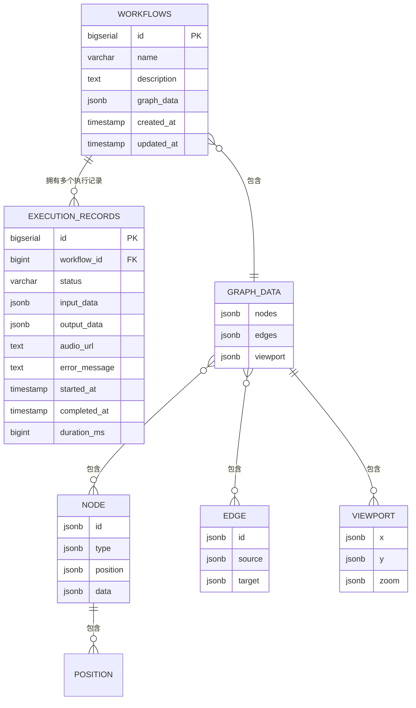
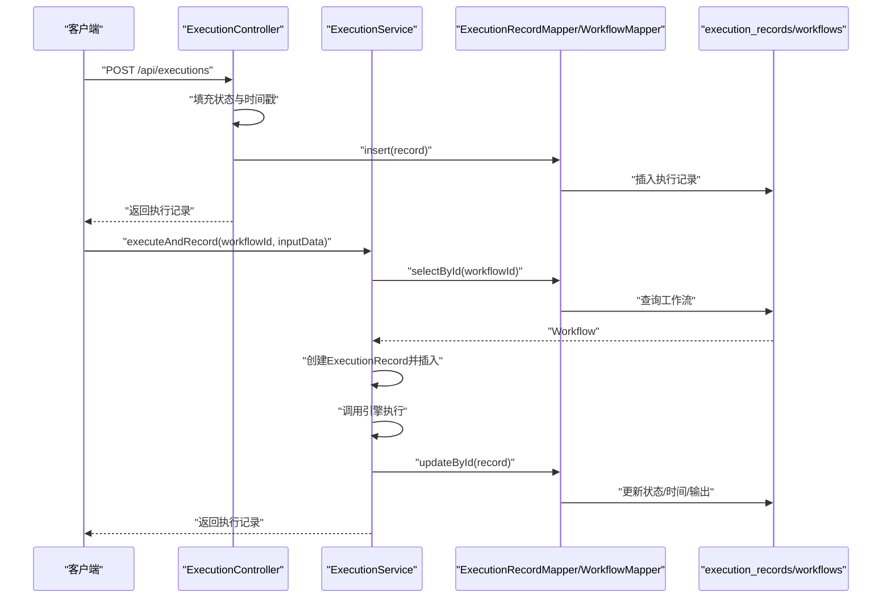
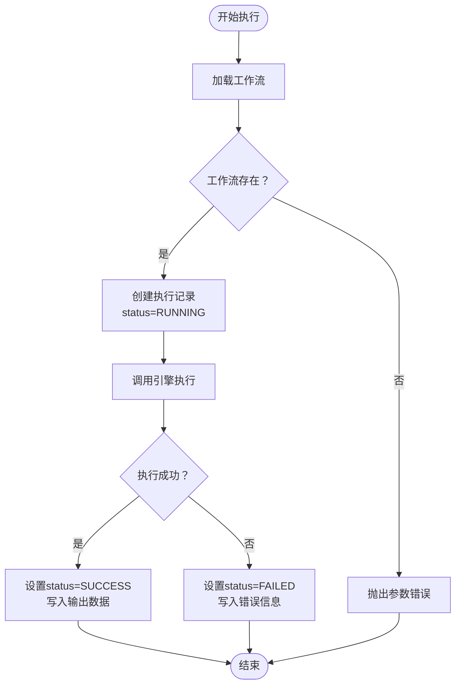
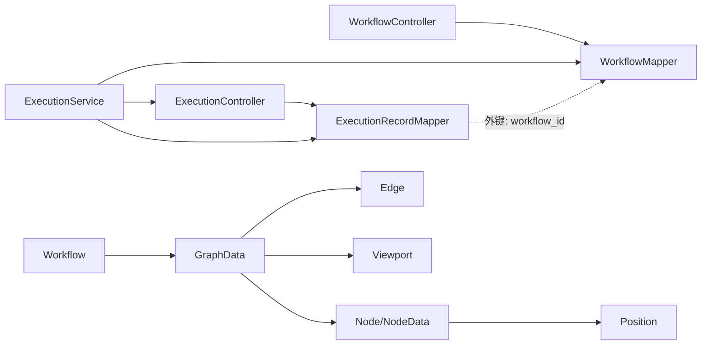

# 实体关系设计

<cite>
**本文引用的文件**
- [Workflow.java](file://backend/src/main/java/com/bokagent/entity/Workflow.java)
- [ExecutionRecord.java](file://backend/src/main/java/com/bokagent/entity/ExecutionRecord.java)
- [Node.java](file://backend/src/main/java/com/bokagent/entity/Node.java)
- [Edge.java](file://backend/src/main/java/com/bokagent/entity/Edge.java)
- [GraphData.java](file://backend/src/main/java/com/bokagent/entity/GraphData.java)
- [NodeData.java](file://backend/src/main/java/com/bokagent/entity/NodeData.java)
- [Position.java](file://backend/src/main/java/com/bokagent/entity/Position.java)
- [Viewport.java](file://backend/src/main/java/com/bokagent/entity/Viewport.java)
- [JsonbTypeHandler.java](file://backend/src/main/java/com/bokagent/handler/JsonbTypeHandler.java)
- [WorkflowMapper.java](file://backend/src/main/java/com/bokagent/mapper/WorkflowMapper.java)
- [ExecutionRecordMapper.java](file://backend/src/main/java/com/bokagent/mapper/ExecutionRecordMapper.java)
- [ExecutionService.java](file://backend/src/main/java/com/bokagent/service/ExecutionService.java)
- [ExecutionController.java](file://backend/src/main/java/com/bokagent/controller/ExecutionController.java)
- [WorkflowController.java](file://backend/src/main/java/com/bokagent/controller/WorkflowController.java)
- [V1__create_workflow_tables.sql](file://backend/src/main/resources/db/migration/V1__create_workflow_tables.sql)
- [V2__create_execution_records.sql](file://backend/src/main/resources/db/migration/V2__create_execution_records.sql)
</cite>

## 目录
1. [简介](#简介)
2. [项目结构](#项目结构)
3. [核心组件](#核心组件)
4. [架构总览](#架构总览)
5. [详细组件分析](#详细组件分析)
6. [依赖分析](#依赖分析)
7. [性能考虑](#性能考虑)
8. [故障排查指南](#故障排查指南)
9. [结论](#结论)
10. [附录](#附录)

## 简介
本文件面向数据库与后端开发，系统性梳理BokAgent中工作流相关实体的关系设计，重点覆盖以下内容：
- Workflow、ExecutionRecord、Node、Edge等核心实体之间的关系映射（一对一、一对多、多对多）及其实现方式
- 外键约束与关联查询设计
- GraphData作为复合数据结构的嵌套关系处理与JSONB序列化机制
- 完整的实体关系图（ER Diagram），展示依赖关系与数据流向
- 级联操作与数据一致性保障机制
- 实体生命周期管理与关系维护的最佳实践

## 项目结构
后端采用分层架构：控制层（Controller）、服务层（Service）、持久层（Mapper）与实体层（Entity）。数据库迁移脚本定义了核心表结构与索引。

```mermaid
graph TB
subgraph "控制层"
WC["WorkflowController"]
EC["ExecutionController"]
end
subgraph "服务层"
ES["ExecutionService"]
end
subgraph "持久层"
WM["WorkflowMapper"]
EM["ExecutionRecordMapper"]
end
subgraph "实体层"
WF["Workflow"]
ER["ExecutionRecord"]
GD["GraphData"]
ND["Node/NodeData"]
EDG["Edge"]
POS["Position"]
VP["Viewport"]
end
subgraph "数据库"
T1["表: workflows"]
T2["表: execution_records"]
end
WC --> WM
EC --> EM
ES --> WM
ES --> EM
ES --> EC
WF --> GD
GD --> ND
GD --> EDG
ND --> POS
GD --> VP
WM --> T1
EM --> T2
T2 -. 外键: workflow_id -> workflows.id .-> T1
```

图表来源
- [WorkflowController.java:1-92](file://backend/src/main/java/com/bokagent/controller/WorkflowController.java#L1-92)
- [ExecutionController.java:1-81](file://backend/src/main/java/com/bokagent/controller/ExecutionController.java#L1-81)
- [ExecutionService.java:1-113](file://backend/src/main/java/com/bokagent/service/ExecutionService.java#L1-113)
- [WorkflowMapper.java:1-13](file://backend/src/main/java/com/bokagent/mapper/WorkflowMapper.java#L1-13)
- [ExecutionRecordMapper.java:1-13](file://backend/src/main/java/com/bokagent/mapper/ExecutionRecordMapper.java#L1-13)
- [Workflow.java:1-32](file://backend/src/main/java/com/bokagent/entity/Workflow.java#L1-32)
- [ExecutionRecord.java:1-40](file://backend/src/main/java/com/bokagent/entity/ExecutionRecord.java#L1-40)
- [GraphData.java:1-15](file://backend/src/main/java/com/bokagent/entity/GraphData.java#L1-15)
- [Node.java:1-15](file://backend/src/main/java/com/bokagent/entity/Node.java#L1-15)
- [Edge.java:1-14](file://backend/src/main/java/com/bokagent/entity/Edge.java#L1-14)
- [Position.java:1-13](file://backend/src/main/java/com/bokagent/entity/Position.java#L1-13)
- [Viewport.java:1-15](file://backend/src/main/java/com/bokagent/entity/Viewport.java#L1-15)
- [V1__create_workflow_tables.sql:1-17](file://backend/src/main/resources/db/migration/V1__create_workflow_tables.sql#L1-17)
- [V2__create_execution_records.sql:1-19](file://backend/src/main/resources/db/migration/V2__create_execution_records.sql#L1-19)

章节来源
- [WorkflowController.java:1-92](file://backend/src/main/java/com/bokagent/controller/WorkflowController.java#L1-92)
- [ExecutionController.java:1-81](file://backend/src/main/java/com/bokagent/controller/ExecutionController.java#L1-81)
- [ExecutionService.java:1-113](file://backend/src/main/java/com/bokagent/service/ExecutionService.java#L1-113)
- [WorkflowMapper.java:1-13](file://backend/src/main/java/com/bokagent/mapper/WorkflowMapper.java#L1-13)
- [ExecutionRecordMapper.java:1-13](file://backend/src/main/java/com/bokagent/mapper/ExecutionRecordMapper.java#L1-13)
- [V1__create_workflow_tables.sql:1-17](file://backend/src/main/resources/db/migration/V1__create_workflow_tables.sql#L1-17)
- [V2__create_execution_records.sql:1-19](file://backend/src/main/resources/db/migration/V2__create_execution_records.sql#L1-19)

## 核心组件
- Workflow：工作流定义，包含名称、描述与GraphData（JSONB）。
- ExecutionRecord：执行记录，包含输入输出数据（JSONB）、状态、时间戳等。
- GraphData：复合数据结构，内含Node列表、Edge列表与Viewport。
- Node/NodeData/Position：节点模型，描述节点类型、标签、提示词、配置与位置。
- Edge：连接线，描述源节点与目标节点标识。
- JsonbTypeHandler：负责Java对象与PostgreSQL JSONB字段之间的序列化/反序列化。

章节来源
- [Workflow.java:1-32](file://backend/src/main/java/com/bokagent/entity/Workflow.java#L1-32)
- [ExecutionRecord.java:1-40](file://backend/src/main/java/com/bokagent/entity/ExecutionRecord.java#L1-40)
- [GraphData.java:1-15](file://backend/src/main/java/com/bokagent/entity/GraphData.java#L1-15)
- [Node.java:1-15](file://backend/src/main/java/com/bokagent/entity/Node.java#L1-15)
- [NodeData.java:1-15](file://backend/src/main/java/com/bokagent/entity/NodeData.java#L1-15)
- [Position.java:1-13](file://backend/src/main/java/com/bokagent/entity/Position.java#L1-13)
- [Edge.java:1-14](file://backend/src/main/java/com/bokagent/entity/Edge.java#L1-14)
- [Viewport.java:1-15](file://backend/src/main/java/com/bokagent/entity/Viewport.java#L1-15)
- [JsonbTypeHandler.java:1-65](file://backend/src/main/java/com/bokagent/handler/JsonbTypeHandler.java#L1-65)

## 架构总览
下图展示实体间的关系映射与数据流向，以及数据库层面的外键约束与索引策略。



图表来源
- [V1__create_workflow_tables.sql:1-17](file://backend/src/main/resources/db/migration/V1__create_workflow_tables.sql#L1-17)
- [V2__create_execution_records.sql:1-19](file://backend/src/main/resources/db/migration/V2__create_execution_records.sql#L1-19)
- [Workflow.java:1-32](file://backend/src/main/java/com/bokagent/entity/Workflow.java#L1-32)
- [ExecutionRecord.java:1-40](file://backend/src/main/java/com/bokagent/entity/ExecutionRecord.java#L1-40)
- [GraphData.java:1-15](file://backend/src/main/java/com/bokagent/entity/GraphData.java#L1-15)
- [Node.java:1-15](file://backend/src/main/java/com/bokagent/entity/Node.java#L1-15)
- [Edge.java:1-14](file://backend/src/main/java/com/bokagent/entity/Edge.java#L1-14)
- [Position.java:1-13](file://backend/src/main/java/com/bokagent/entity/Position.java#L1-13)
- [Viewport.java:1-15](file://backend/src/main/java/com/bokagent/entity/Viewport.java#L1-15)

## 详细组件分析

### 关系映射与外键约束
- Workflow 与 ExecutionRecord：一对多。每个工作流可有多个执行记录；执行记录通过workflow_id指向工作流主键。
- Workflow.graphData：包含GraphData，后者包含Node与Edge列表。该关系在数据库层面以JSONB字段承载，不建立物理外键；业务上通过Workflow.id与执行记录关联。
- Node与Position、Node与NodeData：组合关系，均以内嵌对象形式存在于GraphData.nodes中。
- Edge与Node：组合关系，Edge.source与Edge.target为字符串标识，业务上指向对应Node.id。

章节来源
- [V2__create_execution_records.sql:1-19](file://backend/src/main/resources/db/migration/V2__create_execution_records.sql#L1-19)
- [Workflow.java:1-32](file://backend/src/main/java/com/bokagent/entity/Workflow.java#L1-32)
- [GraphData.java:1-15](file://backend/src/main/java/com/bokagent/entity/GraphData.java#L1-15)
- [Node.java:1-15](file://backend/src/main/java/com/bokagent/entity/Node.java#L1-15)
- [Edge.java:1-14](file://backend/src/main/java/com/bokagent/entity/Edge.java#L1-14)

### 复合数据结构GraphData的嵌套关系处理
- GraphData(nodes, edges, viewport)通过JsonbTypeHandler进行序列化/反序列化，确保复杂嵌套结构（如Node.position、Node.data、Viewport）在数据库中以JSONB存储。
- NodeData包含label、prompt、config等字段，Node包含type、position、data；Edge包含source、target。
- Position与Viewport均为简单值对象，便于在前端渲染与编辑器中使用。

章节来源
- [GraphData.java:1-15](file://backend/src/main/java/com/bokagent/entity/GraphData.java#L1-15)
- [Node.java:1-15](file://backend/src/main/java/com/bokagent/entity/Node.java#L1-15)
- [NodeData.java:1-15](file://backend/src/main/java/com/bokagent/entity/NodeData.java#L1-15)
- [Position.java:1-13](file://backend/src/main/java/com/bokagent/entity/Position.java#L1-13)
- [Viewport.java:1-15](file://backend/src/main/java/com/bokagent/entity/Viewport.java#L1-15)
- [JsonbTypeHandler.java:1-65](file://backend/src/main/java/com/bokagent/handler/JsonbTypeHandler.java#L1-65)

### 关联查询设计
- 执行记录查询：当前控制器与服务层未对execution_records.workflow_id添加过滤条件，存在全表扫描风险。建议在服务层封装按workflow_id的条件查询，避免泄漏与性能问题。
- 索引策略：workflows已建created_at索引；execution_records已建workflow_id与started_at索引，有利于按工作流与时间排序查询。

章节来源
- [ExecutionController.java:1-81](file://backend/src/main/java/com/bokagent/controller/ExecutionController.java#L1-81)
- [ExecutionService.java:1-113](file://backend/src/main/java/com/bokagent/service/ExecutionService.java#L1-113)
- [V2__create_execution_records.sql:17-18](file://backend/src/main/resources/db/migration/V2__create_execution_records.sql#L17-18)

### 级联操作与数据一致性
- 数据库层面：execution_records.workflow_id为外键，但未声明ON DELETE CASCADE；若删除工作流，需先清理或转移其执行记录，否则会违反外键约束。
- 应用层面：执行服务在执行前校验工作流存在，执行后根据结果更新执行记录状态与结束时间；控制器在更新状态为完成时补填结束时间。建议在删除工作流接口处增加前置检查与清理流程。

章节来源
- [V2__create_execution_records.sql:1-19](file://backend/src/main/resources/db/migration/V2__create_execution_records.sql#L1-19)
- [ExecutionService.java:1-113](file://backend/src/main/java/com/bokagent/service/ExecutionService.java#L1-113)
- [ExecutionController.java:1-81](file://backend/src/main/java/com/bokagent/controller/ExecutionController.java#L1-81)

### 实体生命周期管理与关系维护最佳实践
- 创建阶段：工作流创建时设置createdAt/updatedAt；执行记录创建时设置status=RUNNING、startTime/createdAt。
- 执行阶段：服务层统一入口，先写入执行记录，再调用引擎执行，最后根据结果更新状态、结束时间与输出数据。
- 查询阶段：按需添加过滤条件（如workflow_id），利用索引提升查询效率。
- 删除阶段：删除工作流前应清理其执行记录，或在应用层禁止删除有执行记录的工作流。

章节来源
- [WorkflowController.java:1-92](file://backend/src/main/java/com/bokagent/controller/WorkflowController.java#L1-92)
- [ExecutionController.java:1-81](file://backend/src/main/java/com/bokagent/controller/ExecutionController.java#L1-81)
- [ExecutionService.java:1-113](file://backend/src/main/java/com/bokagent/service/ExecutionService.java#L1-113)

### 执行流程时序图


图表来源
- [ExecutionController.java:1-81](file://backend/src/main/java/com/bokagent/controller/ExecutionController.java#L1-81)
- [ExecutionService.java:1-113](file://backend/src/main/java/com/bokagent/service/ExecutionService.java#L1-113)
- [ExecutionRecordMapper.java:1-13](file://backend/src/main/java/com/bokagent/mapper/ExecutionRecordMapper.java#L1-13)
- [WorkflowMapper.java:1-13](file://backend/src/main/java/com/bokagent/mapper/WorkflowMapper.java#L1-13)

### 复杂逻辑流程图（执行记录状态机）


图表来源
- [ExecutionService.java:1-113](file://backend/src/main/java/com/bokagent/service/ExecutionService.java#L1-113)

## 依赖分析
- 控制层依赖Mapper；服务层同时依赖Mapper与控制器（用于返回结果）；实体层之间通过组合关系表达嵌套结构。
- 数据库层通过外键约束保证执行记录与工作流的引用完整性；索引提升查询效率。
- JSONB序列化由JsonbTypeHandler统一处理，避免重复代码与序列化错误。



图表来源
- [WorkflowController.java:1-92](file://backend/src/main/java/com/bokagent/controller/WorkflowController.java#L1-92)
- [ExecutionController.java:1-81](file://backend/src/main/java/com/bokagent/controller/ExecutionController.java#L1-81)
- [ExecutionService.java:1-113](file://backend/src/main/java/com/bokagent/service/ExecutionService.java#L1-113)
- [WorkflowMapper.java:1-13](file://backend/src/main/java/com/bokagent/mapper/WorkflowMapper.java#L1-13)
- [ExecutionRecordMapper.java:1-13](file://backend/src/main/java/com/bokagent/mapper/ExecutionRecordMapper.java#L1-13)
- [Workflow.java:1-32](file://backend/src/main/java/com/bokagent/entity/Workflow.java#L1-32)
- [GraphData.java:1-15](file://backend/src/main/java/com/bokagent/entity/GraphData.java#L1-15)
- [Node.java:1-15](file://backend/src/main/java/com/bokagent/entity/Node.java#L1-15)
- [Edge.java:1-14](file://backend/src/main/java/com/bokagent/entity/Edge.java#L1-14)
- [Position.java:1-13](file://backend/src/main/java/com/bokagent/entity/Position.java#L1-13)
- [Viewport.java:1-15](file://backend/src/main/java/com/bokagent/entity/Viewport.java#L1-15)

## 性能考虑
- 索引优化：execution_records表已建立workflow_id与started_at索引，建议在高频查询场景中结合LIMIT与分页。
- JSONB查询：GraphData与执行记录的input_data/output_data为JSONB，避免在WHERE子句中频繁解析；可在应用层预处理或使用GIN索引（视具体查询模式而定）。
- 批量操作：批量创建执行记录时，优先使用批处理接口减少往返开销。
- 缓存策略：对热点工作流元数据可引入缓存，降低数据库压力。

## 故障排查指南
- 执行记录查询为空：确认是否正确传入workflowId并在服务层添加过滤条件。
- JSONB解析异常：检查JsonbTypeHandler的序列化/反序列化逻辑与字段类型映射。
- 外键约束失败：删除工作流前清理其执行记录，或在应用层禁止删除有依赖的数据。
- 状态更新不一致：确保在状态置为完成时补填结束时间，并在异常分支同样更新结束时间与错误信息。

章节来源
- [ExecutionService.java:1-113](file://backend/src/main/java/com/bokagent/service/ExecutionService.java#L1-113)
- [ExecutionController.java:1-81](file://backend/src/main/java/com/bokagent/controller/ExecutionController.java#L1-81)
- [JsonbTypeHandler.java:1-65](file://backend/src/main/java/com/bokagent/handler/JsonbTypeHandler.java#L1-65)
- [V2__create_execution_records.sql:1-19](file://backend/src/main/resources/db/migration/V2__create_execution_records.sql#L1-19)

## 结论
本设计以JSONB承载复杂的图结构数据，配合外键约束与索引，实现了工作流定义与执行记录的清晰分离。建议在后续迭代中完善查询过滤、外键级联策略与状态机一致性保障，以进一步提升系统的可维护性与稳定性。

## 附录
- 数据库迁移脚本路径
  - [V1__create_workflow_tables.sql:1-17](file://backend/src/main/resources/db/migration/V1__create_workflow_tables.sql#L1-17)
  - [V2__create_execution_records.sql:1-19](file://backend/src/main/resources/db/migration/V2__create_execution_records.sql#L1-19)
- 实体类路径
  - [Workflow.java:1-32](file://backend/src/main/java/com/bokagent/entity/Workflow.java#L1-32)
  - [ExecutionRecord.java:1-40](file://backend/src/main/java/com/bokagent/entity/ExecutionRecord.java#L1-40)
  - [GraphData.java:1-15](file://backend/src/main/java/com/bokagent/entity/GraphData.java#L1-15)
  - [Node.java:1-15](file://backend/src/main/java/com/bokagent/entity/Node.java#L1-15)
  - [Edge.java:1-14](file://backend/src/main/java/com/bokagent/entity/Edge.java#L1-14)
  - [NodeData.java:1-15](file://backend/src/main/java/com/bokagent/entity/NodeData.java#L1-15)
  - [Position.java:1-13](file://backend/src/main/java/com/bokagent/entity/Position.java#L1-13)
  - [Viewport.java:1-15](file://backend/src/main/java/com/bokagent/entity/Viewport.java#L1-15)
- 类型处理器与映射器
  - [JsonbTypeHandler.java:1-65](file://backend/src/main/java/com/bokagent/handler/JsonbTypeHandler.java#L1-65)
  - [WorkflowMapper.java:1-13](file://backend/src/main/java/com/bokagent/mapper/WorkflowMapper.java#L1-13)
  - [ExecutionRecordMapper.java:1-13](file://backend/src/main/java/com/bokagent/mapper/ExecutionRecordMapper.java#L1-13)
- 控制器与服务
  - [WorkflowController.java:1-92](file://backend/src/main/java/com/bokagent/controller/WorkflowController.java#L1-92)
  - [ExecutionController.java:1-81](file://backend/src/main/java/com/bokagent/controller/ExecutionController.java#L1-81)
  - [ExecutionService.java:1-113](file://backend/src/main/java/com/bokagent/service/ExecutionService.java#L1-113)