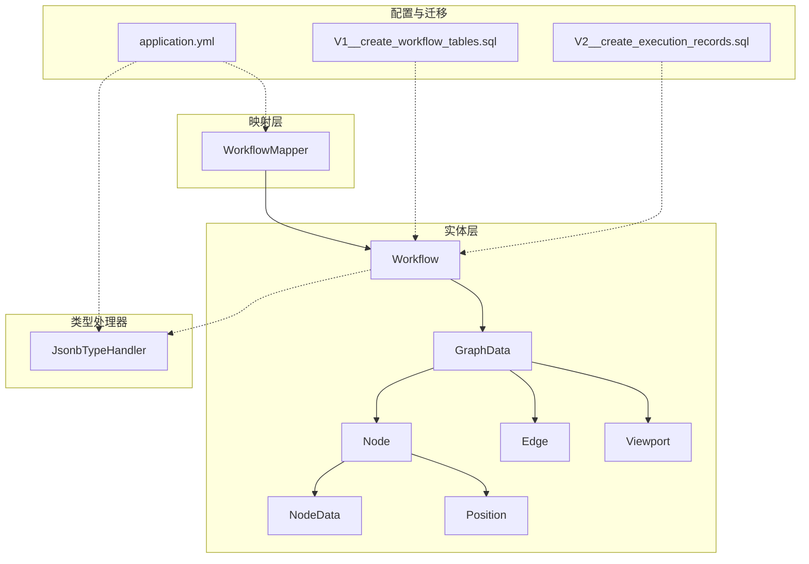
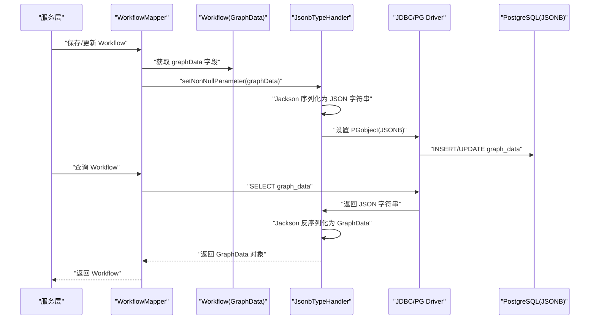
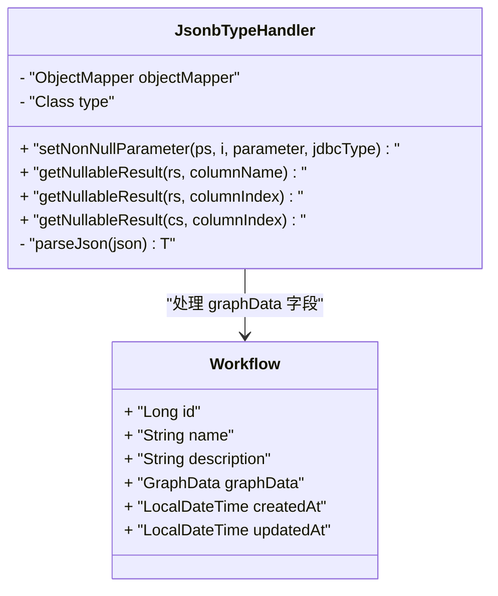
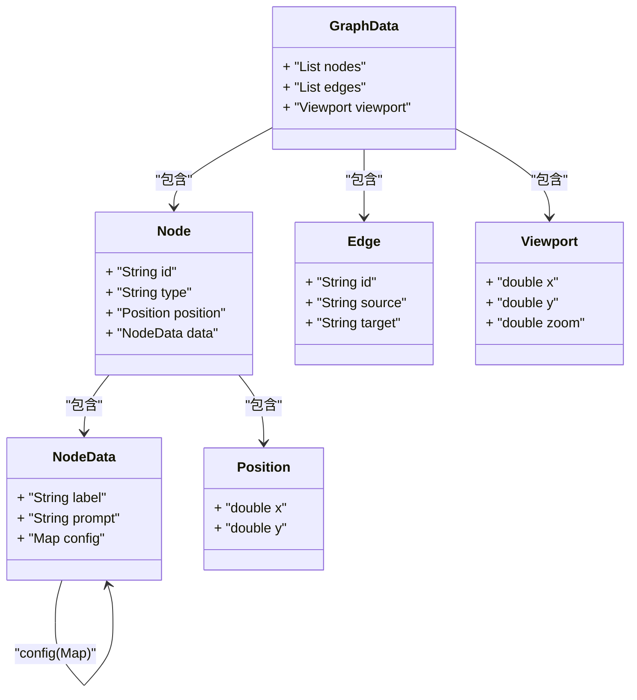
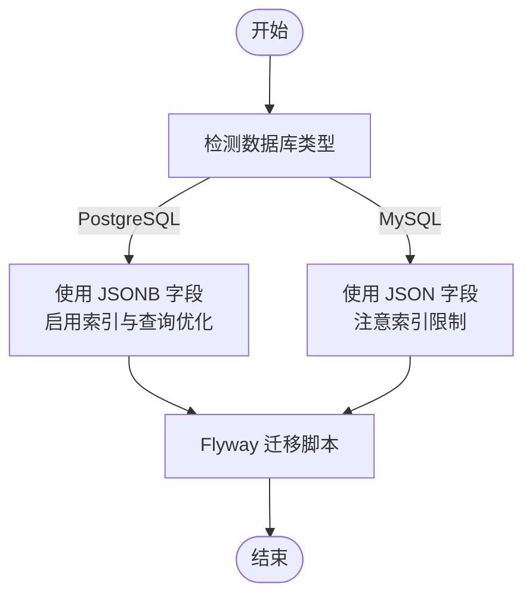
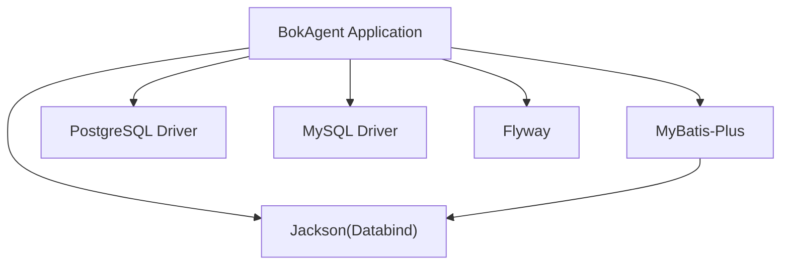

# 数据序列化机制

<cite>
**本文引用的文件**
- [JsonbTypeHandler.java](file://backend/src/main/java/com/bokagent/handler/JsonbTypeHandler.java)
- [GraphData.java](file://backend/src/main/java/com/bokagent/entity/GraphData.java)
- [NodeData.java](file://backend/src/main/java/com/bokagent/entity/NodeData.java)
- [Node.java](file://backend/src/main/java/com/bokagent/entity/Node.java)
- [Edge.java](file://backend/src/main/java/com/bokagent/entity/Edge.java)
- [Position.java](file://backend/src/main/java/com/bokagent/entity/Position.java)
- [Viewport.java](file://backend/src/main/java/com/bokagent/entity/Viewport.java)
- [Workflow.java](file://backend/src/main/java/com/bokagent/entity/Workflow.java)
- [WorkflowMapper.java](file://backend/src/main/java/com/bokagent/mapper/WorkflowMapper.java)
- [application.yml](file://backend/src/main/resources/application.yml)
- [V1__create_workflow_tables.sql](file://backend/src/main/resources/db/migration/V1__create_workflow_tables.sql)
- [V2__create_execution_records.sql](file://backend/src/main/resources/db/migration/V2__create_execution_records.sql)
- [pom.xml](file://backend/pom.xml)
- [GlobalExceptionHandler.java](file://backend/src/main/java/com/bokagent/common/GlobalExceptionHandler.java)
- [init-mysql.sql](file://docker/init-mysql.sql)
- [init-postgres.sql](file://docker/init-postgres.sql)
</cite>

## 目录
1. [简介](#简介)
2. [项目结构](#项目结构)
3. [核心组件](#核心组件)
4. [架构总览](#架构总览)
5. [详细组件分析](#详细组件分析)
6. [依赖分析](#依赖分析)
7. [性能考虑](#性能考虑)
8. [故障排查指南](#故障排查指南)
9. [结论](#结论)
10. [附录](#附录)

## 简介
本文件面向后端开发者，系统性梳理BokAgent工作流系统中的数据序列化与反序列化机制，重点覆盖以下方面：
- 基于Jackson的JSON序列化与反序列化实现
- 自定义MyBatis类型处理器JsonbTypeHandler的设计与应用
- 复合数据结构GraphData、NodeData及其嵌套对象的序列化策略
- PostgreSQL与MySQL在JSON存储上的差异与兼容性处理建议
- 序列化性能优化与内存使用优化方案
- 数据格式验证、错误处理与异常恢复机制
- 版本升级时的数据迁移与兼容性保障

## 项目结构
后端采用Spring Boot + MyBatis-Plus架构，序列化相关代码集中在以下模块：
- 实体层：Workflow、GraphData、Node、Edge、NodeData、Position、Viewport
- 映射层：WorkflowMapper（接口）
- 类型处理器：JsonbTypeHandler（自定义MyBatis类型处理器）
- 配置层：application.yml（Jackson、MyBatis-Plus、Flyway等）
- 数据库迁移：V1__create_workflow_tables.sql、V2__create_execution_records.sql
- 依赖管理：pom.xml（含Jackson、MyBatis-Plus、PostgreSQL/MySQL驱动）

**图表来源**
- [Workflow.java:1-32](file://backend/src/main/java/com/bokagent/entity/Workflow.java#L1-L32)
- [GraphData.java:1-15](file://backend/src/main/java/com/bokagent/entity/GraphData.java#L1-L15)
- [Node.java:1-15](file://backend/src/main/java/com/bokagent/entity/Node.java#L1-L15)
- [Edge.java:1-14](file://backend/src/main/java/com/bokagent/entity/Edge.java#L1-L14)
- [NodeData.java:1-15](file://backend/src/main/java/com/bokagent/entity/NodeData.java#L1-L15)
- [Position.java:1-13](file://backend/src/main/java/com/bokagent/entity/Position.java#L1-L13)
- [Viewport.java:1-15](file://backend/src/main/java/com/bokagent/entity/Viewport.java#L1-L15)
- [WorkflowMapper.java:1-13](file://backend/src/main/java/com/bokagent/mapper/WorkflowMapper.java#L1-L13)
- [JsonbTypeHandler.java:1-65](file://backend/src/main/java/com/bokagent/handler/JsonbTypeHandler.java#L1-L65)
- [application.yml:1-190](file://backend/src/main/resources/application.yml#L1-L190)
- [V1__create_workflow_tables.sql:1-17](file://backend/src/main/resources/db/migration/V1__create_workflow_tables.sql#L1-L17)
- [V2__create_execution_records.sql:1-19](file://backend/src/main/resources/db/migration/V2__create_execution_records.sql#L1-L19)

**章节来源**
- [application.yml:1-190](file://backend/src/main/resources/application.yml#L1-L190)
- [pom.xml:1-175](file://backend/pom.xml#L1-L175)

## 核心组件
- JsonbTypeHandler：基于Jackson的自定义MyBatis类型处理器，负责将复杂Java对象序列化为JSON字符串写入PostgreSQL的JSONB字段，并在读取时反序列化回Java对象。
- Workflow实体：通过@TableField(typeHandler = JsonbTypeHandler.class)标注graphData字段使用自定义类型处理器。
- 复合数据结构：GraphData包含nodes、edges、viewport；Node包含position与NodeData；NodeData包含label、prompt与config；Edge包含source/target；Position与Viewport用于坐标与缩放。

这些组件共同构成“对象模型 → JSON → 数据库存储”的完整链路。

**章节来源**
- [JsonbTypeHandler.java:1-65](file://backend/src/main/java/com/bokagent/handler/JsonbTypeHandler.java#L1-L65)
- [Workflow.java:1-32](file://backend/src/main/java/com/bokagent/entity/Workflow.java#L1-L32)
- [GraphData.java:1-15](file://backend/src/main/java/com/bokagent/entity/GraphData.java#L1-L15)
- [Node.java:1-15](file://backend/src/main/java/com/bokagent/entity/Node.java#L1-L15)
- [NodeData.java:1-15](file://backend/src/main/java/com/bokagent/entity/NodeData.java#L1-L15)
- [Edge.java:1-14](file://backend/src/main/java/com/bokagent/entity/Edge.java#L1-L14)
- [Position.java:1-13](file://backend/src/main/java/com/bokagent/entity/Position.java#L1-L13)
- [Viewport.java:1-15](file://backend/src/main/java/com/bokagent/entity/Viewport.java#L1-L15)

## 架构总览
下图展示从实体到数据库的序列化路径，以及MyBatis如何通过类型处理器完成转换。

**图表来源**
- [Workflow.java:25-26](file://backend/src/main/java/com/bokagent/entity/Workflow.java#L25-L26)
- [JsonbTypeHandler.java:26-63](file://backend/src/main/java/com/bokagent/handler/JsonbTypeHandler.java#L26-L63)
- [WorkflowMapper.java:1-13](file://backend/src/main/java/com/bokagent/mapper/WorkflowMapper.java#L1-L13)
- [V1__create_workflow_tables.sql](file://backend/src/main/resources/db/migration/V1__create_workflow_tables.sql#L6)

## 详细组件分析

### JsonbTypeHandler 类设计与实现
- 设计要点
  - 基于BaseTypeHandler<T>实现，覆盖MyBatis参数设置与结果集读取流程
  - 使用Jackson ObjectMapper进行序列化与反序列化
  - 写入时构造PGobject并设置type为"jsonb"，value为JSON字符串
  - 读取时从ResultSet/CallableStatement中获取字符串，再反序列化为目标类型
  - 对空值与异常进行显式处理，抛出SQLException以便MyBatis统一捕获

- 关键方法与行为
  - setNonNullParameter：序列化为JSON字符串并设置PGobject
  - getNullableResult：从不同来源读取字符串并解析
  - parseJson：空值返回null，异常包装为SQLException

- 复杂度与性能
  - 序列化/反序列化时间复杂度近似O(n)，n为JSON字符串长度
  - 单例ObjectMapper减少对象创建开销
  - 建议在高并发场景下结合连接池与缓存策略优化整体吞吐

- 错误处理
  - 序列化失败或反序列化失败均抛出SQLException，便于上层统一处理
  - 建议在服务层增加校验与降级逻辑

**图表来源**
- [JsonbTypeHandler.java:17-63](file://backend/src/main/java/com/bokagent/handler/JsonbTypeHandler.java#L17-L63)
- [Workflow.java:25-26](file://backend/src/main/java/com/bokagent/entity/Workflow.java#L25-L26)

**章节来源**
- [JsonbTypeHandler.java:1-65](file://backend/src/main/java/com/bokagent/handler/JsonbTypeHandler.java#L1-L65)
- [Workflow.java:1-32](file://backend/src/main/java/com/bokagent/entity/Workflow.java#L1-L32)

### 复合数据结构的嵌套序列化
- GraphData
  - 包含nodes列表、edges列表、viewport视口对象
  - 作为根对象参与序列化，内部嵌套Node、Edge、Viewport
- Node
  - 包含position坐标与NodeData节点数据
  - NodeData包含label、prompt与config映射
- Edge
  - 表示连接关系，包含source与target节点ID
- Position/Viewport
  - 基础数值类型，易于序列化

**图表来源**
- [GraphData.java:10-14](file://backend/src/main/java/com/bokagent/entity/GraphData.java#L10-L14)
- [Node.java:9-14](file://backend/src/main/java/com/bokagent/entity/Node.java#L9-L14)
- [NodeData.java:10-14](file://backend/src/main/java/com/bokagent/entity/NodeData.java#L10-L14)
- [Edge.java:9-13](file://backend/src/main/java/com/bokagent/entity/Edge.java#L9-L13)
- [Position.java:9-12](file://backend/src/main/java/com/bokagent/entity/Position.java#L9-L12)
- [Viewport.java:9-14](file://backend/src/main/java/com/bokagent/entity/Viewport.java#L9-L14)

**章节来源**
- [GraphData.java:1-15](file://backend/src/main/java/com/bokagent/entity/GraphData.java#L1-L15)
- [Node.java:1-15](file://backend/src/main/java/com/bokagent/entity/Node.java#L1-L15)
- [NodeData.java:1-15](file://backend/src/main/java/com/bokagent/entity/NodeData.java#L1-L15)
- [Edge.java:1-14](file://backend/src/main/java/com/bokagent/entity/Edge.java#L1-L14)
- [Position.java:1-13](file://backend/src/main/java/com/bokagent/entity/Position.java#L1-L13)
- [Viewport.java:1-15](file://backend/src/main/java/com/bokagent/entity/Viewport.java#L1-L15)

### PostgreSQL与MySQL的JSON存储差异与兼容性
- 存储类型
  - PostgreSQL：使用JSONB字段类型，支持高效索引与查询
  - MySQL：通常使用JSON字段类型，但索引能力与查询语法与PostgreSQL存在差异
- 编码与字符集
  - PostgreSQL：UTF-8默认编码，迁移脚本明确设置ENCODING='UTF8'
  - MySQL：初始化脚本设置utf8mb4_unicode_ci，确保Emoji与多字节字符支持
- 兼容性处理建议
  - 若需同时支持MySQL，可考虑在实体层增加条件化配置或抽象层，按数据库类型选择不同的字段类型与索引策略
  - 在MyBatis侧保持统一的类型处理器接口，通过配置切换实现兼容

**图表来源**
- [V1__create_workflow_tables.sql](file://backend/src/main/resources/db/migration/V1__create_workflow_tables.sql#L6)
- [V2__create_execution_records.sql:5-6](file://backend/src/main/resources/db/migration/V2__create_execution_records.sql#L5-L6)
- [init-postgres.sql:5-8](file://docker/init-postgres.sql#L5-L8)
- [init-mysql.sql:3-4](file://docker/init-mysql.sql#L3-L4)

**章节来源**
- [V1__create_workflow_tables.sql:1-17](file://backend/src/main/resources/db/migration/V1__create_workflow_tables.sql#L1-L17)
- [V2__create_execution_records.sql:1-19](file://backend/src/main/resources/db/migration/V2__create_execution_records.sql#L1-L19)
- [init-postgres.sql:1-20](file://docker/init-postgres.sql#L1-L20)
- [init-mysql.sql:1-12](file://docker/init-mysql.sql#L1-L12)

### 数据格式验证、错误处理与异常恢复
- Jackson配置
  - application.yml中配置了Jackson属性：非空字段序列化、日期不以时间戳输出、反序列化忽略未知属性
- MyBatis配置
  - application.yml中开启下划线转驼峰映射与日志实现，便于调试序列化问题
- 全局异常处理
  - GlobalExceptionHandler对Exception、IllegalArgumentException、RuntimeException分别处理，统一返回Result结构
- 建议增强
  - 在服务层增加输入校验（如GraphData必填字段、NodeData的config结构约束）
  - 对反序列化失败场景增加重试或降级策略

**章节来源**
- [application.yml:68-95](file://backend/src/main/resources/application.yml#L68-L95)
- [GlobalExceptionHandler.java:1-37](file://backend/src/main/java/com/bokagent/common/GlobalExceptionHandler.java#L1-L37)

### 版本升级与数据迁移
- Flyway集成
  - application.yml启用Flyway，迁移脚本位于classpath:db/migration
  - V1/V2脚本定义了workflows与execution_records表结构，包含JSONB字段
- 迁移注意事项
  - 新增字段或修改JSON结构时，应新增Flyway脚本，避免破坏现有数据
  - 对历史数据进行向后兼容处理（例如默认值填充、结构补全）

**章节来源**
- [application.yml:26-31](file://backend/src/main/resources/application.yml#L26-L31)
- [V1__create_workflow_tables.sql:1-17](file://backend/src/main/resources/db/migration/V1__create_workflow_tables.sql#L1-L17)
- [V2__create_execution_records.sql:1-19](file://backend/src/main/resources/db/migration/V2__create_execution_records.sql#L1-L19)

## 依赖分析
- Jackson
  - 用于序列化/反序列化，配置在application.yml中
- MyBatis-Plus
  - 提供ORM能力，配合自定义类型处理器
- PostgreSQL/MySQL驱动
  - 同时引入，便于在不同环境切换
- Flyway
  - 管理数据库迁移

**图表来源**
- [pom.xml:114-126](file://backend/pom.xml#L114-L126)
- [application.yml:68-95](file://backend/src/main/resources/application.yml#L68-L95)

**章节来源**
- [pom.xml:1-175](file://backend/pom.xml#L1-L175)
- [application.yml:1-190](file://backend/src/main/resources/application.yml#L1-L190)

## 性能考虑
- 序列化性能
  - 使用单例ObjectMapper，避免重复创建
  - 控制序列化字段（application.yml已配置非空字段序列化）
- 内存使用
  - 复合对象较大时，建议分页查询或延迟加载
  - 对频繁访问的字段建立合适索引（PostgreSQL JSONB可利用GIN索引）
- 并发与连接池
  - application.yml配置了Hikari连接池参数，合理设置最大连接数与空闲连接数
- 缓存策略
  - 结合Redis缓存热点工作流定义，降低数据库压力

**章节来源**
- [application.yml:22-25](file://backend/src/main/resources/application.yml#L22-L25)
- [application.yml:32-43](file://backend/src/main/resources/application.yml#L32-L43)

## 故障排查指南
- 常见问题
  - JSON序列化失败：检查实体字段是否可序列化，确认Jackson配置
  - JSON反序列化失败：检查数据库中JSON格式是否合法，查看SQLException堆栈
  - 数据库类型不匹配：确认当前使用的数据库驱动与迁移脚本一致
- 排查步骤
  - 查看全局异常处理器返回的错误信息
  - 检查Flyway迁移状态与SQL执行日志
  - 在开发环境复现问题，逐步缩小到具体实体与字段

**章节来源**
- [GlobalExceptionHandler.java:1-37](file://backend/src/main/java/com/bokagent/common/GlobalExceptionHandler.java#L1-L37)
- [application.yml:182-190](file://backend/src/main/resources/application.yml#L182-L190)

## 结论
BokAgent的序列化机制以JsonbTypeHandler为核心，结合Jackson与MyBatis-Plus实现了复杂对象到JSON的可靠持久化。通过Flyway管理数据库迁移，配合合理的Jackson与MyBatis配置，系统在PostgreSQL环境下具备良好的性能与可维护性。若需兼容MySQL，建议在类型处理器与索引策略层面增加适配层，确保跨数据库的一致性与稳定性。

## 附录
- 关键配置项
  - Jackson：非空字段序列化、日期格式、未知属性处理
  - MyBatis-Plus：下划线转驼峰、日志实现
  - Flyway：迁移脚本位置与基线策略
- 数据库初始化
  - PostgreSQL：UTF-8编码与扩展
  - MySQL：utf8mb4字符集与排序规则

**章节来源**
- [application.yml:68-95](file://backend/src/main/resources/application.yml#L68-L95)
- [application.yml:90-100](file://backend/src/main/resources/application.yml#L90-L100)
- [application.yml:26-31](file://backend/src/main/resources/application.yml#L26-L31)
- [init-postgres.sql:1-20](file://docker/init-postgres.sql#L1-L20)
- [init-mysql.sql:1-12](file://docker/init-mysql.sql#L1-L12)