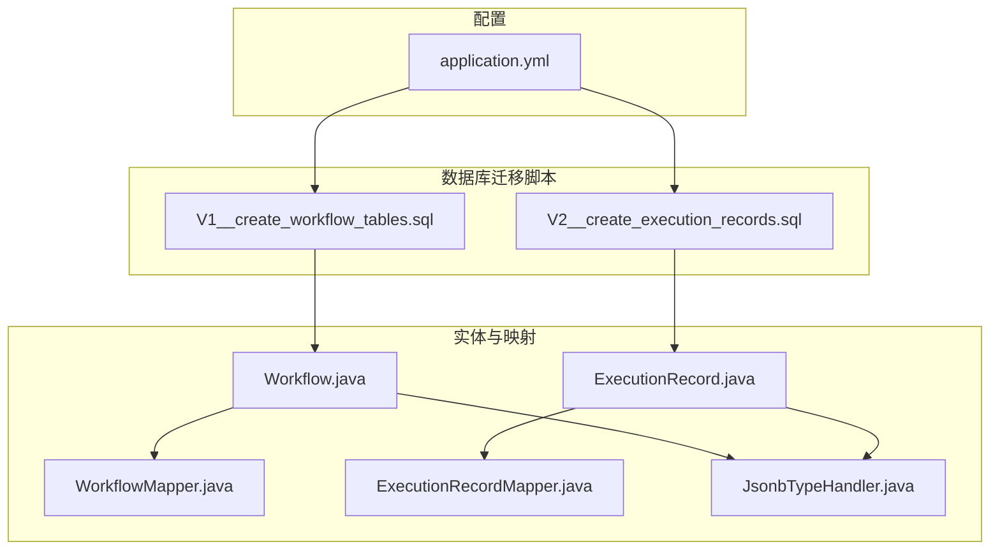
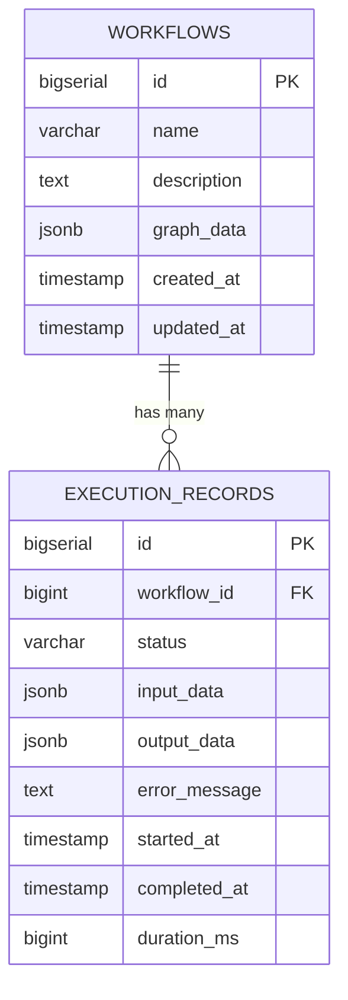
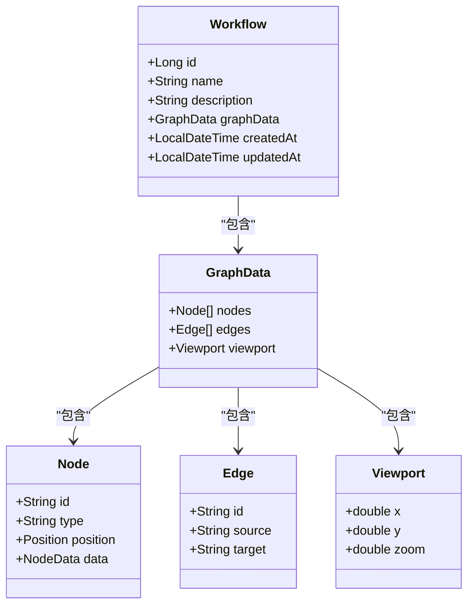
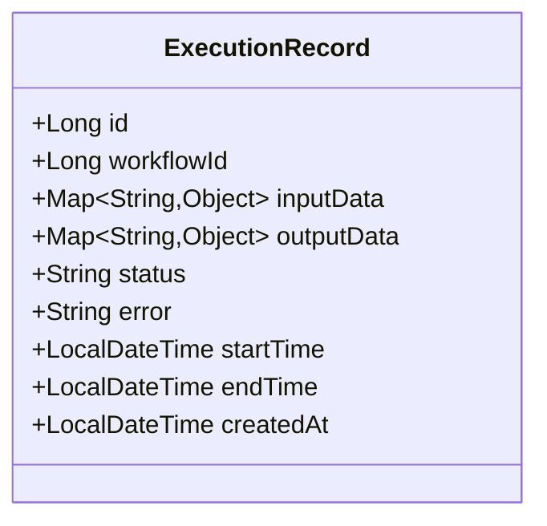
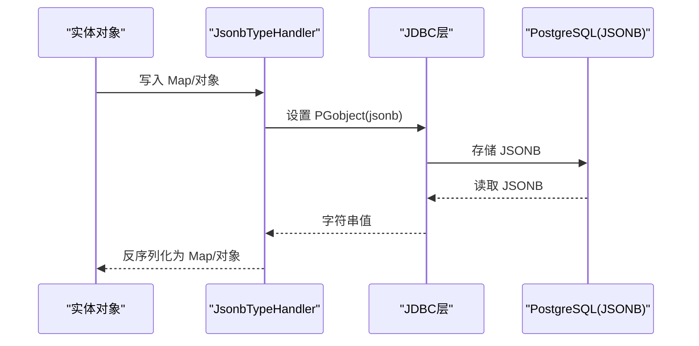
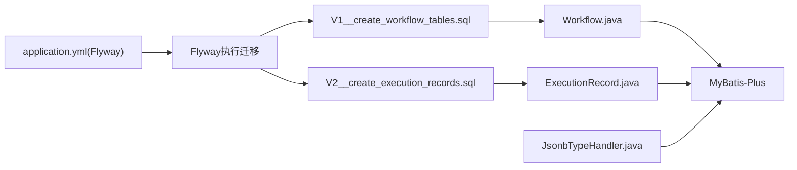

# 数据库表结构

<cite>
**本文引用的文件**
- [V1__create_workflow_tables.sql](file://backend/src/main/resources/db/migration/V1__create_workflow_tables.sql)
- [V2__create_execution_records.sql](file://backend/src/main/resources/db/migration/V2__create_execution_records.sql)
- [Workflow.java](file://backend/src/main/java/com/bokagent/entity/Workflow.java)
- [ExecutionRecord.java](file://backend/src/main/java/com/bokagent/entity/ExecutionRecord.java)
- [JsonbTypeHandler.java](file://backend/src/main/java/com/bokagent/handler/JsonbTypeHandler.java)
- [WorkflowMapper.java](file://backend/src/main/java/com/bokagent/mapper/WorkflowMapper.java)
- [ExecutionRecordMapper.java](file://backend/src/main/java/com/bokagent/mapper/ExecutionRecordMapper.java)
- [application.yml](file://backend/src/main/resources/application.yml)
- [GraphData.java](file://backend/src/main/java/com/bokagent/entity/GraphData.java)
- [Node.java](file://backend/src/main/java/com/bokagent/entity/Node.java)
- [Edge.java](file://backend/src/main/java/com/bokagent/entity/Edge.java)
- [Viewport.java](file://backend/src/main/java/com/bokagent/entity/Viewport.java)
</cite>

## 目录
1. [简介](#简介)
2. [项目结构](#项目结构)
3. [核心组件](#核心组件)
4. [架构总览](#架构总览)
5. [详细组件分析](#详细组件分析)
6. [依赖关系分析](#依赖关系分析)
7. [性能考量](#性能考量)
8. [故障排查指南](#故障排查指南)
9. [结论](#结论)
10. [附录](#附录)

## 简介
本文件面向数据库管理员与开发人员，系统性梳理 BokAgent 工作流系统的数据库表结构，重点覆盖 workflows 与 execution_records 表的完整设计，包括主键、外键、索引、字段类型与约束、迁移版本策略与变更历史、SQL 建表与索引方案、表间关联查询优化策略、数据完整性与业务规则实现方式，并提供维护指南。

## 项目结构
后端采用 Spring Boot + MyBatis-Plus + Flyway 的技术栈，数据库迁移脚本位于 resources/db/migration 目录，使用 V1/V2 版本号进行演进；实体类通过注解映射到对应表，JSON 类型通过自定义 TypeHandler 进行转换。

图表来源
- [V1__create_workflow_tables.sql:1-17](file://backend/src/main/resources/db/migration/V1__create_workflow_tables.sql#L1-L17)
- [V2__create_execution_records.sql:1-19](file://backend/src/main/resources/db/migration/V2__create_execution_records.sql#L1-L19)
- [Workflow.java:1-32](file://backend/src/main/java/com/bokagent/entity/Workflow.java#L1-L32)
- [ExecutionRecord.java:1-40](file://backend/src/main/java/com/bokagent/entity/ExecutionRecord.java#L1-L40)
- [WorkflowMapper.java:1-13](file://backend/src/main/java/com/bokagent/mapper/WorkflowMapper.java#L1-L13)
- [ExecutionRecordMapper.java:1-13](file://backend/src/main/java/com/bokagent/mapper/ExecutionRecordMapper.java#L1-L13)
- [JsonbTypeHandler.java:1-65](file://backend/src/main/java/com/bokagent/handler/JsonbTypeHandler.java#L1-L65)
- [application.yml:26-31](file://backend/src/main/resources/application.yml#L26-L31)

章节来源
- [application.yml:16-31](file://backend/src/main/resources/application.yml#L16-L31)
- [V1__create_workflow_tables.sql:1-17](file://backend/src/main/resources/db/migration/V1__create_workflow_tables.sql#L1-L17)
- [V2__create_execution_records.sql:1-19](file://backend/src/main/resources/db/migration/V2__create_execution_records.sql#L1-L19)

## 核心组件
- workflows 表：存储工作流定义，包含名称、描述、图数据（JSONB）及时间戳。
- execution_records 表：存储工作流执行记录，包含工作流外键、状态、输入/输出数据（JSONB）、错误信息、开始/结束时间与耗时等。

章节来源
- [Workflow.java:14-31](file://backend/src/main/java/com/bokagent/entity/Workflow.java#L14-L31)
- [ExecutionRecord.java:14-39](file://backend/src/main/java/com/bokagent/entity/ExecutionRecord.java#L14-L39)
- [V1__create_workflow_tables.sql:2-9](file://backend/src/main/resources/db/migration/V1__create_workflow_tables.sql#L2-L9)
- [V2__create_execution_records.sql:1-12](file://backend/src/main/resources/db/migration/V2__create_execution_records.sql#L1-L12)

## 架构总览
workflows 与 execution_records 之间存在一对多关系：一个工作流可对应多条执行记录。Flyway 负责版本化迁移，MyBatis-Plus 提供 ORM 映射，自定义 JsonbTypeHandler 实现 JSONB 字段的序列化/反序列化。

图表来源
- [V1__create_workflow_tables.sql:2-9](file://backend/src/main/resources/db/migration/V1__create_workflow_tables.sql#L2-L9)
- [V2__create_execution_records.sql:1-12](file://backend/src/main/resources/db/migration/V2__create_execution_records.sql#L1-L12)

## 详细组件分析

### workflows 表结构设计
- 主键：id（BIGSERIAL 自增）
- 字段与类型：
  - name：VARCHAR(255)，NOT NULL
  - description：TEXT，支持中文与 Emoji
  - graph_data：JSONB，NOT NULL，存储图结构数据
  - created_at/updated_at：TIMESTAMP，默认 NOW()
- 约束与注释：
  - 表与列注释用于中文说明
  - 通过 MyBatis-Plus 注解映射至 Workflow 实体
- 索引：
  - idx_workflows_created_at：按创建时间倒序，便于分页与时间筛选

图表来源
- [Workflow.java:14-31](file://backend/src/main/java/com/bokagent/entity/Workflow.java#L14-L31)
- [GraphData.java:9-15](file://backend/src/main/java/com/bokagent/entity/GraphData.java#L9-L15)
- [Node.java:8-14](file://backend/src/main/java/com/bokagent/entity/Node.java#L8-L14)
- [Edge.java:8-13](file://backend/src/main/java/com/bokagent/entity/Edge.java#L8-L13)
- [Viewport.java:9-14](file://backend/src/main/java/com/bokagent/entity/Viewport.java#L9-L14)

章节来源
- [V1__create_workflow_tables.sql:2-9](file://backend/src/main/resources/db/migration/V1__create_workflow_tables.sql#L2-L9)
- [Workflow.java:14-31](file://backend/src/main/java/com/bokagent/entity/Workflow.java#L14-L31)
- [GraphData.java:9-15](file://backend/src/main/java/com/bokagent/entity/GraphData.java#L9-L15)
- [Node.java:8-14](file://backend/src/main/java/com/bokagent/entity/Node.java#L8-L14)
- [Edge.java:8-13](file://backend/src/main/java/com/bokagent/entity/Edge.java#L8-L13)
- [Viewport.java:9-14](file://backend/src/main/java/com/bokagent/entity/Viewport.java#L9-L14)

### execution_records 表结构设计
- 主键：id（BIGSERIAL 自增）
- 外键：workflow_id 引用 workflows.id
- 字段与类型：
  - status：VARCHAR(20)，NOT NULL，取值 RUNNING/SUCCESS/FAILED
  - input_data/output_data：JSONB，存储执行输入/输出上下文
  - error_message：TEXT，支持中文错误描述
  - started_at/completed_at：TIMESTAMP
  - duration_ms：BIGINT，执行耗时（毫秒）
- 约束与注释：
  - 表与列注释用于中文说明
  - 通过 MyBatis-Plus 注解映射至 ExecutionRecord 实体
- 索引：
  - idx_execution_records_workflow_id：加速按工作流维度查询
  - idx_execution_records_started_at：按开始时间倒序，便于时间范围查询与分页

图表来源
- [ExecutionRecord.java:14-39](file://backend/src/main/java/com/bokagent/entity/ExecutionRecord.java#L14-L39)

章节来源
- [V2__create_execution_records.sql:1-12](file://backend/src/main/resources/db/migration/V2__create_execution_records.sql#L1-L12)
- [ExecutionRecord.java:14-39](file://backend/src/main/java/com/bokagent/entity/ExecutionRecord.java#L14-L39)

### JSONB 字段处理机制
- 使用自定义 JsonbTypeHandler 将 Java 对象（如 Map、GraphData）与 JSONB 字段双向转换。
- 通过 MyBatis-Plus 的 @TableField(typeHandler = ...) 注解绑定类型处理器。
- 保证数据库中以 JSONB 存储，Java 层以强类型对象访问。

图表来源
- [JsonbTypeHandler.java:17-63](file://backend/src/main/java/com/bokagent/handler/JsonbTypeHandler.java#L17-L63)
- [Workflow.java:25-26](file://backend/src/main/java/com/bokagent/entity/Workflow.java#L25-L26)
- [ExecutionRecord.java:24-28](file://backend/src/main/java/com/bokagent/entity/ExecutionRecord.java#L24-L28)

章节来源
- [JsonbTypeHandler.java:17-63](file://backend/src/main/java/com/bokagent/handler/JsonbTypeHandler.java#L17-L63)
- [Workflow.java:25-26](file://backend/src/main/java/com/bokagent/entity/Workflow.java#L25-L26)
- [ExecutionRecord.java:24-28](file://backend/src/main/java/com/bokagent/entity/ExecutionRecord.java#L24-L28)

### 数据完整性与业务规则
- 外键约束：execution_records.workflow_id 引用 workflows.id，保证执行记录与工作流的关联一致性。
- 状态约束：status 字段取值限定为 RUNNING/SUCCESS/FAILED，确保状态机一致性。
- 时间戳：created_at/updated_at（workflows），started_at/completed_at（execution_records）用于审计与统计。
- JSONB 约束：graph_data/input_data/output_data 为非空或可空视具体业务场景，由应用层控制插入/更新逻辑。

章节来源
- [V1__create_workflow_tables.sql:6-9](file://backend/src/main/resources/db/migration/V1__create_workflow_tables.sql#L6-L9)
- [V2__create_execution_records.sql:3-11](file://backend/src/main/resources/db/migration/V2__create_execution_records.sql#L3-L11)
- [Workflow.java:25-26](file://backend/src/main/java/com/bokagent/entity/Workflow.java#L25-L26)
- [ExecutionRecord.java:24-32](file://backend/src/main/java/com/bokagent/entity/ExecutionRecord.java#L24-L32)

### 表间关联查询优化策略
- 关联查询：通过 workflow_id 连接 workflows 与 execution_records，常用于“查看某工作流的历史执行”。
- 索引策略：
  - execution_records.workflow_id：加速按工作流过滤
  - execution_records.started_at：加速按时间范围查询与分页
  - workflows.created_at：加速按创建时间排序与分页
- 性能建议：
  - 在高频查询上使用覆盖索引（如 select id, workflow_id, status, started_at）
  - 控制分页大小，避免深分页导致的性能问题
  - 对 JSONB 字段的查询尽量配合 WHERE 条件与 GIN 索引（如需）

章节来源
- [V1__create_workflow_tables.sql:16-17](file://backend/src/main/resources/db/migration/V1__create_workflow_tables.sql#L16-L17)
- [V2__create_execution_records.sql:17-18](file://backend/src/main/resources/db/migration/V2__create_execution_records.sql#L17-L18)

## 依赖关系分析
- 运行时依赖：
  - Flyway：启用并指定迁移目录，自动执行 V1/V2 脚本
  - MyBatis-Plus：实体映射与 SQL 生成
  - PostgreSQL：JSONB 类型与索引能力
- 组件耦合：
  - 实体类与 JSONB 处理器耦合，确保类型安全
  - Mapper 接口与实体解耦，便于扩展

图表来源
- [application.yml:26-31](file://backend/src/main/resources/application.yml#L26-L31)
- [V1__create_workflow_tables.sql:1-17](file://backend/src/main/resources/db/migration/V1__create_workflow_tables.sql#L1-L17)
- [V2__create_execution_records.sql:1-19](file://backend/src/main/resources/db/migration/V2__create_execution_records.sql#L1-L19)
- [Workflow.java:14-31](file://backend/src/main/java/com/bokagent/entity/Workflow.java#L14-L31)
- [ExecutionRecord.java:14-39](file://backend/src/main/java/com/bokagent/entity/ExecutionRecord.java#L14-L39)
- [JsonbTypeHandler.java:17-63](file://backend/src/main/java/com/bokagent/handler/JsonbTypeHandler.java#L17-L63)

章节来源
- [application.yml:26-31](file://backend/src/main/resources/application.yml#L26-L31)
- [WorkflowMapper.java:10-12](file://backend/src/main/java/com/bokagent/mapper/WorkflowMapper.java#L10-L12)
- [ExecutionRecordMapper.java:10-12](file://backend/src/main/java/com/bokagent/mapper/ExecutionRecordMapper.java#L10-L12)

## 性能考量
- JSONB 存储与查询：
  - 使用 JSONB 可高效存储复杂图数据与上下文，但对 JSONB 字段的查询需配合 WHERE 条件与索引
  - 如需频繁检索 JSONB 中的键，可考虑在应用层预处理或引入 GIN 索引（需评估写入成本）
- 索引与分页：
  - 为高频查询字段建立合适索引，避免全表扫描
  - 分页查询建议使用基于游标的方式，减少 OFFSET 的开销
- 并发与事务：
  - 执行记录的状态更新（RUNNING→SUCCESS/FAILED）应使用原子更新，避免竞态
  - 大批量导入/导出时建议使用事务批处理

## 故障排查指南
- 迁移失败：
  - 检查 Flyway 是否正确启用与迁移目录是否可达
  - 查看迁移脚本语法与 PostgreSQL 版本兼容性
- JSONB 转换异常：
  - 确认 JsonbTypeHandler 正确绑定至实体字段
  - 检查对象序列化/反序列化过程中的空值与类型匹配
- 外键约束错误：
  - 确保 execution_records.workflow_id 对应 workflows.id 存在
  - 避免删除仍有执行记录的工作流定义
- 性能问题：
  - 使用 EXPLAIN ANALYZE 分析慢查询
  - 检查索引是否被使用，必要时重建或调整

章节来源
- [application.yml:26-31](file://backend/src/main/resources/application.yml#L26-L31)
- [JsonbTypeHandler.java:26-36](file://backend/src/main/java/com/bokagent/handler/JsonbTypeHandler.java#L26-L36)
- [V2__create_execution_records.sql:3-3](file://backend/src/main/resources/db/migration/V2__create_execution_records.sql#L3-L3)

## 结论
workflows 与 execution_records 表通过 Flyway 版本化迁移构建，结合 MyBatis-Plus 与自定义 JSONB 处理器，实现了工作流定义与执行记录的强类型持久化。合理的索引策略与外键约束保障了数据一致性与查询性能。建议在生产环境中持续监控执行记录的统计指标与慢查询，按需优化索引与查询计划。

## 附录

### 数据库迁移版本管理策略与变更历史
- 版本策略：
  - 使用 Flyway 的版本命名规范 V<版本号>__<描述>.sql
  - 通过 application.yml 指定迁移目录与启用开关
- 变更历史：
  - V1：创建 workflows 表，包含名称、描述、图数据（JSONB）与时间戳
  - V2：创建 execution_records 表，包含工作流外键、状态、输入/输出数据（JSONB）、错误信息与时间戳
- 建议：
  - 新增迁移时遵循幂等原则，避免破坏现有数据
  - 对生产环境迁移前先在测试环境验证

章节来源
- [application.yml:26-31](file://backend/src/main/resources/application.yml#L26-L31)
- [V1__create_workflow_tables.sql:1-17](file://backend/src/main/resources/db/migration/V1__create_workflow_tables.sql#L1-L17)
- [V2__create_execution_records.sql:1-19](file://backend/src/main/resources/db/migration/V2__create_execution_records.sql#L1-L19)

### 完整 SQL 建表与索引方案
- workflows 表
  - 主键：id（BIGSERIAL）
  - 字段：name（VARCHAR(255) NOT NULL）、description（TEXT）、graph_data（JSONB NOT NULL）、created_at/updated_at（TIMESTAMP DEFAULT NOW）
  - 索引：idx_workflows_created_at（按创建时间倒序）
- execution_records 表
  - 主键：id（BIGSERIAL）
  - 外键：workflow_id 引用 workflows.id
  - 字段：status（VARCHAR(20) NOT NULL）、input_data/output_data（JSONB）、error_message（TEXT）、started_at/completed_at（TIMESTAMP）、duration_ms（BIGINT）
  - 索引：idx_execution_records_workflow_id、idx_execution_records_started_at（按开始时间倒序）

章节来源
- [V1__create_workflow_tables.sql:2-16](file://backend/src/main/resources/db/migration/V1__create_workflow_tables.sql#L2-L16)
- [V2__create_execution_records.sql:1-18](file://backend/src/main/resources/db/migration/V2__create_execution_records.sql#L1-L18)

### 表间关联查询示例思路
- 查询某工作流最近 N 条执行记录：
  - JOIN workflows 与 execution_records，按 started_at DESC 排序，LIMIT N
- 统计某工作流执行成功率：
  - GROUP BY status 计算各状态数量，SUCCESS 占比即为成功率
- 按时间段筛选执行记录：
  - 使用 started_at 或 created_at 上的索引，避免全表扫描

章节来源
- [V1__create_workflow_tables.sql:16-17](file://backend/src/main/resources/db/migration/V1__create_workflow_tables.sql#L16-L17)
- [V2__create_execution_records.sql:17-18](file://backend/src/main/resources/db/migration/V2__create_execution_records.sql#L17-L18)