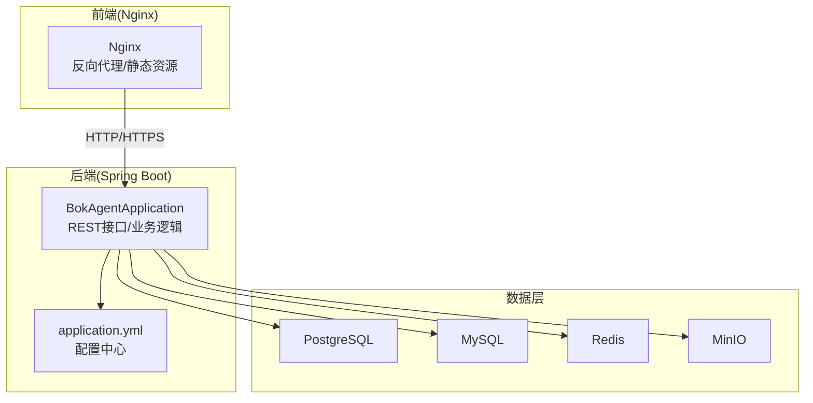
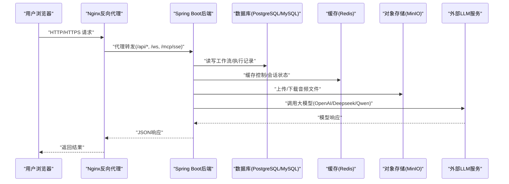
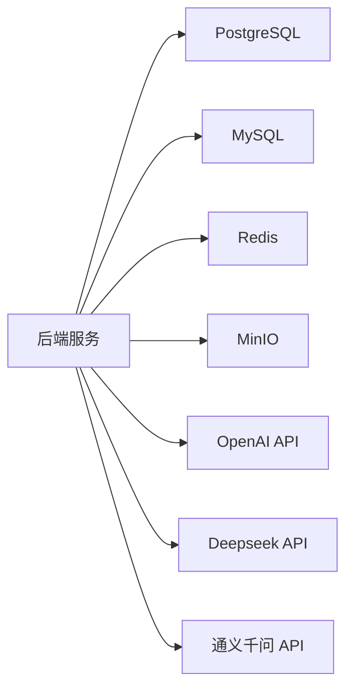

# 安全架构

<cite>
**本文引用的文件**
- [BokAgentApplication.java](file://backend/src/main/java/com/bokagent/BokAgentApplication.java)
- [application.yml](file://backend/src/main/resources/application.yml)
- [GlobalExceptionHandler.java](file://backend/src/main/java/com/bokagent/common/GlobalExceptionHandler.java)
- [Result.java](file://backend/src/main/java/com/bokagent/common/Result.java)
- [ExecutionController.java](file://backend/src/main/java/com/bokagent/controller/ExecutionController.java)
- [WorkflowController.java](file://backend/src/main/java/com/bokagent/controller/WorkflowController.java)
- [ExecutionService.java](file://backend/src/main/java/com/bokagent/service/ExecutionService.java)
- [LLMService.java](file://backend/src/main/java/com/bokagent/service/LLMService.java)
- [WorkflowEngine.java](file://backend/src/main/java/com/bokagent/engine/WorkflowEngine.java)
- [nginx.conf](file://docker/nginx.conf)
- [docker-compose.yml](file://docker/docker-compose.yml)
- [V1__create_workflow_tables.sql](file://backend/src/main/resources/db/migration/V1__create_workflow_tables.sql)
- [V2__create_execution_records.sql](file://backend/src/main/resources/db/migration/V2__create_execution_records.sql)
- [README.md](file://README.md)
</cite>

## 目录
1. [引言](#引言)
2. [项目结构](#项目结构)
3. [核心组件](#核心组件)
4. [架构总览](#架构总览)
5. [详细组件分析](#详细组件分析)
6. [依赖分析](#依赖分析)
7. [性能考虑](#性能考虑)
8. [故障排查指南](#故障排查指南)
9. [结论](#结论)
10. [附录](#附录)

## 引言
本文件面向安全管理员与工程团队，系统化梳理BokAgent系统的安全架构现状与改进建议。重点覆盖身份认证与授权、API安全设计（请求签名、防重放、速率限制）、数据传输安全（HTTPS、敏感数据加密与密钥管理）、访问控制策略（IP白名单、CORS与跨域安全）、错误处理与日志安全（敏感信息脱敏与审计日志）以及安全漏洞防护、渗透测试策略与应急响应预案。

## 项目结构
BokAgent采用前后端分离架构，后端基于Spring Boot，前端基于React，通过Nginx进行反向代理与静态资源分发。容器编排使用Docker Compose，统一管理数据库、缓存、对象存储与后端服务。

图表来源
- [docker-compose.yml:1-132](file://docker/docker-compose.yml#L1-L132)
- [nginx.conf:1-56](file://docker/nginx.conf#L1-L56)
- [application.yml:1-190](file://backend/src/main/resources/application.yml#L1-L190)

章节来源
- [README.md:1-106](file://README.md#L1-L106)
- [docker-compose.yml:1-132](file://docker/docker-compose.yml#L1-L132)
- [nginx.conf:1-56](file://docker/nginx.conf#L1-L56)

## 核心组件
- 应用入口与编码保障：应用启动时强制UTF-8编码，避免字符集相关风险；日志输出UTF-8，便于审计与合规。
- 统一响应与异常处理：全局异常处理器集中处理各类异常，返回标准化Result结构，避免敏感堆栈泄露。
- 控制器与跨域：控制器层使用跨域注解，需结合后端安全策略进行精细化配置。
- 业务服务：工作流执行与LLM调用服务，涉及外部API密钥与第三方服务交互，需强化密钥管理与调用链路监控。
- 数据持久化：PostgreSQL与MySQL分别承载工作流定义与执行记录、业务数据，需关注数据库连接与SQL注入防护。
- 反向代理：Nginx负责静态资源与API代理，WebSocket与MCP SSE路径透传，需确保代理层安全配置。

章节来源
- [BokAgentApplication.java:1-56](file://backend/src/main/java/com/bokagent/BokAgentApplication.java#L1-L56)
- [Result.java:1-42](file://backend/src/main/java/com/bokagent/common/Result.java#L1-L42)
- [GlobalExceptionHandler.java:1-37](file://backend/src/main/java/com/bokagent/common/GlobalExceptionHandler.java#L1-L37)
- [ExecutionController.java:1-81](file://backend/src/main/java/com/bokagent/controller/ExecutionController.java#L1-L81)
- [WorkflowController.java:1-92](file://backend/src/main/java/com/bokagent/controller/WorkflowController.java#L1-L92)
- [ExecutionService.java:1-113](file://backend/src/main/java/com/bokagent/service/ExecutionService.java#L1-L113)
- [LLMService.java:1-67](file://backend/src/main/java/com/bokagent/service/LLMService.java#L1-L67)
- [application.yml:1-190](file://backend/src/main/resources/application.yml#L1-L190)

## 架构总览
下图展示从浏览器到后端服务、再到数据库与外部AI服务的整体调用链路及安全要点。

图表来源
- [nginx.conf:20-54](file://docker/nginx.conf#L20-L54)
- [application.yml:16-67](file://backend/src/main/resources/application.yml#L16-L67)
- [ExecutionService.java:39-92](file://backend/src/main/java/com/bokagent/service/ExecutionService.java#L39-L92)
- [LLMService.java:27-44](file://backend/src/main/java/com/bokagent/service/LLMService.java#L27-L44)

## 详细组件分析

### 身份认证与授权机制
- 现状
  - 代码库未发现内置的身份认证与授权实现（如JWT、OAuth2、RBAC）。控制器层未见鉴权注解或拦截器。
  - 数据库连接与外部API密钥通过环境变量注入，未见密钥加密存储或动态轮换机制。
- 建议
  - 引入基于Spring Security的认证授权方案（如JWT + RBAC），在网关或后端统一拦截校验。
  - 对敏感配置（数据库密码、第三方API Key）启用密钥管理服务（如KMS/密钥库），并定期轮换。
  - 对关键接口增加细粒度权限控制，结合角色与资源维度进行授权。

章节来源
- [ExecutionController.java:19](file://backend/src/main/java/com/bokagent/controller/ExecutionController.java#L19)
- [WorkflowController.java:19](file://backend/src/main/java/com/bokagent/controller/WorkflowController.java#L19)
- [application.yml:17-21](file://backend/src/main/resources/application.yml#L17-L21)
- [application.yml:48-66](file://backend/src/main/resources/application.yml#L48-L66)

### API安全设计
- 请求签名与防重放
  - 现状：未实现请求签名与时间戳/随机数防重放机制。
  - 建议：对关键接口引入HMAC签名，要求客户端携带时间戳、随机串与签名，服务端校验有效期与幂等性。
- 速率限制
  - 现状：未见限流实现。
  - 建议：在网关或后端使用令牌桶/漏桶算法进行限流，并区分匿名与登录用户配额。
- 参数校验与输入净化
  - 现状：控制器接收JSON请求体，未见显式的参数校验与净化。
  - 建议：引入Bean Validation与输入净化，防止注入与异常输入导致的异常行为。

章节来源
- [ExecutionController.java:52-60](file://backend/src/main/java/com/bokagent/controller/ExecutionController.java#L52-L60)
- [WorkflowController.java:51-75](file://backend/src/main/java/com/bokagent/controller/WorkflowController.java#L51-L75)

### 数据传输安全
- HTTPS与证书
  - 现状：Nginx监听80端口，未见HTTPS重定向或TLS配置。
  - 建议：启用HTTPS，强制HTTP重定向；使用Let’s Encrypt自动签发证书；禁用弱密码套件与过时协议。
- 敏感数据加密
  - 现状：数据库连接字符串与第三方API Key以明文注入。
  - 建议：对数据库凭据与密钥进行加密存储与运行时解密；传输链路使用TLS。
- 密钥管理
  - 建议：使用密钥管理服务（KMS）或Vault，实现密钥轮换与访问审计。

章节来源
- [nginx.conf:1-10](file://docker/nginx.conf#L1-L10)
- [docker-compose.yml:88-100](file://docker/docker-compose.yml#L88-L100)
- [application.yml:17-21](file://backend/src/main/resources/application.yml#L17-L21)
- [application.yml:48-66](file://backend/src/main/resources/application.yml#L48-L66)

### 访问控制策略
- CORS配置
  - 现状：控制器使用“允许所有来源”的跨域注解，存在跨站风险。
  - 建议：明确指定可信域名与子域，限制方法与头字段，避免通配符暴露。
- IP白名单
  - 建议：在Nginx或防火墙层对管理端口与内部接口实施IP白名单。
- 跨域安全
  - 建议：严格校验Origin，避免凭据跨域场景下的不必要暴露；对敏感端点禁用凭据跨域。

章节来源
- [ExecutionController.java:19](file://backend/src/main/java/com/bokagent/controller/ExecutionController.java#L19)
- [WorkflowController.java:19](file://backend/src/main/java/com/bokagent/controller/WorkflowController.java#L19)
- [nginx.conf:21-34](file://docker/nginx.conf#L21-L34)

### 错误处理与日志安全
- 统一响应与异常处理
  - 现状：全局异常处理器捕获异常并返回Result，但日志中可能包含敏感信息。
  - 建议：在异常处理器中屏蔽敏感堆栈细节，仅记录必要上下文；对400类参数错误与500类服务器错误分级处理。
- 日志脱敏与审计
  - 建议：对日志中的敏感字段（如手机号、邮箱、Token）进行脱敏；开启审计日志记录关键操作（登录、权限变更、敏感数据访问）。

章节来源
- [GlobalExceptionHandler.java:16-35](file://backend/src/main/java/com/bokagent/common/GlobalExceptionHandler.java#L16-L35)
- [Result.java:14-40](file://backend/src/main/java/com/bokagent/common/Result.java#L14-L40)
- [application.yml:164-180](file://backend/src/main/resources/application.yml#L164-L180)

### 数据库与对象存储安全
- 数据库
  - 现状：PostgreSQL与MySQL通过环境变量注入凭据；DDL使用UTF-8。
  - 建议：最小权限原则分配数据库账号；启用连接池与只读副本；对DDL与查询进行审计。
- 对象存储
  - 现状：MinIO通过环境变量注入凭据；执行记录中存储音频URL。
  - 建议：对存储桶与对象设置访问控制策略；使用预签名URL与短期有效时间；对敏感文件进行加密存储。

章节来源
- [V1__create_workflow_tables.sql:1-17](file://backend/src/main/resources/db/migration/V1__create_workflow_tables.sql#L1-L17)
- [V2__create_execution_records.sql:1-19](file://backend/src/main/resources/db/migration/V2__create_execution_records.sql#L1-L19)
- [application.yml:110-114](file://backend/src/main/resources/application.yml#L110-L114)

### 会话管理策略
- 现状：未发现会话管理实现（Cookie/Session/JWT）。
- 建议：引入基于JWT的无状态会话或基于Redis的有状态会话；设置合理过期时间与刷新策略；对敏感端点强制重新认证。

章节来源
- [BokAgentApplication.java:19-43](file://backend/src/main/java/com/bokagent/BokAgentApplication.java#L19-L43)

### 工作流引擎与LLM调用安全
- 现状：工作流引擎与LLM服务直接调用外部API，未见调用链路的鉴权与审计。
- 建议：对外部调用增加API Key管理与调用限额；对提示词与上下文进行敏感信息检测与过滤；记录调用日志并设置告警阈值。

章节来源
- [WorkflowEngine.java:47-82](file://backend/src/main/java/com/bokagent/engine/WorkflowEngine.java#L47-L82)
- [LLMService.java:27-44](file://backend/src/main/java/com/bokagent/service/LLMService.java#L27-L44)

## 依赖分析
后端服务依赖数据库、缓存、对象存储与外部AI服务，整体耦合度较低，但存在以下安全依赖点：
- 外部API密钥管理：OpenAI、Deepseek、通义千问的API Key需集中管理与轮换。
- 数据库凭据：PostgreSQL与MySQL的连接凭据需加密存储。
- 缓存与会话：Redis用于缓存与会话，需配置访问控制与网络隔离。

图表来源
- [application.yml:16-67](file://backend/src/main/resources/application.yml#L16-L67)

章节来源
- [application.yml:16-67](file://backend/src/main/resources/application.yml#L16-L67)

## 性能考虑
- 连接池与超时：合理配置数据库连接池与外部调用超时，避免资源耗尽。
- 缓存策略：利用Redis缓存热点数据，降低数据库压力；对缓存键进行命名规范与过期策略。
- 并发与异步：对长耗时任务采用异步执行与队列化，避免阻塞主线程。

## 故障排查指南
- 接口异常
  - 使用统一异常处理器返回标准错误格式，结合日志定位问题。
- 数据库连接
  - 检查数据库健康状态与连接池配置，确认凭据正确性。
- 外部API调用
  - 核查API Key有效性与配额，检查网络连通性与超时设置。
- 日志与审计
  - 开启审计日志，对敏感操作进行追踪；对日志进行脱敏与归档。

章节来源
- [GlobalExceptionHandler.java:16-35](file://backend/src/main/java/com/bokagent/common/GlobalExceptionHandler.java#L16-L35)
- [application.yml:164-180](file://backend/src/main/resources/application.yml#L164-L180)

## 结论
当前代码库尚未实现内置的身份认证与授权、请求签名与防重放、速率限制、HTTPS与密钥管理等关键安全能力。建议优先补齐认证授权、密钥管理与传输加密，再逐步引入请求签名、限流与审计日志等纵深防御措施，以满足企业级安全要求。

## 附录

### 安全实施清单（摘要）
- 身份认证与授权
  - 引入JWT与RBAC，实现细粒度权限控制
  - 对敏感配置启用密钥管理与轮换
- API安全
  - 实现请求签名与防重放
  - 引入速率限制与参数校验
- 传输与存储安全
  - 启用HTTPS与强密码套件
  - 对数据库与对象存储凭据加密
- 访问控制
  - 精细化CORS配置，限制可信来源
  - 在网关层实施IP白名单
- 日志与审计
  - 对日志进行脱敏与分级存储
  - 记录关键操作审计事件

### 渗透测试策略
- 范围与目标
  - 前端与后端接口、数据库、缓存、对象存储与外部API
- 方法
  - 黑盒/灰盒测试结合，覆盖认证绕过、注入、越权、敏感信息泄露与DoS
- 报告与修复
  - 输出高危/中危/低危风险清单，制定修复优先级与回归验证计划

### 应急响应预案
- 分级与流程
  - 建立事件分级（紧急/重大/一般），明确处置流程与责任人
- 预案内容
  - 事件上报、影响评估、处置措施、恢复验证与复盘改进
- 演练与培训
  - 定期组织演练，提升团队应急响应能力