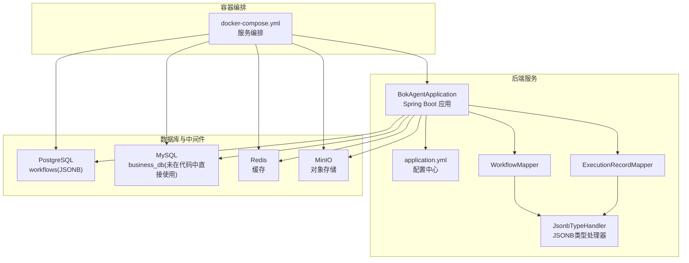
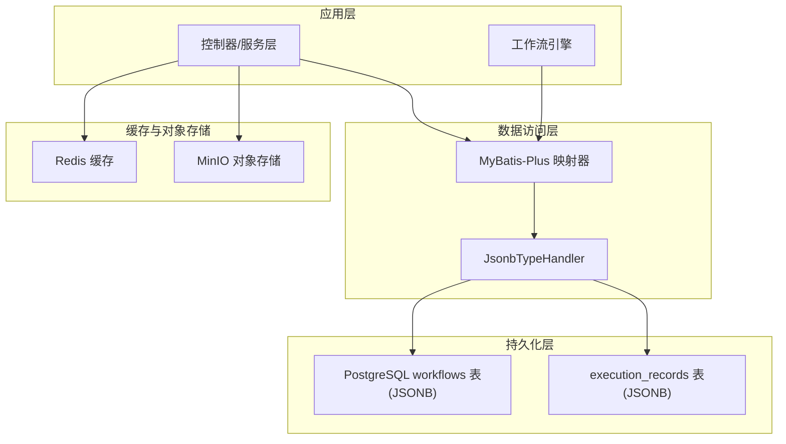
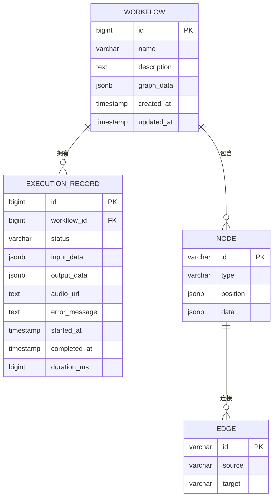
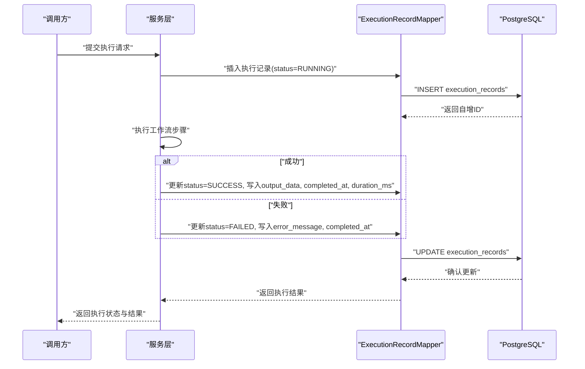
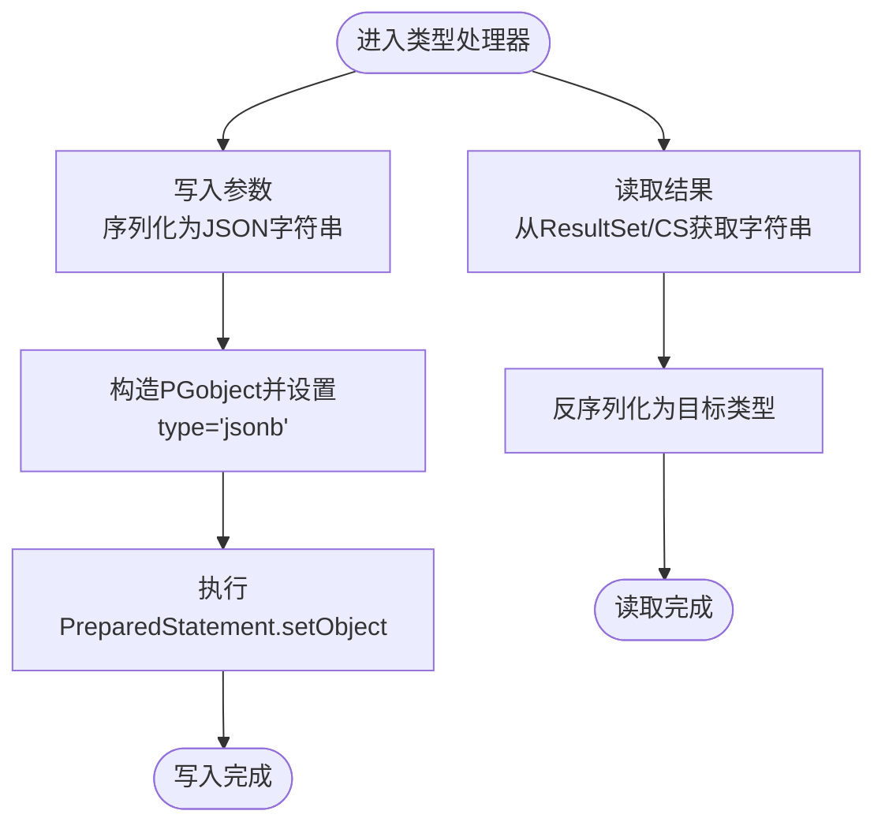
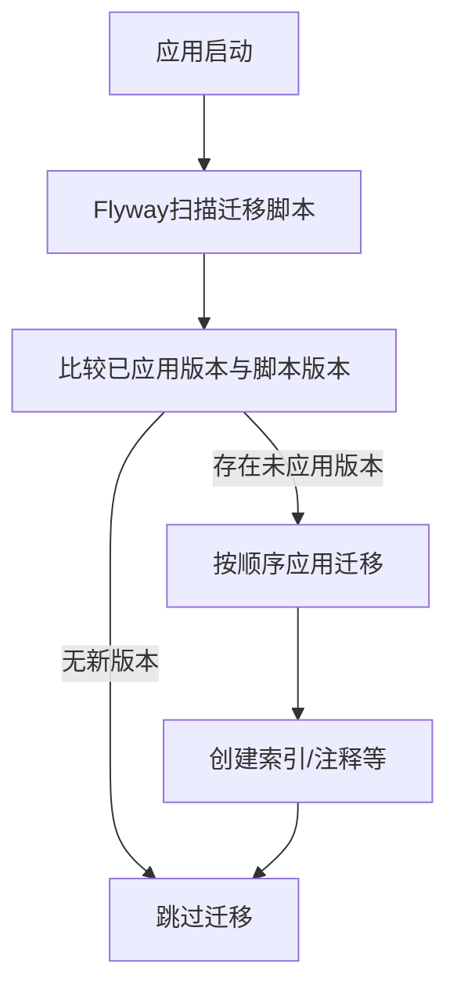
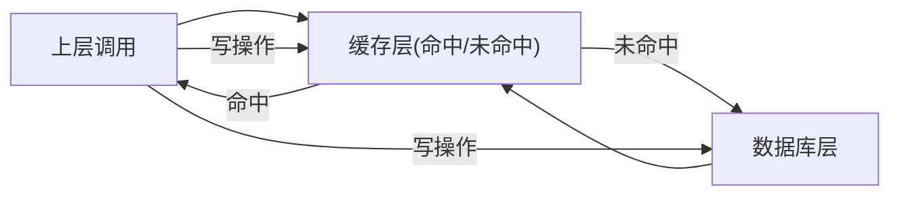
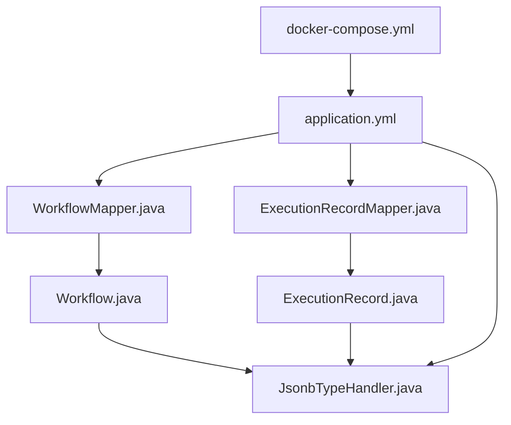

# 数据架构

<cite>
**本文引用的文件**
- [Workflow.java](file://backend/src/main/java/com/bokagent/entity/Workflow.java)
- [Node.java](file://backend/src/main/java/com/bokagent/entity/Node.java)
- [Edge.java](file://backend/src/main/java/com/bokagent/entity/Edge.java)
- [ExecutionRecord.java](file://backend/src/main/java/com/bokagent/entity/ExecutionRecord.java)
- [GraphData.java](file://backend/src/main/java/com/bokagent/entity/GraphData.java)
- [NodeData.java](file://backend/src/main/java/com/bokagent/entity/NodeData.java)
- [Position.java](file://backend/src/main/java/com/bokagent/entity/Position.java)
- [Viewport.java](file://backend/src/main/java/com/bokagent/entity/Viewport.java)
- [JsonbTypeHandler.java](file://backend/src/main/java/com/bokagent/handler/JsonbTypeHandler.java)
- [WorkflowMapper.java](file://backend/src/main/java/com/bokagent/mapper/WorkflowMapper.java)
- [ExecutionRecordMapper.java](file://backend/src/main/java/com/bokagent/mapper/ExecutionRecordMapper.java)
- [application.yml](file://backend/src/main/resources/application.yml)
- [V1__create_workflow_tables.sql](file://backend/src/main/resources/db/migration/V1__create_workflow_tables.sql)
- [V2__create_execution_records.sql](file://backend/src/main/resources/db/migration/V2__create_execution_records.sql)
- [docker-compose.yml](file://docker/docker-compose.yml)
</cite>

## 目录
1. [引言](#引言)
2. [项目结构](#项目结构)
3. [核心组件](#核心组件)
4. [架构总览](#架构总览)
5. [详细组件分析](#详细组件分析)
6. [依赖分析](#依赖分析)
7. [性能考虑](#性能考虑)
8. [故障排查指南](#故障排查指南)
9. [结论](#结论)
10. [附录](#附录)

## 引言
本文件面向BokAgent系统的数据架构，聚焦以下目标：
- 多数据源支持策略：明确PostgreSQL与MySQL的职责划分与使用场景
- 工作流数据模型设计：Workflow、Node、Edge等核心实体的关系映射
- 执行记录的数据结构设计与生命周期管理
- JSONB字段处理机制与自定义类型处理器实现
- 数据库迁移策略与版本管理方案
- 缓存架构设计：Redis缓存策略与数据一致性保障
- 数据备份恢复策略、性能优化方案与监控指标设计

## 项目结构
后端采用Spring Boot + MyBatis-Plus，数据库层通过Flyway进行迁移管理；容器编排提供PostgreSQL、MySQL、Redis、MinIO等外部依赖。

图表来源
- [application.yml:16-44](file://backend/src/main/resources/application.yml#L16-L44)
- [docker-compose.yml:4-49](file://docker/docker-compose.yml#L4-L49)

章节来源
- [application.yml:16-44](file://backend/src/main/resources/application.yml#L16-L44)
- [docker-compose.yml:4-49](file://docker/docker-compose.yml#L4-L49)

## 核心组件
- 实体层：Workflow、ExecutionRecord及其嵌套结构（GraphData、Node、Edge、NodeData、Position、Viewport）
- 映射层：WorkflowMapper、ExecutionRecordMapper
- 类型处理器：JsonbTypeHandler（负责JSONB与Java对象之间的序列化/反序列化）
- 配置层：application.yml中的数据库、缓存、迁移、AI服务等配置
- 迁移层：Flyway迁移脚本（V1、V2）

章节来源
- [Workflow.java:14-31](file://backend/src/main/java/com/bokagent/entity/Workflow.java#L14-L31)
- [ExecutionRecord.java:15-39](file://backend/src/main/java/com/bokagent/entity/ExecutionRecord.java#L15-L39)
- [GraphData.java:9-14](file://backend/src/main/java/com/bokagent/entity/GraphData.java#L9-L14)
- [Node.java:8-14](file://backend/src/main/java/com/bokagent/entity/Node.java#L8-L14)
- [Edge.java:8-13](file://backend/src/main/java/com/bokagent/entity/Edge.java#L8-L13)
- [NodeData.java:9-14](file://backend/src/main/java/com/bokagent/entity/NodeData.java#L9-L14)
- [Position.java:8-12](file://backend/src/main/java/com/bokagent/entity/Position.java#L8-L12)
- [Viewport.java:9-14](file://backend/src/main/java/com/bokagent/entity/Viewport.java#L9-L14)
- [WorkflowMapper.java:10-12](file://backend/src/main/java/com/bokagent/mapper/WorkflowMapper.java#L10-L12)
- [ExecutionRecordMapper.java:10-12](file://backend/src/main/java/com/bokagent/mapper/ExecutionRecordMapper.java#L10-L12)
- [JsonbTypeHandler.java:17-63](file://backend/src/main/java/com/bokagent/handler/JsonbTypeHandler.java#L17-L63)

## 架构总览
下图展示数据层与应用层交互的关键路径：实体经由MyBatis-Plus映射到PostgreSQL，JSONB字段通过自定义类型处理器完成转换；执行记录同时记录状态、输入输出数据及耗时；缓存通过Redis提升读取性能；对象存储用于音频文件归档。

图表来源
- [Workflow.java:25](file://backend/src/main/java/com/bokagent/entity/Workflow.java#L25)
- [ExecutionRecord.java:24-28](file://backend/src/main/java/com/bokagent/entity/ExecutionRecord.java#L24-L28)
- [JsonbTypeHandler.java:27-36](file://backend/src/main/java/com/bokagent/handler/JsonbTypeHandler.java#L27-L36)
- [V1__create_workflow_tables.sql:6](file://backend/src/main/resources/db/migration/V1__create_workflow_tables.sql#L6)
- [V2__create_execution_records.sql:5-6](file://backend/src/main/resources/db/migration/V2__create_execution_records.sql#L5-L6)

## 详细组件分析

### 工作流数据模型设计
- Workflow：工作流定义，包含名称、描述、创建/更新时间，以及以JSONB形式存储的GraphData
- GraphData：包含节点列表、边列表与视口信息
- Node：节点标识、类型（start/llm/end）、位置与节点数据
- Edge：边的源节点与目标节点标识
- NodeData：节点标签、提示词与可扩展配置
- Position/Viewport：二维坐标与缩放视口

图表来源
- [V1__create_workflow_tables.sql:2-9](file://backend/src/main/resources/db/migration/V1__create_workflow_tables.sql#L2-L9)
- [V2__create_execution_records.sql:1-12](file://backend/src/main/resources/db/migration/V2__create_execution_records.sql#L1-L12)
- [Workflow.java:18-30](file://backend/src/main/java/com/bokagent/entity/Workflow.java#L18-L30)
- [ExecutionRecord.java:19-38](file://backend/src/main/java/com/bokagent/entity/ExecutionRecord.java#L19-L38)
- [GraphData.java:10-14](file://backend/src/main/java/com/bokagent/entity/GraphData.java#L10-L14)
- [Node.java:9-14](file://backend/src/main/java/com/bokagent/entity/Node.java#L9-L14)
- [Edge.java:8-13](file://backend/src/main/java/com/bokagent/entity/Edge.java#L8-L13)

章节来源
- [Workflow.java:14-31](file://backend/src/main/java/com/bokagent/entity/Workflow.java#L14-L31)
- [ExecutionRecord.java:15-39](file://backend/src/main/java/com/bokagent/entity/ExecutionRecord.java#L15-L39)
- [GraphData.java:9-14](file://backend/src/main/java/com/bokagent/entity/GraphData.java#L9-L14)
- [Node.java:8-14](file://backend/src/main/java/com/bokagent/entity/Node.java#L8-L14)
- [Edge.java:8-13](file://backend/src/main/java/com/bokagent/entity/Edge.java#L8-L13)
- [NodeData.java:9-14](file://backend/src/main/java/com/bokagent/entity/NodeData.java#L9-L14)
- [Position.java:8-12](file://backend/src/main/java/com/bokagent/entity/Position.java#L8-L12)
- [Viewport.java:9-14](file://backend/src/main/java/com/bokagent/entity/Viewport.java#L9-L14)

### 执行记录的数据结构与生命周期
- 结构要点：关联工作流ID、执行状态（RUNNING/SUCCESS/FAILED）、输入输出数据（JSONB）、错误信息、开始/结束时间、耗时（毫秒）
- 生命周期：创建执行记录 -> 运行中（RUNNING）-> 成功（SUCCESS）或失败（FAILED），期间可写入输入输出数据与错误信息
- 时序流程如下：

图表来源
- [ExecutionRecord.java:19-38](file://backend/src/main/java/com/bokagent/entity/ExecutionRecord.java#L19-L38)
- [V2__create_execution_records.sql:3-11](file://backend/src/main/resources/db/migration/V2__create_execution_records.sql#L3-L11)

章节来源
- [ExecutionRecord.java:15-39](file://backend/src/main/java/com/bokagent/entity/ExecutionRecord.java#L15-L39)
- [V2__create_execution_records.sql:1-19](file://backend/src/main/resources/db/migration/V2__create_execution_records.sql#L1-L19)

### JSONB字段处理机制与自定义类型处理器
- 使用场景：Workflow.graphData、ExecutionRecord.inputData、ExecutionRecord.outputData均以JSONB存储，便于灵活扩展与查询
- 处理器实现：JsonbTypeHandler基于Jackson将Java对象序列化为字符串并封装为PGobject，反向解析时将字符串还原为指定类型
- 关键点：
  - 写入：将对象转为JSON字符串，设置PGobject类型为“jsonb”
  - 读取：从ResultSet/CallableStatement读取字符串，反序列化为目标类型
  - 异常：序列化/反序列化异常统一包装为SQLException

图表来源
- [JsonbTypeHandler.java:26-51](file://backend/src/main/java/com/bokagent/handler/JsonbTypeHandler.java#L26-L51)

章节来源
- [Workflow.java:25](file://backend/src/main/java/com/bokagent/entity/Workflow.java#L25)
- [ExecutionRecord.java:24-28](file://backend/src/main/java/com/bokagent/entity/ExecutionRecord.java#L24-L28)
- [JsonbTypeHandler.java:17-63](file://backend/src/main/java/com/bokagent/handler/JsonbTypeHandler.java#L17-L63)

### 数据库迁移策略与版本管理
- 迁移框架：Flyway启用，迁移脚本位于classpath:db/migration
- 版本策略：
  - V1：创建workflows表，含JSONB字段与索引
  - V2：创建execution_records表，含外键、JSONB字段与索引
- 配置要点：baseline-on-migrate启用，确保首次运行自动基线化

图表来源
- [application.yml:26-31](file://backend/src/main/resources/application.yml#L26-L31)
- [V1__create_workflow_tables.sql:1-17](file://backend/src/main/resources/db/migration/V1__create_workflow_tables.sql#L1-L17)
- [V2__create_execution_records.sql:1-19](file://backend/src/main/resources/db/migration/V2__create_execution_records.sql#L1-L19)

章节来源
- [application.yml:26-31](file://backend/src/main/resources/application.yml#L26-L31)
- [V1__create_workflow_tables.sql:1-17](file://backend/src/main/resources/db/migration/V1__create_workflow_tables.sql#L1-L17)
- [V2__create_execution_records.sql:1-19](file://backend/src/main/resources/db/migration/V2__create_execution_records.sql#L1-L19)

### 缓存架构设计与数据一致性
- 缓存组件：Redis（通过Spring Data Redis配置），用于缓存工具结果、LLM响应等热点数据
- TTL策略：默认缓存1小时，工具结果30分钟，LLM响应2小时
- 一致性策略建议：
  - 读路径：优先命中缓存，未命中再回源数据库
  - 写路径：更新数据库后同步删除或失效相关缓存键
  - 幂等性：缓存键应包含工作流ID、输入指纹等，避免脏读
- 容器编排：Redis服务独立部署，健康检查保障可用性

图表来源
- [application.yml:32-44](file://backend/src/main/resources/application.yml#L32-L44)
- [application.yml:157-163](file://backend/src/main/resources/application.yml#L157-L163)
- [docker-compose.yml:51-64](file://docker/docker-compose.yml#L51-L64)

章节来源
- [application.yml:32-44](file://backend/src/main/resources/application.yml#L32-L44)
- [application.yml:157-163](file://backend/src/main/resources/application.yml#L157-L163)
- [docker-compose.yml:51-64](file://docker/docker-compose.yml#L51-L64)

### 多数据源支持策略
- PostgreSQL（工作流数据）：用于存储Workflow与ExecutionRecord，利用JSONB灵活表达图数据与执行上下文
- MySQL（业务数据）：当前容器编排包含MySQL服务，但后端未在代码中直接使用该数据源；如需接入，可在application.yml中新增数据源配置，并通过多数据源注解区分Mapper与事务
- 使用建议：
  - 将工作流定义与执行记录置于PostgreSQL，便于JSONB查询与全文检索
  - 将用户、订单等传统关系型业务数据置于MySQL，利用其成熟生态与分库分表能力
  - 通过分布式事务或最终一致性保障跨库一致性

章节来源
- [docker-compose.yml:28-49](file://docker/docker-compose.yml#L28-L49)
- [application.yml:16-25](file://backend/src/main/resources/application.yml#L16-L25)

## 依赖分析
- 组件耦合：
  - 实体与类型处理器：Workflow与ExecutionRecord通过注解绑定JsonbTypeHandler
  - 映射器与实体：WorkflowMapper/ExecutionRecordMapper分别对应实体，遵循MyBatis-Plus约定
  - 配置与外部系统：application.yml集中管理数据库、缓存、AI服务、超时与重试等
- 外部依赖：
  - PostgreSQL驱动与PGobject用于JSONB处理
  - Flyway用于数据库版本治理
  - Redis用于缓存
  - MinIO用于对象存储

图表来源
- [Workflow.java:25](file://backend/src/main/java/com/bokagent/entity/Workflow.java#L25)
- [ExecutionRecord.java:24-28](file://backend/src/main/java/com/bokagent/entity/ExecutionRecord.java#L24-L28)
- [JsonbTypeHandler.java:17-24](file://backend/src/main/java/com/bokagent/handler/JsonbTypeHandler.java#L17-L24)
- [WorkflowMapper.java:10-12](file://backend/src/main/java/com/bokagent/mapper/WorkflowMapper.java#L10-L12)
- [ExecutionRecordMapper.java:10-12](file://backend/src/main/java/com/bokagent/mapper/ExecutionRecordMapper.java#L10-L12)
- [application.yml:16-44](file://backend/src/main/resources/application.yml#L16-L44)
- [docker-compose.yml:84-114](file://docker/docker-compose.yml#L84-L114)

章节来源
- [Workflow.java:14-31](file://backend/src/main/java/com/bokagent/entity/Workflow.java#L14-L31)
- [ExecutionRecord.java:15-39](file://backend/src/main/java/com/bokagent/entity/ExecutionRecord.java#L15-L39)
- [JsonbTypeHandler.java:17-63](file://backend/src/main/java/com/bokagent/handler/JsonbTypeHandler.java#L17-L63)
- [WorkflowMapper.java:10-12](file://backend/src/main/java/com/bokagent/mapper/WorkflowMapper.java#L10-L12)
- [ExecutionRecordMapper.java:10-12](file://backend/src/main/java/com/bokagent/mapper/ExecutionRecordMapper.java#L10-L12)
- [application.yml:16-44](file://backend/src/main/resources/application.yml#L16-L44)
- [docker-compose.yml:84-114](file://docker/docker-compose.yml#L84-L114)

## 性能考虑
- 索引策略：
  - workflows按created_at倒序索引，利于分页与时间线查询
  - execution_records按workflow_id与started_at建立索引，加速关联查询与时间范围筛选
- 连接池与并发：
  - PostgreSQL Hikari最大连接数与空闲数合理配置，避免高并发下的连接争用
  - Spring Task执行器使用虚拟线程类型，结合队列容量控制背压
- JSONB查询：
  - 利用JSONB字段存储图数据，减少多表关联；对高频查询字段可考虑物化视图或派生表
- 缓存：
  - 合理设置TTL，避免缓存击穿；对热点键增加互斥锁或预热
- 监控与日志：
  - 开启Actuator指标暴露，关注数据库连接池、缓存命中率、慢查询与异常堆栈

章节来源
- [V1__create_workflow_tables.sql:16](file://backend/src/main/resources/db/migration/V1__create_workflow_tables.sql#L16)
- [V2__create_execution_records.sql:17-18](file://backend/src/main/resources/db/migration/V2__create_execution_records.sql#L17-L18)
- [application.yml:22-25](file://backend/src/main/resources/application.yml#L22-L25)
- [application.yml:82-89](file://backend/src/main/resources/application.yml#L82-L89)
- [application.yml:182-190](file://backend/src/main/resources/application.yml#L182-L190)

## 故障排查指南
- JSONB序列化/反序列化异常：
  - 现象：写入或读取JSONB时报错
  - 排查：检查实体字段是否可序列化、JsonbTypeHandler构造泛型类型是否正确、PGobject类型设置
- 数据库连接问题：
  - 现象：启动阶段无法连接PostgreSQL/MySQL
  - 排查：核对环境变量、容器网络、健康检查状态与初始化脚本
- 缓存不一致：
  - 现象：读到旧数据
  - 排查：确认写后清理缓存键、TTL设置是否过长、缓存键是否包含输入指纹
- 迁移失败：
  - 现象：Flyway应用迁移报错
  - 排查：查看具体SQL语法、权限、字符集与索引冲突

章节来源
- [JsonbTypeHandler.java:33-35](file://backend/src/main/java/com/bokagent/handler/JsonbTypeHandler.java#L33-L35)
- [JsonbTypeHandler.java:60-62](file://backend/src/main/java/com/bokagent/handler/JsonbTypeHandler.java#L60-L62)
- [docker-compose.yml:22-26](file://docker/docker-compose.yml#L22-L26)
- [docker-compose.yml:45-49](file://docker/docker-compose.yml#L45-L49)
- [application.yml:26-31](file://backend/src/main/resources/application.yml#L26-L31)

## 结论
本数据架构以PostgreSQL为核心承载工作流的灵活图数据，配合Flyway进行版本化治理；通过自定义JsonbTypeHandler实现JSONB与Java对象的无缝转换；借助Redis缓存与合理的TTL策略提升读性能；容器编排提供稳定的基础环境。未来可在MySQL引入业务数据、完善跨库一致性方案，并持续优化索引与缓存策略以满足更高并发与更低延迟需求。

## 附录
- 备份与恢复建议：
  - PostgreSQL：定期逻辑备份（pg_dump）+ 归档WAL，恢复时先恢复基准备份，再重放WAL
  - MySQL：使用mysqldump或Percona XtraBackup，制定RPO/RTO目标
  - Redis：开启AOF持久化，定期快照备份，主从复制保障高可用
  - MinIO：对象版本化与跨区域复制，定期校验备份完整性
- 监控指标：
  - 数据库：连接数、查询QPS/TPS、慢查询、锁等待、表空间使用率
  - 缓存：命中率、淘汰率、内存使用、集群节点状态
  - 应用：执行记录耗时分布、错误率、重试次数、队列长度