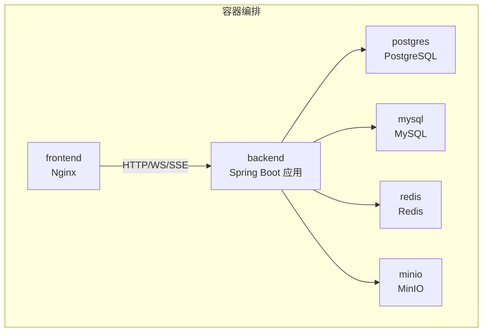
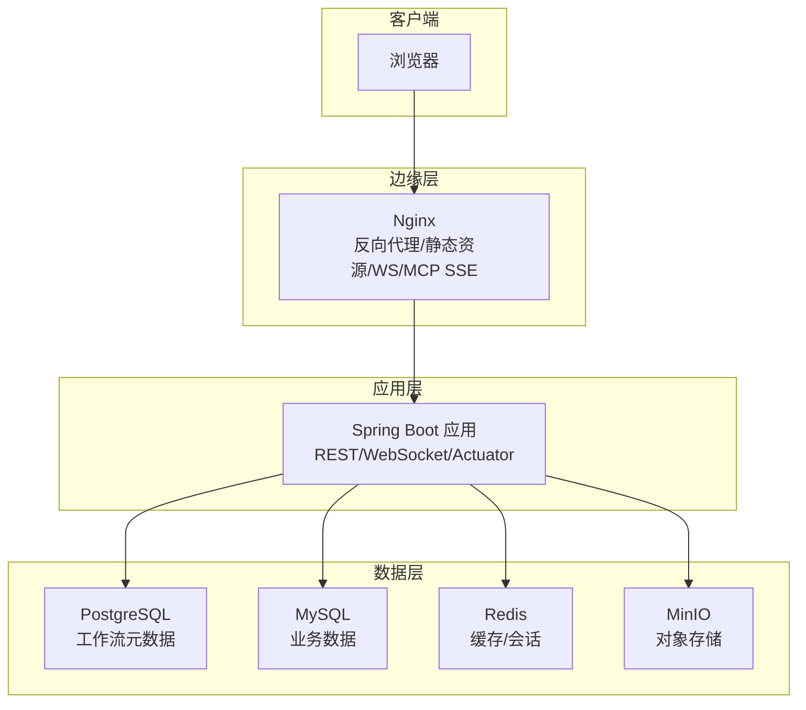
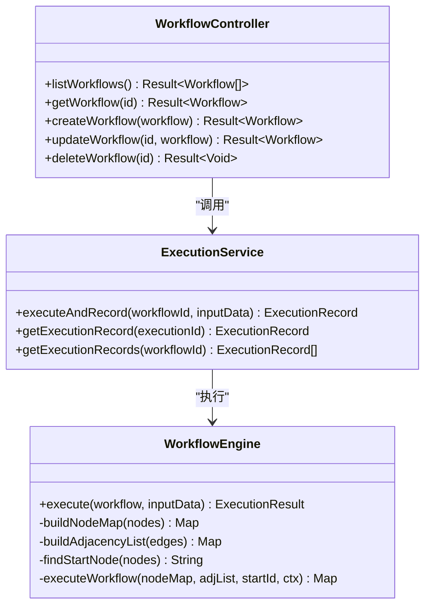
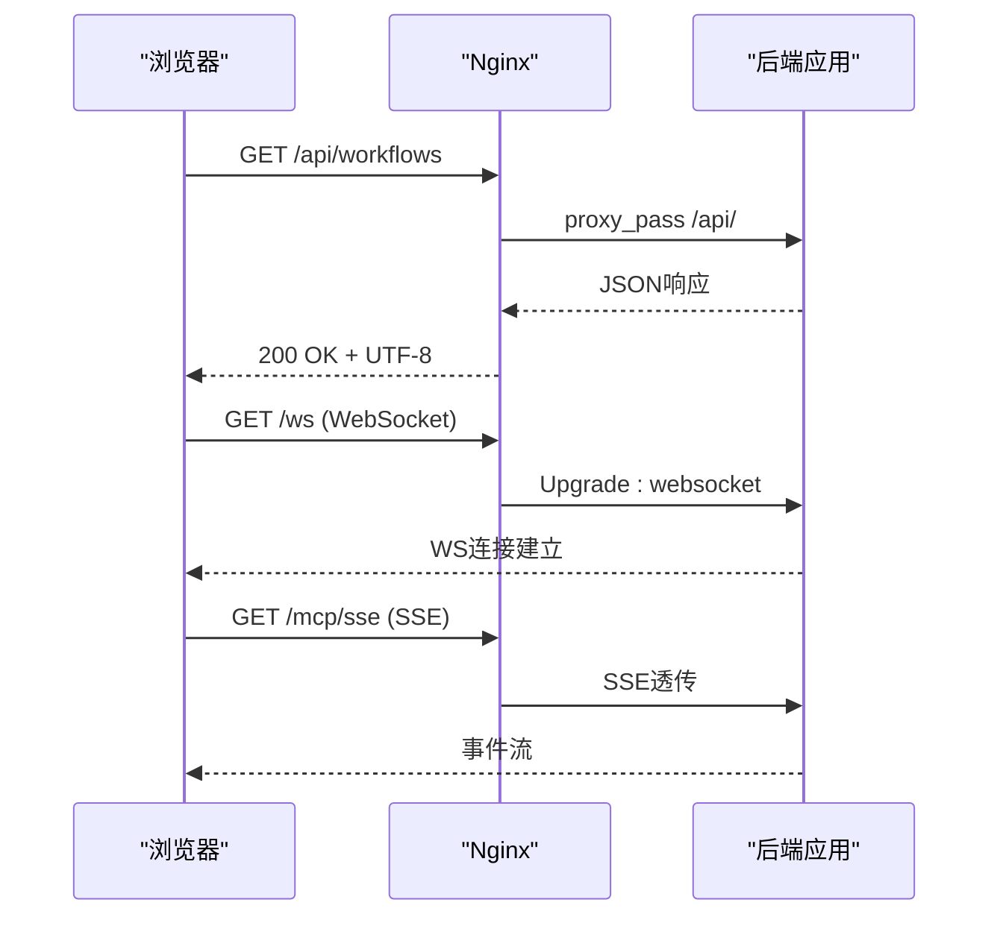
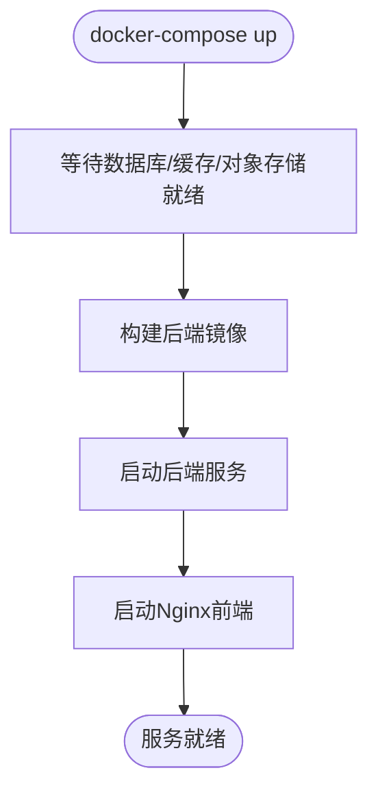
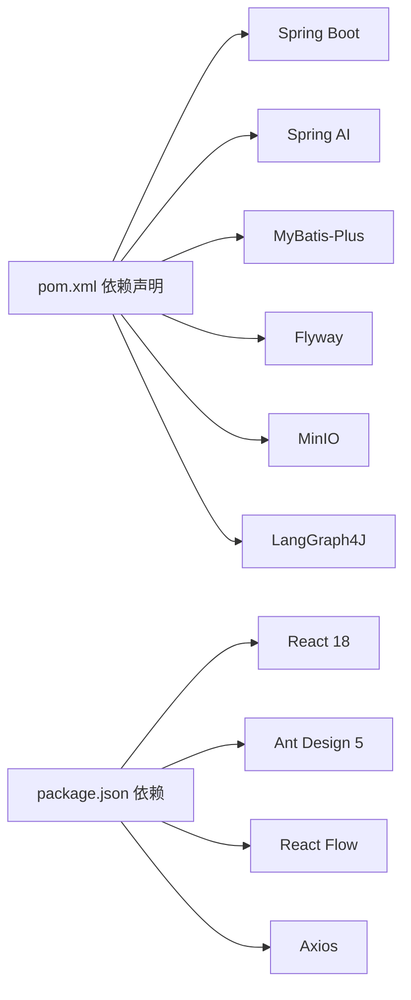

# 架构设计

<cite>
**本文引用的文件**
- [README.md](file://README.md)
- [BokAgentApplication.java](file://backend/src/main/java/com/bokagent/BokAgentApplication.java)
- [application.yml](file://backend/src/main/resources/application.yml)
- [docker-compose.yml](file://docker/docker-compose.yml)
- [nginx.conf](file://docker/nginx.conf)
- [Dockerfile.backend](file://docker/Dockerfile.backend)
- [pom.xml](file://backend/pom.xml)
- [WorkflowController.java](file://backend/src/main/java/com/bokagent/controller/WorkflowController.java)
- [WorkflowEngine.java](file://backend/src/main/java/com/bokagent/engine/WorkflowEngine.java)
- [ExecutionService.java](file://backend/src/main/java/com/bokagent/service/ExecutionService.java)
- [GlobalExceptionHandler.java](file://backend/src/main/java/com/bokagent/common/GlobalExceptionHandler.java)
- [Result.java](file://backend/src/main/java/com/bokagent/common/Result.java)
- [Workflow.java](file://backend/src/main/java/com/bokagent/entity/Workflow.java)
- [workflowApi.ts](file://frontend/src/services/workflowApi.ts)
- [package.json](file://frontend/package.json)
</cite>

## 目录
1. [引言](#引言)
2. [项目结构](#项目结构)
3. [核心组件](#核心组件)
4. [架构总览](#架构总览)
5. [详细组件分析](#详细组件分析)
6. [依赖分析](#依赖分析)
7. [性能考虑](#性能考虑)
8. [故障排查指南](#故障排查指南)
9. [结论](#结论)
10. [附录](#附录)

## 引言
本文件为BokAgent系统的架构设计文档，面向系统管理员与架构师，系统性阐述整体架构、分层设计、微服务分离策略、前后端交互模式、技术选型与权衡、容器化部署、安全架构、可扩展性与性能优化、监控告警等。BokAgent是一个基于React 18与Spring Boot 3.5的企业级AI Agent可视化工作流编排系统，支持多LLM厂商、MCP协议、TTS音频合成、插件生态与热插拔扩展。

## 项目结构
项目采用前后端分离与容器化统一编排的组织方式：
- 后端：Spring Boot应用，提供REST API、WebSocket、Actuator监控、多数据源与缓存集成。
- 前端：React 18 + TypeScript，基于Vite构建，Ant Design 5与React Flow进行可视化编辑。
- 容器：Docker Compose编排PostgreSQL、MySQL、Redis、MinIO、后端、前端(Nginx)。
- 部署：Nginx作为反向代理，统一处理静态资源、API转发、WebSocket升级与MCP SSE。

图表来源
- [docker-compose.yml:1-132](file://docker/docker-compose.yml#L1-L132)
- [nginx.conf:1-56](file://docker/nginx.conf#L1-L56)

章节来源
- [README.md:1-106](file://README.md#L1-L106)
- [docker-compose.yml:1-132](file://docker/docker-compose.yml#L1-L132)

## 核心组件
- 应用入口与编码保障：后端应用在启动时强制设置UTF-8编码，确保日志、文件与国际化一致。
- 控制器层：提供工作流的REST接口，统一返回包装结构。
- 服务层：封装执行流程编排与记录管理。
- 引擎层：基于图结构的工作流执行引擎，支持拓扑顺序执行与节点类型分发。
- 配置中心：application.yml集中管理数据库、缓存、AI模型、超时、重试、日志与Actuator。
- 前端API：Axios封装统一前缀，对接后端REST与WebSocket/MCP端点。
- 容器镜像：后端使用Temurin 21 JRE Alpine，内置健康检查与UTF-8环境变量。

章节来源
- [BokAgentApplication.java:1-56](file://backend/src/main/java/com/bokagent/BokAgentApplication.java#L1-L56)
- [WorkflowController.java:1-92](file://backend/src/main/java/com/bokagent/controller/WorkflowController.java#L1-L92)
- [ExecutionService.java:1-110](file://backend/src/main/java/com/bokagent/service/ExecutionService.java#L1-L110)
- [WorkflowEngine.java:1-169](file://backend/src/main/java/com/bokagent/engine/WorkflowEngine.java#L1-L169)
- [application.yml:1-182](file://backend/src/main/resources/application.yml#L1-L182)
- [workflowApi.ts:1-44](file://frontend/src/services/workflowApi.ts#L1-L44)
- [Dockerfile.backend:1-51](file://docker/Dockerfile.backend#L1-L51)

## 架构总览
系统采用“前端Nginx反向代理 + 后端Spring Boot微服务 + 多数据源”的分层架构：
- 表现层：Nginx提供静态资源、API代理、WebSocket升级、MCP SSE透传。
- 应用层：Spring Boot提供REST、WebSocket、Actuator、缓存、定时与异步线程池。
- 数据层：PostgreSQL存储工作流元数据；MySQL存储业务数据；Redis提供缓存与会话；MinIO提供对象存储。
- 安全与可观测性：统一异常处理、日志级别、Actuator暴露端点、健康检查。

图表来源
- [docker-compose.yml:1-132](file://docker/docker-compose.yml#L1-L132)
- [nginx.conf:1-56](file://docker/nginx.conf#L1-L56)
- [application.yml:1-182](file://backend/src/main/resources/application.yml#L1-L182)

## 详细组件分析

### 后端应用与启动
- 启动时强制设置UTF-8编码，避免中文与Emoji乱码。
- 设置默认Spring属性，保证Servlet层编码一致性。
- 日志记录编码信息，便于运维核验。

章节来源
- [BokAgentApplication.java:1-56](file://backend/src/main/java/com/bokagent/BokAgentApplication.java#L1-L56)

### 配置与数据源
- 数据源：PostgreSQL用于工作流元数据，MySQL用于业务数据，均通过环境变量注入。
- 缓存：Redis用于通用缓存、工具结果与LLM响应缓存，支持TTL配置。
- AI模型：OpenAI、Deepseek、通义千问通过Spring AI配置，支持自定义Base URL与模型选择。
- MinIO：对象存储，用于音频文件等二进制资源。
- 超时与重试：针对工具执行、LLM调用、TTS合成、MCP请求与工作流执行分别设定超时阈值，并配置默认重试策略。
- 日志与监控：Jackson序列化配置、日志级别、文件滚动、Actuator暴露health/info/metrics。

章节来源
- [application.yml:1-182](file://backend/src/main/resources/application.yml#L1-L182)

### 控制器与统一响应
- 控制器提供工作流的增删改查接口，使用统一响应包装类返回。
- 全局异常处理器捕获常见异常，返回标准化错误信息。

章节来源
- [WorkflowController.java:1-92](file://backend/src/main/java/com/bokagent/controller/WorkflowController.java#L1-L92)
- [Result.java:1-42](file://backend/src/main/java/com/bokagent/common/Result.java#L1-L42)
- [GlobalExceptionHandler.java:1-37](file://backend/src/main/java/com/bokagent/common/GlobalExceptionHandler.java#L1-L37)

### 工作流引擎与执行服务
- 引擎：基于图结构构建邻接表，拓扑遍历执行节点，按类型路由至对应执行器。
- 执行服务：负责查询工作流、创建执行记录、调用引擎执行、更新执行状态与结果。

图表来源
- [WorkflowEngine.java:1-169](file://backend/src/main/java/com/bokagent/engine/WorkflowEngine.java#L1-L169)
- [ExecutionService.java:1-110](file://backend/src/main/java/com/bokagent/service/ExecutionService.java#L1-L110)
- [WorkflowController.java:1-92](file://backend/src/main/java/com/bokagent/controller/WorkflowController.java#L1-L92)

章节来源
- [WorkflowEngine.java:1-169](file://backend/src/main/java/com/bokagent/engine/WorkflowEngine.java#L1-L169)
- [ExecutionService.java:1-110](file://backend/src/main/java/com/bokagent/service/ExecutionService.java#L1-L110)

### 前后端交互与Nginx代理
- 前端通过Axios以/api前缀访问后端REST接口。
- Nginx监听80端口，静态资源走/index.html回退，/api转发至后端8080。
- WebSocket与MCP SSE通过代理头透传，保持升级与流式传输。
- Nginx设置charset utf-8，确保响应头含UTF-8。

图表来源
- [nginx.conf:1-56](file://docker/nginx.conf#L1-L56)
- [workflowApi.ts:1-44](file://frontend/src/services/workflowApi.ts#L1-L44)

章节来源
- [nginx.conf:1-56](file://docker/nginx.conf#L1-L56)
- [workflowApi.ts:1-44](file://frontend/src/services/workflowApi.ts#L1-L44)

### 容器化与编排
- docker-compose定义postgres、mysql、redis、minio、backend、frontend服务。
- 后端镜像基于Maven构建，运行于Eclipse Temurin 21 JRE Alpine，设置时区与UTF-8。
- 健康检查通过Actuator健康端点，确保依赖可用后再启动上游服务。
- Nginx镜像构建包含UTF-8与代理配置，前端暴露80端口，后端暴露8080端口。

图表来源
- [docker-compose.yml:1-132](file://docker/docker-compose.yml#L1-L132)
- [Dockerfile.backend:1-51](file://docker/Dockerfile.backend#L1-L51)

章节来源
- [docker-compose.yml:1-132](file://docker/docker-compose.yml#L1-L132)
- [Dockerfile.backend:1-51](file://docker/Dockerfile.backend#L1-L51)

## 依赖分析
- 技术栈依赖：Spring Boot 3.5 + Spring AI 1.1 + MyBatis-Plus 3.5 + PostgreSQL/MySQL + Redis + MinIO。
- Maven依赖管理：通过Spring AI BOM统一版本，Flyway用于数据库迁移。
- 前端依赖：React 18、Ant Design 5、React Flow、Monaco Editor、Axios、Zustand等。

图表来源
- [pom.xml:1-170](file://backend/pom.xml#L1-L170)
- [package.json:1-37](file://frontend/package.json#L1-L37)

章节来源
- [pom.xml:1-170](file://backend/pom.xml#L1-L170)
- [package.json:1-37](file://frontend/package.json#L1-L37)

## 性能考虑
- 并发与线程：启用虚拟线程，提升高并发下的吞吐与低延迟。
- 缓存策略：针对工具结果与LLM响应设置不同TTL，减少重复计算与外部调用。
- 超时与重试：对LLM、工具、TTS、MCP与工作流执行设置合理超时与指数退避重试，避免雪崩。
- 数据库连接池：PostgreSQL Hikari最大池大小与空闲数配置，Flyway自动迁移降低上线风险。
- 日志与监控：Actuator暴露指标，结合日志滚动与级别控制，便于定位热点与瓶颈。

章节来源
- [application.yml:1-182](file://backend/src/main/resources/application.yml#L1-L182)

## 故障排查指南
- 编码问题：若出现中文乱码，检查后端启动日志中的编码信息与Nginx charset配置。
- 依赖不可达：查看compose中各服务健康检查，确认数据库、缓存、对象存储初始化完成。
- 接口异常：通过全局异常处理器返回的标准错误体定位参数或运行时异常。
- 执行失败：检查执行记录状态与错误信息，结合引擎日志定位具体节点与上下文。

章节来源
- [BokAgentApplication.java:1-56](file://backend/src/main/java/com/bokagent/BokAgentApplication.java#L1-L56)
- [GlobalExceptionHandler.java:1-37](file://backend/src/main/java/com/bokagent/common/GlobalExceptionHandler.java#L1-L37)
- [ExecutionService.java:1-110](file://backend/src/main/java/com/bokagent/service/ExecutionService.java#L1-L110)

## 结论
BokAgent采用“前端Nginx + 后端Spring Boot + 多数据源”的清晰分层架构，结合容器化编排与统一的UTF-8配置，具备良好的国际化与跨平台兼容性。通过缓存、超时与重试策略，系统在复杂工作流执行场景下具备较好的稳定性与性能表现。建议在生产环境中进一步完善鉴权、加密与访问控制，并结合Prometheus/Grafana实现更细粒度的监控告警。

## 附录
- 快速开始与Docker部署参见项目说明与Compose配置。
- 前端技术栈与UI组件库参见package.json。
- 后端实体与JSON字段处理参见Workflow实体与自定义TypeHandler。

章节来源
- [README.md:1-106](file://README.md#L1-L106)
- [package.json:1-37](file://frontend/package.json#L1-L37)
- [Workflow.java:1-32](file://backend/src/main/java/com/bokagent/entity/Workflow.java#L1-L32)