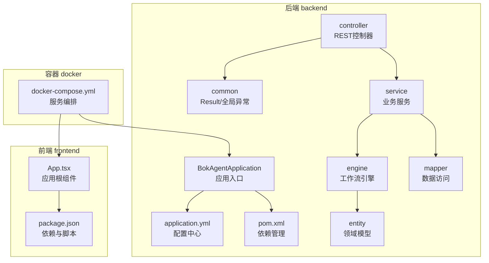
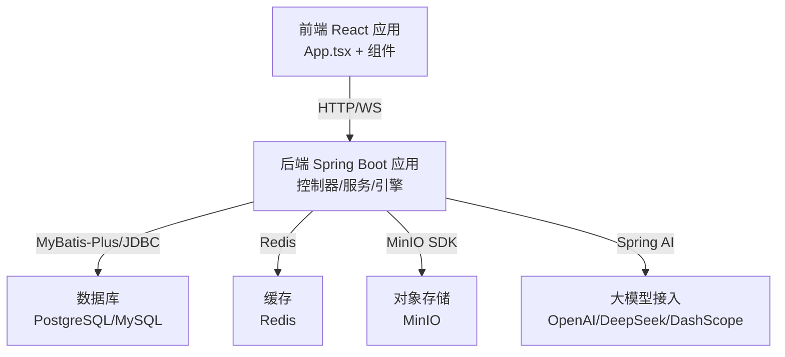
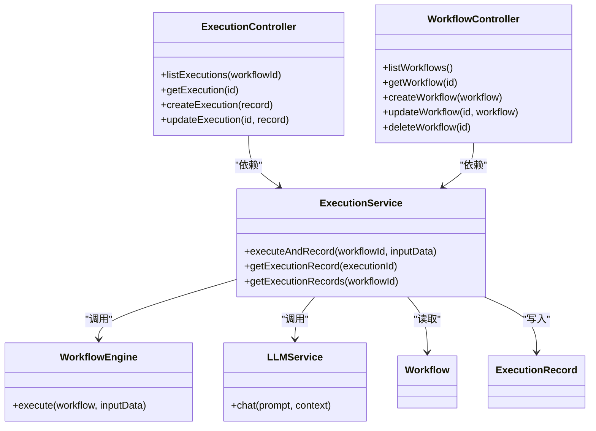
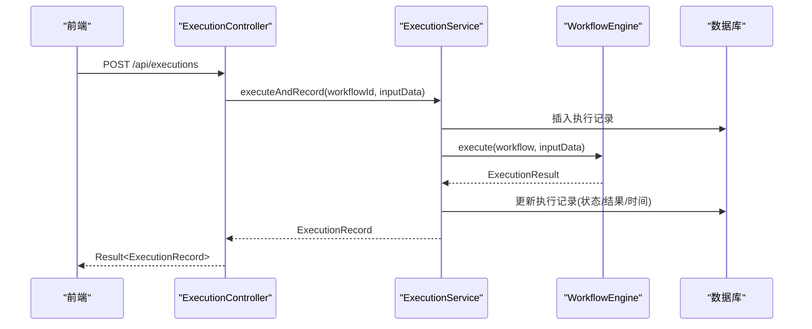
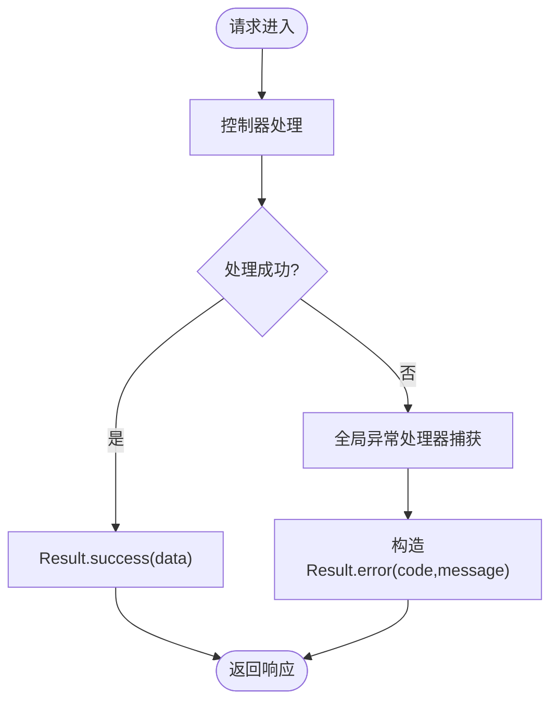
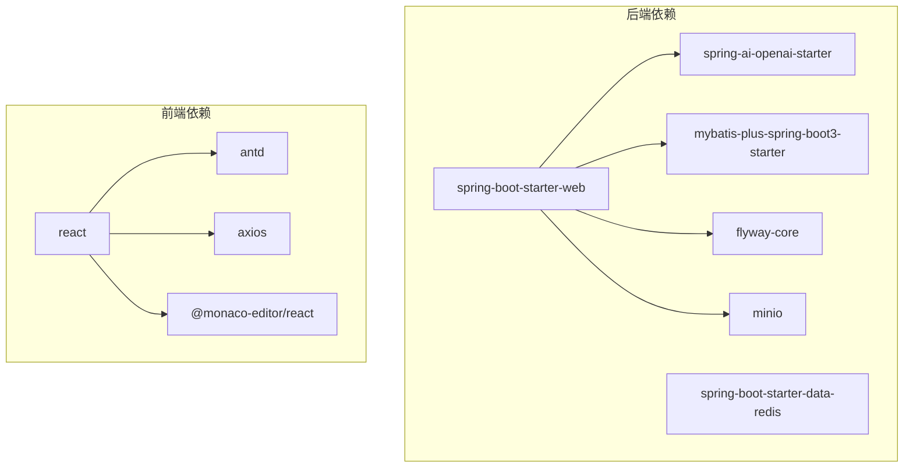

# 系统架构

<cite>
**本文引用的文件**
- [BokAgentApplication.java](file://backend/src/main/java/com/bokagent/BokAgentApplication.java)
- [application.yml](file://backend/src/main/resources/application.yml)
- [pom.xml](file://backend/pom.xml)
- [GlobalExceptionHandler.java](file://backend/src/main/java/com/bokagent/common/GlobalExceptionHandler.java)
- [Result.java](file://backend/src/main/java/com/bokagent/common/Result.java)
- [ExecutionController.java](file://backend/src/main/java/com/bokagent/controller/ExecutionController.java)
- [WorkflowController.java](file://backend/src/main/java/com/bokagent/controller/WorkflowController.java)
- [WorkflowEngine.java](file://backend/src/main/java/com/bokagent/engine/WorkflowEngine.java)
- [ExecutionService.java](file://backend/src/main/java/com/bokagent/service/ExecutionService.java)
- [LLMService.java](file://backend/src/main/java/com/bokagent/service/LLMService.java)
- [Workflow.java](file://backend/src/main/java/com/bokagent/entity/Workflow.java)
- [ExecutionRecord.java](file://backend/src/main/java/com/bokagent/entity/ExecutionRecord.java)
- [package.json](file://frontend/package.json)
- [App.tsx](file://frontend/src/App.tsx)
- [docker-compose.yml](file://docker/docker-compose.yml)
</cite>

## 目录
1. [引言](#引言)
2. [项目结构](#项目结构)
3. [核心组件](#核心组件)
4. [架构总览](#架构总览)
5. [详细组件分析](#详细组件分析)
6. [依赖关系分析](#依赖关系分析)
7. [性能考量](#性能考量)
8. [故障排查指南](#故障排查指南)
9. [结论](#结论)
10. [附录](#附录)

## 引言
本文件为BokAgent系统的架构文档，聚焦于分层架构设计与前后端分离实践。系统采用Spring Boot作为后端技术栈，结合MyBatis-Plus进行数据持久化，集成Spring AI以支持多模型厂商（OpenAI、DeepSeek、DashScope）对话能力；前端采用React + TypeScript，通过Vite构建，配合Ant Design与Monaco Editor等组件实现可视化工作流编辑与调试界面。系统通过统一异常处理与响应包装，确保接口一致性与可维护性；通过Docker Compose实现数据库、缓存、对象存储与后端服务的一体化编排。

## 项目结构
项目采用前后端分离的目录组织方式，后端位于backend目录，前端位于frontend目录，容器化与部署相关配置位于docker目录。整体结构如下：

图表来源
- [BokAgentApplication.java:1-56](file://backend/src/main/java/com/bokagent/BokAgentApplication.java#L1-L56)
- [application.yml:1-190](file://backend/src/main/resources/application.yml#L1-L190)
- [pom.xml:1-170](file://backend/pom.xml#L1-L170)
- [ExecutionController.java:1-81](file://backend/src/main/java/com/bokagent/controller/ExecutionController.java#L1-L81)
- [WorkflowController.java:1-92](file://backend/src/main/java/com/bokagent/controller/WorkflowController.java#L1-L92)
- [ExecutionService.java:1-113](file://backend/src/main/java/com/bokagent/service/ExecutionService.java#L1-L113)
- [WorkflowEngine.java:1-171](file://backend/src/main/java/com/bokagent/engine/WorkflowEngine.java#L1-L171)
- [Workflow.java:1-32](file://backend/src/main/java/com/bokagent/entity/Workflow.java#L1-L32)
- [ExecutionRecord.java:1-40](file://backend/src/main/java/com/bokagent/entity/ExecutionRecord.java#L1-L40)
- [App.tsx:1-21](file://frontend/src/App.tsx#L1-L21)
- [package.json:1-37](file://frontend/package.json#L1-L37)
- [docker-compose.yml:1-132](file://docker/docker-compose.yml#L1-L132)

章节来源
- [BokAgentApplication.java:1-56](file://backend/src/main/java/com/bokagent/BokAgentApplication.java#L1-L56)
- [application.yml:1-190](file://backend/src/main/resources/application.yml#L1-L190)
- [pom.xml:1-170](file://backend/pom.xml#L1-L170)
- [docker-compose.yml:1-132](file://docker/docker-compose.yml#L1-L132)

## 核心组件
- 应用入口与配置
  - 应用入口负责设置编码、默认属性与日志输出，确保系统在UTF-8环境下的稳定运行。
  - 配置文件集中管理服务器端口、数据库连接、缓存、AI模型接入、超时与重试策略、日志级别等。
- 统一响应与异常处理
  - 统一响应包装Result提供success/error静态方法，保证前后端一致的数据契约。
  - 全局异常处理器对常见异常进行分类处理，并返回标准化错误码与消息。
- 控制器层
  - 工作流控制器与执行记录控制器分别提供REST接口，负责接收请求、记录日志并返回Result包装的结果。
- 服务层
  - 执行服务负责工作流执行流程编排、执行记录创建与状态更新，并通过引擎选择器获取具体执行器。
  - LLM服务封装Spring AI的ChatClient，统一提示词构建与调用逻辑。
- 引擎与实体
  - 工作流引擎负责解析图结构、拓扑执行与上下文传递；实体类承载工作流定义与执行记录的字段与类型映射。
- 前端组件
  - 应用根组件负责布局与标题展示，工作流编辑器组件提供可视化编辑体验；包管理文件定义依赖与构建脚本。

章节来源
- [BokAgentApplication.java:16-43](file://backend/src/main/java/com/bokagent/BokAgentApplication.java#L16-L43)
- [application.yml:1-190](file://backend/src/main/resources/application.yml#L1-L190)
- [Result.java:1-42](file://backend/src/main/java/com/bokagent/common/Result.java#L1-L42)
- [GlobalExceptionHandler.java:1-37](file://backend/src/main/java/com/bokagent/common/GlobalExceptionHandler.java#L1-L37)
- [ExecutionController.java:1-81](file://backend/src/main/java/com/bokagent/controller/ExecutionController.java#L1-L81)
- [WorkflowController.java:1-92](file://backend/src/main/java/com/bokagent/controller/WorkflowController.java#L1-L92)
- [ExecutionService.java:1-113](file://backend/src/main/java/com/bokagent/service/ExecutionService.java#L1-L113)
- [LLMService.java:1-67](file://backend/src/main/java/com/bokagent/service/LLMService.java#L1-L67)
- [WorkflowEngine.java:1-171](file://backend/src/main/java/com/bokagent/engine/WorkflowEngine.java#L1-L171)
- [Workflow.java:1-32](file://backend/src/main/java/com/bokagent/entity/Workflow.java#L1-L32)
- [ExecutionRecord.java:1-40](file://backend/src/main/java/com/bokagent/entity/ExecutionRecord.java#L1-L40)
- [App.tsx:1-21](file://frontend/src/App.tsx#L1-L21)
- [package.json:1-37](file://frontend/package.json#L1-L37)

## 架构总览
系统采用典型的三层架构：表现层（前端）、业务层（后端服务）、数据层（数据库/缓存/对象存储）。后端通过Spring MVC提供REST接口，服务层协调引擎与数据访问层，统一响应与异常处理贯穿各层。容器编排将PostgreSQL、MySQL、Redis、MinIO与后端/前端服务整合，便于本地开发与部署。

图表来源
- [App.tsx:1-21](file://frontend/src/App.tsx#L1-L21)
- [BokAgentApplication.java:1-56](file://backend/src/main/java/com/bokagent/BokAgentApplication.java#L1-L56)
- [application.yml:16-67](file://backend/src/main/resources/application.yml#L16-L67)
- [docker-compose.yml:4-81](file://docker/docker-compose.yml#L4-L81)

## 详细组件分析

### 分层架构与职责划分
- 表现层（前端）
  - 职责：提供工作流编辑与调试界面，调用后端REST接口，渲染状态与结果。
  - 技术：React + TypeScript + Ant Design + Monaco Editor + Axios。
- 业务层（后端）
  - 职责：接收请求、编排执行流程、调用引擎与LLM服务、持久化执行记录。
  - 实现：控制器负责路由与参数校验，服务层负责业务编排，引擎负责图执行。
- 数据层（后端）
  - 职责：通过MyBatis-Plus访问数据库，Flyway进行迁移，Redis提供缓存，MinIO提供对象存储。
  - 配置：application.yml集中管理数据源、缓存、AI接入与超时策略。

图表来源
- [ExecutionController.java:1-81](file://backend/src/main/java/com/bokagent/controller/ExecutionController.java#L1-L81)
- [WorkflowController.java:1-92](file://backend/src/main/java/com/bokagent/controller/WorkflowController.java#L1-L92)
- [ExecutionService.java:1-113](file://backend/src/main/java/com/bokagent/service/ExecutionService.java#L1-L113)
- [LLMService.java:1-67](file://backend/src/main/java/com/bokagent/service/LLMService.java#L1-L67)
- [WorkflowEngine.java:1-171](file://backend/src/main/java/com/bokagent/engine/WorkflowEngine.java#L1-L171)
- [Workflow.java:1-32](file://backend/src/main/java/com/bokagent/entity/Workflow.java#L1-L32)
- [ExecutionRecord.java:1-40](file://backend/src/main/java/com/bokagent/entity/ExecutionRecord.java#L1-L40)

章节来源
- [ExecutionController.java:1-81](file://backend/src/main/java/com/bokagent/controller/ExecutionController.java#L1-L81)
- [WorkflowController.java:1-92](file://backend/src/main/java/com/bokagent/controller/WorkflowController.java#L1-L92)
- [ExecutionService.java:1-113](file://backend/src/main/java/com/bokagent/service/ExecutionService.java#L1-L113)
- [LLMService.java:1-67](file://backend/src/main/java/com/bokagent/service/LLMService.java#L1-L67)
- [WorkflowEngine.java:1-171](file://backend/src/main/java/com/bokagent/engine/WorkflowEngine.java#L1-L171)
- [Workflow.java:1-32](file://backend/src/main/java/com/bokagent/entity/Workflow.java#L1-L32)
- [ExecutionRecord.java:1-40](file://backend/src/main/java/com/bokagent/entity/ExecutionRecord.java#L1-L40)

### MVC模式在后端的实现
- 控制器（Controller）
  - 路由：基于@RequestMapping与@RestController，提供工作流与执行记录的CRUD接口。
  - 参数：使用@PathVariable与@RequestBody接收路径参数与请求体。
  - 返回：统一返回Result包装，避免直接抛出异常导致格式不一致。
- 服务（Service）
  - 业务编排：根据工作流ID加载定义，创建执行记录，调用引擎执行，更新状态与结果。
  - 异常：捕获执行过程中的异常并标记为失败，确保幂等与可观测性。
- 数据访问（Mapper/Entity）
  - MyBatis-Plus：通过注解与XML映射数据库表，支持自动ID与驼峰命名。
  - 自定义类型处理器：JsonbTypeHandler用于JSON字段的序列化/反序列化。

图表来源
- [ExecutionController.java:52-60](file://backend/src/main/java/com/bokagent/controller/ExecutionController.java#L52-L60)
- [ExecutionService.java:39-92](file://backend/src/main/java/com/bokagent/service/ExecutionService.java#L39-L92)
- [WorkflowEngine.java:47-82](file://backend/src/main/java/com/bokagent/engine/WorkflowEngine.java#L47-L82)

章节来源
- [ExecutionController.java:1-81](file://backend/src/main/java/com/bokagent/controller/ExecutionController.java#L1-L81)
- [ExecutionService.java:1-113](file://backend/src/main/java/com/bokagent/service/ExecutionService.java#L1-L113)
- [WorkflowEngine.java:1-171](file://backend/src/main/java/com/bokagent/engine/WorkflowEngine.java#L1-L171)

### 统一异常处理与响应包装
- 响应包装
  - Result提供success/error静态方法，统一返回code/message/data结构，便于前端解析。
- 全局异常
  - 全局异常处理器针对Exception、IllegalArgumentException、RuntimeException进行分类处理，返回对应HTTP状态码与错误信息。
- 控制器层
  - 控制器在查询不到资源时返回404错误，避免空指针与不一致的响应格式。

图表来源
- [Result.java:14-40](file://backend/src/main/java/com/bokagent/common/Result.java#L14-L40)
- [GlobalExceptionHandler.java:16-35](file://backend/src/main/java/com/bokagent/common/GlobalExceptionHandler.java#L16-L35)
- [ExecutionController.java:43-46](file://backend/src/main/java/com/bokagent/controller/ExecutionController.java#L43-L46)

章节来源
- [Result.java:1-42](file://backend/src/main/java/com/bokagent/common/Result.java#L1-L42)
- [GlobalExceptionHandler.java:1-37](file://backend/src/main/java/com/bokagent/common/GlobalExceptionHandler.java#L1-L37)
- [ExecutionController.java:1-81](file://backend/src/main/java/com/bokagent/controller/ExecutionController.java#L1-L81)

### 前后端分离架构优势
- 独立开发
  - 前后端通过REST接口通信，前端使用Axios调用后端接口，支持Mock与联调。
- 独立部署
  - Docker Compose将后端、前端、数据库、缓存、对象存储打包，一键部署。
- 独立扩展
  - 后端可横向扩展实例，前端通过Nginx或CDN分发，数据库与缓存可独立扩容。

章节来源
- [docker-compose.yml:83-126](file://docker/docker-compose.yml#L83-L126)
- [package.json:12-23](file://frontend/package.json#L12-L23)

## 依赖关系分析
后端依赖以Spring Boot为核心，集成Web、Redis、Actuator、MyBatis-Plus、Flyway、MinIO与Spring AI；前端依赖React、Ant Design、Axios、Monaco Editor等。依赖关系如下：

图表来源
- [pom.xml:30-127](file://backend/pom.xml#L30-L127)
- [package.json:12-23](file://frontend/package.json#L12-L23)

章节来源
- [pom.xml:1-170](file://backend/pom.xml#L1-L170)
- [package.json:1-37](file://frontend/package.json#L1-L37)

## 性能考量
- 连接池与缓存
  - Hikari连接池与Redis连接池参数已在配置中设定，建议根据并发与数据量调整最大连接数与空闲连接数。
- 超时与重试
  - 配置中定义了工具执行、LLM调用、TTS合成、MCP请求与工作流执行的超时阈值，以及默认重试策略，建议结合监控指标动态优化。
- 日志与可观测性
  - 开启DEBUG级别日志便于问题定位，生产环境建议降低日志级别并配置滚动日志文件大小与保留天数。

章节来源
- [application.yml:22-43](file://backend/src/main/resources/application.yml#L22-L43)
- [application.yml:149-155](file://backend/src/main/resources/application.yml#L149-L155)
- [application.yml:164-180](file://backend/src/main/resources/application.yml#L164-L180)

## 故障排查指南
- 启动编码问题
  - 应用入口与配置均强制UTF-8编码，若出现乱码，请检查系统区域与容器时区设置。
- 数据库连接
  - docker-compose中PostgreSQL与MySQL已设置UTF-8与字符集，确认环境变量与卷挂载正确。
- 接口返回异常
  - 若返回非Result格式，请检查控制器是否正确返回Result或是否被全局异常处理器拦截。
- LLM调用失败
  - 检查OpenAI/DeepSeek/DashScope的API Key与Base URL配置，确认网络连通性与超时设置。

章节来源
- [BokAgentApplication.java:22-34](file://backend/src/main/java/com/bokagent/BokAgentApplication.java#L22-L34)
- [application.yml:16-67](file://backend/src/main/resources/application.yml#L16-L67)
- [docker-compose.yml:11-49](file://docker/docker-compose.yml#L11-L49)
- [GlobalExceptionHandler.java:16-35](file://backend/src/main/java/com/bokagent/common/GlobalExceptionHandler.java#L16-L35)

## 结论
BokAgent系统通过Spring Boot + React的组合实现了清晰的前后端分离与分层架构。后端以控制器-服务-引擎-数据访问的职责划分支撑工作流编排与执行，统一响应与异常处理提升了接口一致性与可维护性。容器化编排简化了部署与扩展，为后续的功能演进与性能优化提供了坚实基础。

## 附录
- 快速启动
  - 使用Docker Compose一键启动后端、前端、数据库、缓存与对象存储服务。
- 前端开发
  - 使用Vite进行开发与构建，依赖React与Ant Design实现UI组件与交互。
- 后端开发
  - 使用Spring Boot与MyBatis-Plus进行接口与数据访问开发，集成Spring AI与MinIO。

章节来源
- [docker-compose.yml:1-132](file://docker/docker-compose.yml#L1-L132)
- [package.json:1-37](file://frontend/package.json#L1-L37)
- [pom.xml:1-170](file://backend/pom.xml#L1-L170)