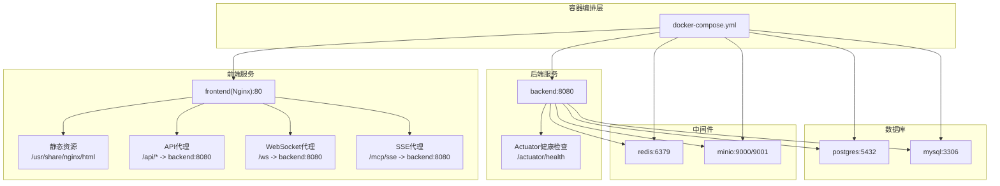
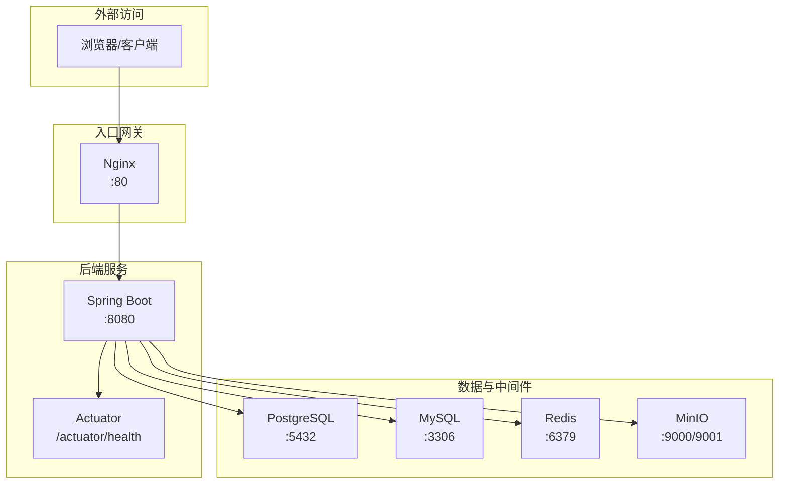
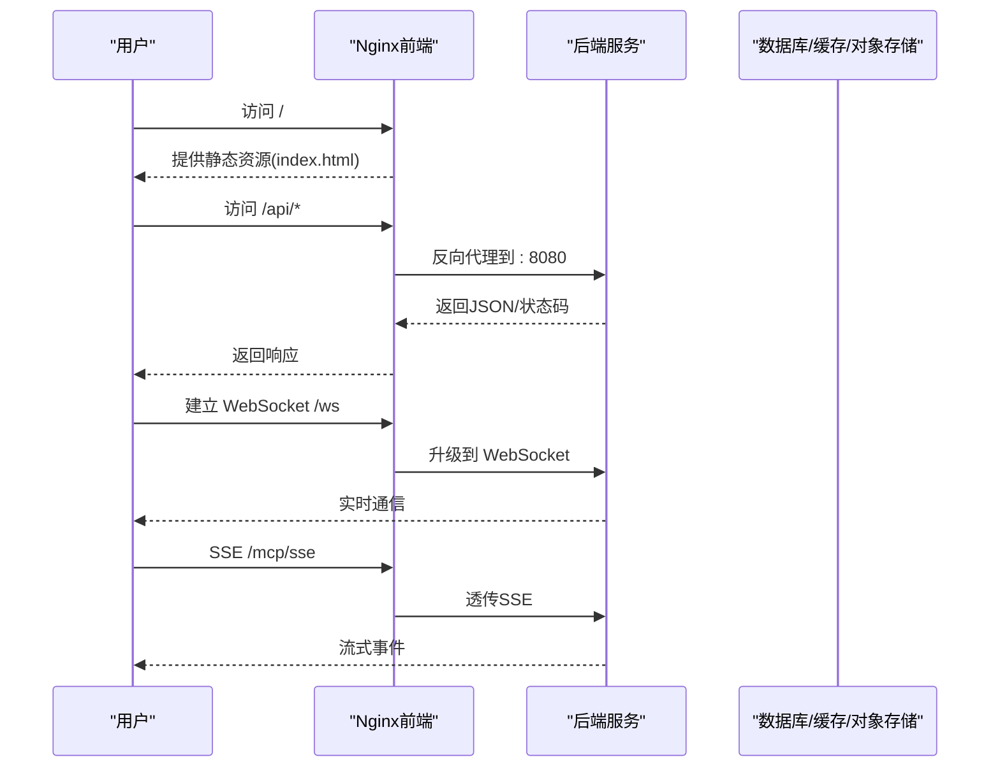
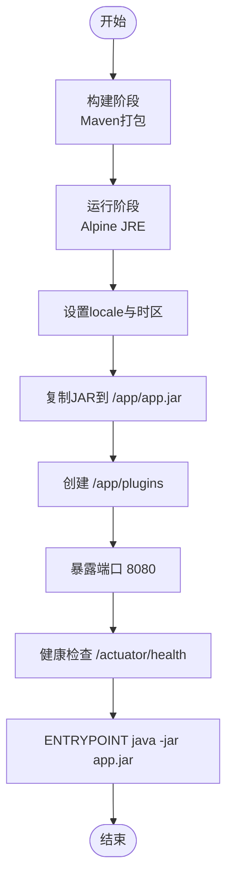
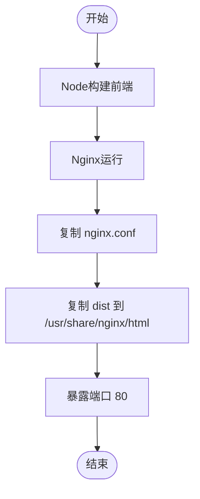
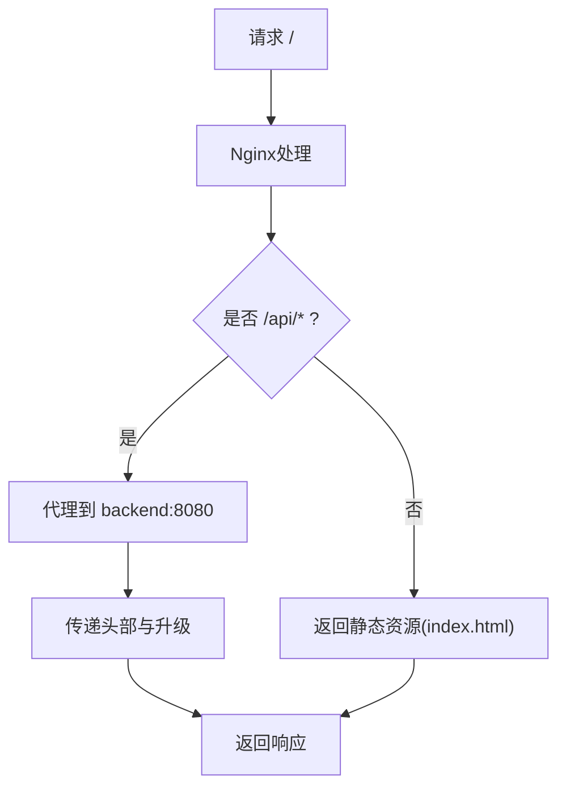
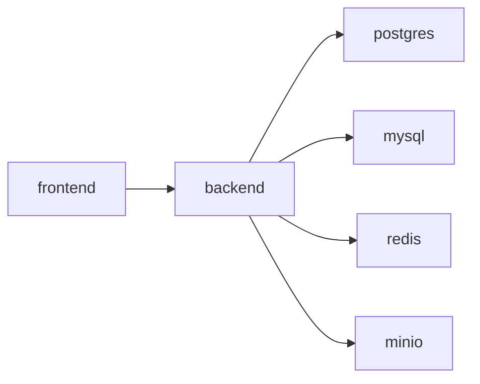

# 部署架构

<cite>
**本文引用的文件**
- [docker-compose.yml](file://docker/docker-compose.yml)
- [Dockerfile.backend](file://docker/Dockerfile.backend)
- [Dockerfile.frontend](file://docker/Dockerfile.frontend)
- [nginx.conf](file://docker/nginx.conf)
- [application.yml](file://backend/src/main/resources/application.yml)
- [init-postgres.sql](file://docker/init-postgres.sql)
- [init-mysql.sql](file://docker/init-mysql.sql)
- [start.sh](file://start.sh)
- [start.ps1](file://start.ps1)
- [README.md](file://README.md)
- [pom.xml](file://backend/pom.xml)
- [package.json](file://frontend/package.json)
</cite>

## 目录
1. [简介](#简介)
2. [项目结构](#项目结构)
3. [核心组件](#核心组件)
4. [架构总览](#架构总览)
5. [详细组件分析](#详细组件分析)
6. [依赖关系分析](#依赖关系分析)
7. [性能考虑](#性能考虑)
8. [故障排查指南](#故障排查指南)
9. [结论](#结论)
10. [附录](#附录)

## 简介
本文件面向BokAgent系统的部署与运维，围绕Docker容器化部署策略展开，覆盖后端与前端镜像构建流程、Docker Compose服务编排配置、Nginx反向代理与静态资源服务、多环境部署策略、容器网络与端口映射、负载均衡与健康检查、故障恢复策略以及完整的部署清单与最佳实践。文档同时强调UTF-8与中文支持的端到端一致性，确保生产环境稳定可靠。

## 项目结构
BokAgent采用前后端分离的微服务架构，通过Docker Compose统一编排以下服务：
- 数据库：PostgreSQL（工作流数据）、MySQL（业务数据）
- 缓存：Redis
- 对象存储：MinIO
- 后端服务：Spring Boot应用（暴露REST API、WebSocket、MCP SSE/WebSocket）
- 前端服务：Nginx提供静态资源与API代理

图表来源
- [docker-compose.yml:1-132](file://docker/docker-compose.yml#L1-L132)
- [nginx.conf:1-56](file://docker/nginx.conf#L1-L56)
- [application.yml:181-190](file://backend/src/main/resources/application.yml#L181-L190)

章节来源
- [docker-compose.yml:1-132](file://docker/docker-compose.yml#L1-L132)
- [README.md:30-50](file://README.md#L30-L50)

## 核心组件
- PostgreSQL（工作流数据）：负责工作流元数据、执行记录等；初始化脚本确保UTF-8编码与扩展启用。
- MySQL（业务数据）：负责业务相关表；初始化脚本确保utf8mb4编码。
- Redis：缓存与会话存储。
- MinIO：对象存储，提供S3兼容接口与Web控制台。
- 后端服务：Spring Boot应用，提供REST API、WebSocket、MCP协议（SSE/WebSocket），内置Actuator健康检查。
- 前端服务：Nginx静态站点，代理/api/到后端，支持WebSocket与SSE。

章节来源
- [docker-compose.yml:4-26](file://docker/docker-compose.yml#L4-L26)
- [docker-compose.yml:28-49](file://docker/docker-compose.yml#L28-L49)
- [docker-compose.yml:51-63](file://docker/docker-compose.yml#L51-L63)
- [docker-compose.yml:65-81](file://docker/docker-compose.yml#L65-L81)
- [docker-compose.yml:83-114](file://docker/docker-compose.yml#L83-L114)
- [docker-compose.yml:115-126](file://docker/docker-compose.yml#L115-L126)

## 架构总览
下图展示容器间依赖关系与网络拓扑，以及Nginx如何作为入口代理API与静态资源。

图表来源
- [docker-compose.yml:115-126](file://docker/docker-compose.yml#L115-L126)
- [docker-compose.yml:83-114](file://docker/docker-compose.yml#L83-L114)
- [application.yml:181-190](file://backend/src/main/resources/application.yml#L181-L190)

## 详细组件分析

### Docker Compose服务编排
- 数据库服务：PostgreSQL与MySQL分别挂载初始化SQL脚本，设置UTF-8编码参数，并暴露宿主机端口。
- 缓存与对象存储：Redis持久化到卷，MinIO提供控制台端口与服务端口。
- 后端服务：构建自后端源码，注入数据库、缓存、对象存储连接信息与API密钥，暴露8080端口，依赖所有上游服务健康。
- 前端服务：构建自前端源码，复制Nginx配置，暴露80端口，依赖后端服务。

图表来源
- [docker-compose.yml:115-126](file://docker/docker-compose.yml#L115-L126)
- [nginx.conf:20-54](file://docker/nginx.conf#L20-L54)
- [application.yml:116-136](file://backend/src/main/resources/application.yml#L116-L136)

章节来源
- [docker-compose.yml:1-132](file://docker/docker-compose.yml#L1-L132)

### 后端镜像构建（Dockerfile.backend）
- 多阶段构建：Maven构建阶段生成JAR，运行阶段使用Alpine JRE。
- 字符集与时区：安装tzdata并设置Asia/Shanghai时区，JVM参数强制UTF-8。
- 健康检查：通过Actuator健康端点进行探测。
- 插件目录：在容器内创建/plugins目录以支持热插拔插件。
- 入口命令：启用虚拟线程，指定JAR运行。

图表来源
- [Dockerfile.backend:1-51](file://docker/Dockerfile.backend#L1-L51)

章节来源
- [Dockerfile.backend:1-51](file://docker/Dockerfile.backend#L1-L51)

### 前端镜像构建（Dockerfile.frontend）
- 多阶段构建：Node构建产物，Nginx运行静态资源。
- 字符集与时区：设置UTF-8与Asia/Shanghai。
- 静态资源：复制dist到Nginx默认站点根目录。
- Nginx配置：复制docker/nginx.conf，启用UTF-8字符集与API代理。

图表来源
- [Dockerfile.frontend:1-35](file://docker/Dockerfile.frontend#L1-L35)
- [nginx.conf:1-56](file://docker/nginx.conf#L1-L56)

章节来源
- [Dockerfile.frontend:1-35](file://docker/Dockerfile.frontend#L1-L35)
- [nginx.conf:1-56](file://docker/nginx.conf#L1-L56)

### Nginx反向代理配置
- 静态资源：根路径返回index.html，确保Content-Type包含UTF-8。
- API代理：/api/前缀代理到后端8080端口，传递Host、X-Real-IP、X-Forwarded-*等头部。
- WebSocket：/ws路径升级到WebSocket，保持连接。
- SSE：/mcp/sse路径关闭代理缓冲与缓存，透传SSE流。
- 字符集：全局charset utf-8，适配多种文本类型。

图表来源
- [nginx.conf:12-34](file://docker/nginx.conf#L12-L34)

章节来源
- [nginx.conf:1-56](file://docker/nginx.conf#L1-L56)

### 数据库初始化与编码
- PostgreSQL：初始化脚本创建UTF8数据库，启用uuid-ossp与pg_trgm扩展，验证编码。
- MySQL：初始化脚本创建utf8mb4数据库，验证字符集与排序规则。

章节来源
- [init-postgres.sql:1-20](file://docker/init-postgres.sql#L1-L20)
- [init-mysql.sql:1-12](file://docker/init-mysql.sql#L1-L12)

### 后端配置与健康检查
- 应用配置：Spring Boot监听8080端口，启用UTF-8编码，激活docker配置文件。
- 数据源：PostgreSQL与MySQL连接参数来自环境变量，Flyway自动迁移。
- 缓存与对象存储：Redis与MinIO连接参数来自环境变量。
- Actuator：暴露health、info、metrics端点，用于容器健康检查。
- MCP协议：启用SSE与WebSocket传输路径。

章节来源
- [application.yml:1-190](file://backend/src/main/resources/application.yml#L1-L190)

### 启动与验证脚本
- 自动检测.env文件，不存在则从示例模板复制。
- 启动Docker Compose并等待服务启动。
- 验证PostgreSQL与MySQL编码，插入中文与Emoji测试数据。
- 输出访问地址与常用运维命令。

章节来源
- [start.sh:1-58](file://start.sh#L1-L58)
- [start.ps1:1-65](file://start.ps1#L1-L65)

## 依赖关系分析
- 服务耦合与顺序：后端服务依赖数据库、缓存、对象存储均处于健康状态；前端依赖后端服务。
- 网络与端口：容器间通过服务名通信（如postgres、mysql、redis、minio、backend），宿主机端口映射用于外部访问。
- 外部依赖：Spring Boot依赖PostgreSQL、MySQL、Redis、MinIO；前端依赖后端API与WebSocket/SSE。

图表来源
- [docker-compose.yml:105-125](file://docker/docker-compose.yml#L105-L125)

章节来源
- [docker-compose.yml:1-132](file://docker/docker-compose.yml#L1-L132)

## 性能考虑
- 连接池与线程：后端使用Hikari连接池与虚拟线程，提升并发与内存效率。
- 缓存策略：启用缓存并设置不同键空间的TTL，降低数据库压力。
- 超时与重试：针对工具执行、LLM调用、TTS合成、MCP请求与工作流执行设置合理超时与重试策略。
- 数据库参数：PostgreSQL设置最大连接数与共享缓冲，MySQL设置字符集与时区。
- 前端静态资源：Nginx启用UTF-8字符集，减少字符编码问题导致的性能损耗。

章节来源
- [application.yml:22-25](file://backend/src/main/resources/application.yml#L22-L25)
- [application.yml:82-89](file://backend/src/main/resources/application.yml#L82-L89)
- [application.yml:157-163](file://backend/src/main/resources/application.yml#L157-L163)
- [application.yml:149-156](file://backend/src/main/resources/application.yml#L149-L156)
- [docker-compose.yml:18-22](file://docker/docker-compose.yml#L18-L22)
- [docker-compose.yml:41-44](file://docker/docker-compose.yml#L41-L44)
- [nginx.conf:8-11](file://docker/nginx.conf#L8-L11)

## 故障排查指南
- 健康检查失败
  - 后端：检查Actuator健康端点是否可达，确认数据库连接参数与网络连通性。
  - 数据库：确认初始化脚本执行成功，编码校验通过。
  - 缓存与对象存储：确认容器健康检查命令返回成功。
- 中文显示异常
  - 检查Nginx字符集配置、容器locale与时区设置、JVM编码参数、数据库字符集。
- API不可达或代理失败
  - 确认Nginx代理配置正确，后端端口映射与容器名称一致。
- WebSocket/SSE连接问题
  - 检查Upgrade头部与Connection字段，确认后端MCP配置启用对应传输。
- 日志定位
  - 查看后端日志文件位置与级别，结合容器日志输出进行定位。

章节来源
- [application.yml:164-180](file://backend/src/main/resources/application.yml#L164-L180)
- [docker-compose.yml:22-26](file://docker/docker-compose.yml#L22-L26)
- [docker-compose.yml:45-49](file://docker/docker-compose.yml#L45-L49)
- [docker-compose.yml:59-63](file://docker/docker-compose.yml#L59-L63)
- [docker-compose.yml:77-81](file://docker/docker-compose.yml#L77-L81)
- [nginx.conf:20-54](file://docker/nginx.conf#L20-L54)

## 结论
BokAgent的部署架构以Docker容器化为核心，通过Compose实现多服务编排，Nginx提供统一入口与代理能力，后端应用具备完善的健康检查与性能配置。整体方案强调UTF-8与中文支持的一致性，满足开发、测试与生产的多环境需求。建议在生产环境中引入负载均衡、SSL终止与持久化策略，并结合监控与告警体系完善运维保障。

## 附录

### 多环境部署策略
- 开发环境：使用docker配置文件，最小化依赖，便于快速迭代。
- 测试环境：启用更严格的超时与重试策略，开启详细日志级别。
- 生产环境：启用负载均衡与SSL终止，使用独立的数据库与对象存储实例，配置高可用与备份策略。

章节来源
- [application.yml:13-14](file://backend/src/main/resources/application.yml#L13-L14)
- [docker-compose.yml:88-100](file://docker/docker-compose.yml#L88-L100)

### 容器网络与端口映射
- 外部访问端口
  - 前端：80
  - 后端：8080
  - MinIO控制台：9001
- 内部服务通信
  - 后端通过服务名访问数据库、缓存与对象存储，无需暴露宿主机端口。

章节来源
- [docker-compose.yml:16-17](file://docker/docker-compose.yml#L16-L17)
- [docker-compose.yml:39-40](file://docker/docker-compose.yml#L39-L40)
- [docker-compose.yml:57-58](file://docker/docker-compose.yml#L57-L58)
- [docker-compose.yml:74-76](file://docker/docker-compose.yml#L74-L76)
- [docker-compose.yml:101-102](file://docker/docker-compose.yml#L101-L102)

### 负载均衡与健康检查
- 健康检查
  - PostgreSQL：pg_isready
  - MySQL：mysqladmin ping
  - Redis：redis-cli ping
  - MinIO：HTTP存活探针
  - 后端：Actuator健康端点
- 负载均衡建议
  - 在生产环境中使用反向代理（如Nginx或云LB）对后端进行轮询或会话亲和。

章节来源
- [docker-compose.yml:22-26](file://docker/docker-compose.yml#L22-L26)
- [docker-compose.yml:45-49](file://docker/docker-compose.yml#L45-L49)
- [docker-compose.yml:59-63](file://docker/docker-compose.yml#L59-L63)
- [docker-compose.yml:77-81](file://docker/docker-compose.yml#L77-L81)
- [application.yml:181-190](file://backend/src/main/resources/application.yml#L181-L190)

### 故障恢复策略
- 服务重启与回滚：利用Compose的健康检查与重启策略，确保服务异常时自动恢复。
- 数据保护：数据库与缓存数据卷持久化，定期备份与快照。
- 对象存储：MinIO使用持久化卷，配置跨区域复制与版本控制。

章节来源
- [docker-compose.yml:13-15](file://docker/docker-compose.yml#L13-L15)
- [docker-compose.yml:36-38](file://docker/docker-compose.yml#L36-L38)
- [docker-compose.yml:55-56](file://docker/docker-compose.yml#L55-L56)
- [docker-compose.yml:72-73](file://docker/docker-compose.yml#L72-L73)

### 部署清单与最佳实践
- 部署清单
  - 准备.env文件并填写API密钥
  - 执行docker-compose up -d
  - 使用start.sh或start.ps1进行验证
  - 访问前端、后端API与MinIO控制台
- 最佳实践
  - 使用独立网络隔离服务
  - 启用容器日志与集中化收集
  - 配置SSL终止与安全头部
  - 定期更新基础镜像与依赖版本
  - 使用只读文件系统与非root用户（生产）

章节来源
- [start.sh:1-58](file://start.sh#L1-L58)
- [start.ps1:1-65](file://start.ps1#L1-L65)
- [README.md:30-50](file://README.md#L30-L50)