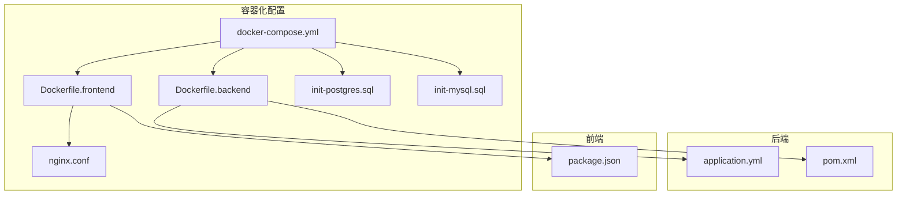
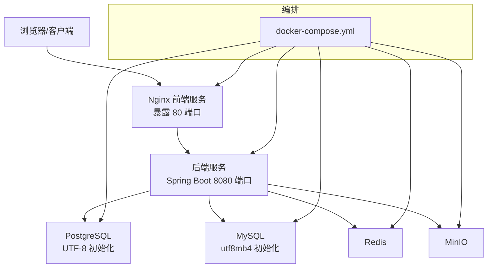
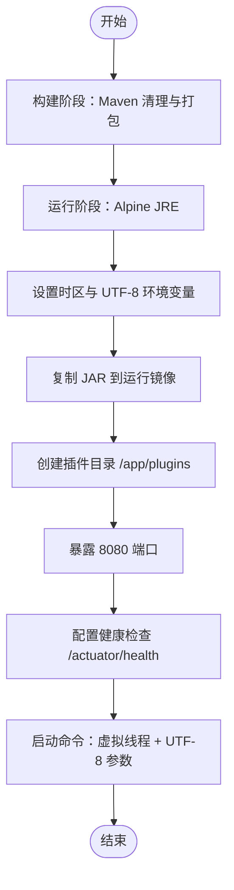
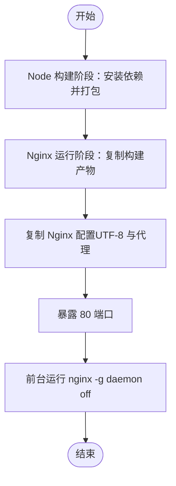
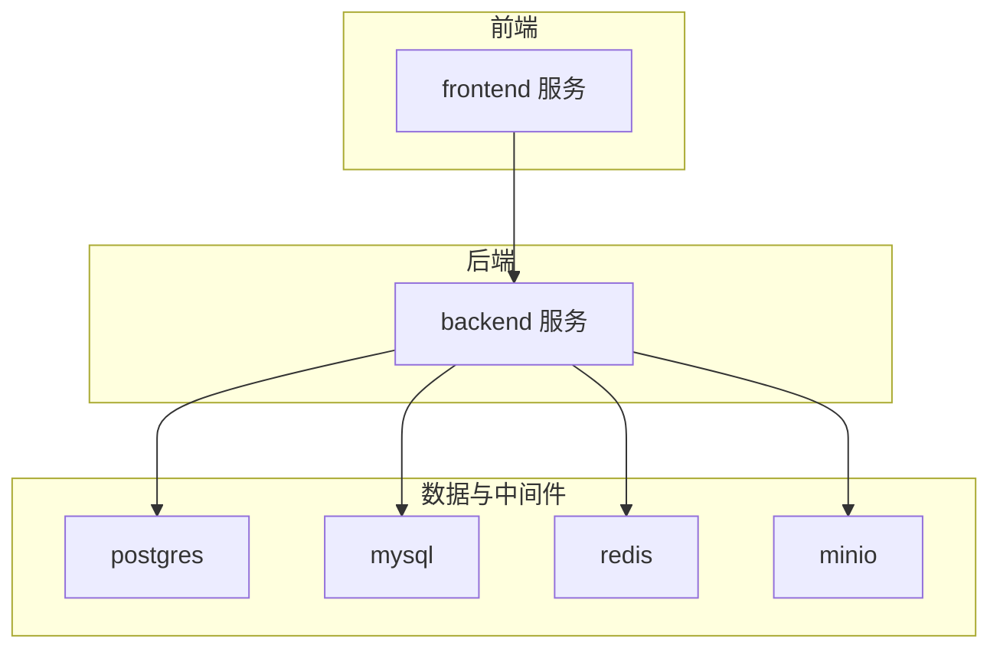
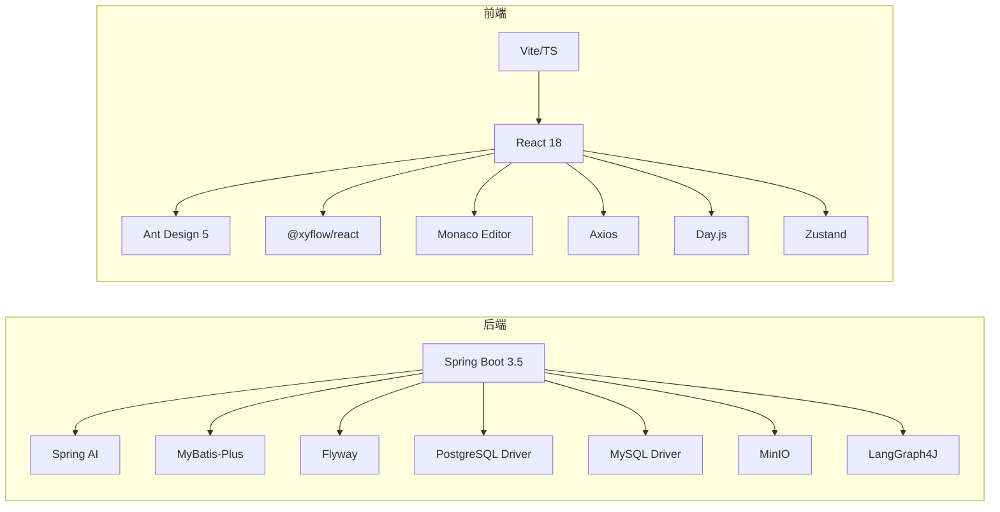

# 容器化部署

<cite>
**本文引用的文件**
- [Dockerfile.backend](file://docker/Dockerfile.backend)
- [Dockerfile.frontend](file://docker/Dockerfile.frontend)
- [docker-compose.yml](file://docker/docker-compose.yml)
- [pom.xml](file://backend/pom.xml)
- [package.json](file://frontend/package.json)
- [application.yml](file://backend/src/main/resources/application.yml)
- [nginx.conf](file://docker/nginx.conf)
- [init-postgres.sql](file://docker/init-postgres.sql)
- [init-mysql.sql](file://docker/init-mysql.sql)
- [start.sh](file://start.sh)
- [README.md](file://README.md)
- [QUICKSTART.md](file://QUICKSTART.md)
</cite>

## 目录
1. [简介](#简介)
2. [项目结构](#项目结构)
3. [核心组件](#核心组件)
4. [架构总览](#架构总览)
5. [详细组件分析](#详细组件分析)
6. [依赖关系分析](#依赖关系分析)
7. [性能考虑](#性能考虑)
8. [故障排除指南](#故障排除指南)
9. [结论](#结论)
10. [附录](#附录)

## 简介
本指南面向希望在生产与开发环境中部署 BokAgent 的工程团队，系统讲解容器化方案：后端 Java 应用与前端 React 应用的镜像构建策略、docker-compose 服务编排、多阶段构建优化、运行时最佳实践以及调试与故障排除方法。文档严格基于仓库中的实际配置文件进行分析与总结，避免臆测。

## 项目结构
BokAgent 的容器化相关文件集中在 docker 目录中，配合后端与前端各自的应用配置文件共同构成完整的容器化体系。

图表来源
- [docker-compose.yml:1-132](file://docker/docker-compose.yml#L1-L132)
- [Dockerfile.backend:1-51](file://docker/Dockerfile.backend#L1-L51)
- [Dockerfile.frontend:1-35](file://docker/Dockerfile.frontend#L1-L35)
- [nginx.conf:1-56](file://docker/nginx.conf#L1-L56)
- [application.yml:1-190](file://backend/src/main/resources/application.yml#L1-L190)
- [pom.xml:1-170](file://backend/pom.xml#L1-L170)
- [package.json:1-37](file://frontend/package.json#L1-L37)
- [init-postgres.sql:1-20](file://docker/init-postgres.sql#L1-L20)
- [init-mysql.sql:1-12](file://docker/init-mysql.sql#L1-L12)

章节来源
- [docker-compose.yml:1-132](file://docker/docker-compose.yml#L1-L132)
- [Dockerfile.backend:1-51](file://docker/Dockerfile.backend#L1-L51)
- [Dockerfile.frontend:1-35](file://docker/Dockerfile.frontend#L1-L35)
- [nginx.conf:1-56](file://docker/nginx.conf#L1-L56)
- [application.yml:1-190](file://backend/src/main/resources/application.yml#L1-L190)
- [pom.xml:1-170](file://backend/pom.xml#L1-L170)
- [package.json:1-37](file://frontend/package.json#L1-L37)
- [init-postgres.sql:1-20](file://docker/init-postgres.sql#L1-L20)
- [init-mysql.sql:1-12](file://docker/init-mysql.sql#L1-L12)

## 核心组件
- 后端服务（Spring Boot 3.5 + JDK 21）
  - 多阶段构建：Maven 构建阶段 + Eclipse Temurin JRE Alpine 运行阶段
  - 健康检查：基于 Actuator 的 /actuator/health
  - 编码与时区：统一设置为 UTF-8 与 Asia/Shanghai
- 前端服务（React + Vite + Nginx）
  - 多阶段构建：Node.js 构建阶段 + Nginx 运行阶段
  - 字符集：Nginx 配置为 UTF-8
  - 反向代理：将 /api/ 与 /ws、/mcp/sse 代理至后端
- 数据与中间件
  - PostgreSQL（UTF-8 初始化参数）、MySQL（utf8mb4）、Redis、MinIO
  - Flyway 数据库迁移、Nginx 静态资源与代理

章节来源
- [Dockerfile.backend:1-51](file://docker/Dockerfile.backend#L1-L51)
- [Dockerfile.frontend:1-35](file://docker/Dockerfile.frontend#L1-L35)
- [docker-compose.yml:1-132](file://docker/docker-compose.yml#L1-L132)
- [application.yml:1-190](file://backend/src/main/resources/application.yml#L1-L190)
- [nginx.conf:1-56](file://docker/nginx.conf#L1-L56)

## 架构总览
下图展示了容器化部署的整体交互：前端通过 Nginx 反向代理访问后端 API；后端连接 PostgreSQL、MySQL、Redis、MinIO；各服务通过 docker-compose 统一编排与健康检查。

图表来源
- [docker-compose.yml:1-132](file://docker/docker-compose.yml#L1-L132)
- [nginx.conf:1-56](file://docker/nginx.conf#L1-L56)
- [application.yml:1-190](file://backend/src/main/resources/application.yml#L1-L190)

## 详细组件分析

### 后端镜像构建（Dockerfile.backend）
- 基础镜像与构建工具
  - 构建阶段：使用 Maven 与 Eclipse Temurin 21，工作目录 /app
  - 运行阶段：基于 eclipse-temurin:21-jre-alpine，精简体积
- 依赖与打包
  - 复制 pom.xml 与源码，执行清理与打包（跳过测试）
  - 将生成的 JAR 包复制到运行镜像
- 运行时配置
  - 安装 curl、tzdata、gcompat，设置 Asia/Shanghai 时区
  - 设置 LANG、LC_ALL、JAVA_TOOL_OPTIONS 为 UTF-8
  - 暴露 8080 端口，配置健康检查命令指向 /actuator/health
  - 使用虚拟线程启动，明确设置用户语言 zh_CN
- 插件目录
  - 在 /app/plugins 创建插件目录，便于宿主机挂载扩展

图表来源
- [Dockerfile.backend:1-51](file://docker/Dockerfile.backend#L1-L51)

章节来源
- [Dockerfile.backend:1-51](file://docker/Dockerfile.backend#L1-L51)

### 前端镜像构建（Dockerfile.frontend）
- 构建阶段
  - 使用 node:20-alpine，设置 UTF-8 环境
  - 安装依赖并执行构建，产出 dist 目录
- 运行阶段（Nginx）
  - 基于 nginx:alpine，设置 Asia/Shanghai 时区
  - 复制构建产物至 /usr/share/nginx/html
  - 复制 nginx.conf，启用 UTF-8 字符集与 API 代理
- 端口与入口
  - 暴露 80 端口，前台运行 nginx

图表来源
- [Dockerfile.frontend:1-35](file://docker/Dockerfile.frontend#L1-L35)
- [nginx.conf:1-56](file://docker/nginx.conf#L1-L56)

章节来源
- [Dockerfile.frontend:1-35](file://docker/Dockerfile.frontend#L1-L35)
- [nginx.conf:1-56](file://docker/nginx.conf#L1-L56)

### docker-compose 服务编排
- 数据库与中间件
  - PostgreSQL：设置 UTF-8 初始化参数，挂载数据卷与初始化 SQL；健康检查基于 pg_isready
  - MySQL：设置 utf8mb4 与默认时区 +08:00；健康检查基于 mysqladmin ping
  - Redis：开启 AOF 持久化，挂载数据卷
  - MinIO：设置访问凭据，暴露对象存储与控制台端口，健康检查基于 /minio/health/live
- 后端服务
  - 构建上下文与 Dockerfile 路径
  - 环境变量：激活 docker 配置文件、数据库主机名、MinIO 端点、各 LLM API 密钥、时区与 UTF-8
  - 端口映射 8080:8080，挂载插件目录
  - 依赖健康检查：postgres、mysql、redis、minio 均需健康后才启动
- 前端服务（Nginx）
  - 构建上下文与 Dockerfile 路径
  - 环境变量：设置时区
  - 端口映射 80:80，依赖后端服务
- 数据卷
  - postgres_data、mysql_data、redis_data、minio_data

图表来源
- [docker-compose.yml:1-132](file://docker/docker-compose.yml#L1-L132)

章节来源
- [docker-compose.yml:1-132](file://docker/docker-compose.yml#L1-L132)

### Nginx 反向代理与字符集
- 字符集设置：server 层设置 charset utf-8，并声明多种内容类型的字符集
- 静态资源：root 指向 /usr/share/nginx/html，index 为 index.html
- API 代理：/api/ 代理到后端 8080，传递 Host、X-Real-IP、X-Forwarded-* 等头部
- WebSocket 与 MCP SSE：/ws 与 /mcp/sse 保持升级能力，禁用代理缓存

章节来源
- [nginx.conf:1-56](file://docker/nginx.conf#L1-L56)

### 后端应用配置（application.yml）
- 服务器与编码：HTTP 服务器端口 8080，强制 UTF-8 编码
- 数据源与连接池：PostgreSQL 数据源，Hikari 最大连接数与最小空闲
- Spring AI：OpenAI、Deepseek、通义千问的 API Key 与 Base URL
- Jackson：非空字段序列化、日期格式、忽略未知属性
- 消息与日志：消息编码 UTF-8，日志文件路径与轮转
- Actuator：暴露 health、info、metrics 端点，授权可见细节
- MinIO：端点、AccessKey、SecretKey、Bucket
- MCP 协议：SSE 与 WebSocket 传输启用及路径
- 超时与重试：工具执行、LLM 调用、TTS 合成、MCP 请求、工作流执行的超时配置
- 缓存：默认 TTL、工具结果 TTL、LLM 响应 TTL
- 异步任务：虚拟线程执行器类型，线程池容量与队列

章节来源
- [application.yml:1-190](file://backend/src/main/resources/application.yml#L1-L190)

### 数据库初始化脚本
- PostgreSQL：创建数据库并设置 ENCODING='UTF8'、LC_COLLATE='en_US.UTF-8'、LC_CTYPE='en_US.UTF-8'
- MySQL：创建数据库并设置 DEFAULT CHARACTER SET utf8mb4、COLLATE utf8mb4_unicode_ci

章节来源
- [init-postgres.sql:1-20](file://docker/init-postgres.sql#L1-L20)
- [init-mysql.sql:1-12](file://docker/init-mysql.sql#L1-L12)

### 启动与验证脚本
- 自动检测 .env 并创建示例文件
- 启动 docker-compose 并等待服务启动
- 验证 PostgreSQL 与 MySQL 的编码
- 测试中文与 Emoji 存储
- 输出访问地址与常用命令

章节来源
- [start.sh:1-58](file://start.sh#L1-L58)

## 依赖关系分析
- 后端依赖
  - Spring Boot 3.5、Spring AI、MyBatis-Plus、Flyway、PostgreSQL/MySQL 驱动、MinIO、LangGraph4J
  - Maven 插件：spring-boot-maven-plugin 排除 Lombok
- 前端依赖
  - React 18、Ant Design 5、@xyflow/react、Monaco Editor、Axios、Day.js、Zustand
  - Vite、TypeScript、ESLint、@vitejs/plugin-react

图表来源
- [pom.xml:1-170](file://backend/pom.xml#L1-L170)
- [package.json:1-37](file://frontend/package.json#L1-L37)

章节来源
- [pom.xml:1-170](file://backend/pom.xml#L1-L170)
- [package.json:1-37](file://frontend/package.json#L1-L37)

## 性能考虑
- 多阶段构建
  - 后端：仅在最终镜像中保留 JRE，显著减小体积
  - 前端：Nginx 运行阶段不包含 Node.js，减少攻击面与体积
- 启动性能
  - 后端启用虚拟线程，提升并发与吞吐
  - 前端静态资源由 Nginx 直接提供，降低后端压力
- 健康检查
  - 后端基于 Actuator，快速判断应用就绪
  - 数据库与中间件使用专用命令进行健康探测
- 编码一致性
  - 容器内统一 UTF-8，避免跨层编码转换带来的性能损耗与错误

章节来源
- [Dockerfile.backend:1-51](file://docker/Dockerfile.backend#L1-L51)
- [Dockerfile.frontend:1-35](file://docker/Dockerfile.frontend#L1-L35)
- [application.yml:1-190](file://backend/src/main/resources/application.yml#L1-L190)
- [nginx.conf:1-56](file://docker/nginx.conf#L1-L56)

## 故障排除指南
- 服务启动失败
  - 查看后端与前端日志：docker-compose logs -f backend / frontend
  - 检查数据库服务是否健康：docker-compose ps postgres mysql
- 端口冲突
  - 修改 docker-compose.yml 中的端口映射（如 8080:8081）
- 中文显示问题
  - 确认容器内时区与字符集设置正确（Asia/Shanghai、UTF-8）
  - 前端 Nginx 已设置 charset utf-8，确保浏览器未强制指定非 UTF-8
- 数据库连接失败
  - 确认数据库初始化脚本已执行，且环境变量中的主机名与凭据正确
  - 使用 docker-compose exec 进入容器验证连接
- MinIO 控制台不可用
  - 确认端口映射 9000/9001 是否被占用，或调整映射

章节来源
- [docker-compose.yml:1-132](file://docker/docker-compose.yml#L1-L132)
- [QUICKSTART.md:112-144](file://QUICKSTART.md#L112-L144)
- [start.sh:1-58](file://start.sh#L1-L58)

## 结论
本容器化方案通过多阶段构建与轻量运行时镜像，实现了后端与前端的高效部署；通过 docker-compose 统一编排数据库与中间件，并在 Nginx 层完成反向代理与字符集保障；结合健康检查与日志配置，提供了良好的可观测性与可维护性。建议在生产环境中进一步引入资源限制、网络隔离与密钥管理策略，以满足更高的安全性与稳定性需求。

## 附录
- 快速开始
  - 复制并编辑 .env 文件，配置 LLM API Key
  - docker-compose up -d 启动服务
  - 访问 http://localhost、http://localhost:8080、http://localhost:9001
- 常用命令
  - 查看服务状态：docker-compose ps
  - 查看日志：docker-compose logs -f backend
  - 停止服务：docker-compose down
  - 清除数据卷（谨慎）：docker-compose down -v

章节来源
- [README.md:30-50](file://README.md#L30-L50)
- [QUICKSTART.md:47-68](file://QUICKSTART.md#L47-L68)
- [start.sh:46-56](file://start.sh#L46-L56)