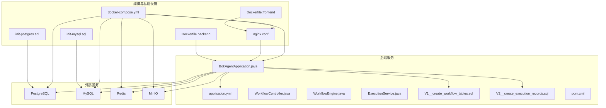
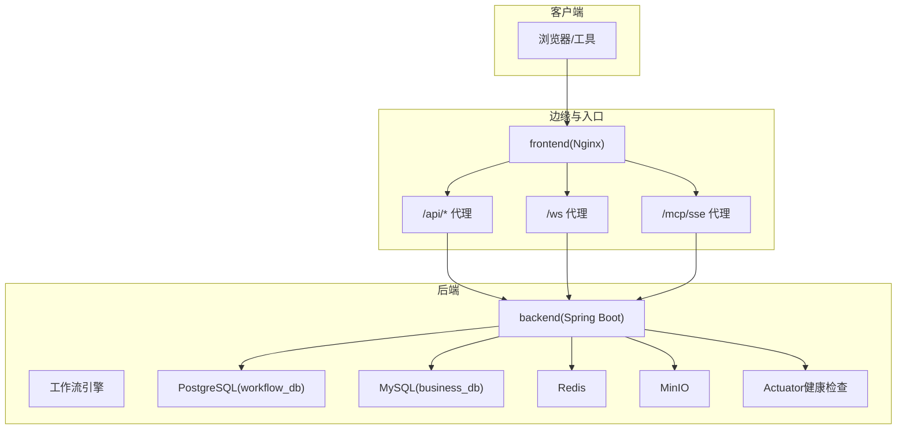
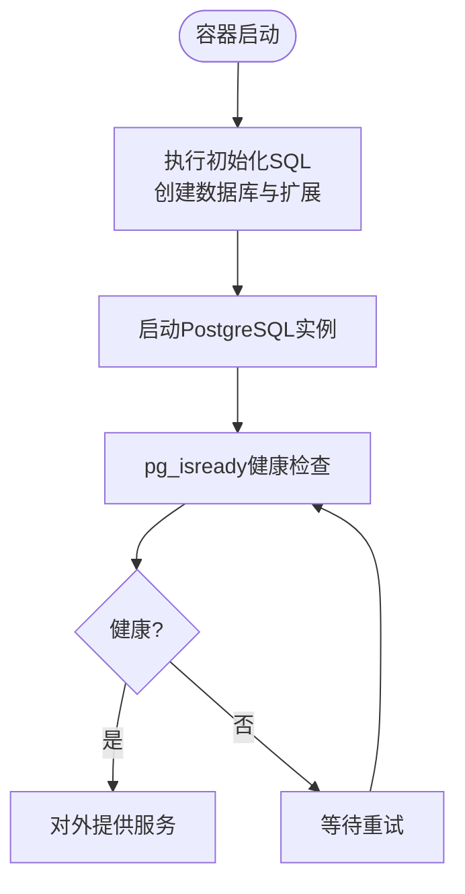
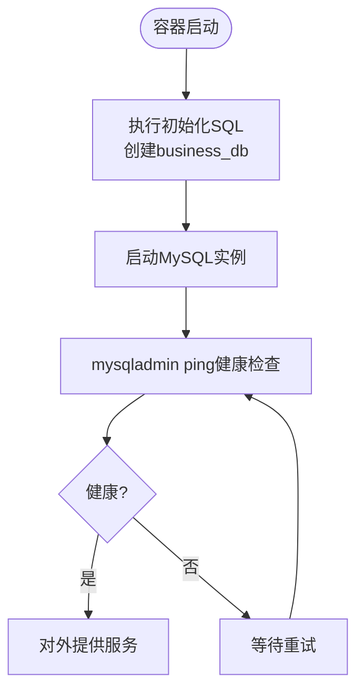
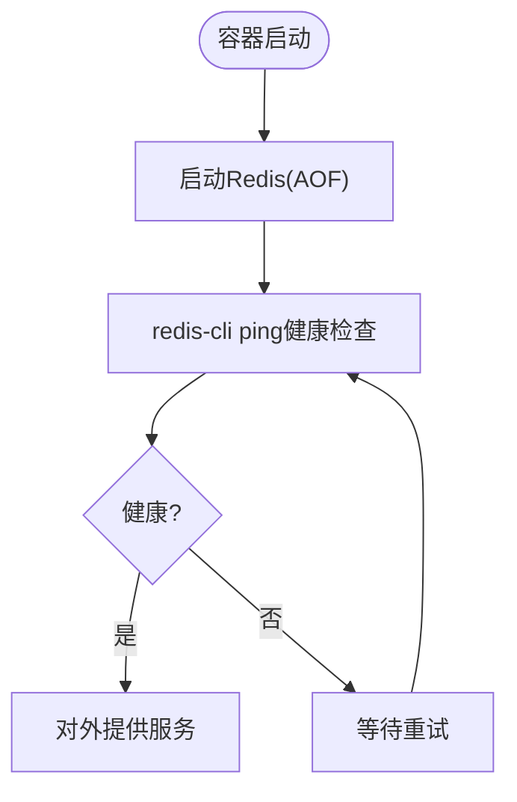
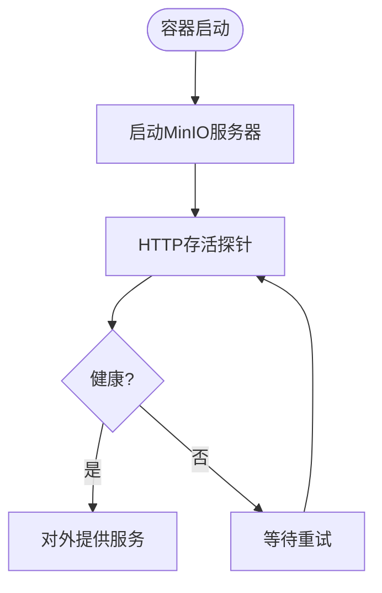
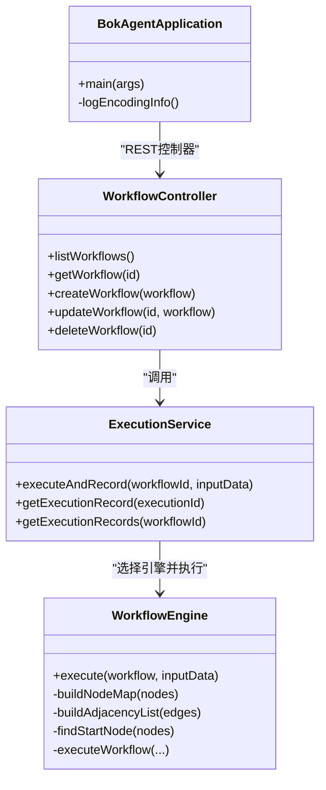
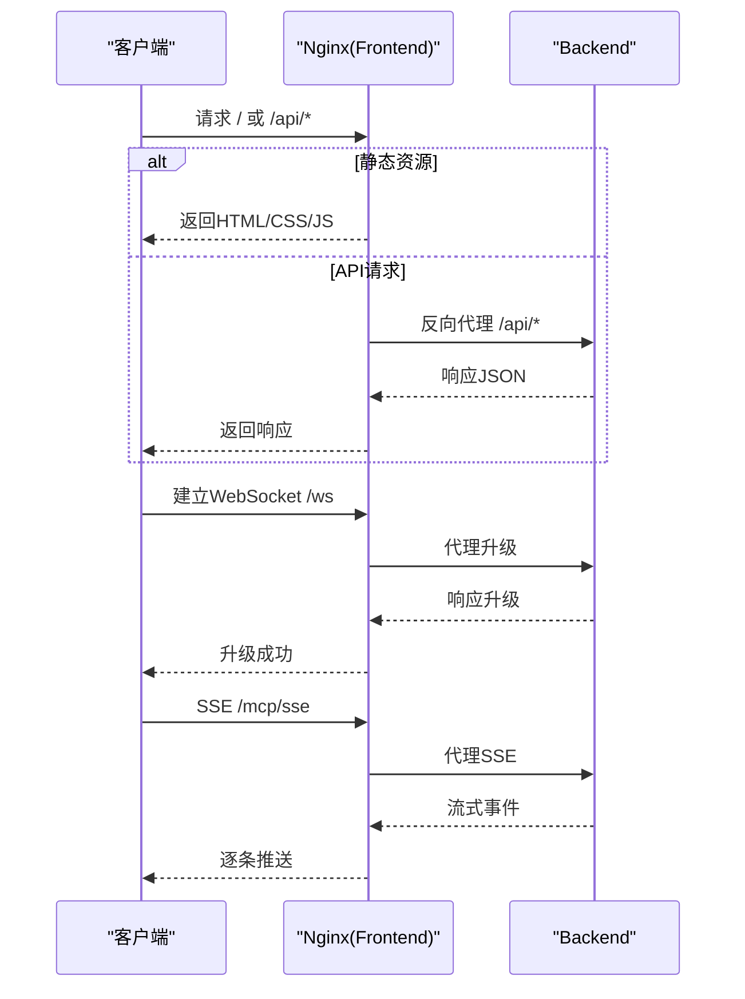
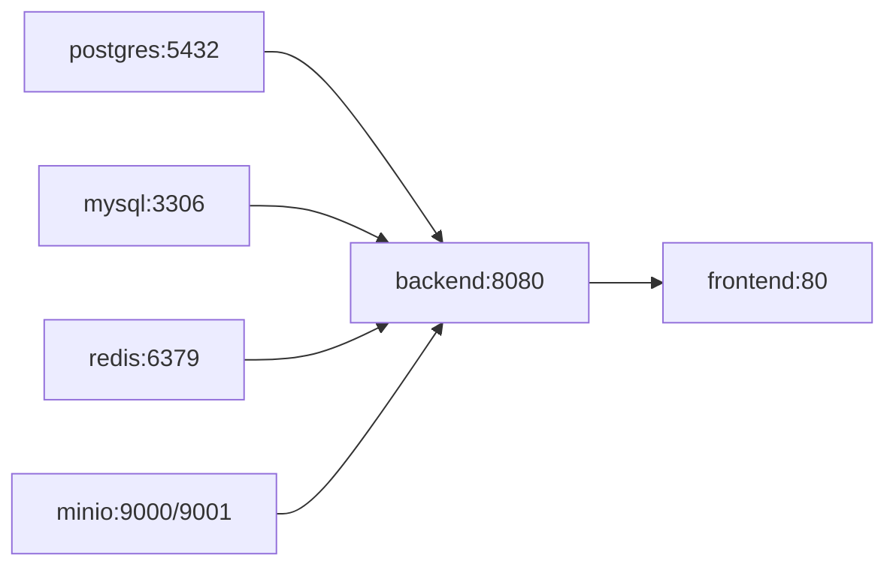

# 服务编排

<cite>
**本文引用的文件**
- [docker-compose.yml](file://docker/docker-compose.yml)
- [nginx.conf](file://docker/nginx.conf)
- [application.yml](file://backend/src/main/resources/application.yml)
- [init-postgres.sql](file://docker/init-postgres.sql)
- [init-mysql.sql](file://docker/init-mysql.sql)
- [Dockerfile.backend](file://docker/Dockerfile.backend)
- [Dockerfile.frontend](file://docker/Dockerfile.frontend)
- [BokAgentApplication.java](file://backend/src/main/java/com/bokagent/BokAgentApplication.java)
- [WorkflowController.java](file://backend/src/main/java/com/bokagent/controller/WorkflowController.java)
- [WorkflowEngine.java](file://backend/src/main/java/com/bokagent/engine/WorkflowEngine.java)
- [ExecutionService.java](file://backend/src/main/java/com/bokagent/service/ExecutionService.java)
- [V1__create_workflow_tables.sql](file://backend/src/main/resources/db/migration/V1__create_workflow_tables.sql)
- [V2__create_execution_records.sql](file://backend/src/main/resources/db/migration/V2__create_execution_records.sql)
- [pom.xml](file://backend/pom.xml)
- [README.md](file://README.md)
- [QUICKSTART.md](file://QUICKSTART.md)
</cite>

## 目录
1. [简介](#简介)
2. [项目结构](#项目结构)
3. [核心组件](#核心组件)
4. [架构总览](#架构总览)
5. [详细组件分析](#详细组件分析)
6. [依赖分析](#依赖分析)
7. [性能考虑](#性能考虑)
8. [故障排除指南](#故障排除指南)
9. [结论](#结论)
10. [附录](#附录)

## 简介
本指南面向运维与开发人员，提供BokAgent服务编排的完整配置说明。系统采用多服务编排架构，包含：
- PostgreSQL工作流数据库（UTF-8）
- MySQL业务数据库（utf8mb4）
- Redis缓存
- MinIO对象存储
- 后端服务（Spring Boot 3.5 + Spring AI + MyBatis-Plus）
- 前端服务（Nginx静态资源 + 反向代理）

重点涵盖服务间依赖与启动顺序、健康检查、服务发现、网络通信、Nginx反向代理（静态资源、API路由、WebSocket/SSE）、环境变量管理策略、存储卷与持久化、扩缩容与故障转移建议。

## 项目结构
项目采用分层与模块化组织：
- docker：Docker镜像构建文件、Compose编排、Nginx配置、数据库初始化SQL
- backend：Spring Boot后端工程（Java 21、Spring Boot 3.5、MyBatis-Plus、Flyway）
- frontend：React前端（Vite + Ant Design），构建产物由Nginx提供
- docs：项目文档（含快速开始、部署指南等）

图表来源
- [docker-compose.yml:1-132](file://docker/docker-compose.yml#L1-L132)
- [nginx.conf:1-56](file://docker/nginx.conf#L1-L56)
- [application.yml:1-190](file://backend/src/main/resources/application.yml#L1-L190)
- [Dockerfile.backend:1-51](file://docker/Dockerfile.backend#L1-L51)
- [Dockerfile.frontend:1-35](file://docker/Dockerfile.frontend#L1-L35)
- [BokAgentApplication.java:1-56](file://backend/src/main/java/com/bokagent/BokAgentApplication.java#L1-L56)
- [WorkflowController.java:1-92](file://backend/src/main/java/com/bokagent/controller/WorkflowController.java#L1-L92)
- [WorkflowEngine.java:1-171](file://backend/src/main/java/com/bokagent/engine/WorkflowEngine.java#L1-L171)
- [ExecutionService.java:1-113](file://backend/src/main/java/com/bokagent/service/ExecutionService.java#L1-L113)
- [V1__create_workflow_tables.sql:1-17](file://backend/src/main/resources/db/migration/V1__create_workflow_tables.sql#L1-L17)
- [V2__create_execution_records.sql:1-19](file://backend/src/main/resources/db/migration/V2__create_execution_records.sql#L1-L19)

章节来源
- [README.md:1-106](file://README.md#L1-L106)
- [docker-compose.yml:1-132](file://docker/docker-compose.yml#L1-L132)

## 核心组件
- PostgreSQL（工作流数据库）
  - 初始化脚本确保UTF-8编码与扩展启用；通过卷实现数据持久化；健康检查基于pg_isready
- MySQL（业务数据库）
  - 初始化脚本设置utf8mb4与校对规则；持久化卷；健康检查基于mysqladmin ping
- Redis（缓存）
  - 开启AOF持久化；持久化卷；健康检查基于redis-cli ping
- MinIO（对象存储）
  - 控制台端口映射；持久化卷；健康检查基于HTTP存活探针
- 后端服务（Spring Boot）
  - 多配置源：Docker环境变量、application.yml、JVM参数；Actuator健康检查；UTF-8全局编码
- 前端服务（Nginx）
  - 静态资源根目录与UTF-8字符集；API与WebSocket/SSE代理至后端；时区与locale设置

章节来源
- [docker-compose.yml:4-132](file://docker/docker-compose.yml#L4-L132)
- [application.yml:16-190](file://backend/src/main/resources/application.yml#L16-L190)
- [Dockerfile.backend:14-51](file://docker/Dockerfile.backend#L14-L51)
- [Dockerfile.frontend:14-35](file://docker/Dockerfile.frontend#L14-L35)
- [init-postgres.sql:1-20](file://docker/init-postgres.sql#L1-L20)
- [init-mysql.sql:1-12](file://docker/init-mysql.sql#L1-L12)

## 架构总览
下图展示容器间依赖、启动顺序与网络通信路径：

图表来源
- [docker-compose.yml:115-126](file://docker/docker-compose.yml#L115-L126)
- [nginx.conf:20-55](file://docker/nginx.conf#L20-L55)
- [application.yml:16-115](file://backend/src/main/resources/application.yml#L16-L115)
- [BokAgentApplication.java:16-43](file://backend/src/main/java/com/bokagent/BokAgentApplication.java#L16-L43)

## 详细组件分析

### PostgreSQL（工作流数据库）
- 初始化与编码
  - 初始化脚本创建UTF-8数据库并启用uuid-ossp与pg_trgm扩展；Compose中显式设置UTF-8初始化参数
- 持久化与卷
  - 卷postgres_data挂载至/var/lib/postgresql/data；重启后数据不丢失
- 健康检查
  - pg_isready探测；失败重试次数与间隔可调
- 连接与池化
  - application.yml中配置PostgreSQL数据源、Hikari连接池大小
- Flyway迁移
  - 自动执行V1/V2迁移脚本，创建workflows与execution_records表

图表来源
- [docker-compose.yml:5-27](file://docker/docker-compose.yml#L5-L27)
- [init-postgres.sql:1-20](file://docker/init-postgres.sql#L1-L20)
- [application.yml:16-25](file://backend/src/main/resources/application.yml#L16-L25)
- [V1__create_workflow_tables.sql:1-17](file://backend/src/main/resources/db/migration/V1__create_workflow_tables.sql#L1-L17)
- [V2__create_execution_records.sql:1-19](file://backend/src/main/resources/db/migration/V2__create_execution_records.sql#L1-L19)

章节来源
- [docker-compose.yml:5-27](file://docker/docker-compose.yml#L5-L27)
- [init-postgres.sql:1-20](file://docker/init-postgres.sql#L1-L20)
- [application.yml:16-25](file://backend/src/main/resources/application.yml#L16-L25)
- [V1__create_workflow_tables.sql:1-17](file://backend/src/main/resources/db/migration/V1__create_workflow_tables.sql#L1-L17)
- [V2__create_execution_records.sql:1-19](file://backend/src/main/resources/db/migration/V2__create_execution_records.sql#L1-L19)

### MySQL（业务数据库）
- 初始化与编码
  - 初始化脚本创建utf8mb4数据库；Compose中设置字符集与时区
- 持久化与卷
  - 卷mysql_data挂载至/var/lib/mysql
- 健康检查
  - mysqladmin ping探测
- 连接与池化
  - application.yml中配置MySQL数据源与Hikari连接池

图表来源
- [docker-compose.yml:28-50](file://docker/docker-compose.yml#L28-L50)
- [init-mysql.sql:1-12](file://docker/init-mysql.sql#L1-L12)
- [application.yml:16-25](file://backend/src/main/resources/application.yml#L16-L25)

章节来源
- [docker-compose.yml:28-50](file://docker/docker-compose.yml#L28-L50)
- [init-mysql.sql:1-12](file://docker/init-mysql.sql#L1-L12)
- [application.yml:16-25](file://backend/src/main/resources/application.yml#L16-L25)

### Redis（缓存）
- 持久化与卷
  - AOF持久化开启；卷redis_data挂载至/data
- 健康检查
  - redis-cli ping探测
- 连接与池化
  - application.yml中配置Redis主机、端口与Lettuce连接池

图表来源
- [docker-compose.yml:51-64](file://docker/docker-compose.yml#L51-L64)
- [application.yml:32-44](file://backend/src/main/resources/application.yml#L32-L44)

章节来源
- [docker-compose.yml:51-64](file://docker/docker-compose.yml#L51-L64)
- [application.yml:32-44](file://backend/src/main/resources/application.yml#L32-L44)

### MinIO（对象存储）
- 端口与控制台
  - 9000对外API，9001对外控制台；环境变量设置访问凭据
- 持久化与卷
  - 卷minio_data挂载至/data
- 健康检查
  - HTTP存活探针检查/minio/health/live
- 访问与桶
  - application.yml中配置endpoint、access-key、secret-key与bucket-name

图表来源
- [docker-compose.yml:65-82](file://docker/docker-compose.yml#L65-L82)
- [application.yml:109-115](file://backend/src/main/resources/application.yml#L109-L115)

章节来源
- [docker-compose.yml:65-82](file://docker/docker-compose.yml#L65-L82)
- [application.yml:109-115](file://backend/src/main/resources/application.yml#L109-L115)

### 后端服务（Spring Boot）
- 启动与编码
  - Dockerfile设置时区、locale与JVM参数；application.yml强制UTF-8编码；启动日志打印编码信息
- 配置源
  - Docker环境变量覆盖application.yml中的数据库、缓存、MinIO与LLM相关配置
- Actuator健康检查
  - Dockerfile与application.yml均提供健康检查端点
- 数据源与迁移
  - PostgreSQL/MySQL数据源、Flyway迁移脚本自动执行
- 缓存与超时
  - Redis缓存、工具/LLM/TTS/MCP/工作流执行等超时配置
- MCP协议
  - SSE/WebSocket传输通道配置

图表来源
- [BokAgentApplication.java:16-56](file://backend/src/main/java/com/bokagent/BokAgentApplication.java#L16-L56)
- [WorkflowController.java:16-92](file://backend/src/main/java/com/bokagent/controller/WorkflowController.java#L16-L92)
- [ExecutionService.java:21-113](file://backend/src/main/java/com/bokagent/service/ExecutionService.java#L21-L113)
- [WorkflowEngine.java:18-171](file://backend/src/main/java/com/bokagent/engine/WorkflowEngine.java#L18-L171)

章节来源
- [Dockerfile.backend:14-51](file://docker/Dockerfile.backend#L14-L51)
- [application.yml:16-190](file://backend/src/main/resources/application.yml#L16-L190)
- [BokAgentApplication.java:16-56](file://backend/src/main/java/com/bokagent/BokAgentApplication.java#L16-L56)
- [WorkflowController.java:16-92](file://backend/src/main/java/com/bokagent/controller/WorkflowController.java#L16-L92)
- [ExecutionService.java:21-113](file://backend/src/main/java/com/bokagent/service/ExecutionService.java#L21-L113)
- [WorkflowEngine.java:18-171](file://backend/src/main/java/com/bokagent/engine/WorkflowEngine.java#L18-L171)

### 前端服务（Nginx）
- 静态资源
  - root指向构建产物目录；index为index.html；UTF-8字符集与类型声明
- API代理
  - /api/前缀代理至backend:8080；保留升级头用于WebSocket；传递真实IP与协议头
- WebSocket与SSE
  - /ws与/mcp/sse分别代理至后端，关闭代理缓冲与缓存，保持流式传输
- 构建与运行
  - Dockerfile前端镜像基于Nginx-alpine，复制构建产物与nginx.conf

图表来源
- [nginx.conf:12-55](file://docker/nginx.conf#L12-L55)
- [docker-compose.yml:115-126](file://docker/docker-compose.yml#L115-L126)

章节来源
- [Dockerfile.frontend:14-35](file://docker/Dockerfile.frontend#L14-L35)
- [nginx.conf:1-56](file://docker/nginx.conf#L1-56)
- [docker-compose.yml:115-126](file://docker/docker-compose.yml#L115-L126)

## 依赖分析
- 启动顺序
  - backend使用depends_on并指定service_healthy，确保PostgreSQL、MySQL、Redis、MinIO均健康后再启动
  - frontend依赖backend，保证API可用后再暴露静态页面
- 服务发现
  - 容器网络内通过服务名访问（如postgres、mysql、redis、minio、backend）
- 健康检查
  - 各服务均配置健康检查，Compose会根据探针状态决定重启与依赖顺序
- 网络通信
  - 外部端口映射：PostgreSQL 5432、MySQL 3306、Redis 6379、MinIO 9000/9001、后端8080、前端80

图表来源
- [docker-compose.yml:83-126](file://docker/docker-compose.yml#L83-L126)

章节来源
- [docker-compose.yml:83-126](file://docker/docker-compose.yml#L83-L126)

## 性能考虑
- 数据库连接池
  - PostgreSQL/Hikari最大池大小与最小空闲数；MySQL连接参数已在Compose中设置
- 缓存与TTL
  - Redis连接池与默认缓存TTL、工具结果与LLM响应TTL
- 超时与重试
  - 工具执行、LLM调用、TTS合成、MCP请求、工作流执行均有超时配置；默认重试策略
- JVM与容器
  - 后端容器启用虚拟线程与UTF-8编码，减少GC压力并保证文本处理一致性
- Nginx
  - 对WebSocket/SSE关闭代理缓冲，避免延迟与内存占用

章节来源
- [application.yml:22-44](file://backend/src/main/resources/application.yml#L22-L44)
- [application.yml:138-156](file://backend/src/main/resources/application.yml#L138-L156)
- [Dockerfile.backend:49-50](file://docker/Dockerfile.backend#L49-L50)
- [nginx.conf:36-54](file://docker/nginx.conf#L36-L54)

## 故障排除指南
- 服务状态检查
  - 使用docker-compose ps确认各服务状态；使用docker-compose logs查看后端/前端日志
- 端口冲突
  - 修改docker-compose.yml中的端口映射（如将8080映射到8081）
- 数据库连接失败
  - 确认PostgreSQL/MySQL健康；检查环境变量与初始化脚本；必要时重启对应服务
- 中文乱码
  - 确认容器locale与JVM编码一致；检查Nginx与数据库字符集；参考快速开始中的验证步骤
- MinIO控制台
  - 默认凭据可在环境变量中配置；控制台端口为9001
- Actuator健康检查
  - 访问后端健康检查端点验证服务状态

章节来源
- [QUICKSTART.md:70-164](file://QUICKSTART.md#L70-L164)
- [docker-compose.yml:115-126](file://docker/docker-compose.yml#L115-L126)
- [application.yml:181-190](file://backend/src/main/resources/application.yml#L181-L190)

## 结论
本编排方案通过Docker Compose统一管理多服务，结合UTF-8全局配置与健康检查，确保系统在开发与生产环境中具备良好的稳定性与可维护性。Nginx作为反向代理承担静态资源与API路由职责，后端通过Spring Boot与Spring AI实现工作流编排与多模型支持。建议在生产环境中进一步引入负载均衡、SSL终止、监控告警与备份策略。

## 附录

### 环境变量管理策略
- 敏感信息保护
  - 使用Docker Compose环境变量注入（如数据库密码、MinIO凭据、LLM API密钥）；避免硬编码在镜像或配置文件中
- 配置模板化
  - 在docker-compose.yml中使用变量占位符；在后端application.yml中使用占位符与默认值
- 多环境适配
  - 通过SPRING_PROFILES_ACTIVE切换不同配置文件；前端与后端均设置Asia/Shanghai时区与UTF-8 locale

章节来源
- [docker-compose.yml:7-100](file://docker/docker-compose.yml#L7-L100)
- [application.yml:13-14](file://backend/src/main/resources/application.yml#L13-L14)
- [Dockerfile.backend:18-28](file://docker/Dockerfile.backend#L18-L28)
- [Dockerfile.frontend:17-24](file://docker/Dockerfile.frontend#L17-L24)

### 存储卷与持久化
- 卷定义
  - postgres_data、mysql_data、redis_data、minio_data分别挂载至各服务数据目录
- 备份策略建议
  - PostgreSQL/MySQL定期导出；Redis定期RDB/AOF归档；MinIO对象定期快照；结合外部存储与自动化脚本
- 存储优化
  - 合理设置数据库共享缓冲与连接池；启用压缩与归档清理策略

章节来源
- [docker-compose.yml:127-132](file://docker/docker-compose.yml#L127-L132)
- [init-postgres.sql:13-15](file://docker/init-postgres.sql#L13-L15)

### 扩缩容与故障转移
- 扩缩容
  - 后端服务可通过容器副本数扩展；数据库与缓存需评估连接池与容量限制；对象存储建议使用集群模式
- 故障转移
  - 健康检查失败自动重启；数据库与缓存建议使用高可用方案；Nginx可配合外部负载均衡器实现多实例接入

章节来源
- [docker-compose.yml:22-26](file://docker/docker-compose.yml#L22-L26)
- [docker-compose.yml:45-49](file://docker/docker-compose.yml#L45-L49)
- [docker-compose.yml:59-63](file://docker/docker-compose.yml#L59-L63)
- [docker-compose.yml:77-81](file://docker/docker-compose.yml#L77-L81)