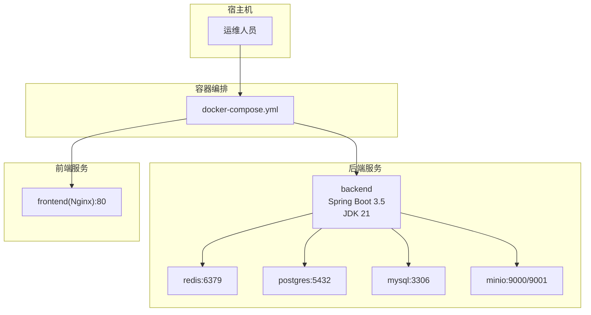
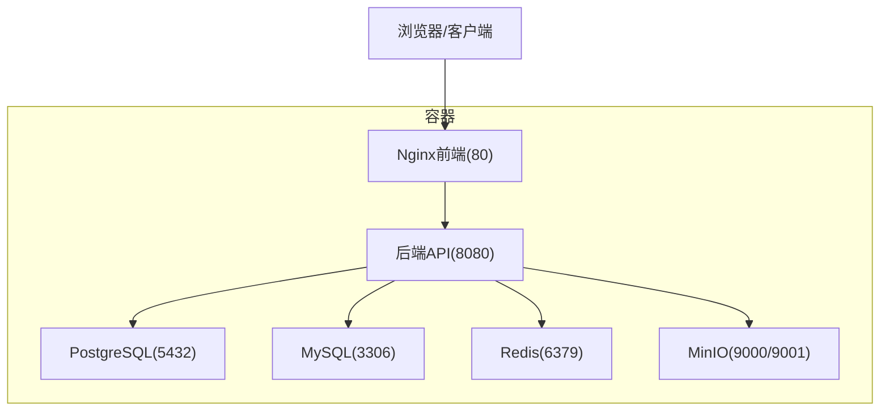
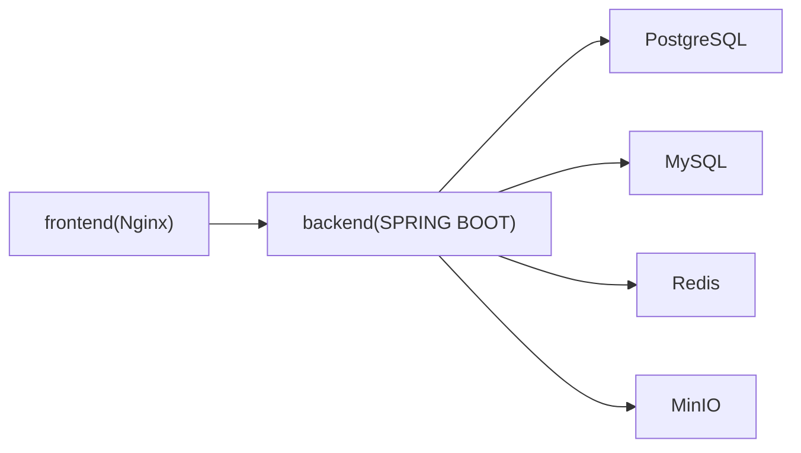

# 生产环境部署

<cite>
**本文引用的文件**
- [README.md](file://README.md)
- [QUICKSTART.md](file://QUICKSTART.md)
- [start.sh](file://start.sh)
- [start.ps1](file://start.ps1)
- [docker-compose.yml](file://docker/docker-compose.yml)
- [application.yml](file://backend/src/main/resources/application.yml)
- [Dockerfile.backend](file://docker/Dockerfile.backend)
- [Dockerfile.frontend](file://docker/Dockerfile.frontend)
- [pom.xml](file://backend/pom.xml)
- [PROJECT_INIT_STATUS.md](file://PROJECT_INIT_STATUS.md)
- [PROJECT_STRUCTURE.md](file://docs/PROJECT_STRUCTURE.md)
- [V1__create_workflow_tables.sql](file://backend/src/main/resources/db/migration/V1__create_workflow_tables.sql)
- [V2__create_execution_records.sql](file://backend/src/main/resources/db/migration/V2__create_execution_records.sql)
</cite>

## 目录
1. [简介](#简介)
2. [项目结构](#项目结构)
3. [核心组件](#核心组件)
4. [架构总览](#架构总览)
5. [详细组件分析](#详细组件分析)
6. [依赖关系分析](#依赖关系分析)
7. [性能考虑](#性能考虑)
8. [故障排查指南](#故障排查指南)
9. [结论](#结论)
10. [附录](#附录)

## 简介
本方案面向BokAgent在生产环境的落地部署，目标是提供一套可操作、可审计、可回滚的完整实施方案。方案覆盖硬件与系统要求、网络与安全策略、部署前准备、部署流程、脚本使用指南、配置管理策略、回滚与应急响应以及生产维护清单。

## 项目结构
BokAgent采用前后端分离与多服务编排的架构，核心由后端（Spring Boot）、前端（Nginx静态服务）、数据库（PostgreSQL/MySQL）、缓存（Redis）、对象存储（MinIO）及健康检查组成。Docker Compose统一编排，提供一键启动能力；后端与前端分别通过各自Dockerfile进行多阶段构建与运行时优化。

图表来源
- [docker-compose.yml:1-132](file://docker/docker-compose.yml#L1-L132)
- [Dockerfile.backend:1-51](file://docker/Dockerfile.backend#L1-L51)
- [Dockerfile.frontend:1-35](file://docker/Dockerfile.frontend#L1-L35)

章节来源
- [PROJECT_STRUCTURE.md:1-256](file://docs/PROJECT_STRUCTURE.md#L1-L256)
- [docker-compose.yml:1-132](file://docker/docker-compose.yml#L1-L132)

## 核心组件
- 后端服务（Spring Boot 3.5 + JDK 21）：提供REST API、工作流执行、缓存、对象存储接入、Actuator健康监控。
- 前端服务（Nginx）：提供静态资源服务与API/WebSocket代理，统一字符集与时区。
- 数据库：PostgreSQL（工作流数据）与MySQL（业务数据），均配置UTF-8/utf8mb4。
- 缓存：Redis，持久化开启。
- 对象存储：MinIO，提供音频等文件存储与控制台。
- 健康检查：各服务均配置健康检查，便于编排与监控。

章节来源
- [docker-compose.yml:1-132](file://docker/docker-compose.yml#L1-L132)
- [application.yml:1-190](file://backend/src/main/resources/application.yml#L1-L190)
- [Dockerfile.backend:1-51](file://docker/Dockerfile.backend#L1-L51)
- [Dockerfile.frontend:1-35](file://docker/Dockerfile.frontend#L1-L35)

## 架构总览
下图展示生产环境部署的总体架构与数据流：

图表来源
- [docker-compose.yml:1-132](file://docker/docker-compose.yml#L1-L132)
- [application.yml:1-190](file://backend/src/main/resources/application.yml#L1-L190)

## 详细组件分析

### 硬件与系统要求
- 推荐配置
  - CPU：2核起步，建议4核以上
  - 内存：4GB起步，建议8GB以上
  - 磁盘：系统盘≥20GB，数据卷按业务量预留
- 操作系统
  - Linux发行版（如Ubuntu/CentOS）或Windows Server（需启用WSL2/虚拟化）
  - Docker版本：Docker Engine 20.10+，Docker Compose 2.0+
  - 时区与语言：Asia/Shanghai，C.UTF-8
- 网络
  - 出站访问：允许拉取官方镜像与第三方LLM服务
  - 入站端口：80（前端）、8080（后端API）、5432（PostgreSQL）、3306（MySQL）、6379（Redis）、9000/9001（MinIO）

章节来源
- [PROJECT_INIT_STATUS.md:216-222](file://PROJECT_INIT_STATUS.md#L216-L222)
- [QUICKSTART.md:5-11](file://QUICKSTART.md#L5-L11)
- [docker-compose.yml:1-132](file://docker/docker-compose.yml#L1-L132)

### 网络与安全策略
- 端口与暴露
  - 前端：80（Nginx）
  - 后端：8080（Spring Boot）
  - 数据库：5432（PostgreSQL）、3306（MySQL）
  - 缓存：6379（Redis）
  - 对象存储：9000/9001（MinIO）
- 安全加固建议
  - 使用反向代理（Nginx）统一入口，隐藏内部端口细节
  - 限制数据库与缓存的外网访问，仅允许内网或专用VPC
  - 为MinIO设置强口令，启用TLS（如需）
  - 为后端启用Actuator访问控制与只读暴露
  - 为敏感环境变量（API密钥）使用密钥管理服务（如KMS/Secrets Manager）
  - 为容器镜像启用签名校验与漏洞扫描

章节来源
- [docker-compose.yml:1-132](file://docker/docker-compose.yml#L1-L132)
- [application.yml:181-190](file://backend/src/main/resources/application.yml#L181-L190)

### 部署前准备
- 环境检查
  - Docker与Compose版本满足要求
  - 系统时间与时区正确（Asia/Shanghai）
  - 端口未被占用（80/8080/5432/3306/6379/9000/9001）
- 依赖验证
  - 拉取镜像：docker-compose pull
  - 网络连通性：可访问外部LLM服务
- 数据迁移
  - 初次部署：Flyway自动执行迁移脚本
  - 升级迁移：遵循数据库版本演进，保留备份
- 配置审核
  - 环境变量：.env文件中API密钥、数据库凭据、MinIO凭据
  - 应用配置：application.yml中的数据源、缓存、日志、超时与重试策略

章节来源
- [QUICKSTART.md:12-22](file://QUICKSTART.md#L12-L22)
- [docker-compose.yml:88-104](file://docker/docker-compose.yml#L88-L104)
- [application.yml:1-190](file://backend/src/main/resources/application.yml#L1-L190)
- [V1__create_workflow_tables.sql:1-17](file://backend/src/main/resources/db/migration/V1__create_workflow_tables.sql#L1-L17)
- [V2__create_execution_records.sql:1-19](file://backend/src/main/resources/db/migration/V2__create_execution_records.sql#L1-L19)

### 部署流程步骤
- 步骤1：准备环境与依赖
  - 安装Docker与Compose
  - 准备.ENV文件并填写密钥
- 步骤2：拉取镜像与启动服务
  - docker-compose pull
  - docker-compose up -d
- 步骤3：健康检查
  - docker-compose ps
  - curl http://localhost:8080/actuator/health
- 步骤4：功能验证
  - 前端访问：http://localhost
  - 中文与Emoji显示验证
  - 数据库编码验证（PostgreSQL显示UTF8；MySQL显示utf8mb4）

章节来源
- [QUICKSTART.md:47-79](file://QUICKSTART.md#L47-L79)
- [start.sh:17-23](file://start.sh#L17-L23)
- [start.ps1:15-21](file://start.ps1#L15-L21)

### 部署脚本使用指南
- start.sh（Linux/Mac）
  - 功能：自动检测并创建.env文件，启动服务，等待30秒，验证PostgreSQL/MySQL编码与中文存储，输出访问地址与日志查看命令
  - 参数：无（自动读取环境变量）
  - 使用：chmod +x start.sh && ./start.sh
- start.ps1（Windows PowerShell）
  - 功能：同上，适用于Windows环境
  - 参数：无（自动读取环境变量）
  - 使用：.\start.ps1

章节来源
- [start.sh:1-58](file://start.sh#L1-L58)
- [start.ps1:1-65](file://start.ps1#L1-L65)

### 配置管理策略
- 环境变量管理
  - .env文件集中存放密钥与连接串，避免硬编码
  - 在容器中通过环境变量注入（compose文件已映射）
- 密钥管理
  - 建议使用KMS/密钥管理服务或Vault，不将真实密钥提交至仓库
- 配置热更新
  - 后端支持Spring Profiles切换（compose中已激活docker profile）
  - Actuator暴露健康与指标，结合外部监控平台实现灰度与回滚
- 日志与字符集
  - 后端与容器均设置C.UTF-8与JVM UTF-8参数，确保日志与数据库字符集一致

章节来源
- [docker-compose.yml:88-104](file://docker/docker-compose.yml#L88-L104)
- [application.yml:1-190](file://backend/src/main/resources/application.yml#L1-L190)
- [Dockerfile.backend:25-28](file://docker/Dockerfile.backend#L25-L28)
- [PROJECT_INIT_STATUS.md:134-159](file://PROJECT_INIT_STATUS.md#L134-L159)

### 回滚策略与应急响应预案
- 快速恢复
  - 使用docker-compose备份数据卷（postgres_data/mysql_data/redis_data/minio_data），回滚时恢复对应卷
  - 保留上一个稳定版本的镜像tag，回滚时切换到旧版本
- 数据备份
  - PostgreSQL/MySQL：定期导出逻辑备份（pg_dump/mysqldump）
  - Redis：启用AOF持久化（已在Dockerfile中开启）
  - MinIO：定期快照或对象版本控制
- 故障隔离
  - 通过健康检查与日志定位问题服务
  - 临时停用非关键服务（如MinIO）以保障核心API可用
- 应急响应
  - 建立值班与升级流程，明确故障分级与处置时限
  - 保留一键降级方案（关闭非关键功能或切换到只读模式）

章节来源
- [docker-compose.yml:127-132](file://docker/docker-compose.yml#L127-L132)
- [application.yml:181-190](file://backend/src/main/resources/application.yml#L181-L190)

### 生产环境维护清单与定期检查
- 系统层面
  - 磁盘空间与inode使用率
  - Docker镜像清理与过期日志轮转
  - 系统与容器时钟同步（NTP）
- 服务层面
  - docker-compose ps状态与日志异常
  - Actuator健康检查与指标（CPU/内存/磁盘/网络）
- 数据层面
  - 数据库连接池与慢查询
  - Flyway迁移状态一致性
- 安全层面
  - 密钥轮换与权限回收
  - 镜像与依赖漏洞扫描
- 文档与演练
  - 更新部署手册与应急预案
  - 定期进行回滚演练

章节来源
- [docker-compose.yml:22-26](file://docker/docker-compose.yml#L22-L26)
- [application.yml:181-190](file://backend/src/main/resources/application.yml#L181-L190)

## 依赖关系分析
- 组件耦合
  - 后端依赖数据库（PostgreSQL/MySQL）、缓存（Redis）、对象存储（MinIO）
  - 前端依赖后端API与WebSocket（通过Nginx代理）
- 外部依赖
  - Docker镜像来源与版本锁定
  - 第三方LLM服务（OpenAI/Deepseek/Qwen）的API密钥与网络可达性
- 潜在风险
  - 端口冲突与网络策略不当
  - 字符集不一致导致中文乱码
  - 缓存与对象存储容量不足

图表来源
- [docker-compose.yml:1-132](file://docker/docker-compose.yml#L1-L132)

章节来源
- [docker-compose.yml:1-132](file://docker/docker-compose.yml#L1-L132)
- [pom.xml:1-175](file://backend/pom.xml#L1-L175)

## 性能考虑
- 连接池与线程
  - Hikari连接池最大20，核心线程池大小100，队列容量1000
  - 启用虚拟线程（JDK 21），提升高并发下的吞吐
- 缓存与超时
  - 默认缓存1小时，工具结果30分钟，LLM响应2小时
  - 工具执行30秒、LLM调用60秒、TTS合成120秒、MCP请求10秒、工作流执行5分钟
- 存储与I/O
  - Redis启用AOF持久化
  - MinIO对象存储建议使用SSD与分层存储策略
- 监控与告警
  - 通过Actuator暴露指标，结合Prometheus/Grafana进行监控

章节来源
- [application.yml:22-43](file://backend/src/main/resources/application.yml#L22-L43)
- [application.yml:138-156](file://backend/src/main/resources/application.yml#L138-L156)
- [Dockerfile.backend:49-50](file://docker/Dockerfile.backend#L49-L50)

## 故障排查指南
- 服务启动失败
  - 查看后端日志：docker-compose logs -f backend
  - 检查数据库服务：docker-compose ps postgres mysql
  - 重启数据库：docker-compose restart postgres mysql
- 端口被占用
  - 修改docker-compose.yml中的端口映射（如将8080映射到8081）
- 中文显示异常
  - 检查容器locale与JVM编码参数
  - 确认Nginx与数据库字符集配置
- 健康检查失败
  - 使用curl http://localhost:8080/actuator/health确认后端健康
  - 检查依赖服务（数据库、缓存、对象存储）健康状态

章节来源
- [QUICKSTART.md:112-144](file://QUICKSTART.md#L112-L144)
- [docker-compose.yml:22-26](file://docker/docker-compose.yml#L22-L26)
- [application.yml:181-190](file://backend/src/main/resources/application.yml#L181-L190)

## 结论
本方案提供了BokAgent生产环境部署的完整路径：从硬件与系统准备、网络与安全策略，到部署流程、脚本使用、配置管理、回滚与应急响应，再到维护清单与性能考量。建议在上线前完成端到端演练与演练回滚，确保变更可控、可观测、可恢复。

## 附录
- 快速参考
  - 启动：docker-compose up -d
  - 停止：docker-compose down
  - 健康：http://localhost:8080/actuator/health
  - 前端：http://localhost
  - MinIO控制台：http://localhost:9001
- 参考文档
  - 项目说明与技术栈：README.md
  - 快速开始与常见问题：QUICKSTART.md
  - 项目结构与文件说明：docs/PROJECT_STRUCTURE.md
  - 初始化状态与验证步骤：PROJECT_INIT_STATUS.md