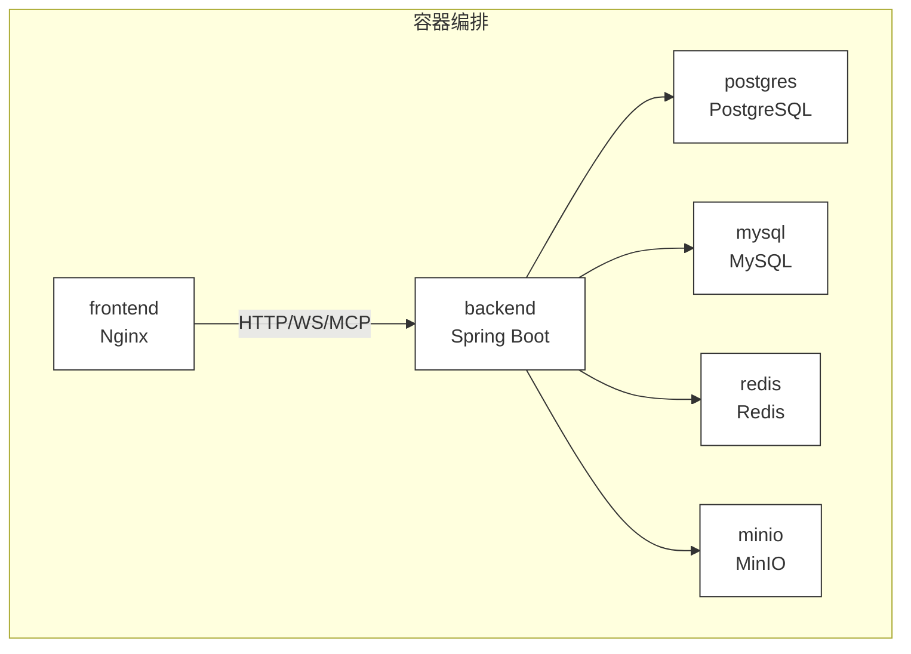
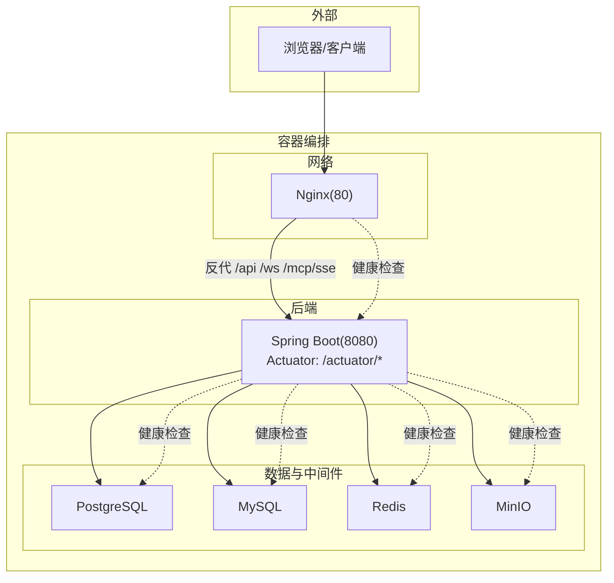
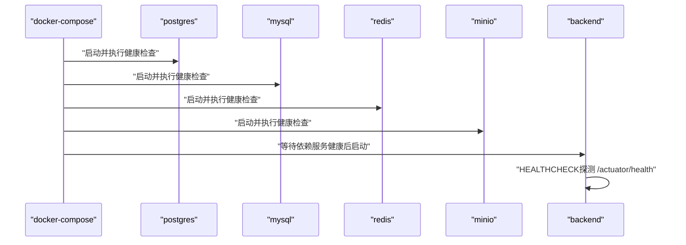
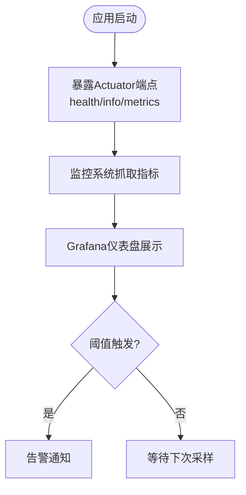
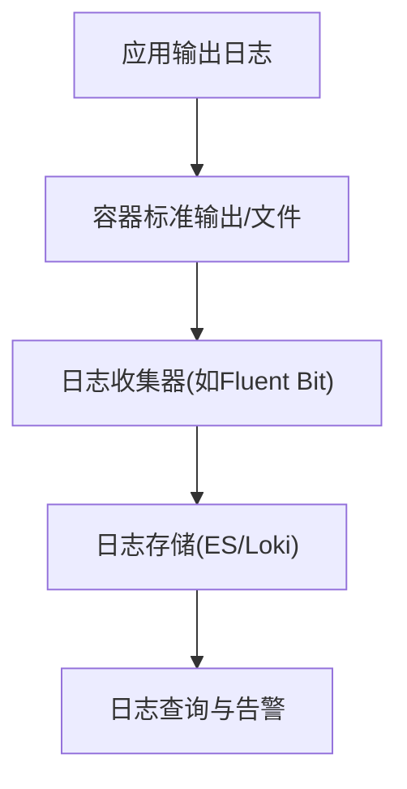
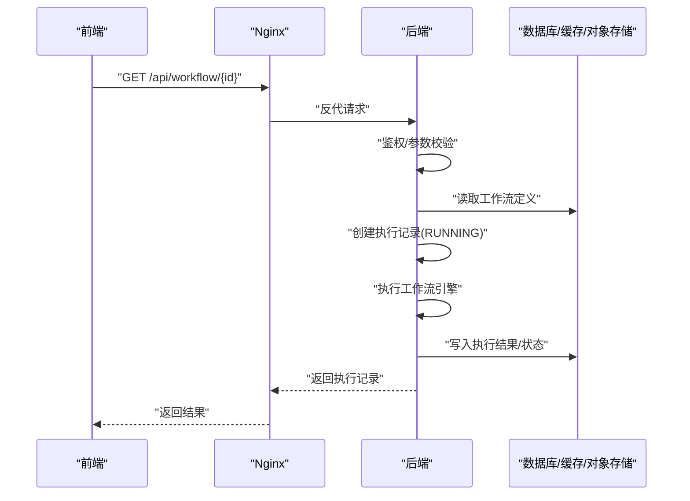
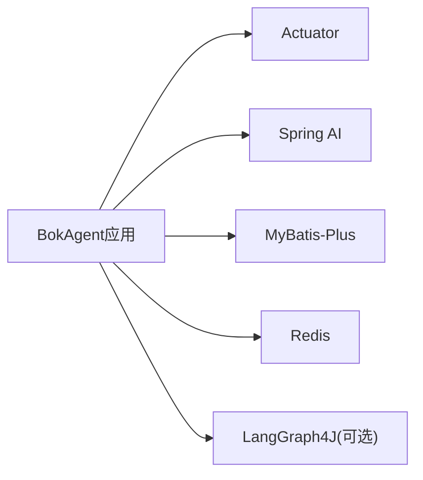

# 监控运维

<cite>
**本文引用的文件**   
- [application.yml](file://backend/src/main/resources/application.yml)
- [docker-compose.yml](file://docker/docker-compose.yml)
- [Dockerfile.backend](file://docker/Dockerfile.backend)
- [pom.xml](file://backend/pom.xml)
- [BokAgentApplication.java](file://backend/src/main/java/com/bokagent/BokAgentApplication.java)
- [GlobalExceptionHandler.java](file://backend/src/main/java/com/bokagent/common/GlobalExceptionHandler.java)
- [LLMService.java](file://backend/src/main/java/com/bokagent/service/LLMService.java)
- [WorkflowEngine.java](file://backend/src/main/java/com/bokagent/engine/WorkflowEngine.java)
- [ExecutionController.java](file://backend/src/main/java/com/bokagent/controller/ExecutionController.java)
- [ExecutionService.java](file://backend/src/main/java/com/bokagent/service/ExecutionService.java)
- [ExecutionRecordMapper.java](file://backend/src/main/java/com/bokagent/mapper/ExecutionRecordMapper.java)
- [start.sh](file://start.sh)
- [nginx.conf](file://docker/nginx.conf)
- [README.md](file://README.md)
</cite>

## 目录
1. [简介](#简介)
2. [项目结构](#项目结构)
3. [核心组件](#核心组件)
4. [架构总览](#架构总览)
5. [详细组件分析](#详细组件分析)
6. [依赖分析](#依赖分析)
7. [性能考虑](#性能考虑)
8. [故障排除指南](#故障排除指南)
9. [结论](#结论)
10. [附录](#附录)

## 简介
本指南面向BokAgent系统的监控与运维团队，围绕容器监控、应用指标、日志管理、性能监控、告警机制与运维自动化展开。结合项目现有的Docker编排、Actuator暴露、日志配置与健康检查能力，给出可落地的监控与运维实践建议，并补充必要的指标采集与告警策略。

## 项目结构
BokAgent采用前后端分离与容器化部署：
- 后端：Spring Boot 3.5 + Java 21，集成Spring AI、MyBatis-Plus、Redis、PostgreSQL/MySQL、MinIO、LangGraph4J等。
- 前端：React 18 + Vite + Ant Design，通过Nginx反向代理与后端通信。
- 容器：docker-compose统一编排，包含PostgreSQL、MySQL、Redis、MinIO与后端/前端服务；后端镜像内置健康检查与Actuator端点。

图表来源
- [docker-compose.yml:1-132](file://docker/docker-compose.yml#L1-L132)
- [nginx.conf:1-56](file://docker/nginx.conf#L1-L56)

章节来源
- [docker-compose.yml:1-132](file://docker/docker-compose.yml#L1-L132)
- [README.md:1-106](file://README.md#L1-L106)

## 核心组件
- 容器与服务健康检查：PostgreSQL/MySQL/Redis/MinIO均配置健康检查；后端容器通过HEALTHCHECK探测Actuator健康端点。
- 应用监控：启用Actuator的health/info/metrics端点，暴露运行状态与指标。
- 日志：统一UTF-8编码，控制台与文件输出格式一致，支持滚动与保留天数。
- 缓存与超时：Hikari连接池、Redis连接池、缓存TTL、各类调用超时配置。
- 异常处理：全局异常捕获，统一返回结构与日志记录。
- LLM调用：基于Spring AI的ChatClient，记录提示词长度与调用异常。
- 工作流执行：记录执行耗时、状态与错误，便于追踪与审计。

章节来源
- [application.yml:1-190](file://backend/src/main/resources/application.yml#L1-L190)
- [Dockerfile.backend:1-51](file://docker/Dockerfile.backend#L1-L51)
- [docker-compose.yml:1-132](file://docker/docker-compose.yml#L1-L132)
- [GlobalExceptionHandler.java:1-37](file://backend/src/main/java/com/bokagent/common/GlobalExceptionHandler.java#L1-L37)
- [LLMService.java:1-67](file://backend/src/main/java/com/bokagent/service/LLMService.java#L1-L67)
- [ExecutionService.java:1-113](file://backend/src/main/java/com/bokagent/service/ExecutionService.java#L1-L113)
- [ExecutionController.java:1-81](file://backend/src/main/java/com/bokagent/controller/ExecutionController.java#L1-L81)

## 架构总览
下图展示容器层、应用层与外部依赖之间的交互关系，以及健康检查与监控端点的位置。

图表来源
- [docker-compose.yml:1-132](file://docker/docker-compose.yml#L1-L132)
- [nginx.conf:1-56](file://docker/nginx.conf#L1-L56)
- [Dockerfile.backend:39-41](file://docker/Dockerfile.backend#L39-L41)
- [application.yml:181-190](file://backend/src/main/resources/application.yml#L181-L190)

## 详细组件分析

### 容器监控与健康检查
- 数据库服务：PostgreSQL/MySQL/Redis/MinIO均配置健康检查命令与重试次数，容器启动后自动验证可达性。
- 后端服务：容器内置HEALTHCHECK，探测Actuator健康端点；同时docker-compose通过depends_on配合service_healthy保证依赖服务就绪。
- 前端服务：Nginx作为反向代理，负责静态资源与API转发，需配合后端健康状态进行整体可用性判断。

图表来源
- [docker-compose.yml:22-81](file://docker/docker-compose.yml#L22-L81)
- [Dockerfile.backend:39-41](file://docker/Dockerfile.backend#L39-L41)

章节来源
- [docker-compose.yml:1-132](file://docker/docker-compose.yml#L1-L132)
- [Dockerfile.backend:1-51](file://docker/Dockerfile.backend#L1-L51)

### 应用监控指标与采集
- Actuator端点：health、info、metrics已暴露，可用于Prometheus/Grafana等监控平台抓取。
- 关键指标建议：
  - 健康状态：/actuator/health（含细节）
  - JVM堆/非堆使用、线程数、GC次数与耗时
  - HTTP请求指标：请求数、错误率、响应时间分位
  - 数据库连接池：活跃/空闲连接数、等待时间
  - 缓存命中率：Redis命中/未命中计数
  - LLM调用统计：成功/失败次数、平均/分位耗时、错误类型分布
  - 工作流执行：执行次数、成功率、平均耗时、最长耗时
- 日志级别：根级别INFO，com.bokagent与org.springframework.ai设为DEBUG，便于问题定位。

图表来源
- [application.yml:181-190](file://backend/src/main/resources/application.yml#L181-L190)

章节来源
- [application.yml:164-190](file://backend/src/main/resources/application.yml#L164-L190)
- [pom.xml:48-49](file://backend/pom.xml#L48-L49)

### 日志管理策略
- 编码与格式：控制台与文件均为UTF-8，统一日志模式，便于跨组件检索。
- 文件滚动：单文件最大10MB，保留30天历史，避免磁盘膨胀。
- 级别控制：生产环境建议提升至WARN/INFO，仅在排查时临时调整为DEBUG。
- 集中式收集：建议在容器编排中挂载日志卷或使用sidecar收集器（如Fluent Bit/Logstash），将/act/logs汇聚至ELK/Graylog/Loki。
- 错误追踪：结合全局异常处理器记录异常堆栈，便于快速定位。

图表来源
- [application.yml:164-179](file://backend/src/main/resources/application.yml#L164-L179)
- [GlobalExceptionHandler.java:1-37](file://backend/src/main/java/com/bokagent/common/GlobalExceptionHandler.java#L1-L37)

章节来源
- [application.yml:164-179](file://backend/src/main/resources/application.yml#L164-L179)
- [GlobalExceptionHandler.java:1-37](file://backend/src/main/java/com/bokagent/common/GlobalExceptionHandler.java#L1-L37)

### 性能监控方案
- JVM性能：通过Actuator暴露JVM指标，关注堆使用、GC、线程、类加载等。
- 数据库性能：监控PostgreSQL/MySQL连接数、慢查询、锁等待；结合Hikari配置评估连接池容量。
- 前端性能：Nginx可记录请求耗时、状态码；结合浏览器性能面板与APM（如SkyWalking/Zipkin）追踪端到端链路。
- 工作流与LLM：记录执行耗时、成功率与错误类型；对LLM调用统计平均/分位耗时与错误分布，辅助模型与参数优化。

章节来源
- [application.yml:22-25](file://backend/src/main/resources/application.yml#L22-L25)
- [LLMService.java:1-67](file://backend/src/main/java/com/bokagent/service/LLMService.java#L1-L67)
- [ExecutionService.java:1-113](file://backend/src/main/java/com/bokagent/service/ExecutionService.java#L1-L113)

### 告警机制配置
- 阈值建议：
  - 健康检查失败次数/连续失败
  - HTTP错误率（5xx）超过阈值
  - 响应时间P95/P99超过阈值
  - 数据库连接池空闲/等待超时
  - LLM调用失败率/超时率
  - 工作流执行失败率/超时率
- 通知渠道：邮件、Webhook、IM（如钉钉/飞书）、PagerDuty等。
- 故障自动恢复：容器重启策略（restart policy）、服务依赖健康检查、自动扩缩容（如Kubernetes HPA）。

章节来源
- [docker-compose.yml:105-113](file://docker/docker-compose.yml#L105-L113)
- [Dockerfile.backend:39-41](file://docker/Dockerfile.backend#L39-L41)
- [application.yml:181-190](file://backend/src/main/resources/application.yml#L181-L190)

### 运维自动化脚本
- 启动与验证：一键启动容器、等待服务、验证UTF-8编码与中文存储、打印访问地址与日志查看方式。
- 建议扩展：
  - 备份脚本：导出PostgreSQL/MySQL数据、备份Redis快照、MinIO对象归档。
  - 重启策略：按服务粒度重启（如后端/数据库/缓存），记录重启时间与健康恢复时间。
  - 扩容脚本：调整docker-compose副本数或Kubernetes副本数，观察指标变化。
  - 灰度发布：蓝绿/金丝雀发布流程与回滚策略。

章节来源
- [start.sh:1-58](file://start.sh#L1-L58)
- [docker-compose.yml:1-132](file://docker/docker-compose.yml#L1-L132)

### API与执行流程（监控视角）
以下序列图展示前端通过Nginx调用后端API，后端执行工作流并记录执行记录的过程，便于在监控侧标注关键指标埋点位置。

图表来源
- [nginx.conf:20-34](file://docker/nginx.conf#L20-L34)
- [ExecutionController.java:1-81](file://backend/src/main/java/com/bokagent/controller/ExecutionController.java#L1-L81)
- [ExecutionService.java:1-113](file://backend/src/main/java/com/bokagent/service/ExecutionService.java#L1-L113)
- [ExecutionRecordMapper.java:1-12](file://backend/src/main/java/com/bokagent/mapper/ExecutionRecordMapper.java#L1-L12)

## 依赖分析
- Spring Boot Actuator：提供健康、信息与指标端点，是监控体系的核心。
- Spring AI：LLM调用入口，建议在调用前后埋点统计耗时与错误。
- MyBatis-Plus：数据库访问层，建议结合慢查询日志与连接池指标分析性能瓶颈。
- Redis：缓存命中/未命中计数与延迟，建议通过指标平台观测。
- LangGraph4J：可选执行引擎，当前使用自定义引擎，未来可替换并增加引擎特定指标。

图表来源
- [pom.xml:48-100](file://backend/pom.xml#L48-L100)
- [application.yml:101-107](file://backend/src/main/resources/application.yml#L101-L107)

章节来源
- [pom.xml:1-170](file://backend/pom.xml#L1-L170)
- [application.yml:1-190](file://backend/src/main/resources/application.yml#L1-L190)

## 性能考虑
- JVM与线程：启用虚拟线程（UseVirtualThreads），降低上下文切换成本；合理设置堆大小与GC策略。
- 数据库：Hikari连接池参数与数据库连接上限匹配；开启慢查询日志与索引分析。
- 缓存：合理设置TTL与容量，结合命中率与延迟优化缓存策略。
- LLM：限制并发调用、引入重试与熔断，记录调用耗时与错误类型，便于容量规划。
- 工作流：对长耗时节点拆分、异步化与进度上报，减少阻塞与超时风险。

## 故障排除指南
- 启动后端无法访问：检查容器健康检查与Actuator端点；确认端口映射与防火墙。
- 中文乱码：核对JVM编码、容器locale、数据库编码与Nginx字符集配置。
- 数据库连接失败：检查数据库健康状态、连接池参数与网络连通性。
- LLM调用异常：检查API密钥、Base URL、超时与重试配置；查看日志与异常处理器输出。
- 执行记录异常：核对执行记录创建/更新逻辑与数据库写入状态。

章节来源
- [BokAgentApplication.java:1-56](file://backend/src/main/java/com/bokagent/BokAgentApplication.java#L1-L56)
- [GlobalExceptionHandler.java:1-37](file://backend/src/main/java/com/bokagent/common/GlobalExceptionHandler.java#L1-L37)
- [docker-compose.yml:105-113](file://docker/docker-compose.yml#L105-L113)
- [application.yml:149-155](file://backend/src/main/resources/application.yml#L149-L155)

## 结论
通过容器健康检查、Actuator指标暴露、统一日志与异常处理，BokAgent具备完善的监控与运维基础。建议在此基础上接入集中式监控与告警平台，完善指标采集与阈值告警，结合自动化脚本实现备份、重启与扩容的标准化流程，持续优化数据库、缓存与LLM调用性能，保障系统稳定与可观测性。

## 附录
- 快速验证：使用提供的启动脚本验证UTF-8与服务可用性，查看日志与访问地址。
- 前端代理：Nginx配置确保UTF-8字符集与API/WebSocket/MCP SSE代理正确。

章节来源
- [start.sh:1-58](file://start.sh#L1-L58)
- [nginx.conf:1-56](file://docker/nginx.conf#L1-L56)
- [README.md:30-50](file://README.md#L30-L50)