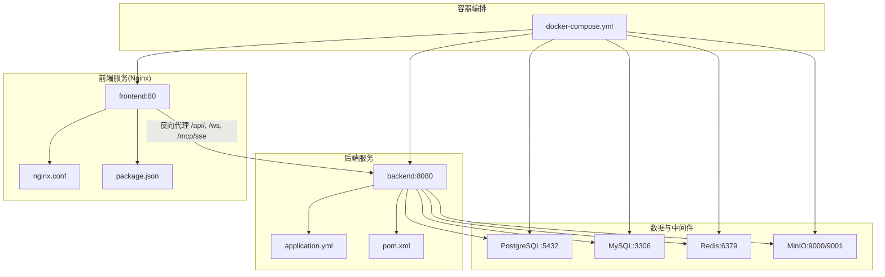
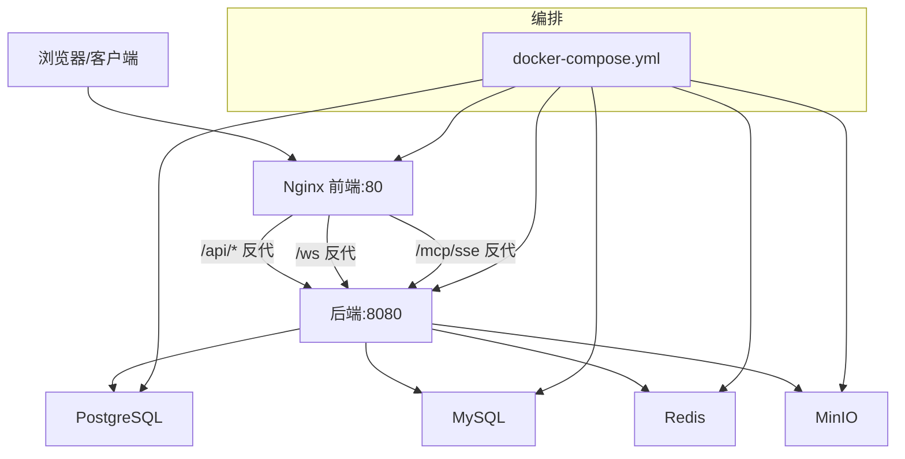
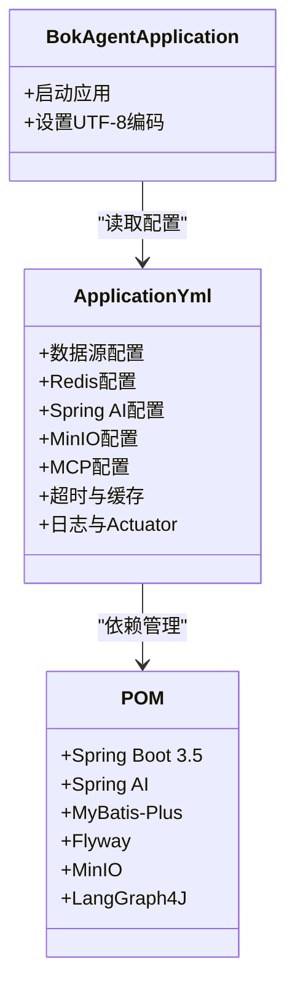
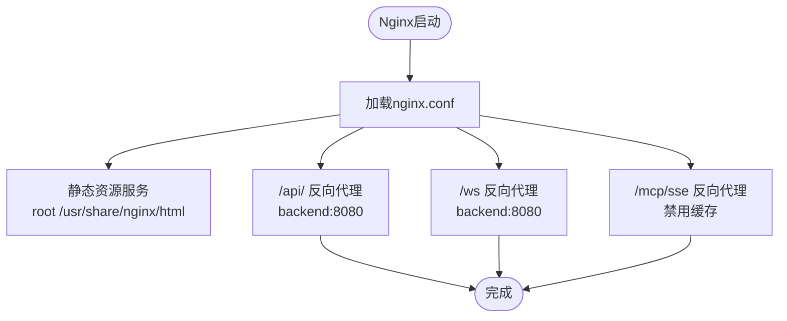
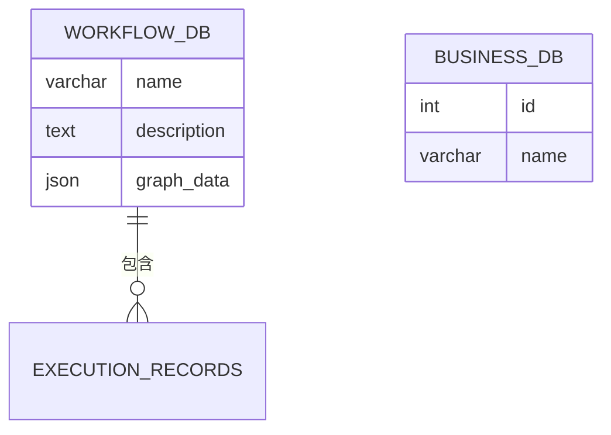
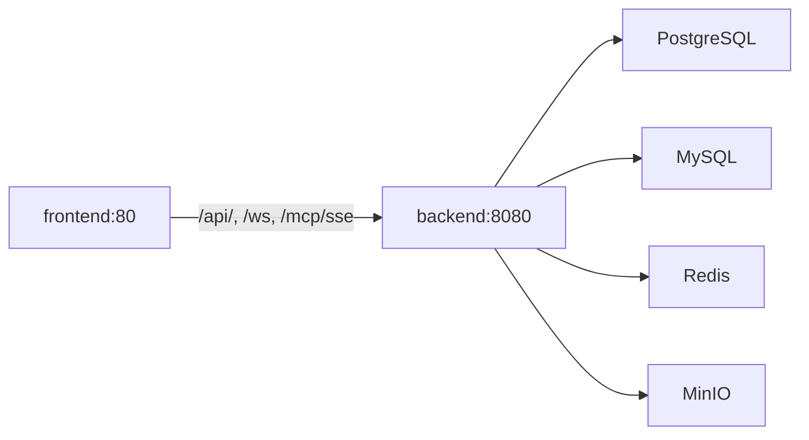

# 部署运维

<cite>
**本文引用的文件**
- [docker-compose.yml](file://docker/docker-compose.yml)
- [Dockerfile.backend](file://docker/Dockerfile.backend)
- [Dockerfile.frontend](file://docker/Dockerfile.frontend)
- [nginx.conf](file://docker/nginx.conf)
- [application.yml](file://backend/src/main/resources/application.yml)
- [pom.xml](file://backend/pom.xml)
- [package.json](file://frontend/package.json)
- [start.sh](file://start.sh)
- [start.ps1](file://start.ps1)
- [README.md](file://README.md)
- [PROJECT_STRUCTURE.md](file://docs/PROJECT_STRUCTURE.md)
- [QUICKSTART.md](file://QUICKSTART.md)
- [init-postgres.sql](file://docker/init-postgres.sql)
- [init-mysql.sql](file://docker/init-mysql.sql)
</cite>

## 目录
1. [简介](#简介)
2. [项目结构](#项目结构)
3. [核心组件](#核心组件)
4. [架构总览](#架构总览)
5. [详细组件分析](#详细组件分析)
6. [依赖关系分析](#依赖关系分析)
7. [性能考量](#性能考量)
8. [故障排除指南](#故障排除指南)
9. [结论](#结论)
10. [附录](#附录)

## 简介
本指南面向运维工程师，提供BokAgent系统在生产与开发环境中的完整部署与运维方案。内容覆盖Docker容器化部署、镜像构建策略、服务编排、网络与存储配置、多服务协调、Nginx反向代理、生产环境配置、CI/CD流水线、性能监控与故障排除、扩展性设计等。

## 项目结构
BokAgent采用前后端分离与多服务编排的架构，核心由以下部分组成：
- 后端服务：基于Spring Boot 3.5 + JDK 21，提供REST API、WebSocket、MCP协议、缓存与对象存储集成。
- 前端服务：基于React 18 + Vite，通过Nginx提供静态资源与反向代理。
- 数据库：PostgreSQL（工作流数据）与MySQL（业务数据）。
- 缓存：Redis。
- 对象存储：MinIO。
- 编排：Docker Compose。
- 字符集与国际化：全链路UTF-8与中文支持。

图表来源
- [docker-compose.yml:1-132](file://docker/docker-compose.yml#L1-L132)
- [application.yml:1-182](file://backend/src/main/resources/application.yml#L1-L182)
- [nginx.conf:1-56](file://docker/nginx.conf#L1-L56)

章节来源
- [PROJECT_STRUCTURE.md:1-256](file://docs/PROJECT_STRUCTURE.md#L1-L256)
- [README.md:1-106](file://README.md#L1-L106)

## 核心组件
- 后端镜像构建（多阶段）
  - 构建阶段：Maven + Eclipse Temurin 21，打包JAR。
  - 运行阶段：Alpine Linux + JRE 21，启用虚拟线程，设置UTF-8与时区，暴露8080端口，健康检查。
- 前端镜像构建（多阶段）
  - 构建阶段：Node 20 + npm ci + 构建产物。
  - 运行阶段：Nginx Alpine，复制构建产物与Nginx配置，暴露80端口。
- 编排与服务
  - PostgreSQL、MySQL、Redis、MinIO、后端、前端。
  - 环境变量注入（API密钥、数据库凭据、MinIO端点等），健康检查，数据卷持久化。
- Nginx反向代理
  - 静态资源服务与UTF-8字符集；API、WebSocket、MCP SSE代理；传递头部与编码。
- 配置中心
  - application.yml集中管理数据库、缓存、AI提供商、MinIO、MCP、超时与日志等。

章节来源
- [Dockerfile.backend:1-51](file://docker/Dockerfile.backend#L1-L51)
- [Dockerfile.frontend:1-35](file://docker/Dockerfile.frontend#L1-L35)
- [docker-compose.yml:1-132](file://docker/docker-compose.yml#L1-L132)
- [application.yml:1-182](file://backend/src/main/resources/application.yml#L1-L182)
- [nginx.conf:1-56](file://docker/nginx.conf#L1-L56)

## 架构总览
下图展示容器间交互、网络与数据流向，以及Nginx作为入口代理的作用。

图表来源
- [docker-compose.yml:1-132](file://docker/docker-compose.yml#L1-L132)
- [nginx.conf:20-54](file://docker/nginx.conf#L20-L54)
- [application.yml:16-106](file://backend/src/main/resources/application.yml#L16-L106)

## 详细组件分析

### 后端服务（Spring Boot）
- 镜像与运行
  - 多阶段构建，JDK 21，启用虚拟线程，UTF-8与Asia/Shanghai时区，健康检查。
- 配置要点
  - 数据源（PostgreSQL）、Flyway迁移、Redis、Spring AI（OpenAI/Deepseek/Qwen）、Jackson、消息编码、异步任务池、MyBatis-Plus、MinIO、MCP（SSE/WebSocket）、超时与缓存策略、日志与Actuator。
- 依赖
  - Web、Websocket、Data Redis、Actuator、MyBatis-Plus、Flyway、MinIO、LangGraph4J、WebSocket客户端等。

图表来源
- [application.yml:1-182](file://backend/src/main/resources/application.yml#L1-L182)
- [pom.xml:1-170](file://backend/pom.xml#L1-L170)

章节来源
- [Dockerfile.backend:1-51](file://docker/Dockerfile.backend#L1-L51)
- [application.yml:1-182](file://backend/src/main/resources/application.yml#L1-L182)
- [pom.xml:1-170](file://backend/pom.xml#L1-L170)

### 前端服务（Nginx）
- 镜像与运行
  - 多阶段构建，Nginx Alpine，复制dist与nginx.conf，设置UTF-8与Asia/Shanghai。
- 反向代理
  - 静态资源根路径与try_files；/api/、/ws、/mcp/sse分别代理至后端；传递Host、X-Real-IP、X-Forwarded-*、X-Forwarded-Proto；SSE关闭缓存与强制旁路。

图表来源
- [Dockerfile.frontend:14-35](file://docker/Dockerfile.frontend#L14-L35)
- [nginx.conf:1-56](file://docker/nginx.conf#L1-L56)

章节来源
- [Dockerfile.frontend:1-35](file://docker/Dockerfile.frontend#L1-L35)
- [nginx.conf:1-56](file://docker/nginx.conf#L1-L56)

### 数据库与中间件
- PostgreSQL（工作流数据）
  - 初始化脚本创建UTF8数据库，安装uuid-ossp与pg_trgm扩展，设置UTF8与排序规则。
  - Compose中设置UTF-8初始化参数与健康检查。
- MySQL（业务数据）
  - 初始化脚本创建utf8mb4数据库，设置校对规则，Compose中设置字符集与时区。
- Redis
  - 启用AOF持久化，健康检查。
- MinIO
  - 对象存储与控制台，健康检查。

图表来源
- [init-postgres.sql:1-20](file://docker/init-postgres.sql#L1-L20)
- [init-mysql.sql:1-12](file://docker/init-mysql.sql#L1-L12)

章节来源
- [docker-compose.yml:1-132](file://docker/docker-compose.yml#L1-L132)
- [init-postgres.sql:1-20](file://docker/init-postgres.sql#L1-L20)
- [init-mysql.sql:1-12](file://docker/init-mysql.sql#L1-L12)

### Nginx反向代理配置详解
- 字符集与头部
  - 设置charset utf-8，Content-Type附加UTF-8，Accept-Charset utf-8传递。
- 路由规则
  - /api/ 代理至后端8080，传递鉴权与转发头。
  - /ws 升级WebSocket至后端。
  - /mcp/sse 关闭缓存与旁路升级。
- 健康检查
  - 后端Actuator健康端点可用于外部探活。

章节来源
- [nginx.conf:1-56](file://docker/nginx.conf#L1-L56)
- [application.yml:173-182](file://backend/src/main/resources/application.yml#L173-L182)

### 生产环境配置指南
- 环境变量管理
  - 使用 .env 文件注入API密钥与数据库凭据；Compose中通过环境变量传入容器。
- 敏感信息保护
  - 将 .env 与敏感配置纳入 .gitignore；生产中使用机密管理（如Kubernetes Secret或Vault）。
- 日志配置
  - application.yml中设置UTF-8日志编码、文件大小与保留天数；建议接入集中式日志（如ELK/Fluentd）。
- 监控指标
  - Actuator暴露health、info、metrics；建议结合Prometheus/Grafana采集JVM与应用指标。
- 网络与安全
  - 仅暴露必要端口；在生产中启用SSL终止（可在前置LB或Ingress完成）；限制内网访问数据库与MinIO控制台。

章节来源
- [docker-compose.yml:88-100](file://docker/docker-compose.yml#L88-L100)
- [application.yml:156-182](file://backend/src/main/resources/application.yml#L156-L182)
- [README.md:39-50](file://README.md#L39-L50)

### CI/CD流水线设置
- 自动化构建
  - 触发条件：push到分支或打标签；步骤：拉取代码、构建后端JAR、构建前端静态、构建镜像、推送镜像。
- 测试集成
  - 在构建阶段加入单元测试与集成测试（可选），失败则阻断发布。
- 部署策略
  - 蓝绿/金丝雀：通过Compose或Kubernetes滚动更新；健康检查失败回滚。
  - 配置注入：使用环境变量或Secrets；避免硬编码。
- 发布与验证
  - 部署后执行快速验证（HTTP 200、Actuator健康、中文与Emoji可用性）。

（本节为通用实践说明，不直接分析具体文件）

### 性能监控与故障排除
- 性能指标
  - JVM线程与GC、数据库连接池、Redis命中率、MinIO吞吐与延迟、Nginx请求数与错误码。
- 日志分析
  - 后端日志级别与文件轮转；前端Nginx访问与错误日志；数据库慢查询日志。
- 健康检查
  - Compose健康检查与Actuator健康端点；结合探针实现自动恢复。
- 常见问题
  - 端口冲突：调整映射；服务未就绪：检查依赖健康状态；中文乱码：确认UTF-8配置链路。

章节来源
- [docker-compose.yml:22-81](file://docker/docker-compose.yml#L22-L81)
- [application.yml:173-182](file://backend/src/main/resources/application.yml#L173-L182)
- [QUICKSTART.md:112-164](file://QUICKSTART.md#L112-L164)

### 扩展性考虑
- 水平扩展
  - 后端：多实例部署，共享数据库与Redis；前端：多副本Nginx。
- 负载均衡
  - 使用反向代理或云负载均衡分发流量；Nginx可配置上游集群。
- 数据库读写分离
  - 读库：只读副本；写库：主库；缓存：多实例Redis Cluster。
- 存储与对象
  - MinIO可横向扩展；生产中启用纠删码与桶策略。

（本节为通用实践说明，不直接分析具体文件）

## 依赖关系分析

图表来源
- [docker-compose.yml:83-126](file://docker/docker-compose.yml#L83-L126)
- [nginx.conf:20-54](file://docker/nginx.conf#L20-L54)
- [application.yml:16-106](file://backend/src/main/resources/application.yml#L16-L106)

章节来源
- [docker-compose.yml:1-132](file://docker/docker-compose.yml#L1-L132)
- [nginx.conf:1-56](file://docker/nginx.conf#L1-L56)
- [application.yml:1-182](file://backend/src/main/resources/application.yml#L1-L182)

## 性能考量
- JVM与线程
  - 启用虚拟线程提升并发；合理设置堆与GC参数。
- 数据库
  - 连接池大小与超时；索引与查询优化；Flyway版本化迁移。
- 缓存
  - TTL策略与热点数据预热；Redis哨兵/集群提高可用性。
- 存储
  - MinIO分片与纠删码；对象生命周期管理。
- 网络
  - Nginx压缩与静态缓存；CDN加速静态资源。

（本节为通用指导，不直接分析具体文件）

## 故障排除指南
- 启动与健康
  - 使用 docker-compose ps/ logs 排查；确认各服务健康检查通过。
- 编码问题
  - 核对容器locale、JVM编码、数据库字符集与排序规则；参考初始化脚本与Compose配置。
- API与代理
  - 检查Nginx代理头与路径；确认后端端口映射与防火墙。
- 数据库连接
  - 校验主机名、端口、凭据与网络连通性；Flyway迁移是否成功。
- MinIO
  - 控制台端口与凭据；健康检查URL；桶权限与生命周期。

章节来源
- [docker-compose.yml:1-132](file://docker/docker-compose.yml#L1-L132)
- [start.sh:1-58](file://start.sh#L1-L58)
- [start.ps1:1-65](file://start.ps1#L1-L65)
- [QUICKSTART.md:112-164](file://QUICKSTART.md#L112-L164)

## 结论
通过Docker多阶段镜像与Compose编排，BokAgent实现了前后端分离、多数据源与中间件协同的容器化部署。配合UTF-8全链路配置、Nginx反向代理与Actuator监控，系统具备良好的可维护性与可扩展性。建议在生产中进一步完善密钥管理、监控告警、蓝绿发布与数据库高可用策略。

## 附录
- 快速启动与验证
  - 复制并编辑 .env；使用启动脚本或 docker-compose；验证UTF-8与中文存储；访问前端、后端健康检查、MinIO控制台。
- 本地开发
  - 后端：进入 backend 目录执行 spring-boot:run；前端：进入 frontend 目录执行 npm run dev。

章节来源
- [QUICKSTART.md:23-102](file://QUICKSTART.md#L23-L102)
- [README.md:32-50](file://README.md#L32-L50)
- [start.sh:1-58](file://start.sh#L1-L58)
- [start.ps1:1-65](file://start.ps1#L1-L65)