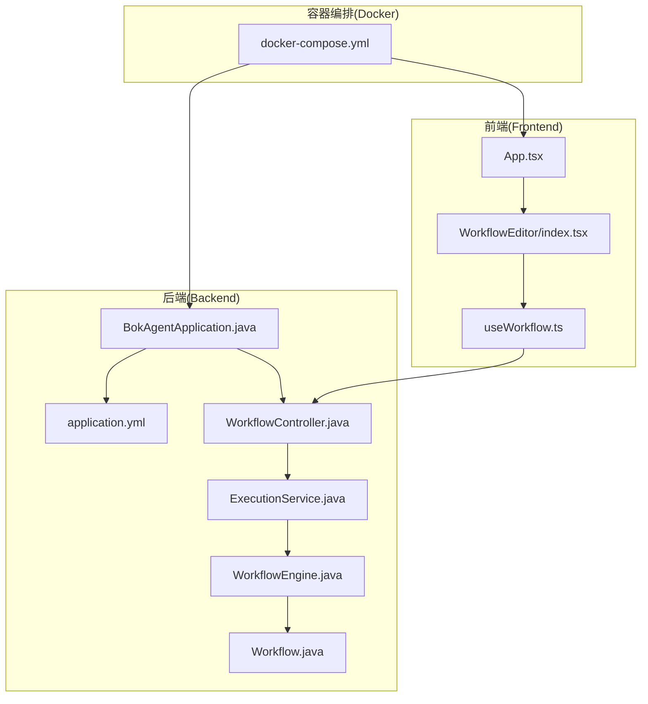
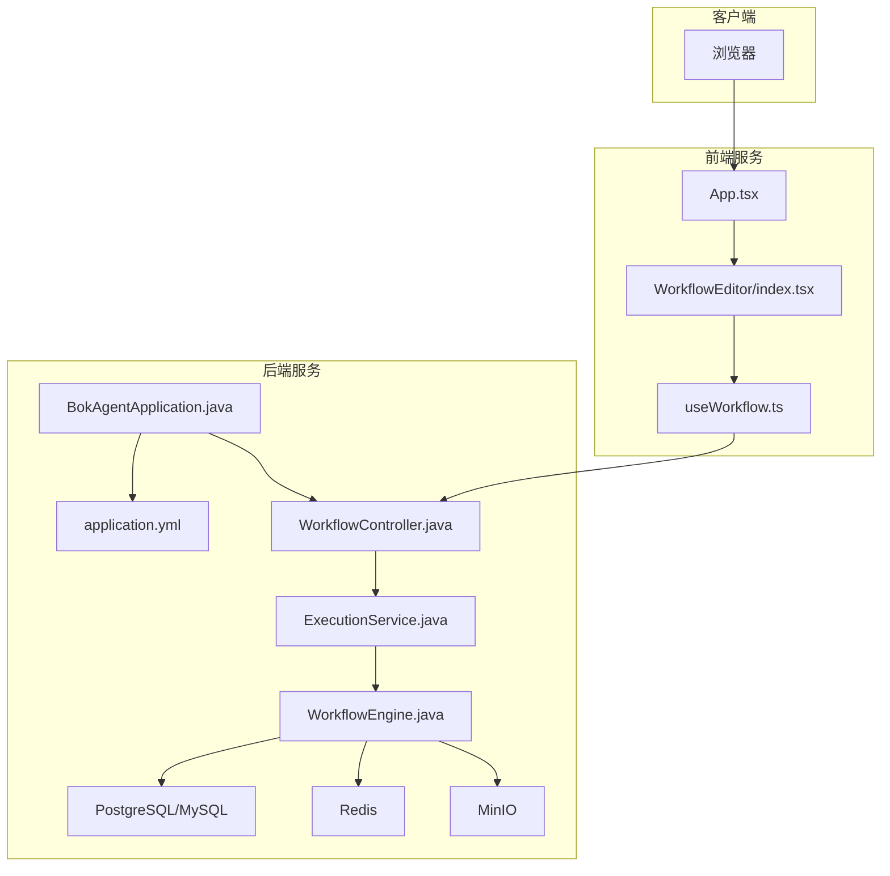
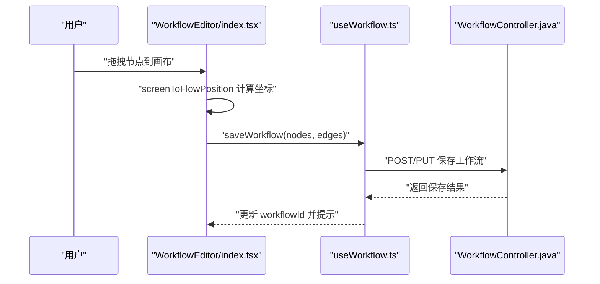
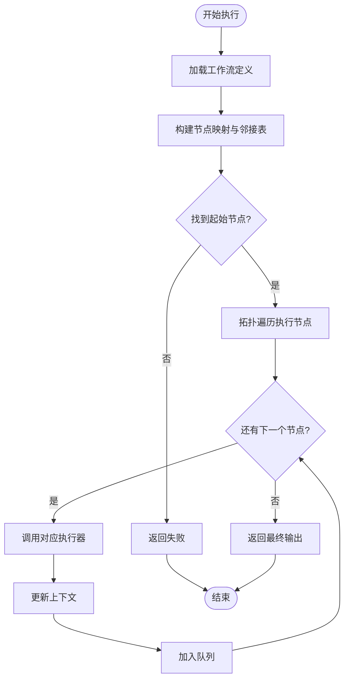
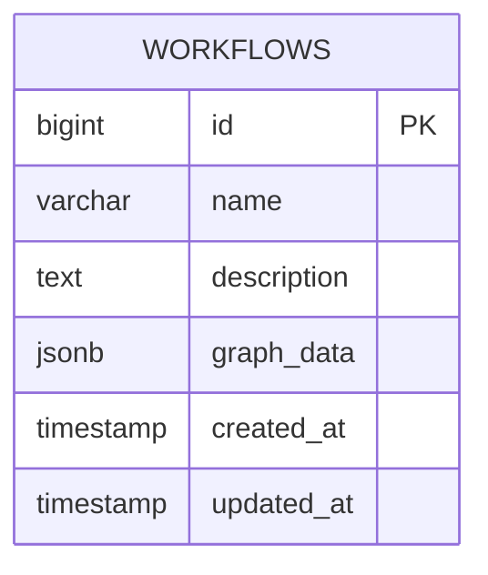
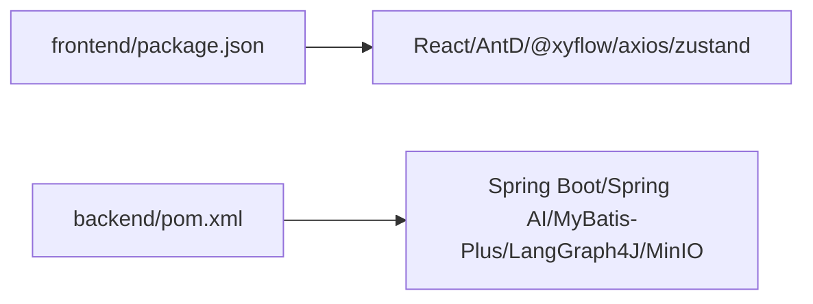

# 项目概述

<cite>
**本文引用的文件**
- [README.md](file://README.md)
- [BokAgentApplication.java](file://backend/src/main/java/com/bokagent/BokAgentApplication.java)
- [WorkflowController.java](file://backend/src/main/java/com/bokagent/controller/WorkflowController.java)
- [WorkflowEngine.java](file://backend/src/main/java/com/bokagent/engine/WorkflowEngine.java)
- [NodeExecutor.java](file://backend/src/main/java/com/bokagent/engine/NodeExecutor.java)
- [ExecutionService.java](file://backend/src/main/java/com/bokagent/service/ExecutionService.java)
- [Workflow.java](file://backend/src/main/java/com/bokagent/entity/Workflow.java)
- [App.tsx](file://frontend/src/App.tsx)
- [index.tsx](file://frontend/src/components/WorkflowEditor/index.tsx)
- [useWorkflow.ts](file://frontend/src/hooks/useWorkflow.ts)
- [application.yml](file://backend/src/main/resources/application.yml)
- [docker-compose.yml](file://docker/docker-compose.yml)
- [pom.xml](file://backend/pom.xml)
- [package.json](file://frontend/package.json)
- [QUICKSTART.md](file://QUICKSTART.md)
</cite>

## 目录
1. [简介](#简介)
2. [项目结构](#项目结构)
3. [核心组件](#核心组件)
4. [架构总览](#架构总览)
5. [详细组件分析](#详细组件分析)
6. [依赖分析](#依赖分析)
7. [性能考虑](#性能考虑)
8. [故障排除指南](#故障排除指南)
9. [结论](#结论)
10. [附录](#附录)

## 简介
BokAgent 是一个面向企业级应用的 AI Agent 可视化工作流编排系统，采用前后端分离架构，结合 React 18 + TypeScript 的前端与 Spring Boot 3.5 + Spring AI 的后端，提供基于 React Flow 的拖拽式工作流编辑器、多大模型（LLM）支持、工具注册与函数调用、插件生态、MCP 协议双向通信、TTS 音频合成以及重试、超时、缓存、异步执行等企业级能力。系统通过 Docker 一键部署，完整支持 UTF-8 与中文，适合在生产环境中稳定运行。

## 项目结构
项目采用典型的前后端分离布局，后端使用 Spring Boot 3.5，前端使用 React 18 + TypeScript，配合 Vite 构建与 Ant Design UI 框架；容器层通过 docker-compose 编排 PostgreSQL、MySQL、Redis、MinIO 等依赖服务与后端、前端镜像。

**图表来源**
- [App.tsx:1-21](file://frontend/src/App.tsx#L1-L21)
- [index.tsx:1-116](file://frontend/src/components/WorkflowEditor/index.tsx#L1-L116)
- [useWorkflow.ts:1-69](file://frontend/src/hooks/useWorkflow.ts#L1-L69)
- [BokAgentApplication.java:1-56](file://backend/src/main/java/com/bokagent/BokAgentApplication.java#L1-L56)
- [application.yml:1-182](file://backend/src/main/resources/application.yml#L1-L182)
- [WorkflowController.java:1-92](file://backend/src/main/java/com/bokagent/controller/WorkflowController.java#L1-L92)
- [ExecutionService.java:1-110](file://backend/src/main/java/com/bokagent/service/ExecutionService.java#L1-L110)
- [WorkflowEngine.java:1-169](file://backend/src/main/java/com/bokagent/engine/WorkflowEngine.java#L1-L169)
- [Workflow.java:1-32](file://backend/src/main/java/com/bokagent/entity/Workflow.java#L1-L32)
- [docker-compose.yml:1-132](file://docker/docker-compose.yml#L1-L132)

**章节来源**
- [README.md:1-106](file://README.md#L1-L106)
- [docker-compose.yml:1-132](file://docker/docker-compose.yml#L1-L132)

## 核心组件
- 可视化工作流编辑器：基于 React Flow 的拖拽式画布，支持节点拖放、连线、保存与调试。
- 工作流引擎：负责解析工作流图、构建执行图、拓扑顺序执行节点、维护执行上下文。
- 控制器与服务：提供工作流的 CRUD 接口与执行记录管理，协调引擎执行并持久化结果。
- 多 LLM 支持：通过 Spring AI 配置 OpenAI、Deepseek、通义千问等模型，统一对外接口。
- 插件与工具生态：预留插件与工具扩展点，支持热插拔与动态扩展。
- MCP 协议：支持双向 MCP（Server + Client），实现工具与资源的标准化交互。
- 企业级特性：重试、超时、缓存、异步执行、Actuator 监控、日志与编码配置。

**章节来源**
- [README.md:5-14](file://README.md#L5-L14)
- [index.tsx:1-116](file://frontend/src/components/WorkflowEditor/index.tsx#L1-L116)
- [WorkflowEngine.java:1-169](file://backend/src/main/java/com/bokagent/engine/WorkflowEngine.java#L1-L169)
- [WorkflowController.java:1-92](file://backend/src/main/java/com/bokagent/controller/WorkflowController.java#L1-L92)
- [ExecutionService.java:1-110](file://backend/src/main/java/com/bokagent/service/ExecutionService.java#L1-L110)
- [application.yml:45-147](file://backend/src/main/resources/application.yml#L45-L147)

## 架构总览
系统采用前后端分离与容器化部署策略。前端负责工作流可视化编辑与调试，后端提供 REST API、工作流执行引擎与数据持久化。容器编排统一管理数据库、缓存、对象存储与后端/前端服务，确保开发与生产的环境一致性。

**图表来源**
- [App.tsx:1-21](file://frontend/src/App.tsx#L1-L21)
- [index.tsx:1-116](file://frontend/src/components/WorkflowEditor/index.tsx#L1-L116)
- [useWorkflow.ts:1-69](file://frontend/src/hooks/useWorkflow.ts#L1-L69)
- [BokAgentApplication.java:1-56](file://backend/src/main/java/com/bokagent/BokAgentApplication.java#L1-L56)
- [application.yml:1-182](file://backend/src/main/resources/application.yml#L1-L182)
- [WorkflowController.java:1-92](file://backend/src/main/java/com/bokagent/controller/WorkflowController.java#L1-L92)
- [ExecutionService.java:1-110](file://backend/src/main/java/com/bokagent/service/ExecutionService.java#L1-L110)
- [WorkflowEngine.java:1-169](file://backend/src/main/java/com/bokagent/engine/WorkflowEngine.java#L1-L169)

## 详细组件分析

### 前端组件：工作流编辑器
- 功能要点：提供节点面板、拖拽添加节点、连线、保存工作流、调试抽屉等。
- 交互流程：拖拽节点到画布 → 自动计算位置 → 生成节点数据 → 保存至后端 → 成功提示。

**图表来源**
- [index.tsx:1-116](file://frontend/src/components/WorkflowEditor/index.tsx#L1-L116)
- [useWorkflow.ts:1-69](file://frontend/src/hooks/useWorkflow.ts#L1-L69)
- [WorkflowController.java:1-92](file://backend/src/main/java/com/bokagent/controller/WorkflowController.java#L1-L92)

**章节来源**
- [index.tsx:1-116](file://frontend/src/components/WorkflowEditor/index.tsx#L1-L116)
- [useWorkflow.ts:1-69](file://frontend/src/hooks/useWorkflow.ts#L1-L69)

### 后端组件：工作流引擎与执行服务
- 工作流引擎：解析 GraphData，构建邻接表，按拓扑顺序执行节点，维护上下文与输出。
- 执行服务：封装执行流程，创建执行记录，调用引擎执行，更新执行状态与结果。

**图表来源**
- [WorkflowEngine.java:1-169](file://backend/src/main/java/com/bokagent/engine/WorkflowEngine.java#L1-L169)
- [NodeExecutor.java:1-24](file://backend/src/main/java/com/bokagent/engine/NodeExecutor.java#L1-L24)

**章节来源**
- [WorkflowEngine.java:1-169](file://backend/src/main/java/com/bokagent/engine/WorkflowEngine.java#L1-L169)
- [NodeExecutor.java:1-24](file://backend/src/main/java/com/bokagent/engine/NodeExecutor.java#L1-L24)
- [ExecutionService.java:1-110](file://backend/src/main/java/com/bokagent/service/ExecutionService.java#L1-L110)

### 数据模型：工作流实体
- 工作流实体包含名称、描述、图形数据（GraphData）、创建与更新时间等字段；GraphData 通过自定义 TypeHandler 进行序列化存储。

**图表来源**
- [Workflow.java:1-32](file://backend/src/main/java/com/bokagent/entity/Workflow.java#L1-L32)

**章节来源**
- [Workflow.java:1-32](file://backend/src/main/java/com/bokagent/entity/Workflow.java#L1-L32)

### 配置与部署：Spring Boot 与 Docker
- Spring Boot 配置：数据库连接、Redis、Jackson、Spring AI 多模型、MinIO、MCP、重试、超时、缓存、日志与 Actuator。
- Docker 编排：PostgreSQL、MySQL、Redis、MinIO、后端、前端（Nginx）服务，统一时区与 UTF-8 设置。

**章节来源**
- [application.yml:1-182](file://backend/src/main/resources/application.yml#L1-L182)
- [docker-compose.yml:1-132](file://docker/docker-compose.yml#L1-L132)

## 依赖分析
- 前端依赖：React 18、Ant Design、React Flow、Monaco Editor、Axios、Zustand、STOMP 等。
- 后端依赖：Spring Boot Web/WebSocket/Redis/Actuator、Spring AI OpenAI/Starter、MyBatis-Plus、Flyway、MinIO、LangGraph4J、WebSocket 客户端等。

**图表来源**
- [package.json:1-37](file://frontend/package.json#L1-L37)
- [pom.xml:1-170](file://backend/pom.xml#L1-L170)

**章节来源**
- [package.json:1-37](file://frontend/package.json#L1-L37)
- [pom.xml:1-170](file://backend/pom.xml#L1-L170)

## 性能考虑
- 编码与国际化：前后端均配置 UTF-8，确保中文与 Emoji 正常显示，避免乱码带来的额外处理成本。
- 缓存策略：启用 Redis 缓存，针对工具结果与 LLM 响应设置 TTL，降低重复调用开销。
- 超时与重试：对 LLM 调用、工具执行、TTS 合成、MCP 请求与工作流执行分别设置超时阈值，提升稳定性。
- 异步执行：线程池配置支持并发执行，提高吞吐量。
- 数据库迁移：Flyway 自动迁移，保证数据库结构一致性，减少运维成本。

**章节来源**
- [BokAgentApplication.java:22-54](file://backend/src/main/java/com/bokagent/BokAgentApplication.java#L22-L54)
- [application.yml:130-154](file://backend/src/main/resources/application.yml#L130-L154)
- [application.yml:141-147](file://backend/src/main/resources/application.yml#L141-L147)
- [application.yml:81-89](file://backend/src/main/resources/application.yml#L81-L89)

## 故障排除指南
- 端口冲突：修改 docker-compose.yml 中的端口映射，避免 80/8080/9000/9001 冲突。
- 服务启动失败：查看后端/前端日志，确认数据库、缓存、对象存储服务是否健康。
- 数据库连接失败：检查 Postgres/MySQL 服务状态，必要时重启对应容器。
- 中文乱码：确认终端、浏览器与容器 locale 设置为 UTF-8，系统语言支持 UTF-8。

**章节来源**
- [QUICKSTART.md:112-164](file://QUICKSTART.md#L112-L164)

## 结论
BokAgent 通过“可视化编辑 + 工作流引擎 + 多 LLM + 插件生态”的组合，为企业提供了可扩展、可运维、易集成的 AI Agent 工作流编排平台。前后端分离与容器化部署降低了集成与运维复杂度，UTF-8 与中文支持确保了全球化业务场景的可用性。对于初学者，从快速启动与示例入手即可上手；对于有经验的开发者，系统提供了清晰的扩展点与企业级特性，便于二次开发与定制。

## 附录
- 快速开始：Docker 一键部署、本地开发模式、常见问题与停止服务命令。
- 技术栈概览：前端 React 18 + TypeScript + AntD + React Flow；后端 Spring Boot 3.5 + Spring AI + MyBatis-Plus + PostgreSQL/MySQL/Redis/MinIO。

**章节来源**
- [README.md:30-67](file://README.md#L30-L67)
- [QUICKSTART.md:1-205](file://QUICKSTART.md#L1-L205)